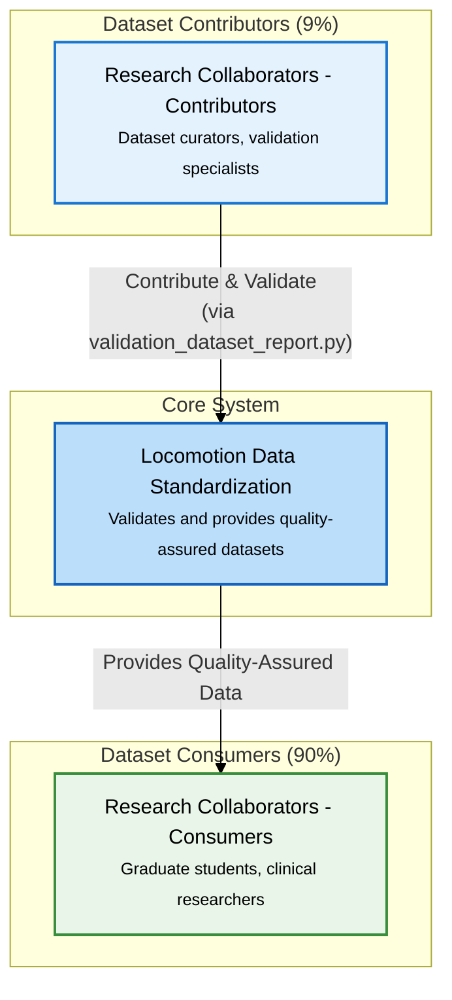

# User Personas

!!! info "🎯 **You are here** → User Research & Personas Hub"
    **Purpose:** Understand who uses the system and how they work
    
    **Who should read this:** Product managers, developers, UX designers, stakeholders
    
    **Value:** Deep user insights drive better design decisions and prioritization
    
    **Connection:** Feeds into [Requirements](02_REQUIREMENTS.md) and [Architecture](03_ARCHITECTURE.md)
    
    **:clock4: Reading time:** 15 minutes | **:busts_in_silhouette: User types:** 4 personas

!!! tip "**Quick Navigation**"
    **👥 Who are our users?** → [User Population Analysis](#user-population-analysis)
    
    **🧑‍💼 Detailed profiles?** → [User Roles & Entry Points](01a_USER_ROLES.md)
    
    **🛤️ How do they work?** → [User Journeys](01c_USER_JOURNEYS.md)
    
    **📋 Common workflows?** → [User Workflows](01d_USER_WORKFLOWS.md)
    
    **🏗️ System context?** → [System Context](01b_SYSTEM_CONTEXT.md)

## 🎯 User Population Analysis

!!! abstract "**90/9/1 Split Strategy**"
    Our phased approach serves users based on their contribution to data quality:
    
    - **📊 Dataset Consumers (90%):** Graduate students, clinical researchers, biomechanics engineers, sports scientists
    - **🔧 Dataset Contributors (9%):** Dataset curators (programmers + biomechanical validation)
    - **⚙️ System Administrators (1%):** Release managers, infrastructure maintainers

!!! success "**Current Development Focus**"
    **Phase 1** targets the 9% + 1% to establish validation infrastructure before building consumer tools for the 90%.
    
    **Why?** Quality-first approach - fewer high-quality datasets preferred over many questionable ones.

## User Personas

**User Personas**: See [User Roles & Entry Points](01a_USER_ROLES.md) for complete persona descriptions and tool requirements.

**Key User Populations:**
- **Dataset Curators - Biomechanical Validation (9%)**: Domain experts ensuring data quality
- **Dataset Curators - Programmers (9%)**: Technical specialists developing conversion scripts  
- **System Administrators (1%)**: Infrastructure managers and release coordinators
- **Dataset Consumers (90%)**: Researchers analyzing quality-assured data *(Future Phase 2)*

## User Journeys

**Detailed Workflow Analysis**: See [User Journeys](01c_USER_JOURNEYS.md) for complete workflow maps and interaction patterns.

**Current Focus Journeys:**
- **Journey 1**: Dataset Curator (Programmer) - Technical dataset conversion workflow
- **Journey 2**: Dataset Curator (Biomechanical Validation) - Validation specification updates  
- **Journey 3**: Collaborative Dataset Contribution - Multi-role workflow coordination
- **Future Preview**: Simplified consumer experience (Phase 2 development target)

## System Context

**Architecture overview showing external users, system boundaries, and key interaction patterns.**

The system serves external research collaborators through a quality-first approach:
- **Contributors (9%)**: Use `validation_dataset_report.py` as the primary tool to validate and contribute datasets
- **Consumers (90%)**: Benefit from quality-assured datasets without requiring validation expertise
- **Administrators (1%)**: Manage releases and ML benchmarks

### Quick Context Overview

**Detailed Documentation:**
- **[User Roles & Entry Points →](01a_USER_ROLES.md)** - Complete CLI tool catalog by user role
- **[System Context →](01b_SYSTEM_CONTEXT.md)** - Architecture diagrams and interaction patterns

---

## Complete User Documentation Structure

**User Research & Guidance Documentation:**

- **[User Personas](01_USER_GUIDE.md)** *(this document)* - Population analysis and personas overview
- **[User Roles & Entry Points](01a_USER_ROLES.md)** - Detailed persona descriptions and tool requirements  
- **[System Context](01b_SYSTEM_CONTEXT.md)** - Architecture overview and interaction patterns
- **[User Journeys](01c_USER_JOURNEYS.md)** - Detailed workflow maps and emotional journey analysis
- **[User Workflows](01d_USER_WORKFLOWS.md)** - Step-by-step guides for common user tasks

**How to Navigate:**
- **Start here** for population understanding and persona overview
- **Drill down** to specific roles, journeys, or workflows as needed
- **Reference workflows** when performing actual tasks
- **Review context** for architectural understanding

## Development Strategy

**Phase 1 (Current):** Validation infrastructure for dataset contributors
- ✅ Core validation architecture (ValidationExpectationsParser, PhaseValidator)
- 🚧 Dataset quality assessment and reporting tools
- 📋 Validation specification management
- 📋 Conversion scaffolding and examples
- 📋 `conversion_generate_phase_dataset.py` - Automated time-to-phase conversion tool

**Phase 2 (Future):** Consumer tools for 90% users
- 📋 Data repository with standardized access
- 📋 Python/MATLAB analysis libraries
- 📋 Educational tutorials and documentation

**Rationale:** Establish quality datasets through robust validation before building consumer tools

---

## 📊 Section Contents

-   **📋 [User Roles & Entry Points](01a_USER_ROLES.md)**
    
    ---
    
    Complete CLI tool catalog organized by user role and priority
    
    **Key Content:** Implementation priority matrix, common usage patterns
    
    **Time:** 8 minutes
    
    **Best For:** Developers, product managers

-   **🏗️ [System Context](01b_SYSTEM_CONTEXT.md)**
    
    ---
    
    Architecture diagrams and interaction patterns
    
    **Key Content:** C4 context diagrams, user workflows
    
    **Time:** 12 minutes
    
    **Best For:** Architects, system designers

-   **🛤️ [User Journeys](01c_USER_JOURNEYS.md)**
    
    ---
    
    Detailed workflow maps showing how users interact with the system
    
    **Key Content:** 3 contributor journeys, pain points, success factors
    
    **Time:** 12 minutes
    
    **Best For:** UX designers, user researchers, product managers

---

## 🧭 Navigation Context

!!! info "**📍 You are here:** User Research & Personas Hub"
    **⬅️ Previous:** [Overview](00_OVERVIEW.md) - Project introduction and navigation hub
    
    **➡️ Next:** [Requirements](02_REQUIREMENTS.md) - User stories and system requirements
    
    **📖 Reading time:** 15 minutes
    
    **🎯 Prerequisites:** [Overview](00_OVERVIEW.md) - Project understanding
    
    **🔄 Follow-up sections:** Requirements, Architecture design decisions

!!! tip "**Cross-References & Related Content**"
    **🔗 Direct Implementation:** [Architecture - User Context](03_ARCHITECTURE.md#user-context-and-benefits) - How these user insights shaped system design
    
    **🔗 Detailed Tools:** [User Roles & Entry Points](01a_USER_ROLES.md) - Complete CLI tool catalog by user role
    
    **🔗 System Context:** [System Context Diagrams](01b_SYSTEM_CONTEXT.md) - Technical interaction patterns
    
    **🔗 Workflow Details:** [User Journeys](01c_USER_JOURNEYS.md) - Detailed workflow maps and interaction patterns
    
    **🔗 Requirements Traceability:** [Requirements](02_REQUIREMENTS.md) - User stories derived from these personas

---

!!! success "**Key Takeaways**"
    ✅ **90/9/1 Strategy:** Focus on contributors first to ensure data quality
    
    ✅ **Phase 1 Validation:** Build quality infrastructure before consumer tools
    
    ✅ **User Collaboration:** Contributors work together (programmer + domain expert)
    
    ✅ **Quality First:** Fewer high-quality datasets preferred over many questionable ones
