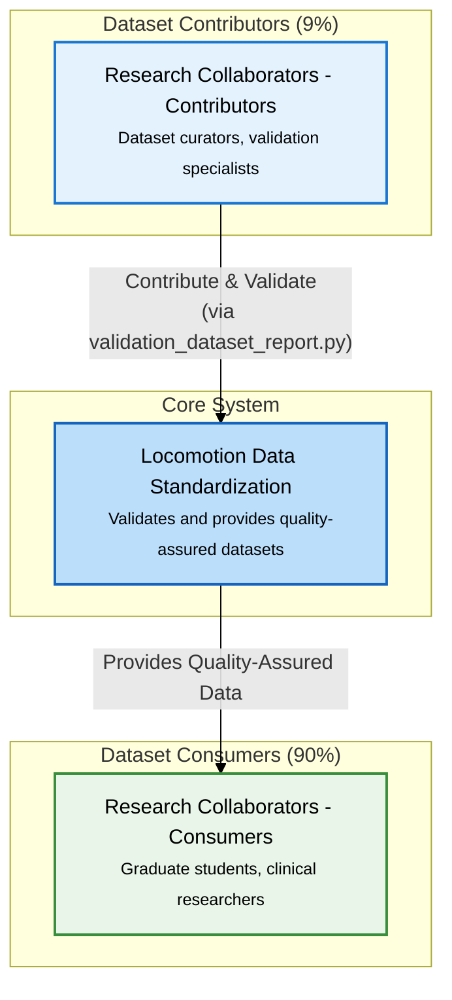

# User Personas

!!! info "🎯 **You are here** → User Research & Personas Hub"
    **Purpose:** Understand who uses the system and how they work
    
    **Who should read this:** Product managers, developers, UX designers, stakeholders
    
    **Value:** Deep user insights drive better design decisions and prioritization
    
    **Connection:** Feeds into [Requirements](02_REQUIREMENTS.md) and [Architecture](03_ARCHITECTURE.md)
    
    **:clock4: Reading time:** 20 minutes | **:busts_in_silhouette: User types:** 4 detailed personas

!!! tip "**Quick Navigation**"
    **👥 Who are our users?** → [User Population Analysis](#user-population-analysis)
    
    **🎭 Named personas?** → [Detailed Personas](#detailed-personas)
    
    **🧑‍💼 Tool mappings?** → [User Roles & Entry Points](01a_USER_ROLES.md)
    
    **🛤️ How do they work?** → [User Journeys](01c_USER_JOURNEYS.md)
    
    **📋 Common workflows?** → [User Workflows](01d_USER_WORKFLOWS.md)
    
    **🗺️ Formal user stories?** → [User Story Mapping](01e_USER_STORY_MAPPING.md)
    
    **⚡ Technical workflows?** → [Sequence Diagrams](03a_SEQUENCE_DIAGRAMS.md)
    
    **🏗️ System context?** → [System Context](01b_SYSTEM_CONTEXT.md)

## 🎯 User Population Analysis

!!! abstract "**90/9/1 Split Strategy**"
    Our phased approach serves users based on their contribution to data quality:
    
    - **📊 Dataset Consumers (90%):** Graduate students, clinical researchers, biomechanics engineers, sports scientists
    - **🔧 Dataset Contributors (9%):** Dataset curators (programmers + biomechanical validation)
    - **⚙️ System Administrators (1%):** Release managers, infrastructure maintainers

!!! success "**Current Development Focus**"
    **Phase 1** targets the 9% + 1% to establish validation infrastructure before building consumer tools for the 90%.
    
    **Why?** Quality-first approach - fewer high-quality datasets preferred over many questionable ones.

## User Personas

**User Personas**: See [User Roles & Entry Points](01a_USER_ROLES.md) for complete persona descriptions and tool requirements.

**Key User Populations:**
- **Dataset Curators - Biomechanical Validation (9%)**: Domain experts ensuring data quality
- **Dataset Curators - Programmers (9%)**: Technical specialists developing conversion scripts  
- **System Administrators (1%)**: Infrastructure managers and release coordinators
- **Dataset Consumers (90%)**: Researchers analyzing quality-assured data *(Future Phase 2)*

## Detailed Personas

*These concrete personas represent our primary users with specific backgrounds, actions, and pain points that drive design decisions.*

### Dr. Sarah Validator - Biomechanical Validation Specialist

**Background**: PhD in Biomechanics from Stanford, 8 years experience in gait analysis, currently Senior Research Scientist at rehabilitation engineering lab, published 25+ papers on lower-limb biomechanics.

**Role & Responsibilities**: 
- Maintains validation specifications based on current literature
- Reviews and approves biomechanical data quality standards
- Investigates validation failures and edge cases
- Bridges gap between technical implementation and domain expertise

**System Actions**:
- Updates validation ranges using `validation_manual_tune_spec.py` after literature reviews
- Runs statistical analysis with `validation_auto_tune_spec.py` to optimize thresholds
- Debugs complex validation failures with `validation_investigate_errors.py`
- Compares datasets from different sources using `validation_compare_datasets.py`

**Tools Used**: MATLAB for biomechanical analysis, Python validation tools, literature databases (PubMed, Scopus), statistical analysis software

**Pain Points**:
- Validation failures often require deep biomechanical knowledge to debug
- Balancing literature-based ranges with real-world data variability
- Communicating biomechanical rationale to technical team members
- Time-consuming manual review of complex validation edge cases

**Goals**: Maintain high data quality standards while enabling practical dataset contribution workflows

---

### Alex Converter - Dataset Curator Programmer

**Background**: MS in Computer Science, 5 years Python/MATLAB experience, works at biomechanics research lab, comfortable with data processing but limited biomechanics domain knowledge.

**Role & Responsibilities**:
- Converts lab datasets from proprietary formats to standardized parquet
- Develops and maintains conversion scripts for different data sources
- Troubleshoots technical issues in data processing pipelines
- Collaborates with biomechanics experts on data quality validation

**System Actions**:
- Generates phase-indexed datasets using `conversion_generate_phase_dataset.py`
- Runs comprehensive validation reports with `validation_dataset_report.py --generate-gifs`
- Debugs conversion issues and data format inconsistencies
- Documents conversion decisions and maintains processing scripts

**Tools Used**: Python (pandas, numpy), version control (git), IDE (VS Code), command line tools, parquet inspection tools

**Pain Points**:
- Complex biomechanical conventions and coordinate systems are unfamiliar
- Variable naming inconsistencies across source datasets require domain knowledge
- Debugging validation failures without biomechanics expertise is frustrating
- Time-consuming iteration between conversion attempts and quality assessment

**Goals**: Efficiently convert datasets to standard format with minimal back-and-forth with domain experts

---

### Dr. Morgan Administrator - System Administrator

**Background**: PhD in Biomedical Engineering, 12 years experience managing research data infrastructure, leads data management for multi-lab consortium, expertise in reproducible research practices.

**Role & Responsibilities**:
- Manages dataset releases and version control
- Creates ML benchmarks for research community
- Maintains infrastructure and ensures system reliability
- Coordinates between multiple research collaborators

**System Actions**:
- Creates standardized ML splits using `create_benchmarks.py`
- Prepares public dataset releases with `publish_datasets.py`
- Manages version control and release documentation
- Monitors system health and dataset quality metrics

**Tools Used**: Command line administration, docker containers, cloud infrastructure, data management platforms, CI/CD pipelines

**Pain Points**:
- Coordinating releases across multiple datasets and contributors
- Ensuring reproducible benchmarks for ML research community
- Managing growing dataset sizes and storage requirements
- Balancing data accessibility with quality assurance processes

**Goals**: Provide reliable, high-quality datasets that enable reproducible biomechanics research and ML development

---

### Dr. Sam Consumer - Dataset Consumer *(Future Phase 2)*

**Background**: PhD candidate in Biomedical Engineering, developing ML models for gait analysis, strong programming skills but prefers pre-validated datasets over data curation.

**Role & Responsibilities**:
- Uses quality-assured datasets for research and ML model development
- Focuses on analysis and modeling rather than data curation
- Requires standardized, well-documented datasets for reproducible research
- Contributes to research community through publications and open-source tools

**Future System Actions**:
- Downloads validated datasets through simplified interface
- Uses standardized analysis libraries for common biomechanics tasks
- Accesses educational tutorials and documentation
- Provides feedback on dataset usability and analysis tools

**Tools Used**: Python (scikit-learn, PyTorch), Jupyter notebooks, statistical analysis tools, visualization libraries

**Pain Points** *(anticipated)*:
- Need for simple, reliable access to quality datasets
- Desire for standardized analysis tools and best practices
- Requirement for clear documentation and educational resources
- Expectation of dataset stability and version management

**Goals**: Focus on research questions and model development using reliable, quality-assured biomechanical datasets

## User Journeys

**Detailed Workflow Analysis**: See [User Journeys](01c_USER_JOURNEYS.md) for complete workflow maps and interaction patterns.

**Current Focus Journeys:**
- **Journey 1**: Dataset Curator (Programmer) - Technical dataset conversion workflow
- **Journey 2**: Dataset Curator (Biomechanical Validation) - Validation specification updates  
- **Journey 3**: Collaborative Dataset Contribution - Multi-role workflow coordination
- **Future Preview**: Simplified consumer experience (Phase 2 development target)

## System Context

**Architecture overview showing external users, system boundaries, and key interaction patterns.**

The system serves external research collaborators through a quality-first approach:
- **Contributors (9%)**: Use `validation_dataset_report.py` as the primary tool to validate and contribute datasets
- **Consumers (90%)**: Benefit from quality-assured datasets without requiring validation expertise
- **Administrators (1%)**: Manage releases and ML benchmarks

### Quick Context Overview

**Detailed Documentation:**
- **[User Roles & Entry Points →](01a_USER_ROLES.md)** - Complete CLI tool catalog by user role
- **[System Context →](01b_SYSTEM_CONTEXT.md)** - Architecture diagrams and interaction patterns

---

## Complete User Documentation Structure

**User Research & Guidance Documentation:**

- **[User Personas](01_USER_GUIDE.md)** *(this document)* - Population analysis and personas overview
- **[User Roles & Entry Points](01a_USER_ROLES.md)** - Detailed persona descriptions and tool requirements  
- **[System Context](01b_SYSTEM_CONTEXT.md)** - Architecture overview and interaction patterns
- **[User Journeys](01c_USER_JOURNEYS.md)** - Detailed workflow maps and emotional journey analysis
- **[User Workflows](01d_USER_WORKFLOWS.md)** - Step-by-step guides for common user tasks

**How to Navigate:**
- **Start here** for population understanding and persona overview
- **Drill down** to specific roles, journeys, or workflows as needed
- **Reference workflows** when performing actual tasks
- **Review context** for architectural understanding

## User Stories & Acceptance Criteria

**Formal user stories derived from persona analysis with quantifiable success measures.**

### Dataset Curator - Programmer Stories

#### Story 1: Dataset Conversion Workflow
**As a** Dataset Curator (Programmer)  
**I want** to convert raw biomechanical datasets to standardized parquet format efficiently  
**So that** I can contribute quality datasets without extensive biomechanical expertise

**Acceptance Criteria:**
- Complete dataset conversion in <60 minutes for typical lab dataset (500-1000 trials)
- Generate phase-indexed dataset with exactly 150 points per gait cycle (100% compliance)
- Achieve >90% validation pass rate for correctly formatted source data
- Receive clear error messages for 95% of common failure modes
- Access working example scripts for 3+ different source formats

#### Story 2: Quality Assessment Confidence
**As a** Dataset Curator (Programmer)  
**I want** comprehensive quality reports that I can interpret without domain expertise  
**So that** I can confidently contribute datasets and debug conversion issues

**Acceptance Criteria:**
- Generate quality report in <5 minutes for phase-indexed datasets
- Receive biomechanical plausibility score with clear interpretation (High/Medium/Low)
- Get specific debugging guidance for >80% of validation failures
- Access visual verification plots showing data patterns vs expected ranges
- Complete workflow documentation review in <15 minutes

### Dataset Curator - Biomechanical Validation Stories

#### Story 3: Literature-Based Range Updates
**As a** Dataset Curator (Biomechanical Validation Specialist)  
**I want** to update validation ranges based on recent literature efficiently  
**So that** validation standards remain current with biomechanical research

**Acceptance Criteria:**
- Complete range update workflow in <30 minutes per variable group
- Preview impact on existing datasets before committing changes
- Document literature citations with automated referencing
- Generate staging plots showing proposed vs current ranges
- Maintain change history with rationale for future reference

#### Story 4: Statistical Range Optimization
**As a** Dataset Curator (Biomechanical Validation Specialist)  
**I want** to optimize validation ranges using statistical analysis of existing data  
**So that** ranges reflect real-world data variability while maintaining quality standards

**Acceptance Criteria:**
- Process combined datasets with >1000 gait cycles in <20 minutes
- Support 3+ statistical methods (percentiles, IQR, standard deviation)
- Generate distribution plots with proposed ranges overlay
- Achieve <5% false positive rate for known quality datasets
- Provide method appropriateness guidance for different variable types

### System Administrator Stories

#### Story 5: ML Benchmark Creation
**As a** System Administrator  
**I want** to create standardized ML train/test/validation splits from quality datasets  
**So that** the research community has reproducible benchmarks

**Acceptance Criteria:**
- Process multiple datasets with consistent split ratios (70/15/15 default)
- Ensure demographic balance across splits within 5% tolerance
- Generate benchmark metadata with population characteristics
- Complete benchmark creation in <45 minutes for typical multi-dataset corpus
- Validate no subject leakage between splits (100% compliance)

#### Story 6: Dataset Release Management
**As a** System Administrator  
**I want** to prepare validated datasets for public release with proper documentation  
**So that** researchers can access quality-assured data with confidence

**Acceptance Criteria:**
- Bundle datasets with quality reports and documentation in <30 minutes
- Verify all datasets pass validation with >95% success rate
- Generate release notes with dataset characteristics and known limitations
- Create version-controlled release artifacts with reproducible builds
- Provide download verification (checksums) for all released files

### Collaborative Workflow Stories

#### Story 7: Multi-Role Dataset Contribution
**As a** collaborative team (Programmer + Validator)  
**I want** clear role definitions and shared tools for dataset contribution  
**So that** we can efficiently produce high-quality standardized datasets

**Acceptance Criteria:**
- Complete collaborative workflow in <90 minutes for typical dataset
- Achieve >95% validation pass rate through iterative improvement
- Document both technical and biomechanical decisions with shared templates
- Enable asynchronous review with clear hand-off points
- Maintain communication trail linking conversion decisions to validation outcomes

## Development Strategy

**Phase 1 (Current):** Validation infrastructure for dataset contributors
- ✅ Core validation architecture (ValidationExpectationsParser, PhaseValidator)
- 🚧 Dataset quality assessment and reporting tools
- 📋 Validation specification management
- 📋 Conversion scaffolding and examples
- 📋 `conversion_generate_phase_dataset.py` - Automated time-to-phase conversion tool

**Phase 2 (Future):** Consumer tools for 90% users
- 📋 Data repository with standardized access
- 📋 Python/MATLAB analysis libraries
- 📋 Educational tutorials and documentation

**Rationale:** Establish quality datasets through robust validation before building consumer tools

---

## 📊 Section Contents

-   **📋 [User Roles & Entry Points](01a_USER_ROLES.md)**
    
    ---
    
    Complete CLI tool catalog organized by user role and priority
    
    **Key Content:** Implementation priority matrix, common usage patterns
    
    **Time:** 8 minutes
    
    **Best For:** Developers, product managers

-   **🏗️ [System Context](01b_SYSTEM_CONTEXT.md)**
    
    ---
    
    Architecture diagrams and interaction patterns
    
    **Key Content:** C4 context diagrams, user workflows
    
    **Time:** 12 minutes
    
    **Best For:** Architects, system designers

-   **🛤️ [User Journeys](01c_USER_JOURNEYS.md)**
    
    ---
    
    Detailed workflow maps showing how users interact with the system
    
    **Key Content:** 3 contributor journeys, pain points, success factors
    
    **Time:** 12 minutes
    
    **Best For:** UX designers, user researchers, product managers

-   **📋 [User Workflows](01d_USER_WORKFLOWS.md)**
    
    ---
    
    Step-by-step workflow guides with quantified acceptance criteria
    
    **Key Content:** 4 comprehensive workflows, success indicators, troubleshooting
    
    **Time:** 20 minutes
    
    **Best For:** Dataset curators, system users

-   **🗺️ [User Story Mapping](01e_USER_STORY_MAPPING.md)**
    
    ---
    
    Formal user stories with quantifiable acceptance criteria for test-driven development
    
    **Key Content:** 7 user stories, traceability matrix, performance thresholds
    
    **Time:** 25 minutes
    
    **Best For:** Product managers, developers, QA engineers

---

## 🧭 Navigation Context

!!! info "**📍 You are here:** User Research & Personas Hub"
    **⬅️ Previous:** [Overview](00_OVERVIEW.md) - Project introduction and navigation hub
    
    **➡️ Next:** [Requirements](02_REQUIREMENTS.md) - User stories and system requirements
    
    **📖 Reading time:** 20 minutes
    
    **🎯 Prerequisites:** [Overview](00_OVERVIEW.md) - Project understanding
    
    **🔄 Follow-up sections:** Requirements, Architecture design decisions

!!! tip "**Cross-References & Related Content**"
    **🔗 Direct Implementation:** [Architecture - User Context](03_ARCHITECTURE.md#user-context-and-benefits) - How these user insights shaped system design
    
    **🔗 Persona Details:** [Detailed Personas](#detailed-personas) - Named personas with specific backgrounds and pain points
    
    **🔗 Detailed Tools:** [User Roles & Entry Points](01a_USER_ROLES.md) - Complete CLI tool catalog by user role
    
    **🔗 System Context:** [System Context Diagrams](01b_SYSTEM_CONTEXT.md) - Technical interaction patterns
    
    **🔗 Workflow Details:** [User Journeys](01c_USER_JOURNEYS.md) - Detailed workflow maps and interaction patterns
    
    **🔗 Technical Workflows:** [Sequence Diagrams](03a_SEQUENCE_DIAGRAMS.md) - Technical implementation details for all user workflows
    
    **🔗 Requirements Traceability:** [Requirements](02_REQUIREMENTS.md) - User stories derived from these personas

!!! tip "**Technical Implementation Details**"
    For detailed technical sequence diagrams showing component interactions and data flow for all user workflows, see [Architecture - Sequence Diagrams](03a_SEQUENCE_DIAGRAMS.md).
    
    These technical diagrams complement the user-focused personas and journeys with implementation-level detail for developers and system integrators.
