# System Context

!!! info ":globe_with_meridians: **You are here** → System Context & External Interactions"
    **Purpose:** C4 context diagrams and external system relationships
    
    **Who should read this:** Architects, system designers, integration engineers
    
    **Value:** Understand system boundaries and external dependencies
    
    **Connection:** Context level of [Architecture](03_ARCHITECTURE.md) C4 model
    
    **:clock4: Reading time:** 10 minutes | **:globe_with_meridians: Diagrams:** System context with user workflows

**Architecture overview showing external users, system boundaries, and key interaction patterns.**

*Navigation: [← User Guide](01_USER_GUIDE.md) • [← User Roles](01a_USER_ROLES.md)*

## Architecture Context

This document translates the functional requirements into system context and user interaction patterns. The context architecture directly informs the container design and component architecture.

**Requirements Implementation**: All context diagrams implement the user workflows and satisfy the functional requirements F1-F6.

## Role-Based Entry Points

### Dataset Contributor Workflow
*Implements F1 (Dataset Validation Infrastructure) and F3 (Conversion Scaffolding)*
*Primary validation tool user (9% of system usage) serving 90% consumer population*

```mermaid
%%{init: {'theme': 'default'}}%%
graph LR
    DC["🔬 Dataset Contributor<br/><font size='-1'>Research collaborator with raw locomotion data</font>"] 
    
    DC --> CONVERT["📝 conversion_generate_phase_dataset.py<br/><font size='-1'>Convert time to phase data<br/>→ Workflow Sequence 1</font>"]
    DC --> VALIDATE["✅ validation_dataset_report.py<br/><font size='-1'>PRIMARY TOOL: Validate and assess quality<br/>→ Workflow Sequence 3</font>"]
    
    style DC fill:#e3f2fd,color:#000000,stroke:#1976d2
    style CONVERT fill:#f3e5f5,color:#000000,stroke:#7b1fa2
    style VALIDATE fill:#fff3e0,color:#000000,stroke:#f57c00
    
    linkStyle default stroke:black
```

### Validation Specialist Workflow  
*Implements F2 (Validation Specification Management)*
*Expert biomechanics reviewer collaborating on quality standards*

```mermaid
%%{init: {'theme': 'default'}}%%
graph LR
    VS["⚙️ Validation Specialist<br/><font size='-1'>Research collaborator managing quality standards</font>"]
    
    VS --> MANAGE["📋 validation_manual_tune_spec.py<br/><font size='-1'>Edit validation rules<br/>→ Workflow Sequence 2A</font>"]
    VS --> TUNE["🎯 validation_auto_tune_spec.py<br/><font size='-1'>Optimize validation ranges<br/>→ Workflow Sequence 2B</font>"]
    VS --> COMPARE["📈 validation_compare_datasets.py<br/><font size='-1'>Cross-dataset analysis</font>"]
    VS --> DEBUG["🔍 validation_investigate_errors.py<br/><font size='-1'>Investigate data issues</font>"]
    
    style VS fill:#e3f2fd,color:#000000,stroke:#1976d2
    style MANAGE fill:#bbdefb,color:#000000,stroke:#1565c0
    style TUNE fill:#bbdefb,color:#000000,stroke:#1565c0
    style COMPARE fill:#bbdefb,color:#000000,stroke:#1565c0
    style DEBUG fill:#bbdefb,color:#000000,stroke:#1565c0
    
    linkStyle default stroke:black
```

### System Administrator Workflow
*Implements F6 (Administrative Tools - Future Phase)*
*Infrastructure management using workflow sequences*

```mermaid
%%{init: {'theme': 'default'}}%%
graph LR
    SA["👨‍💼 System Administrator<br/><font size='-1'>I manage releases and benchmarks</font>"]
    
    SA --> BENCHMARK["🏆 create_benchmarks.py<br/><font size='-1'>Create ML train/test splits</font>"]
    SA --> PUBLISH["📦 publish_datasets.py<br/><font size='-1'>Prepare public releases</font>"]
    SA --> BATCH["⚡ validation_dataset_report.py (batch)<br/><font size='-1'>Validate multiple datasets</font>"]
    
    style SA fill:#fff3e0,color:#000000,stroke:#f57c00
    style BENCHMARK fill:#bbdefb,color:#000000,stroke:#1565c0
    style PUBLISH fill:#bbdefb,color:#000000,stroke:#1565c0
    style BATCH fill:#bbdefb,color:#000000,stroke:#1565c0
    
    linkStyle default stroke:black
```

### Dataset Consumer Workflow (Future)
*Benefits from F1-F4 quality infrastructure without requiring validation expertise*
*Primary user base: 90% research collaborators consuming quality-assured standardized data*
*Future implementation: F5 (Dataset Comparison) and consumer-focused tools*

```mermaid
%%{init: {'theme': 'default'}}%%
graph LR
    DC["🎓 Dataset Consumer<br/><font size='-1'>Research collaborator analyzing locomotion data<br/>Graduate students, clinical researchers, etc.</font>"]
    
    DC --> BROWSE["🌐 Web Portal<br/><font size='-1'>Browse available datasets<br/>Quality-assured by validation system</font>"]
    DC --> DOWNLOAD["📥 Data Repository<br/><font size='-1'>Download parquet files<br/>Standardized format guaranteed</font>"]
    DC --> PYTHON["🐍 Python Library<br/><font size='-1'>LocomotionData class<br/>→ Future workflow development</font>"]
    DC --> MATLAB["📊 MATLAB Tools<br/><font size='-1'>Native MATLAB integration<br/>→ Future workflow development</font>"]
    
    style DC fill:#e8f5e8,color:#000000,stroke:#388e3c,stroke-dasharray:3
    style BROWSE fill:#f5f5f5,color:#000000,stroke:#616161,stroke-dasharray:3
    style DOWNLOAD fill:#f5f5f5,color:#000000,stroke:#616161,stroke-dasharray:3
    style PYTHON fill:#f5f5f5,color:#000000,stroke:#616161,stroke-dasharray:3
    style MATLAB fill:#f5f5f5,color:#000000,stroke:#616161,stroke-dasharray:3
    
    linkStyle default stroke:black,stroke-dasharray:3
```

**Legend**: 
- **Solid lines** = Current implementation focus (Contributors/Specialists/Administrators)
- **Dashed lines** = Future development (Consumers - 90% user base)
- **Yellow highlight** = Primary validation tool (validation_dataset_report.py)

**Context**: External research collaborators interact with the system through defined workflows, with `validation_dataset_report.py` serving as the primary quality assessment tool implementing F1 requirements. This quality-first approach ensures dataset reliability for the 90% consumer population.

---

## System Context Levels

*Multiple context perspectives for different stakeholder communication needs*

### Level 1A: Simple User Split

**Use Case**: Stakeholder communication and high-level system overview  
**Context**: Shows how external research collaborators engage as both contributors (9%) and consumers (90%) with validation_dataset_report.py as the primary quality gate.

---

## Level 1B: Data Flow Focus

**Use Case**: Technical understanding and data transformation explanation  
**Context**: Emphasizes the validation system's role in ensuring data quality for external research collaborators consuming standardized datasets.

---

## Level 1C: Intermediate Detail

**Use Case**: Architecture planning and detailed system understanding  
**Context**: Shows detailed interactions between external research collaborators and system components, highlighting validation_dataset_report.py as the primary tool and the connection to defined workflows.

---

## Context Diagram Usage Guide

### **Level 1A: Simple User Split**
- **Best For**: Executive summaries, grant proposals, stakeholder presentations
- **Shows**: Clear 90/10 user population and basic system value
- **Audience**: Non-technical stakeholders, funding bodies, project sponsors

### **Level 1B: Data Flow Focus** 
- **Best For**: Technical documentation, system integration planning
- **Shows**: What the system does (data transformation) without user complexity
- **Audience**: Technical teams, system architects, data engineers

### **Level 1C: Intermediate Detail**
- **Best For**: Development planning, architecture discussions, team alignment
- **Shows**: System components, user interactions, and development priorities
- **Audience**: Development teams, product managers, technical leads

### **Development Priority Visualization**
- **Solid lines + full color**: Current development focus (contributors, validation engine)
- **Dashed lines + muted color**: Future development focus (consumers, analysis tools)
- **Quality bridge**: How validation ensures consumer confidence behind the scenes

## Strategic Approach

**Phase 1**: Build robust contributor tools (validation engine) to ensure high-quality datasets  
*Focus: External research collaborators contributing data via validation_dataset_report.py*

**Phase 2**: Develop consumer experience (analysis tools) using proven foundation  
*Focus: External research collaborators (90% user base) consuming quality-assured data*

**Quality Bridge**: The validation system ensures dataset quality behind the scenes, enabling consumer confidence without requiring validation expertise from end users.

## External User Context

**Research Collaborators** represent the primary external user base:
- **Contributors (9%)**: Researchers from institutions like GTech, UMich, AddBiomechanics who contribute datasets
- **Consumers (90%)**: Graduate students, clinical researchers, biomechanics engineers, sports scientists
- **Interaction Pattern**: Contributors use defined workflows with validation_dataset_report.py as the primary tool to ensure quality for consumers

**Requirements Implementation**: All external user interactions implement functional requirements F1-F6 through specific workflows. The quality-first architecture strategy ensures contributor validation (10% users) enables consumer confidence (90% users).

**Primary Tool Emphasis**: `validation_dataset_report.py` appears as the central tool across all context diagrams, implementing the core validation infrastructure (F1) that enables all other system functions.