# Architecture

!!! info ":building_construction: **You are here** → System Design Hub"
    **Purpose:** Complete architectural view from system context to code specifications
    
    **Who should read this:** Architects, senior developers, system designers, technical leads
    
    **Value:** Understand system structure, design decisions, and component relationships
    
    **Connection:** Implements [User Guide](01_USER_GUIDE.md) insights and [Requirements](02_REQUIREMENTS.md)
    
    **:clock4: Reading time:** 25 minutes | **:building_construction: Architecture levels:** 4 (Context → Container → Component → Code)

!!! tip "**Architecture Navigation**"
    **🌐 Big picture?** → [System Context Architecture](#system-context-architecture)
    
    **📦 Containers?** → [Container Architecture](#container-architecture)
    
    **🔧 Components?** → [Component Architecture](#component-architecture)
    
    **💻 Code details?** → [Code Architecture](#code-architecture)

## 🏗️ Architectural Overview

!!! abstract "**Key Design Principle**"
    **Quality-first approach** where validation infrastructure (10% contributors) enables data reliability for research community (90% consumers).

!!! success "**Primary Integration Point**"
    `validation_dataset_report.py` serves as the central validation tool implementing F1 requirements from [Requirements](02_REQUIREMENTS.md).

**Architecture Philosophy:**
- **C4 Methodology:** Clear abstraction levels from context to code
- **Validation-Centric Design:** All components integrate through validation specifications
- **Quality-First Foundation:** 10% contributor effort enables 90% consumer success

## System Context Architecture

### User Population and Workflows

The system serves external research collaborators through three distinct user populations:

**Dataset Contributors (9%)**: Research collaborators who validate and contribute data
**System Administrators (1%)**: Infrastructure managers and release coordinators  
**Dataset Consumers (90%)**: Research collaborators analyzing quality-assured data

### Context Diagram Reference

**System Context Diagrams**: See [System Context](01b_SYSTEM_CONTEXT.md) for complete context diagrams including intermediate detail and workflow-specific perspectives.

### Role-Based Entry Points

The system provides distinct workflows for three user populations:

- **Dataset Contributors (9%)**: Use `validation_dataset_report.py` as primary tool for data quality validation
- **Validation Specialists**: Manage validation rules via `validation_manual_tune_spec.py` and `validation_auto_tune_spec.py`  
- **System Administrators (1%)**: Infrastructure management and release coordination
- **Dataset Consumers (90%)**: Future focus on analysis tools consuming quality-assured data

## Container Architecture

### Current Implementation (Phase 1)

The system follows a three-phase development approach with the current implementation targeting dataset contributors and validation specialists.


### Container Workflow Integration

**validation_dataset_report.py serves as the central validation hub** for all contributor workflows:

1. **Dataset Conversion** → **validation_dataset_report.py**
2. **Manual Validation Tuning** → **validation_dataset_report.py** 
3. **Statistical Validation Tuning** → **validation_dataset_report.py**
4. **Quality Assessment** → **validation_dataset_report.py** as primary container

### Three-Phase Development Strategy

- **Phase 1 (Current)**: Manual validation workflows for dataset contributors and specialists (10% users)
- **Phase 2 (Future)**: Advanced contributor workflows with ML-assisted tools and community features  
- **Phase 3 (Future)**: Consumer-focused tools for researchers analyzing quality-assured data (90% users)

## Component Architecture

### Core Infrastructure Components (lib/core/)

Core data handling and manipulation components that provide the foundation for all validation workflows.


### Enhanced Validation Engine Components (lib/validation/)

The primary validation infrastructure implementing the three core validation goals:
1. **Sign Convention Adherence** - Verify biomechanical data follows standard conventions
2. **Outlier Detection** - Identify strides with values outside acceptable ranges  
3. **Phase Segmentation Validation** - Ensure exactly 150 points per gait cycle

!!! info "Interactive Architecture Diagram"
    The following diagram shows the complete lib/validation/ architecture with component relationships and data flow. **Zoom and pan controls are available** - click and drag to explore component details. Hover over components to see detailed descriptions of their responsibilities.

    **Color Legend:**
    - **Blue**: Core validation components (orchestrators and validation logic)
    - **Purple**: Specification management (parsing and optimization)  
    - **Green**: Visualization and reporting components
    - **Orange**: External core library dependencies
    - **Gray**: Data sources and specifications
    - **Pink**: Entry points and integration layers

```mermaid
%%{init: {'theme': 'default', 'themeVariables': {'primaryColor': '#fff4e6', 'primaryTextColor': '#000000', 'primaryBorderColor': '#ffb74d', 'lineColor': '#333333', 'secondaryColor': '#f0f0f0', 'tertiaryColor': '#e8f5e8'}}}%%
graph TB
    subgraph "lib/validation/ Architecture"
        style ValidationLibrary fill:#00000000,stroke:#ffb74d,stroke-width:3px,stroke-dasharray:5
        
        subgraph "Core Validation Components"
            dataset_validator_phase["DatasetValidator<br/><font size='-2'>dataset_validator_phase.py</font><br/><font size='-1'>• Main validation orchestrator<br/>• Uses LocomotionData for efficient 3D ops<br/>• Generates validation reports</font>"]
            
            dataset_validator_time["DatasetValidator<br/><font size='-2'>dataset_validator_time.py</font><br/><font size='-1'>• Time-indexed validation<br/>• Handles variable sampling rates<br/>• Converts to phase for validation</font>"]
            
            step_classifier["StepClassifier<br/><font size='-2'>step_classifier.py</font><br/><font size='-1'>• Validation logic engine<br/>• Representative phase validation<br/>• Step color classification</font>"]
        end
        
        subgraph "Specification Management"
            validation_parser["ValidationExpectationsParser<br/><font size='-2'>validation_expectations_parser.py</font><br/><font size='-1'>• Unified markdown parser<br/>• Dictionary API abstraction<br/>• Reads/writes validation specs</font>"]
            
            automated_tuner["AutomatedFineTuner<br/><font size='-2'>automated_fine_tuning.py</font><br/><font size='-1'>• Statistical range optimization<br/>• 6 statistical methods<br/>• Data-driven validation ranges</font>"]
        end
        
        subgraph "Visualization & Reporting"
            filters_plots["FiltersPlotter<br/><font size='-2'>filters_by_phase_plots.py</font><br/><font size='-1'>• Phase-based validation plots<br/>• Kinematic/kinetic visualization<br/>• Step color overlays</font>"]
            
            forward_kinematics["ForwardKinematicsPlotter<br/><font size='-2'>forward_kinematics_plots.py</font><br/><font size='-1'>• Joint angle range visualization<br/>• Phase-specific plots (0%, 25%, 50%, 75%)<br/>• Biomechanical pose generation</font>"]
            
            validation_plots["ValidationPlotsGenerator<br/><font size='-2'>generate_validation_plots.py</font><br/><font size='-1'>• Unified plot generation<br/>• Batch processing<br/>• Static validation plots</font>"]
            
            validation_gifs["ValidationGIFGenerator<br/><font size='-2'>generate_validation_gifs.py</font><br/><font size='-1'>• Animated validation plots<br/>• Gait cycle animations<br/>• Dynamic visualization</font>"]
        end
    end
    
    subgraph "External Dependencies"
        locomotion_data["LocomotionData<br/><font size='-2'>lib/core/locomotion_analysis.py</font><br/><font size='-1'>• Efficient 3D array operations<br/>• Parquet file handling<br/>• Data manipulation</font>"]
        
        feature_constants["FeatureConstants<br/><font size='-2'>lib/core/feature_constants.py</font><br/><font size='-1'>• Variable name mappings<br/>• Feature definitions<br/>• Single source of truth</font>"]
        
        validation_specs["Validation Specifications<br/><font size='-2'>docs/standard_spec/validation_expectations_*.md</font><br/><font size='-1'>• Kinematic validation ranges<br/>• Kinetic validation ranges<br/>• Task-specific expectations</font>"]
        
        parquet_datasets["Parquet Datasets<br/><font size='-2'>*_phase.parquet, *_time.parquet</font><br/><font size='-1'>• Phase-indexed data (150 points/cycle)<br/>• Time-indexed data (variable sampling)<br/>• Standardized format</font>"]
    end
    
    subgraph "Entry Points & Integration"
        contributor_scripts["Contributor Scripts<br/><font size='-2'>contributor_scripts/</font><br/><font size='-1'>• Dataset conversion tools<br/>• Validation workflows<br/>• Integration examples</font>"]
        
        test_framework["Testing Framework<br/><font size='-2'>source/tests/</font><br/><font size='-1'>• Demo scripts<br/>• Unit tests<br/>• Integration tests</font>"]
    end
    
    %% Core Validation Flow
    dataset_validator_phase --> step_classifier
    dataset_validator_time --> step_classifier
    step_classifier --> validation_parser
    
    %% Specification Management Flow
    validation_parser --> automated_tuner
    automated_tuner --> validation_parser
    validation_parser --> validation_specs
    
    %% Visualization Flow
    dataset_validator_phase --> filters_plots
    dataset_validator_phase --> forward_kinematics
    validation_plots --> filters_plots
    validation_plots --> forward_kinematics
    validation_gifs --> filters_plots
    
    %% External Dependencies
    dataset_validator_phase --> locomotion_data
    dataset_validator_time --> locomotion_data
    step_classifier --> feature_constants
    validation_parser --> validation_specs
    dataset_validator_phase --> parquet_datasets
    dataset_validator_time --> parquet_datasets
    automated_tuner --> locomotion_data
    automated_tuner --> parquet_datasets
    
    %% Entry Point Integration
    contributor_scripts --> dataset_validator_phase
    contributor_scripts --> dataset_validator_time
    contributor_scripts --> automated_tuner
    test_framework --> dataset_validator_phase
    test_framework --> step_classifier
    test_framework --> filters_plots
    
    %% Data Flow Arrows
    parquet_datasets -.-> dataset_validator_phase
    parquet_datasets -.-> dataset_validator_time
    validation_specs -.-> step_classifier
    locomotion_data -.-> dataset_validator_phase
    locomotion_data -.-> dataset_validator_time
    
    %% Styling
    style dataset_validator_phase fill:#bbdefb,color:#000000,stroke:#1565c0
    style dataset_validator_time fill:#bbdefb,color:#000000,stroke:#1565c0
    style step_classifier fill:#e3f2fd,color:#000000,stroke:#1976d2
    style validation_parser fill:#f3e5f5,color:#000000,stroke:#7b1fa2
    style automated_tuner fill:#f3e5f5,color:#000000,stroke:#7b1fa2
    style filters_plots fill:#e8f5e8,color:#000000,stroke:#388e3c
    style forward_kinematics fill:#e8f5e8,color:#000000,stroke:#388e3c
    style validation_plots fill:#e8f5e8,color:#000000,stroke:#388e3c
    style validation_gifs fill:#e8f5e8,color:#000000,stroke:#388e3c
    style locomotion_data fill:#fff3e0,color:#000000,stroke:#f57c00
    style feature_constants fill:#fff3e0,color:#000000,stroke:#f57c00
    style validation_specs fill:#f5f5f5,color:#000000,stroke:#616161
    style parquet_datasets fill:#f5f5f5,color:#000000,stroke:#616161
    style contributor_scripts fill:#fce4ec,color:#000000,stroke:#c2185b
    style test_framework fill:#fce4ec,color:#000000,stroke:#c2185b
    
    linkStyle default stroke:#333333,stroke-width:2px
```



**Key Component Groups:**

**Core Validation Components:**
- `DatasetValidator` (Phase/Time): Main validation orchestrators that coordinate validation workflows
- `StepClassifier`: Validation logic engine using representative phase validation for 37.5x performance improvement
- Implements three core validation goals: sign convention adherence, outlier detection, phase segmentation

**Specification Management:**
- `ValidationExpectationsParser`: Unified markdown parser with dictionary API abstraction
- `AutomatedFineTuner`: Statistical range optimization using 6 different statistical methods
- Provides data-driven validation ranges based on actual data distributions

**Visualization & Reporting:**
- `FiltersPlotter`: Phase-based validation plots with step color overlays
- `ForwardKinematicsPlotter`: Joint angle range visualization at key phases
- `ValidationPlotsGenerator`: Unified plot generation for batch processing
- `ValidationGIFGenerator`: Animated validation plots for dynamic visualization

!!! note "Data Flow Patterns"
    The diagram illustrates three key data flow patterns:
    
    **1. Validation Workflow (Solid Lines):** 
    Dataset validators → Step classifier → Validation parser → Specifications
    
    **2. Specification Management (Bidirectional):**
    Automated tuner ↔ Validation parser ↔ Validation specifications
    
    **3. Visualization Integration (Dotted Lines):**
    Data sources flow into validators and visualization components for comprehensive reporting

!!! tip "Component Integration Points" 
    **Primary Entry Points:**
    - `dataset_validator_phase.py`: Main orchestrator for phase-indexed validation workflows
    - `automated_fine_tuning.py`: Statistical optimization entry point for data-driven ranges
    - `generate_validation_plots.py`: Batch visualization generation for documentation
    
    **Core Dependencies:**
    - All validation components depend on `lib/core/` for data handling and feature definitions
    - Specification management components provide validation ranges to all validators
    - Visualization components integrate with validators for comprehensive reporting

### Component Execution Flow

The validation workflow follows a structured execution pattern implementing three core validation goals:
1. **Sign Convention Adherence** - Verify biomechanical data follows standard conventions
2. **Outlier Detection** - Identify strides with values outside acceptable ranges  
3. **Phase Segmentation Validation** - Ensure exactly 150 points per gait cycle

Key execution sequence: TaskDetector → CoverageAnalyzer → StrideFilter → ValidationPlotter → PhaseReportGenerator

## Code Architecture

### Library Structure

The codebase is organized into three main architectural layers:

**Core Libraries (`lib/`):**
- **`lib/core/`**: Core locomotion data functionality
  - `locomotion_analysis.py`: Main LocomotionData class with 3D array operations
  - `feature_constants.py`: Feature definitions and mappings (single source of truth)
  - `examples.py`: Real-world usage examples and demonstrations
- **`lib/validation/`**: Validation-specific libraries and tools
  - `dataset_validator_phase.py`: Phase-indexed dataset validation
  - `step_classifier.py`: Gait cycle step classification
  - `validation_expectations_parser.py`: Markdown validation rule parser
  - `filters_by_phase_plots.py`: Phase-based validation visualization
  - `automated_fine_tuning.py`: Validation range optimization

**Contributor Scripts (`contributor_scripts/`):**
- Dataset conversion and processing tools
- Entry points for dataset contributors
- Dataset-specific conversion workflows (AddBiomechanics, GTech, UMich)

**Testing Framework (`source/tests/`):**
- Comprehensive test suite for all components
- Demo scripts for visual validation
- Integration tests for end-to-end workflows

### Core Classes and Integration

The architecture centers around key validation classes:

**Core Validation Components:**
- `PhaseValidator`: Main validation orchestrator with `validate_dataset()` method
- `ValidationSpecManager`: Manages validation ranges and biomechanical specifications  
- `QualityAssessor`: Provides quality metrics and outlier analysis
- `AutomatedFineTuner`: Statistical optimization of validation ranges

**Key Data Structures:**
- `PhaseValidationResult`: Complete validation results with metrics and reports
- `StrideFilterResult`: Detailed stride filtering outcomes with pass rates
- `ValidationRanges`: Task and phase-specific validation criteria

**Supporting Infrastructure:**
- `ConfigurationManager`: System settings and preferences
- `ErrorHandler`: Consistent error reporting across components
- `DataLoader`: Parquet file operations and data access

### Primary Integration Point: validation_dataset_report.py

The validation_dataset_report.py CLI tool represents the primary integration point demonstrating component orchestration:

```python
# Primary validation workflow integration
def main():
    # Initialize standardized dependencies
    config_manager = ConfigurationManager("validation_dataset_report")
    error_handler = ErrorHandler("validation_dataset_report", verbose=args.verbose)
    progress_reporter = ProgressReporter(verbose=args.verbose, quiet=args.quiet)
    
    # Initialize validation components
    spec_manager = ValidationSpecManager(config_manager, error_handler, progress_reporter)
    quality_assessor = QualityAssessor(spec_manager, error_handler, progress_reporter)
    phase_validator = PhaseValidator(spec_manager, error_handler, progress_reporter)
    
    # Execute comprehensive validation
    result = phase_validator.validate_dataset(
        file_path=args.dataset_path,
        generate_plots=True,
        generate_gifs=args.generate_gifs,
        output_dir=args.output_dir
    )
    
    # Generate comprehensive report
    report_path = phase_validator.generate_validation_report(result, output_path)
    
    return EXIT_SUCCESS
```

## Design Principles

### Validation-Centric Design
- All components integrate through validation specifications and quality metrics
- Biomechanical context maintained throughout validation pipeline
- validation_dataset_report.py serves as the cornerstone tool

### Quality-First Foundation
- 10% contributor effort enables 90% consumer success through rigorous validation
- Data quality is non-negotiable - fewer high-quality datasets preferred over many questionable ones
- Phase 1 builds quality infrastructure that enables consumer confidence

### Error Handling and Coverage-Aware Design
- Graceful degradation with actionable error messages
- Flexible validation that adapts to available variables vs full specification requirements
- Coverage tracking with percentage metrics and adaptive outputs

## Workflow Sequences

The system supports structured workflows for dataset contributors and validation specialists. These workflows integrate through the validation infrastructure to ensure data quality and consistency.

### Key Contributor Workflows

1. **Dataset Conversion**: Programmers develop conversion scripts using scaffolding and examples
2. **Manual Validation**: Biomechanics experts update validation ranges based on literature
3. **Statistical Validation**: Automated validation range updates using statistical methods
4. **Quality Assessment**: Comprehensive dataset evaluation and reporting

### Workflow Integration Points

- **validation_dataset_report.py**: Central validation hub for all contributor activities
- **ValidationSpecificationManager**: Safe staging and preview of validation rule changes
- **PhaseValidator**: Core validation engine with comprehensive quality metrics
- **Interactive Tools**: No manual markdown editing, automated plot generation

**Detailed Workflows**: See [Architecture - Sequence Diagrams](03a_SEQUENCE_DIAGRAMS.md) for complete technical workflow specifications.

## Future Architecture

The system evolves through three phases, progressively serving larger user populations:

### Phase 2: Enhanced Contributors (2025-2026)
- **Advanced CLI Tools**: Batch validation, failure analysis, cross-dataset comparison
- **ML & Analytics**: Benchmark creation, automated release preparation, quality dashboards
- **Community Features**: Peer review portals, collaborative documentation, feedback systems
- **Intelligent Processing**: AI-assisted conversion, ML-based quality prediction

### Phase 3: Consumer-Focused (2026-2027)
- **Direct Data Access**: High-performance repository, web portal, programmatic API
- **Programming Libraries**: Native Python, MATLAB, and R integration
- **Learning Resources**: Interactive tutorials, comprehensive documentation, theory guides
- **Research Enablement**: Publication-ready visualizations, algorithm benchmarks

**Detailed Future Plans**: See [Future Architecture](03b_FUTURE_ARCHITECTURE.md) for complete Phase 2 and Phase 3 specifications.

## Strategic Approach

The architecture follows a three-phase strategy:

- **Phase 1 (Current)**: Build robust contributor tools for quality-assured datasets
- **Phase 2 (Future)**: Advanced contributor workflows with community features  
- **Phase 3 (Future)**: Consumer experience using proven validation foundation

**Quality Bridge**: The validation system ensures dataset quality behind the scenes, enabling consumer confidence without requiring validation expertise.

## User Context and Benefits

**Research Collaborators** represent the primary external user base:
- **Contributors (9%)**: Technical specialists focused on data quality validation
- **Consumers (90%)**: Researchers focused on analysis using quality-assured data

**Architecture Benefits**:
- **Risk Reduction**: Validate approach with expert community before scaling
- **Resource Efficiency**: Build quality foundation once, serve many consumers  
- **Sustainable Growth**: Establish validation credibility before widespread adoption

**Primary Tool**: validation_dataset_report.py serves as the central validation infrastructure across all architecture levels.

---

## 📊 Section Contents

<div class="grid cards" markdown>
-   **⚡ [Architecture - Sequence Diagrams](03a_SEQUENCE_DIAGRAMS.md)**
    
    ---
    
    Technical sequence diagrams for all user workflows
    
    **Key Content:** Dataset conversion, validation tuning, quality assessment workflows
    
    **Time:** 15 minutes
    
    **Best For:** Developers, system integrators

-   **🔮 [Future Architecture](03b_FUTURE_ARCHITECTURE.md)**
    
    ---
    
    Phase 2 and Phase 3 architectural evolution plans
    
    **Key Content:** Consumer tools, advanced features, scalability plans
    
    **Time:** 10 minutes
    
    **Best For:** Product managers, technical leads
</div>

---

## 🧭 Navigation Context

!!! info "**📍 You are here:** System Design & Architecture Hub"
    **⬅️ Previous:** [Requirements](02_REQUIREMENTS.md) - User stories and system requirements
    
    **➡️ Next:** [Interface Spec](04_INTERFACE_SPEC.md) - API and tool interfaces
    
    **📖 Reading time:** 20 minutes
    
    **🎯 Prerequisites:** [User Guide](01_USER_GUIDE.md) and [Requirements](02_REQUIREMENTS.md) - User understanding and system requirements
    
    **🔄 Follow-up sections:** Interface specifications, Implementation guidance

!!! tip "**Cross-References & Related Content**"
    **🔗 Requirements Foundation:** [Requirements - System Architecture](02_REQUIREMENTS.md) - User stories that drive these design decisions
    
    **🔗 User Research:** [User Guide - Journey Maps](01_USER_GUIDE.md#user-journey-maps) - User workflows informing architecture
    
    **🔗 Technical Details:** [Architecture - Sequence Diagrams](03a_SEQUENCE_DIAGRAMS.md) - Detailed component interactions
    
    **🔗 Future Planning:** [Future Architecture](03b_FUTURE_ARCHITECTURE.md) - Phase 2 and Phase 3 evolution plans
    
    **🔗 Implementation:** [Implementation Guide](05_IMPLEMENTATION_GUIDE.md) - How to build this architecture

---

## 🏗️ Architecture Summary

!!! success "**Key Design Decisions**"
    ✅ **Validation-Centric:** All components integrate through validation specifications
    
    ✅ **Quality-First:** 10% contributor focus enables 90% consumer confidence
    
    ✅ **Phased Evolution:** Phase 1 → validation infrastructure, Phase 2 → consumer tools
    
    ✅ **C4 Methodology:** Clear abstraction levels from system context to code implementation