# Future Architecture

!!! info ":crystal_ball: **You are here** → Future System Evolution & Architecture"
    **Purpose:** Enhanced architecture for Phase 2 contributors and Phase 3 consumers
    
    **Who should read this:** Architects, product managers, long-term planners
    
    **Value:** Understand system evolution and scaling strategies
    
    **Connection:** Future evolution of [Architecture](03_ARCHITECTURE.md) design
    
    **:clock4: Reading time:** 12 minutes | **:crystal_ball: Phases:** Phase 2 & 3 architectural vision

**Enhanced architecture for Phase 2 contributors and Phase 3 consumers.**

## Phase 2: Enhanced Contributors

### C4 Container Diagram - Future Contributors

**Enhanced Phase 2 architecture for advanced contributor workflows and community features.**

```mermaid
%%{init: {'theme': 'dark'}}%%
graph TD
    subgraph "Enhanced Contributors (10%)"
        contributors["Dataset Contributors<br/><font size='-2'>Person</font><br/><font size='-1'>Streamlined data contribution</font>"]
        specialists["Validation Specialists<br/><font size='-2'>Person</font><br/><font size='-1'>Advanced quality analytics</font>"]
        admins["System Administrators<br/><font size='-2'>Person</font><br/><font size='-1'>Automated release management</font>"]
        reviewers["Community Reviewers<br/><font size='-2'>Person</font><br/><font size='-1'>Peer validation and standards</font>"]
    end

    subgraph "Enhanced Validation Platform (Future Contributor Tools)"
        style EnhancedPlatform fill:#00000000,stroke:#f4a261,stroke-width:3px,stroke-dasharray:3
        
        subgraph "Advanced CLI Tools"
            direction LR
            batch_validate["batch_validate.py<br/><font size='-2'>Container</font><br/><font size='-1'>Multi-dataset validation</font>"]
            debug_failures["debug_validation_failures.py<br/><font size='-2'>Container</font><br/><font size='-1'>Deep failure analysis</font>"]
            compare_datasets["compare_datasets.py<br/><font size='-2'>Container</font><br/><font size='-1'>Cross-dataset comparison</font>"]
        end

        subgraph "ML & Analytics Tools"
            direction LR
            create_benchmarks["create_benchmarks.py<br/><font size='-2'>Container</font><br/><font size='-1'>ML benchmark creation</font>"]
            publish_datasets["publish_datasets.py<br/><font size='-2'>Container</font><br/><font size='-1'>Release preparation</font>"]
            analytics_dashboard["Analytics Dashboard<br/><font size='-2'>Container</font><br/><font size='-1'>Quality trend analysis</font>"]
        end

        subgraph "Community Tools"
            direction LR
            review_portal["Review Portal<br/><font size='-2'>Container</font><br/><font size='-1'>Peer review workflows</font>"]
            standards_wiki["Standards Wiki<br/><font size='-2'>Container</font><br/><font size='-1'>Community documentation</font>"]
            feedback_system["Feedback System<br/><font size='-2'>Container</font><br/><font size='-1'>User suggestions and issues</font>"]
        end
    end

    subgraph "Enhanced Data Infrastructure (Future)"
        direction LR
        subgraph "Intelligent Processing"
            auto_converter["Smart Converter<br/><font size='-1'>AI-assisted format detection</font>"]
            quality_predictor["Quality Predictor<br/><font size='-1'>ML-based quality estimation</font>"]
        end
        subgraph "Advanced Storage"
            versioned_datasets["Versioned Datasets<br/><font size='-1'>Git-like data versioning</font>"]
            ml_benchmarks["ML Benchmarks<br/><font size='-1'>Standardized train/test splits</font>"]
            community_standards["Community Standards<br/><font size='-1'>Collaboratively evolved rules</font>"]
        end
    end

    %% Enhanced User Interactions
    contributors -- "Uses" --> batch_validate
    contributors -- "Benefits from" --> auto_converter
    
    specialists -- "Uses" --> debug_failures
    specialists -- "Monitors" --> analytics_dashboard
    specialists -- "Uses" --> quality_predictor
    
    admins -- "Uses" --> create_benchmarks
    admins -- "Uses" --> publish_datasets
    admins -- "Manages" --> versioned_datasets
    
    reviewers -- "Uses" --> review_portal
    reviewers -- "Contributes to" --> standards_wiki
    reviewers -- "Provides" --> feedback_system

    %% Advanced Data Flow
    auto_converter -- "Creates" --> versioned_datasets
    create_benchmarks -- "Generates" --> ml_benchmarks
    analytics_dashboard -- "Analyzes" --> quality_predictor
    review_portal -- "Updates" --> community_standards

    %% Styling - Future Implementation (Dashed)
    style contributors fill:#f4a261,color:white,stroke-dasharray:3
    style specialists fill:#f4a261,color:white,stroke-dasharray:3
    style admins fill:#f4a261,color:white,stroke-dasharray:3
    style reviewers fill:#f4a261,color:white,stroke-dasharray:3
    
    style batch_validate fill:#6baed6,color:white,stroke-dasharray:3
    style debug_failures fill:#6baed6,color:white,stroke-dasharray:3
    style compare_datasets fill:#6baed6,color:white,stroke-dasharray:3
    style create_benchmarks fill:#6baed6,color:white,stroke-dasharray:3
    style publish_datasets fill:#6baed6,color:white,stroke-dasharray:3
    style analytics_dashboard fill:#6baed6,color:white,stroke-dasharray:3
    style review_portal fill:#6baed6,color:white,stroke-dasharray:3
    style standards_wiki fill:#6baed6,color:white,stroke-dasharray:3
    style feedback_system fill:#6baed6,color:white,stroke-dasharray:3
    
    style auto_converter fill:#96c93d,color:white,stroke-dasharray:3
    style quality_predictor fill:#96c93d,color:white,stroke-dasharray:3
    style versioned_datasets fill:#8d99ae,color:white,stroke-dasharray:3
    style ml_benchmarks fill:#8d99ae,color:white,stroke-dasharray:3
    style community_standards fill:#8d99ae,color:white,stroke-dasharray:3
    
    linkStyle default stroke:white,stroke-dasharray:3
```

### Enhanced Features (Phase 2)

#### **Advanced CLI Tools**
- **batch_validate.py**: Validate multiple datasets simultaneously with parallel processing
- **debug_validation_failures.py**: Deep-dive analysis of validation failures with statistical context
- **compare_datasets.py**: Cross-dataset comparison and quality analytics

#### **ML & Analytics Tools**
- **create_benchmarks.py**: Generate ML-ready train/test splits with proper subject-level separation
- **publish_datasets.py**: Automated release preparation with quality verification
- **Analytics Dashboard**: Real-time quality metrics and trend analysis

#### **Community Tools**
- **Review Portal**: Peer review workflows for dataset contributions and standard updates
- **Standards Wiki**: Community-maintained documentation and best practices
- **Feedback System**: User suggestions, issue tracking, and community communication

#### **Intelligent Processing**
- **Smart Converter**: AI-assisted format detection and conversion recommendations
- **Quality Predictor**: ML-based pre-validation quality estimation

#### **Advanced Storage**
- **Versioned Datasets**: Git-like versioning for dataset evolution and reproducibility
- **ML Benchmarks**: Standardized benchmarks for algorithm development
- **Community Standards**: Collaboratively evolved validation rules and ranges

**Implementation Timeline**: 2025-2026 development phase

**Prerequisites**: Successful Phase 1 implementation with proven validation infrastructure

**Success Criteria**: Self-sustaining contributor community with automated workflows and peer governance

---

## Phase 3: Consumer-Focused Architecture

### C4 Container Diagram - Future Consumers

**Phase 3 architecture optimized for dataset consumers (90% of user population) with focus on research productivity.**

```mermaid
%%{init: {'theme': 'dark'}}%%
graph TD
    subgraph "Dataset Consumers (90% User Population)"
        GRAD["Graduate Students (30%)<br/><font size='-2'>Person</font><br/><font size='-1'>Exoskeleton control, gait analysis research</font>"]
        CLIN["Clinical Researchers (25%)<br/><font size='-2'>Person</font><br/><font size='-1'>Patient comparisons, diagnostic studies</font>"]
        ENG["Biomechanics Engineers (20%)<br/><font size='-2'>Person</font><br/><font size='-1'>Algorithm development and validation</font>"]
        SPORT["Sports Scientists (10%)<br/><font size='-2'>Person</font><br/><font size='-1'>Athletic performance analysis</font>"]
        STUD["Students (5%)<br/><font size='-2'>Person</font><br/><font size='-1'>Learning biomechanics and gait analysis</font>"]
    end

    subgraph "Consumer Access Interfaces"
        style ConsumerInterfaces fill:#00000000,stroke:#2a9d8f,stroke-width:3px,stroke-dasharray:5
        
        subgraph "Direct Data Access"
            data_repo["Data Repository<br/><font size='-2'>Container</font><br/><font size='-1'>Fast parquet file downloads</font>"]
            web_portal["Web Portal<br/><font size='-2'>Container</font><br/><font size='-1'>Dataset discovery and browsing</font>"]
            dataset_api["Dataset API<br/><font size='-2'>Container</font><br/><font size='-1'>Programmatic data access</font>"]
        end
        
        subgraph "Programming Libraries"
            python_lib["Python LocomotionData<br/><font size='-2'>Container</font><br/><font size='-1'>Analysis and visualization tools</font>"]
            matlab_tools["MATLAB Tools<br/><font size='-2'>Container</font><br/><font size='-1'>Native MATLAB integration</font>"]
            r_package["R Package<br/><font size='-2'>Container</font><br/><font size='-1'>Statistical analysis tools</font>"]
        end
        
        subgraph "Documentation & Learning"
            tutorials["Interactive Tutorials<br/><font size='-2'>Container</font><br/><font size='-1'>Step-by-step learning guides</font>"]
            api_docs["API Documentation<br/><font size='-2'>Container</font><br/><font size='-1'>Library reference and examples</font>"]
            biomech_guide["Biomechanics Guide<br/><font size='-2'>Container</font><br/><font size='-1'>Conventions and theory explanations</font>"]
        end
    end

    subgraph "Core Infrastructure"
        locomotion_core["LocomotionData Core<br/><font size='-2'>Container</font><br/><font size='-1'>Data loading and manipulation engine</font>"]
        feature_lib["FeatureConstants<br/><font size='-2'>Container</font><br/><font size='-1'>Variable definitions and mappings</font>"]
    end

    subgraph "Consumer Data & Documentation"
        direction LR
        subgraph "Research Datasets"
            parquet_data["Parquet Datasets<br/><font size='-1'>Quality-validated biomechanical data</font>"]
            ml_benchmarks_data["ML Benchmarks<br/><font size='-1'>Standardized train/test splits</font>"]
            metadata["Dataset Metadata<br/><font size='-1'>Population and collection info</font>"]
        end
        
        subgraph "User Documentation"
            user_guides["User Guides<br/><font size='-1'>Getting started and workflows</font>"]
            code_examples["Code Examples<br/><font size='-1'>Real-world usage patterns</font>"]
            quality_summaries["Quality Summaries<br/><font size='-1'>Dataset validation overviews</font>"]
        end
    end

    %% User to Interface Relationships
    GRAD -- "Downloads directly" --> data_repo
    GRAD -- "Programs with" --> python_lib
    GRAD -- "Learns from" --> tutorials
    
    CLIN -- "Browses and downloads" --> web_portal
    CLIN -- "Analyzes with" --> matlab_tools
    CLIN -- "References" --> api_docs
    
    ENG -- "API access" --> dataset_api
    ENG -- "Develops with" --> python_lib
    ENG -- "Benchmarks with" --> ml_benchmarks_data
    
    SPORT -- "Downloads directly" --> data_repo
    SPORT -- "Analyzes with" --> matlab_tools
    SPORT -- "Studies" --> biomech_guide
    
    STUD -- "Explores via" --> web_portal
    STUD -- "Learns with" --> r_package
    STUD -- "Follows" --> tutorials

    %% Interface to Data Relationships
    data_repo -- "Serves" --> parquet_data
    web_portal -- "Displays" --> metadata
    web_portal -- "Provides" --> parquet_data
    dataset_api -- "Exposes" --> parquet_data
    
    tutorials -- "References" --> user_guides
    api_docs -- "Documents" --> code_examples
    biomech_guide -- "Explains" --> quality_summaries

    %% Library to Core Relationships
    python_lib -- "Built on" --> locomotion_core
    matlab_tools -- "Uses" --> locomotion_core
    r_package -- "Interfaces with" --> locomotion_core
    
    %% Core Data Access
    locomotion_core -- "References" --> feature_lib
    locomotion_core -- "Loads" --> parquet_data

    %% Styling
    %% Consumer Users
    style GRAD fill:#2a9d8f,stroke:#168f70,stroke-width:2px,color:#ffffff,stroke-dasharray:3
    style CLIN fill:#2a9d8f,stroke:#168f70,stroke-width:2px,color:#ffffff,stroke-dasharray:3
    style ENG fill:#2a9d8f,stroke:#168f70,stroke-width:2px,color:#ffffff,stroke-dasharray:3
    style SPORT fill:#2a9d8f,stroke:#168f70,stroke-width:2px,color:#ffffff,stroke-dasharray:3
    style STUD fill:#2a9d8f,stroke:#168f70,stroke-width:2px,color:#ffffff,stroke-dasharray:3

    %% Consumer Interfaces
    style data_repo fill:#2a9d8f,color:white,stroke-dasharray:3
    style web_portal fill:#2a9d8f,color:white,stroke-dasharray:3
    style dataset_api fill:#2a9d8f,color:white,stroke-dasharray:3
    style python_lib fill:#438dd5,color:white,stroke-dasharray:3
    style matlab_tools fill:#438dd5,color:white,stroke-dasharray:3
    style r_package fill:#438dd5,color:white,stroke-dasharray:3
    style tutorials fill:#6baed6,color:white,stroke-dasharray:3
    style api_docs fill:#6baed6,color:white,stroke-dasharray:3
    style biomech_guide fill:#6baed6,color:white,stroke-dasharray:3

    %% Core Infrastructure
    style locomotion_core fill:#96c93d,color:white,stroke-dasharray:3
    style feature_lib fill:#96c93d,color:white,stroke-dasharray:3

    %% Data Storage
    style parquet_data fill:#707070,color:white,stroke-dasharray:3
    style ml_benchmarks_data fill:#707070,color:white,stroke-dasharray:3
    style metadata fill:#707070,color:white,stroke-dasharray:3
    style user_guides fill:#707070,color:white,stroke-dasharray:3
    style code_examples fill:#707070,color:white,stroke-dasharray:3
    style quality_summaries fill:#707070,color:white,stroke-dasharray:3
    
    linkStyle default stroke:white,stroke-dasharray:3
```

### Consumer-Focused Features (Phase 3)

#### **Direct Data Access**
- **Data Repository**: High-performance parquet file serving with CDN distribution
- **Web Portal**: Interactive dataset discovery with filtering and preview capabilities
- **Dataset API**: RESTful API for programmatic access with authentication and rate limiting

#### **Programming Libraries**
- **Python LocomotionData**: Comprehensive analysis library with pandas integration
- **MATLAB Tools**: Native MATLAB toolbox with familiar biomechanics workflows
- **R Package**: Statistical analysis package optimized for biomechanical data

#### **Documentation & Learning**
- **Interactive Tutorials**: Progressive learning paths from basic to advanced analysis
- **API Documentation**: Comprehensive reference with runnable code examples
- **Biomechanics Guide**: Theory explanations connecting data to biomechanical principles

#### **Research Datasets**
- **Parquet Datasets**: Quality-validated datasets ready for immediate analysis
- **ML Benchmarks**: Standardized benchmarks for algorithm development and comparison
- **Dataset Metadata**: Rich metadata including population demographics and collection protocols

#### **User Documentation**
- **User Guides**: Task-oriented documentation for common research workflows
- **Code Examples**: Real-world analysis patterns and best practices
- **Quality Summaries**: Transparent reporting of dataset validation and quality metrics

### User-Centric Design Principles

#### **Fast Access**
- Optimized data repository with global CDN for rapid downloads
- Efficient parquet format for fast loading and analysis
- Minimal authentication barriers for public datasets

#### **Research Enablement**
- Libraries designed around common biomechanical analysis patterns
- Built-in visualization tools for publication-ready figures
- Seamless integration with popular research software (MATLAB, Python, R)

#### **Learning Support**
- Progressive documentation from tutorials to advanced examples
- Interactive notebooks with executable code
- Theory explanations connecting data science to biomechanics

#### **Platform Diversity**
- Native support for Python, MATLAB, and R ecosystems
- Direct file access for custom analysis tools
- Web-based exploration for quick data assessment

**Implementation Timeline**: 2026-2027 development phase

**Prerequisites**: Mature validation infrastructure and growing dataset repository

**Success Criteria**: Widespread adoption for routine locomotion data analysis across biomechanics research community

---

## Evolution Strategy

### Phase 1 → Phase 2 Transition
- Build upon proven validation infrastructure
- Add community features and peer review workflows
- Introduce ML-assisted tools for contributors
- Expand to multi-dataset workflows and batch processing

### Phase 2 → Phase 3 Transition
- Leverage established dataset repository and quality standards
- Focus entirely on consumer experience and research productivity
- Provide multiple access patterns for different skill levels
- Ensure seamless transition from validation to analysis workflows

### Long-term Vision
The architecture evolves from validation-centric (Phase 1) to community-driven (Phase 2) to consumer-optimized (Phase 3), maintaining the quality foundation established in early phases while progressively serving larger user populations with simpler, more powerful tools.