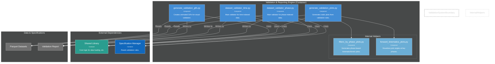

# C4 Component Diagram for Validation & Reporting Engine

```mermaid
%%{init: {'theme': 'dark'}}%%
graph TD
    subgraph "Validation & Reporting Engine (Container)"
        style ValidationSystemBoundary fill:#00000000,stroke:#888,stroke-width:2px,stroke-dasharray:5
        
        validator_phase["dataset_validator_phase.py<br/><font size='-2'>Component</font><br/><font size='-1'>Main validator for phase-indexed data.</font>"]
        validator_time["dataset_validator_time.py<br/><font size='-2'>Component</font><br/><font size='-1'>Main validator for time-indexed data.</font>"]
        plot_generator["generate_validation_plots.py<br/><font size='-2'>Component</font><br/><font size='-1'>Generates static plots from validation rules.</font>"]
        gif_generator["generate_validation_gifs.py<br/><font size='-2'>Component</font><br/><font size='-1'>Creates animated GIFs for visual validation.</font>"]
        
        subgraph "Internal Helpers"
            style InternalHelpers fill:#00000000,stroke:#aaa,stroke-width:1px,stroke-dasharray:3
            filters_plotter["filters_by_phase_plots.py<br/><font size='-2'>Component</font><br/><font size='-1'>Generates phase-based kinematic/kinetic plots.</font>"]
            fk_plotter["forward_kinematics_plots.py<br/><font size='-2'>Component</font><br/><font size='-1'>Visualizes joint angles at key phases.</font>"]
        end
    end

    subgraph "External Dependencies"
        shared_lib["Shared Library<br/><font size='-2'>Container</font><br/><font size='-1'>Core logic for data loading, etc.</font>"]
        spec_manager["Specification Manager<br/><font size='-2'>Container</font><br/><font size='-1'>Reads validation rules.</font>"]
    end

    subgraph "Data & Specifications"
        parquet_storage["Parquet Datasets"]
        validation_report["Validation Report"]
    end

    %% Component to Component Relationships
    plot_generator --> filters_plotter
    plot_generator --> fk_plotter
    
    %% Component to External Dependency Relationships
    validator_phase -- "Uses" --> shared_lib
    validator_time -- "Uses" --> shared_lib
    plot_generator -- "Uses" --> shared_lib
    gif_generator -- "Uses" --> shared_lib

    validator_phase -- "Uses" --> spec_manager
    validator_time -- "Uses" --> spec_manager


    %% Component to Data Relationships
    validator_phase -- "Reads" --> parquet_storage
    validator_time -- "Reads" --> parquet_storage
    gif_generator -- "Reads" --> parquet_storage

    validator_phase -- "Writes to" --> validation_report
    validator_time -- "Writes to" --> validation_report
    plot_generator -- "Writes to" --> validation_report
    gif_generator -- "Writes to" --> validation_report


    %% Styling
    style validator_phase fill:#438dd5,color:white
    style validator_time fill:#438dd5,color:white
    style plot_generator fill:#438dd5,color:white
    style gif_generator fill:#438dd5,color:white
    style filters_plotter fill:#6baed6,color:white
    style fk_plotter fill:#6baed6,color:white
    
    style shared_lib fill:#2a9d8f,color:white
    style spec_manager fill:#1168bd,color:white

    style parquet_storage fill:#707070,color:white
    style validation_report fill:#707070,color:white
    
    linkStyle default stroke:white
``` 