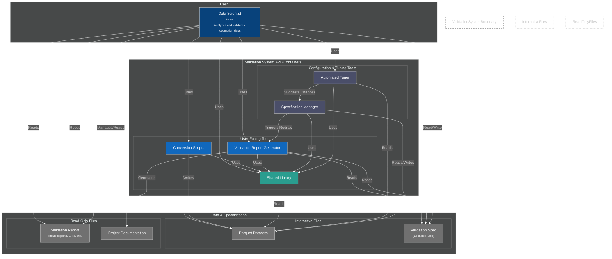

# C4 Container Diagram

```mermaid
%%{init: {'theme': 'dark'}}%%
graph TD
    subgraph "User"
        data_scientist["Data Scientist<br/><font size='-2'>Person</font><br/><font size='-1'>Analyzes and validates locomotion data.</font>"]
    end

    subgraph "Validation System API (Containers)"
        style ValidationSystemBoundary fill:#00000000,stroke:#888,stroke-width:2px,stroke-dasharray:5
        
        subgraph "User-Facing Tools"
            direction LR
            conversion_scripts["Conversion Scripts"]
            reporting_engine["Validation Report Generator"]
            shared_lib["Shared Library"]
        end

        subgraph "Configuration & Tuning Tools"
             direction LR
            spec_manager["Specification Manager"]
            auto_tuner["Automated Tuner"]
        end
    end

    subgraph "Data & Specifications"
        direction LR
        subgraph "Interactive Files"
            style InteractiveFiles fill:#00000000,stroke:#aaa,stroke-width:1px,stroke-dasharray:3
            parquet_storage["Parquet Datasets"]
            validation_spec["Validation Spec<br/><font size='-1'>(Editable Rules)</font>"]
        end
        subgraph "Read-Only Files"
            style ReadOnlyFiles fill:#00000000,stroke:#aaa,stroke-width:1px,stroke-dasharray:3
            validation_report["Validation Report<br/><font size='-1'>(Includes plots, GIFs, etc.)</font>"]
            project_docs["Project Documentation"]
        end
    end


    %% User Relationships
    data_scientist -- "Uses" --> conversion_scripts
    data_scientist -- "Uses" --> reporting_engine
    data_scientist -- "Uses" --> shared_lib
    data_scientist -- "Uses" --> auto_tuner
    data_scientist -- "Read/Write" --> validation_spec
    data_scientist -- "Manages/Reads" --> parquet_storage
    data_scientist -- "Reads" --> validation_report
    data_scientist -- "Reads" --> project_docs


    %% Internal System Relationships
    conversion_scripts -- "Uses" --> shared_lib
    reporting_engine -- "Uses" --> shared_lib
    spec_manager -- "Uses" --> shared_lib
    auto_tuner -- "Uses" --> shared_lib
    
    spec_manager -- "Triggers Redraw" --> reporting_engine
    auto_tuner -- "Suggests Changes" --> spec_manager


    %% System to File Relationships
    conversion_scripts -- "Writes" --> parquet_storage
    shared_lib -- "Reads" --> parquet_storage
    spec_manager -- "Reads/Writes" --> validation_spec
    auto_tuner -- "Reads" --> parquet_storage
    reporting_engine -- "Reads" --> parquet_storage
    reporting_engine -- "Reads" --> validation_spec
    reporting_engine -- "Generates" --> validation_report
    

    %% Styling
    style data_scientist fill:#08427b,color:white
    style conversion_scripts fill:#1168bd,color:white
    style reporting_engine fill:#1168bd,color:white
    style shared_lib fill:#2a9d8f,color:white
    style spec_manager fill:#4a4e69,color:white
    style auto_tuner fill:#4a4e69,color:white
    style parquet_storage fill:#707070,color:white
    style validation_spec fill:#707070,color:white
    style validation_report fill:#707070,color:white
    style project_docs fill:#707070,color:white
    
    linkStyle default stroke:white
``` 