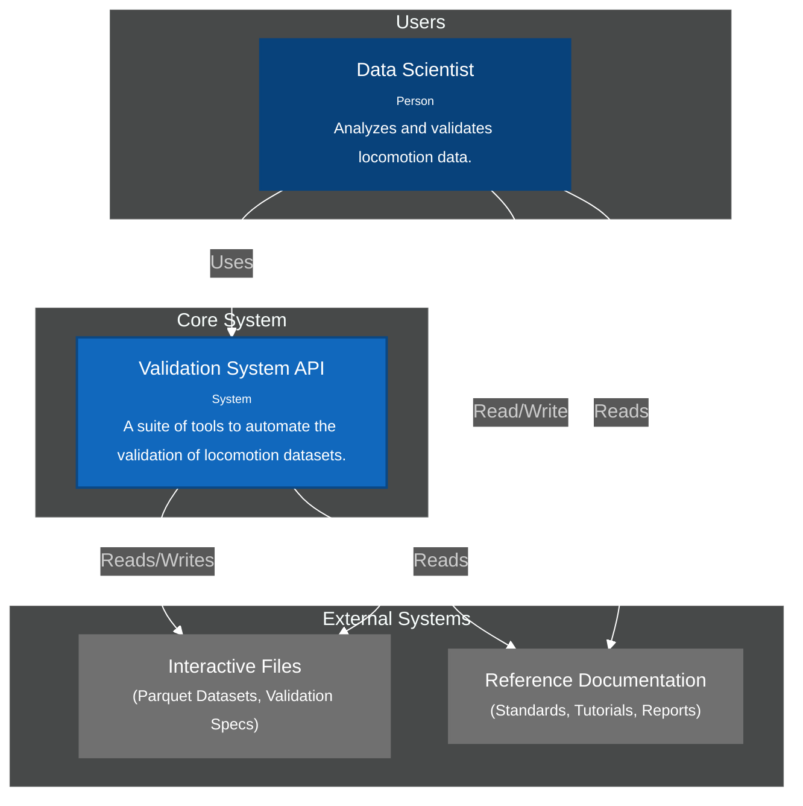

# C4 System Context Diagram

```mermaid
%%{init: {'theme': 'dark'}}%%
graph TD
    subgraph "Users"
        data_scientist["Data Scientist<br/><font size='-2'>Person</font><br/><font size='-1'>Analyzes and validates locomotion data.</font>"]
    end

    subgraph "Core System"
        validation_system["Validation System API<br/><font size='-2'>System</font><br/><font size='-1'>A suite of tools to automate the validation of locomotion datasets.</font>"]
    end

    subgraph "External Systems"
        interactive_files["Interactive Files<br/><font size='-1'>(Parquet Datasets, Validation Specs)</font>"]
        reference_docs["Reference Documentation<br/><font size='-1'>(Standards, Tutorials, Reports)</font>"]
    end

    data_scientist -- "Uses" --> validation_system
    
    validation_system -- "Reads/Writes" --> interactive_files
    validation_system -- "Reads" --> reference_docs

    data_scientist -- "Read/Write" --> interactive_files
    data_scientist -- "Reads" --> reference_docs
    
    %% Styling
    style data_scientist fill:#08427b,stroke:#08427b,stroke-width:2px,color:#ffffff
    style validation_system fill:#1168bd,stroke:#0b4884,stroke-width:2px,color:#ffffff
    style interactive_files fill:#707070,stroke:#707070,stroke-width:2px,color:#ffffff
    style reference_docs fill:#707070,stroke:#707070,stroke-width:2px,color:#ffffff
    
    linkStyle default stroke:white
```

