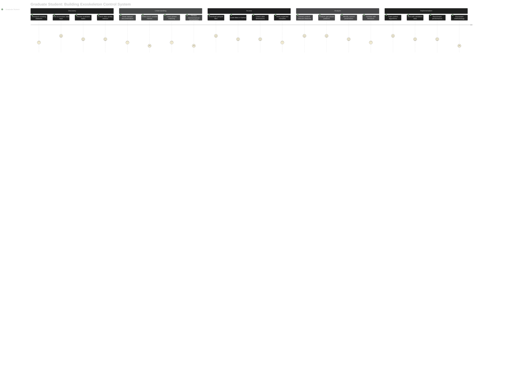
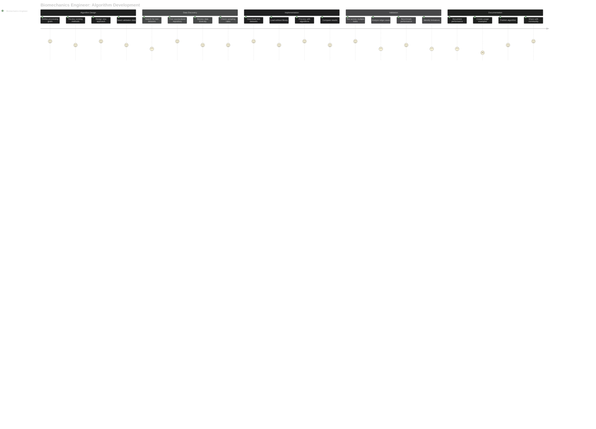
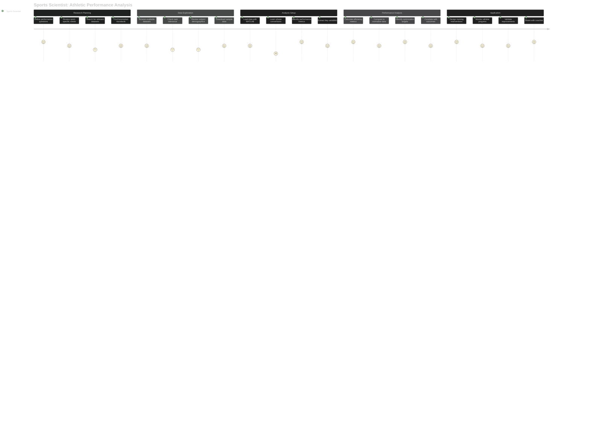

# User Journey Maps - Locomotion Data Consumers

## Journey 1: Graduate Student Needs Gait Data for Exoskeleton Control

**Pain Points:**
- Confusing variable naming conventions across datasets
- Unclear biomechanical coordinate systems and sign conventions
- Missing documentation about data collection protocols
- Difficulty extracting phase-specific control parameters

**Emotional Journey:**
- **Discovery**: Excitement finding standardized locomotion data
- **Understanding**: Frustration with complex biomechanical conventions
- **Access**: Relief that data loads easily into existing workflow
- **Analysis**: Satisfaction with rich, clean datasets
- **Implementation**: Confidence in robust control system development

---

## Journey 2: Clinical Researcher Compares Patient Data to Healthy Norms

**Pain Points:**
- Uncertainty about appropriate healthy reference populations
- Converting patient data to match standard format
- Understanding statistical significance of deviations
- Proper attribution and citation requirements

**Emotional Journey:**
- **Project Setup**: Confidence in finding quality reference data
- **Data Preparation**: Satisfaction with easy data access
- **Patient Analysis**: Excitement discovering clear patterns
- **Interpretation**: Professional fulfillment helping patients
- **Publication**: Pride in contributing to clinical knowledge

---

## Journey 3: Biomechanics Engineer Tests Algorithm Performance

**Pain Points:**
- Finding datasets with sufficient diversity for robust testing
- Understanding data preprocessing and filtering applied
- Ensuring fair comparison across different collection protocols
- Managing large datasets efficiently

**Emotional Journey:**
- **Algorithm Design**: Creative excitement about new methods
- **Data Discovery**: Relief finding comprehensive test data
- **Implementation**: Technical satisfaction with clean data access
- **Validation**: Confidence in robust algorithm performance
- **Documentation**: Professional pride in advancing the field

---

## Journey 4: Sports Scientist Analyzes Athletic Performance

**Pain Points:**
- Limited sport-specific locomotion tasks in datasets
- Uncertainty about relevance to athletic populations
- Need for real-time analysis capabilities
- Translating research findings to practical training

**Emotional Journey:**
- **Research Planning**: Enthusiasm for evidence-based training
- **Data Exploration**: Disappointment with limited sport-specific data
- **Analysis Setup**: Frustration learning biomechanical conventions
- **Performance Analysis**: Excitement discovering performance insights
- **Application**: Fulfillment improving athlete outcomes

---

## Journey 5: Undergraduate Student Learns Biomechanics

**Pain Points:**
- Overwhelming biomechanical terminology and conventions
- Steep learning curve for data analysis concepts
- Difficulty connecting data patterns to real physiology
- Limited programming experience with scientific data

**Emotional Journey:**
- **Course Assignment**: Anxiety about complex technical project
- **Learning**: Growing confidence with clear tutorials
- **Analysis**: Excitement seeing real biomechanical patterns
- **Understanding**: Satisfaction connecting theory to data
- **Mastery**: Pride in developing analytical skills

---

## Cross-Journey Insights

### **Primary User Needs (90% of users)**
1. **Easy data access** - Simple download and load workflows
2. **Clear documentation** - Understand what the data represents
3. **Standard formats** - Compatible with existing analysis tools
4. **Quality assurance** - Trust in data reliability and validity
5. **Proper attribution** - Know how to cite and reference datasets

### **Common Success Factors**
1. **Standardized variable names** across all datasets
2. **Rich documentation** explaining biomechanical conventions
3. **Multiple access methods** (direct parquet, Python library, MATLAB tools)
4. **Quality metrics** visible to build user confidence
5. **Clear tutorials** for different experience levels

### **Universal Pain Points**
1. **Biomechanical complexity** - coordinate systems, sign conventions
2. **Format conversion** between different analysis tools
3. **Population matching** for appropriate comparisons
4. **Real-time constraints** for some applications
5. **Limited task diversity** for specialized applications

### **User Personas Breakdown**
- **90% Dataset Consumers**: Researchers using standardized data for analysis
  - Graduate students (exoskeleton control, gait analysis)
  - Clinical researchers (patient comparisons, diagnostics)
  - Engineers (algorithm development, validation)
  - Sports scientists (performance analysis)
  - Students (learning biomechanics)

- **10% Dataset Contributors**: Researchers adding to the standard
  - Data validation specialists
  - Dataset curators
  - Standard developers

### **Emotional Journey Patterns**
- **Discovery Phase**: Initial excitement finding quality datasets
- **Learning Curve**: Frustration with biomechanical complexity
- **Data Access**: Relief with easy loading and standard formats
- **Analysis**: Satisfaction with rich, clean data enabling insights
- **Application**: Professional fulfillment applying research to real problems

The validation system operates behind the scenes to ensure the 90% of users can trust and effectively use the datasets without needing to understand the complex validation processes.