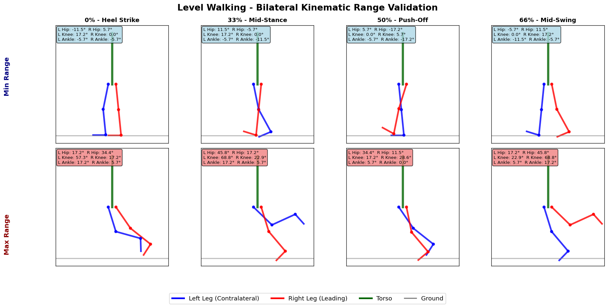
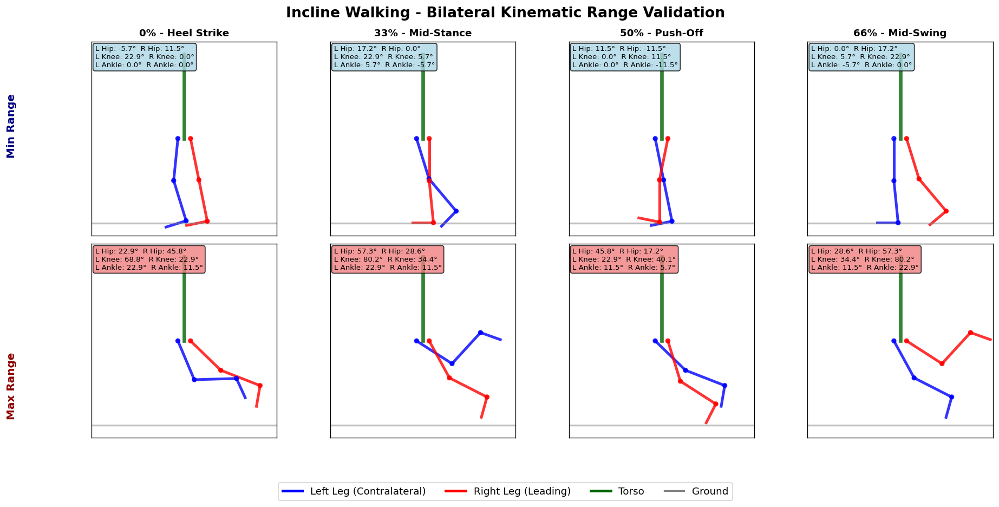
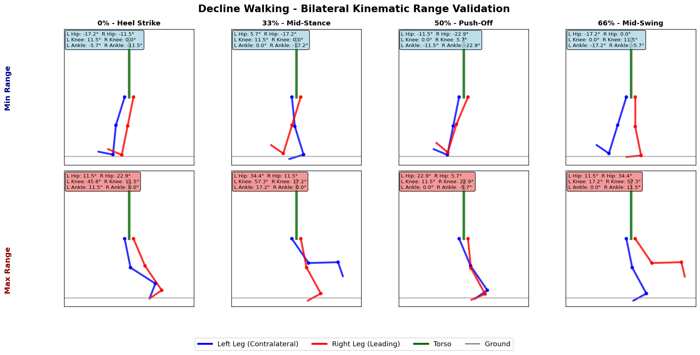
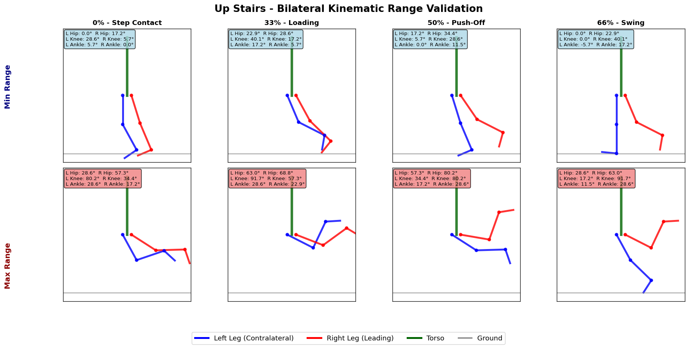
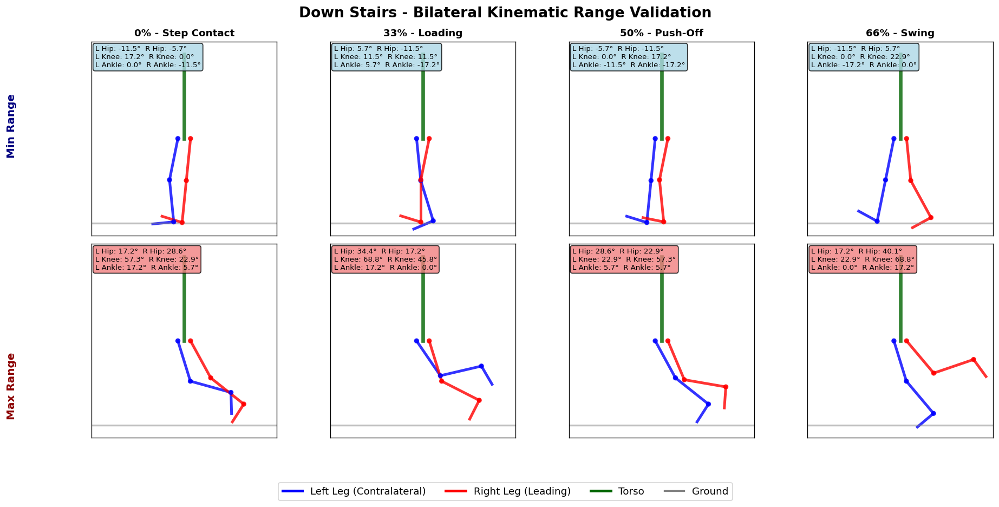
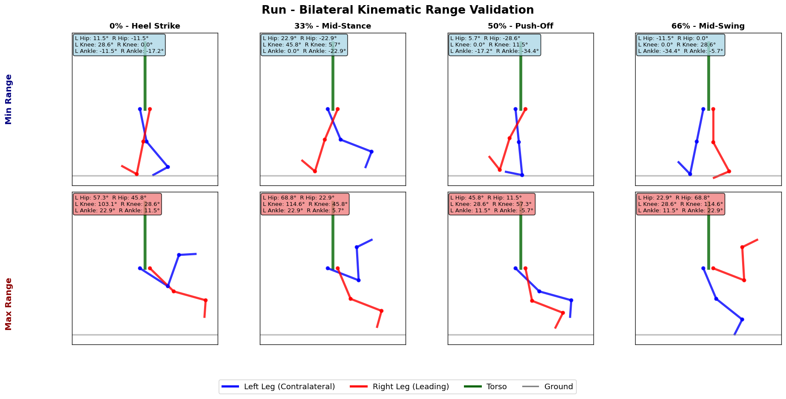
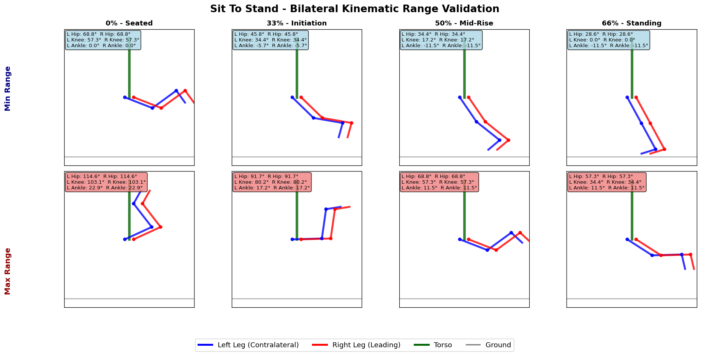
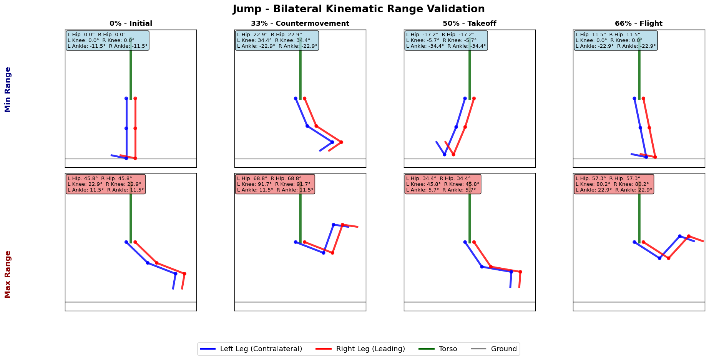
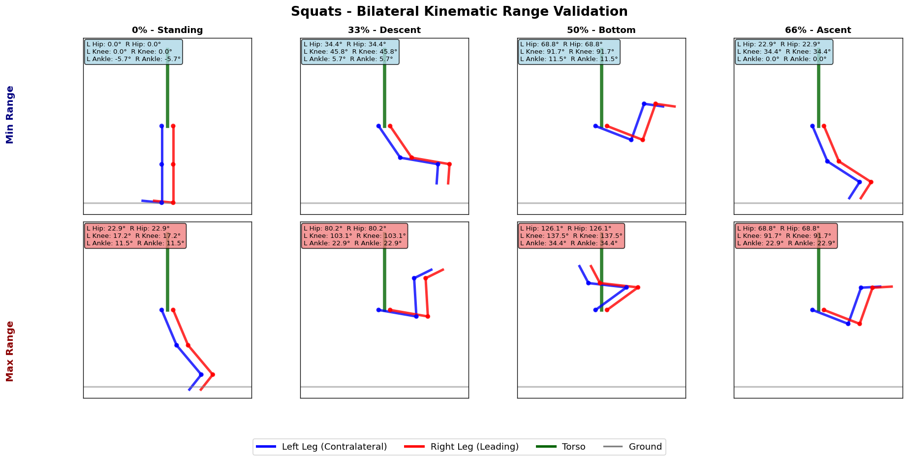

# Validation Expectations Specification

**Single Source of Truth for Biomechanical Validation Rules**

This document defines expected ranges and patterns for all biomechanical variables across different locomotion tasks. It serves as both human-readable documentation and machine-parseable validation specifications.

## Format Specification

### Two-Tier Validation Structure

**Tier 1: Generic Range Validation**
- Basic biomechanical plausibility checks
- Anatomically possible ranges across all tasks
- Applied to all variables regardless of task

**Tier 2: Task-Specific Phase Validation**
- Task-specific expected ranges and patterns
- Phase-specific validation at key points: 0%, 33%, 50%, 66%
- Visual kinematic validation with min/max pose images

### Validation Table Structure

```markdown
### Task: {task_name}

**Phase-Specific Range Validation:**

#### Phase 0% (Heel Strike)
| Variable | Min_Value | Max_Value | Units | Notes |
|----------|-----------|-----------|-------|-------|

#### Phase 33% (Mid-Stance)  
| Variable | Min_Value | Max_Value | Units | Notes |
|----------|-----------|-----------|-------|-------|

#### Phase 50% (Push-Off)
| Variable | Min_Value | Max_Value | Units | Notes |
|----------|-----------|-----------|-------|-------|

#### Phase 66% (Mid-Swing)
| Variable | Min_Value | Max_Value | Units | Notes |
|----------|-----------|-----------|-------|-------|

**Kinematic Range Visualization:**

```

**Column Definitions:**
- `Variable`: Exact variable name (must match dataset columns)
- `Min_Value`: Minimum expected value at this phase point
- `Max_Value`: Maximum expected value at this phase point
- `Units`: Variable units (rad, N, m, etc.)
- `Notes`: Additional context or exceptions

## Validation Tables

### Task: level_walking

**Phase-Specific Range Validation:**

#### Phase 0% (Heel Strike)
| Variable | Min_Value | Max_Value | Units | Notes |
|----------|-----------|-----------|-------|-------|
| hip_flexion_angle_left_rad | 0.1 | 0.6 | rad | Initial contact with slight hip flexion |
| hip_flexion_angle_right_rad | -0.2 | 0.3 | rad | Contralateral leg in stance |
| knee_flexion_angle_left_rad | 0.0 | 0.3 | rad | Slight knee flexion for loading response |
| knee_flexion_angle_right_rad | 0.3 | 1.0 | rad | Contralateral leg in swing |
| ankle_flexion_angle_left_rad | -0.1 | 0.1 | rad | Neutral ankle position at contact |
| ankle_flexion_angle_right_rad | -0.1 | 0.3 | rad | Dorsiflexion for foot clearance |
| vertical_grf_N | 400 | 1200 | N | Initial loading response |
| ap_grf_N | -300 | 100 | N | Initial braking forces |
| ml_grf_N | -100 | 100 | N | Lateral balance adjustment |

#### Phase 33% (Mid-Stance)
| Variable | Min_Value | Max_Value | Units | Notes |
|----------|-----------|-----------|-------|-------|
| hip_flexion_angle_left_rad | -0.1 | 0.3 | rad | Hip moving toward extension |
| hip_flexion_angle_right_rad | 0.2 | 0.8 | rad | Contralateral leg peak swing flexion |
| knee_flexion_angle_left_rad | 0.0 | 0.4 | rad | Stance leg stability |
| knee_flexion_angle_right_rad | 0.3 | 1.2 | rad | Contralateral leg peak swing flexion |
| ankle_flexion_angle_left_rad | -0.2 | 0.1 | rad | Controlled dorsiflexion |
| ankle_flexion_angle_right_rad | -0.1 | 0.3 | rad | Contralateral preparation for contact |
| vertical_grf_N | 600 | 1000 | N | Single limb support |
| ap_grf_N | -200 | 200 | N | Transition from braking to propulsion |
| ml_grf_N | -80 | 80 | N | Stable mediolateral forces |

#### Phase 50% (Push-Off)
| Variable | Min_Value | Max_Value | Units | Notes |
|----------|-----------|-----------|-------|-------|
| hip_flexion_angle_left_rad | -0.3 | 0.2 | rad | Hip extension for propulsion |
| hip_flexion_angle_right_rad | 0.1 | 0.6 | rad | Contralateral leg initial contact |
| knee_flexion_angle_left_rad | 0.1 | 0.5 | rad | Knee flexion for push-off |
| knee_flexion_angle_right_rad | 0.0 | 0.3 | rad | Contralateral leg loading response |
| ankle_flexion_angle_left_rad | -0.3 | 0.0 | rad | Plantarflexion for propulsion |
| ankle_flexion_angle_right_rad | -0.1 | 0.1 | rad | Contralateral leg initial contact |
| vertical_grf_N | 800 | 1400 | N | Peak push-off forces |
| ap_grf_N | 100 | 400 | N | Peak propulsive forces |
| ml_grf_N | -120 | 120 | N | Weight transfer forces |

#### Phase 66% (Mid-Swing)
| Variable | Min_Value | Max_Value | Units | Notes |
|----------|-----------|-----------|-------|-------|
| hip_flexion_angle_left_rad | 0.2 | 0.8 | rad | Hip flexion for limb advancement |
| hip_flexion_angle_right_rad | -0.1 | 0.3 | rad | Contralateral leg stance |
| knee_flexion_angle_left_rad | 0.3 | 1.2 | rad | Peak knee flexion for clearance |
| knee_flexion_angle_right_rad | 0.0 | 0.4 | rad | Contralateral leg stance |
| ankle_flexion_angle_left_rad | -0.1 | 0.3 | rad | Dorsiflexion for foot clearance |
| ankle_flexion_angle_right_rad | -0.2 | 0.1 | rad | Contralateral leg preparation |
| vertical_grf_N | 0 | 200 | N | Minimal forces during swing |
| ap_grf_N | -50 | 50 | N | Minimal AP forces during swing |
| ml_grf_N | -30 | 30 | N | Minimal ML forces during swing |

**Kinematic Range Visualization:**



### Task: incline_walking

**Phase-Specific Range Validation:**

#### Phase 0% (Heel Strike)
| Variable | Min_Value | Max_Value | Units | Notes |
|----------|-----------|-----------|-------|-------|
| hip_flexion_angle_left_rad | 0.2 | 0.8 | rad | Increased hip flexion for incline approach |
| hip_flexion_angle_right_rad | -0.1 | 0.4 | rad | Contralateral leg support |
| knee_flexion_angle_left_rad | 0.0 | 0.4 | rad | Controlled loading on incline |
| knee_flexion_angle_right_rad | 0.4 | 1.2 | rad | Contralateral leg swing |
| ankle_flexion_angle_left_rad | 0.0 | 0.2 | rad | Dorsiflexion for incline contact |
| ankle_flexion_angle_right_rad | 0.0 | 0.4 | rad | Clearance preparation |
| vertical_grf_N | 500 | 1400 | N | Higher impact on incline |
| ap_grf_N | -400 | 0 | N | Strong braking forces uphill |
| ml_grf_N | -120 | 120 | N | Lateral balance on incline |

#### Phase 33% (Mid-Stance)
| Variable | Min_Value | Max_Value | Units | Notes |
|----------|-----------|-----------|-------|-------|
| hip_flexion_angle_left_rad | 0.0 | 0.5 | rad | Hip extension for propulsion |
| hip_flexion_angle_right_rad | 0.3 | 1.0 | rad | Contralateral leg peak flexion |
| knee_flexion_angle_left_rad | 0.1 | 0.6 | rad | Stability with increased flexion |
| knee_flexion_angle_right_rad | 0.4 | 1.4 | rad | Higher swing flexion on incline |
| ankle_flexion_angle_left_rad | -0.1 | 0.2 | rad | Controlled dorsiflexion |
| ankle_flexion_angle_right_rad | 0.1 | 0.4 | rad | Clearance maintenance |
| vertical_grf_N | 700 | 1200 | N | Single limb support |
| ap_grf_N | -300 | 100 | N | Transition to propulsion |
| ml_grf_N | -100 | 100 | N | Lateral stability |

#### Phase 50% (Push-Off)
| Variable | Min_Value | Max_Value | Units | Notes |
|----------|-----------|-----------|-------|-------|
| hip_flexion_angle_left_rad | -0.2 | 0.3 | rad | Hip extension for incline propulsion |
| hip_flexion_angle_right_rad | 0.2 | 0.8 | rad | Contralateral leg preparation |
| knee_flexion_angle_left_rad | 0.2 | 0.7 | rad | Increased push-off flexion |
| knee_flexion_angle_right_rad | 0.0 | 0.4 | rad | Contralateral loading |
| ankle_flexion_angle_left_rad | -0.2 | 0.1 | rad | Moderate plantarflexion |
| ankle_flexion_angle_right_rad | 0.0 | 0.2 | rad | Contact preparation |
| vertical_grf_N | 900 | 1600 | N | Peak propulsive forces |
| ap_grf_N | -100 | 200 | N | Limited propulsion uphill |
| ml_grf_N | -150 | 150 | N | Weight transfer |

#### Phase 66% (Mid-Swing)
| Variable | Min_Value | Max_Value | Units | Notes |
|----------|-----------|-----------|-------|-------|
| hip_flexion_angle_left_rad | 0.3 | 1.0 | rad | Increased hip flexion for clearance |
| hip_flexion_angle_right_rad | 0.0 | 0.5 | rad | Contralateral stance |
| knee_flexion_angle_left_rad | 0.4 | 1.4 | rad | Maximum clearance flexion |
| knee_flexion_angle_right_rad | 0.1 | 0.6 | rad | Stance leg stability |
| ankle_flexion_angle_left_rad | 0.0 | 0.4 | rad | Enhanced dorsiflexion |
| ankle_flexion_angle_right_rad | -0.1 | 0.2 | rad | Preparation for next cycle |
| vertical_grf_N | 0 | 100 | N | Minimal swing forces |
| ap_grf_N | -30 | 30 | N | Minimal swing forces |
| ml_grf_N | -20 | 20 | N | Minimal swing forces |

**Kinematic Range Visualization:**



### Task: decline_walking

**Decline Walking - Controlled descent with increased eccentric loading**

**Phase-Specific Range Validation:**

#### Phase 0% (Heel Strike)
| Variable | Min_Value | Max_Value | Units | Notes |
|----------|-----------|-----------|-------|---------|
| hip_flexion_angle_left_rad | -0.2 | 0.4 | rad | Reduced hip flexion for decline approach |
| hip_flexion_angle_right_rad | -0.3 | 0.2 | rad | Contralateral leg in stance |
| knee_flexion_angle_left_rad | 0.0 | 0.2 | rad | Controlled loading for descent |
| knee_flexion_angle_right_rad | 0.2 | 0.8 | rad | Contralateral leg swing |
| ankle_flexion_angle_left_rad | -0.2 | 0.0 | rad | Slight plantarflexion for control |
| ankle_flexion_angle_right_rad | -0.1 | 0.2 | rad | Clearance preparation |
| vertical_grf_N | 300 | 1000 | N | Controlled impact on decline |
| ap_grf_N | -200 | 200 | N | Balance of braking and propulsion |
| ml_grf_N | -100 | 100 | N | Lateral balance control |

#### Phase 33% (Mid-Stance)
| Variable | Min_Value | Max_Value | Units | Notes |
|----------|-----------|-----------|-------|---------|
| hip_flexion_angle_left_rad | -0.3 | 0.2 | rad | Hip extension for control |
| hip_flexion_angle_right_rad | 0.1 | 0.6 | rad | Contralateral leg swing |
| knee_flexion_angle_left_rad | 0.0 | 0.3 | rad | Eccentric control |
| knee_flexion_angle_right_rad | 0.2 | 1.0 | rad | Swing phase flexion |
| ankle_flexion_angle_left_rad | -0.3 | 0.0 | rad | Controlled plantarflexion |
| ankle_flexion_angle_right_rad | 0.0 | 0.3 | rad | Clearance maintenance |
| vertical_grf_N | 500 | 900 | N | Single limb support |
| ap_grf_N | 0 | 400 | N | Forward progression |
| ml_grf_N | -80 | 80 | N | Lateral stability |

#### Phase 50% (Push-Off)
| Variable | Min_Value | Max_Value | Units | Notes |
|----------|-----------|-----------|-------|---------|
| hip_flexion_angle_left_rad | -0.4 | 0.1 | rad | Maximum hip extension |
| hip_flexion_angle_right_rad | -0.2 | 0.4 | rad | Contralateral preparation |
| knee_flexion_angle_left_rad | 0.1 | 0.4 | rad | Push-off initiation |
| knee_flexion_angle_right_rad | 0.0 | 0.2 | rad | Loading preparation |
| ankle_flexion_angle_left_rad | -0.4 | -0.1 | rad | Plantarflexion for propulsion |
| ankle_flexion_angle_right_rad | -0.2 | 0.0 | rad | Contact preparation |
| vertical_grf_N | 600 | 1100 | N | Controlled push-off |
| ap_grf_N | 200 | 500 | N | Forward propulsion |
| ml_grf_N | -120 | 120 | N | Weight transfer |

#### Phase 66% (Mid-Swing)
| Variable | Min_Value | Max_Value | Units | Notes |
|----------|-----------|-----------|-------|---------|
| hip_flexion_angle_left_rad | 0.0 | 0.6 | rad | Hip flexion for advancement |
| hip_flexion_angle_right_rad | -0.3 | 0.2 | rad | Stance leg position |
| knee_flexion_angle_left_rad | 0.2 | 1.0 | rad | Swing flexion for clearance |
| knee_flexion_angle_right_rad | 0.0 | 0.3 | rad | Stance stability |
| ankle_flexion_angle_left_rad | -0.1 | 0.2 | rad | Dorsiflexion for clearance |
| ankle_flexion_angle_right_rad | -0.3 | 0.0 | rad | Preparation for next cycle |
| vertical_grf_N | 0 | 150 | N | Minimal swing forces |
| ap_grf_N | -40 | 40 | N | Minimal swing forces |
| ml_grf_N | -25 | 25 | N | Minimal swing forces |

**Kinematic Range Visualization:**



### Task: up_stairs

**Stair Ascent - High joint flexion for step clearance and vertical propulsion**

**Phase-Specific Range Validation:**

#### Phase 0% (Step Contact)
| Variable | Min_Value | Max_Value | Units | Notes |
|----------|-----------|-----------|-------|---------|
| hip_flexion_angle_left_rad | 0.3 | 1.0 | rad | High hip flexion for step approach |
| hip_flexion_angle_right_rad | 0.0 | 0.5 | rad | Support leg position |
| knee_flexion_angle_left_rad | 0.1 | 0.6 | rad | Controlled loading on step |
| knee_flexion_angle_right_rad | 0.5 | 1.4 | rad | High swing flexion |
| ankle_flexion_angle_left_rad | 0.0 | 0.3 | rad | Dorsiflexion for step contact |
| ankle_flexion_angle_right_rad | 0.1 | 0.5 | rad | Clearance over step |
| vertical_grf_N | 600 | 1800 | N | High vertical forces for lifting |
| ap_grf_N | -500 | 0 | N | Strong braking for control |
| ml_grf_N | -200 | 200 | N | Balance on step |

#### Phase 33% (Loading)
| Variable | Min_Value | Max_Value | Units | Notes |
|----------|-----------|-----------|-------|---------|
| hip_flexion_angle_left_rad | 0.5 | 1.2 | rad | Peak hip flexion for lifting |
| hip_flexion_angle_right_rad | 0.4 | 1.1 | rad | Swing leg preparation |
| knee_flexion_angle_left_rad | 0.3 | 1.0 | rad | Eccentric to concentric transition |
| knee_flexion_angle_right_rad | 0.7 | 1.6 | rad | Maximum swing flexion |
| ankle_flexion_angle_left_rad | 0.1 | 0.4 | rad | Dorsiflexion maintenance |
| ankle_flexion_angle_right_rad | 0.3 | 0.5 | rad | Peak dorsiflexion |
| vertical_grf_N | 800 | 2000 | N | Peak vertical lifting forces |
| ap_grf_N | -400 | 100 | N | Transition to propulsion |
| ml_grf_N | -150 | 150 | N | Lateral balance |

#### Phase 50% (Push-Off)
| Variable | Min_Value | Max_Value | Units | Notes |
|----------|-----------|-----------|-------|---------|
| hip_flexion_angle_left_rad | 0.6 | 1.4 | rad | Hip flexion for vertical lift |
| hip_flexion_angle_right_rad | 0.3 | 1.0 | rad | Swing leg positioning |
| knee_flexion_angle_left_rad | 0.5 | 1.4 | rad | Concentric extension phase |
| knee_flexion_angle_right_rad | 0.1 | 0.6 | rad | Landing preparation |
| ankle_flexion_angle_left_rad | 0.2 | 0.5 | rad | Dorsiflexion for push-off |
| ankle_flexion_angle_right_rad | 0.0 | 0.3 | rad | Landing preparation |
| vertical_grf_N | 1000 | 2200 | N | Maximum lifting forces |
| ap_grf_N | -200 | 200 | N | Balanced horizontal forces |
| ml_grf_N | -180 | 180 | N | Balance during lift |

#### Phase 66% (Swing)
| Variable | Min_Value | Max_Value | Units | Notes |
|----------|-----------|-----------|-------|---------|
| hip_flexion_angle_left_rad | 0.4 | 1.1 | rad | Hip position at step completion |
| hip_flexion_angle_right_rad | 0.0 | 0.5 | rad | Landing leg position |
| knee_flexion_angle_left_rad | 0.7 | 1.6 | rad | Swing leg peak flexion |
| knee_flexion_angle_right_rad | 0.0 | 0.3 | rad | Landing preparation |
| ankle_flexion_angle_left_rad | 0.3 | 0.5 | rad | Maximum dorsiflexion |
| ankle_flexion_angle_right_rad | -0.1 | 0.2 | rad | Neutral for landing |
| vertical_grf_N | 0 | 300 | N | Minimal forces during swing |
| ap_grf_N | -60 | 60 | N | Minimal swing forces |
| ml_grf_N | -40 | 40 | N | Minimal swing forces |

**Kinematic Range Visualization:**



### Task: down_stairs

**Stair Descent - Controlled eccentric loading with high impact absorption**

**Phase-Specific Range Validation:**

#### Phase 0% (Step Contact)
| Variable | Min_Value | Max_Value | Units | Notes |
|----------|-----------|-----------|-------|---------|
| hip_flexion_angle_left_rad | -0.1 | 0.5 | rad | Controlled hip position for descent |
| hip_flexion_angle_right_rad | -0.2 | 0.3 | rad | Support leg stability |
| knee_flexion_angle_left_rad | 0.0 | 0.4 | rad | Initial contact absorption |
| knee_flexion_angle_right_rad | 0.3 | 1.0 | rad | Swing clearance |
| ankle_flexion_angle_left_rad | -0.2 | 0.1 | rad | Controlled landing |
| ankle_flexion_angle_right_rad | 0.0 | 0.3 | rad | Clearance maintenance |
| vertical_grf_N | 800 | 2200 | N | High impact absorption |
| ap_grf_N | -100 | 400 | N | Forward momentum control |
| ml_grf_N | -150 | 150 | N | Lateral balance |

#### Phase 33% (Loading)
| Variable | Min_Value | Max_Value | Units | Notes |
|----------|-----------|-----------|-------|---------|
| hip_flexion_angle_left_rad | -0.2 | 0.3 | rad | Hip extension for control |
| hip_flexion_angle_right_rad | 0.1 | 0.6 | rad | Swing leg advancement |
| knee_flexion_angle_left_rad | 0.2 | 0.8 | rad | Eccentric loading peak |
| knee_flexion_angle_right_rad | 0.2 | 1.2 | rad | Swing flexion |
| ankle_flexion_angle_left_rad | -0.3 | 0.0 | rad | Controlled plantarflexion |
| ankle_flexion_angle_right_rad | 0.1 | 0.3 | rad | Swing clearance |
| vertical_grf_N | 1000 | 2500 | N | Peak eccentric loading |
| ap_grf_N | 100 | 600 | N | Forward progression |
| ml_grf_N | -120 | 120 | N | Lateral control |

#### Phase 50% (Push-Off)
| Variable | Min_Value | Max_Value | Units | Notes |
|----------|-----------|-----------|-------|---------|
| hip_flexion_angle_left_rad | -0.2 | 0.4 | rad | Hip position for push-off |
| hip_flexion_angle_right_rad | -0.1 | 0.5 | rad | Landing preparation |
| knee_flexion_angle_left_rad | 0.3 | 1.0 | rad | Controlled extension |
| knee_flexion_angle_right_rad | 0.0 | 0.4 | rad | Landing preparation |
| ankle_flexion_angle_left_rad | -0.3 | 0.1 | rad | Push-off preparation |
| ankle_flexion_angle_right_rad | -0.2 | 0.1 | rad | Landing preparation |
| vertical_grf_N | 600 | 1800 | N | Controlled push-off |
| ap_grf_N | 200 | 600 | N | Forward propulsion |
| ml_grf_N | -140 | 140 | N | Weight transfer |

#### Phase 66% (Swing)
| Variable | Min_Value | Max_Value | Units | Notes |
|----------|-----------|-----------|-------|---------|
| hip_flexion_angle_left_rad | 0.1 | 0.7 | rad | Swing hip flexion |
| hip_flexion_angle_right_rad | -0.2 | 0.3 | rad | Stance leg position |
| knee_flexion_angle_left_rad | 0.4 | 1.2 | rad | Swing clearance |
| knee_flexion_angle_right_rad | 0.0 | 0.4 | rad | Stance stability |
| ankle_flexion_angle_left_rad | 0.0 | 0.3 | rad | Clearance dorsiflexion |
| ankle_flexion_angle_right_rad | -0.3 | 0.0 | rad | Stance preparation |
| vertical_grf_N | 0 | 250 | N | Minimal swing forces |
| ap_grf_N | -50 | 50 | N | Minimal swing forces |
| ml_grf_N | -30 | 30 | N | Minimal swing forces |

**Kinematic Range Visualization:**



### Task: run

**Running - High impact with flight phase and increased joint ranges**

**Phase-Specific Range Validation:**

#### Phase 0% (Heel Strike)
| Variable | Min_Value | Max_Value | Units | Notes |
|----------|-----------|-----------|-------|---------|
| hip_flexion_angle_left_rad | -0.2 | 0.8 | rad | Initial contact with forward lean |
| hip_flexion_angle_right_rad | 0.2 | 1.0 | rad | Swing leg position |
| knee_flexion_angle_left_rad | 0.0 | 0.5 | rad | Impact absorption |
| knee_flexion_angle_right_rad | 0.5 | 1.8 | rad | High swing flexion |
| ankle_flexion_angle_left_rad | -0.3 | 0.2 | rad | Variable contact strategy |
| ankle_flexion_angle_right_rad | -0.2 | 0.4 | rad | Swing preparation |
| vertical_grf_N | 1200 | 2800 | N | High impact forces |
| ap_grf_N | -600 | 200 | N | Strong braking forces |
| ml_grf_N | -250 | 250 | N | Lateral balance |

#### Phase 33% (Mid-Stance)
| Variable | Min_Value | Max_Value | Units | Notes |
|----------|-----------|-----------|-------|---------|
| hip_flexion_angle_left_rad | -0.4 | 0.4 | rad | Hip extension for propulsion |
| hip_flexion_angle_right_rad | 0.4 | 1.2 | rad | Peak swing flexion |
| knee_flexion_angle_left_rad | 0.1 | 0.8 | rad | Stance flexion control |
| knee_flexion_angle_right_rad | 0.8 | 2.0 | rad | Maximum swing flexion |
| ankle_flexion_angle_left_rad | -0.4 | 0.1 | rad | Plantarflexion development |
| ankle_flexion_angle_right_rad | 0.0 | 0.4 | rad | Swing dorsiflexion |
| vertical_grf_N | 800 | 2200 | N | Mid-stance loading |
| ap_grf_N | -300 | 400 | N | Transition to propulsion |
| ml_grf_N | -200 | 200 | N | Dynamic balance |

#### Phase 50% (Push-Off)
| Variable | Min_Value | Max_Value | Units | Notes |
|----------|-----------|-----------|-------|---------|
| hip_flexion_angle_left_rad | -0.5 | 0.2 | rad | Maximum hip extension |
| hip_flexion_angle_right_rad | 0.1 | 0.8 | rad | Swing leg advancement |
| knee_flexion_angle_left_rad | 0.2 | 1.0 | rad | Push-off initiation |
| knee_flexion_angle_right_rad | 0.0 | 0.5 | rad | Swing extension preparation |
| ankle_flexion_angle_left_rad | -0.6 | -0.1 | rad | Strong plantarflexion |
| ankle_flexion_angle_right_rad | -0.3 | 0.2 | rad | Contact preparation |
| vertical_grf_N | 1000 | 3000 | N | Peak propulsive forces |
| ap_grf_N | 200 | 800 | N | Maximum propulsion |
| ml_grf_N | -300 | 300 | N | Dynamic lateral forces |

#### Phase 66% (Mid-Swing)
| Variable | Min_Value | Max_Value | Units | Notes |
|----------|-----------|-----------|-------|---------|
| hip_flexion_angle_left_rad | 0.0 | 1.2 | rad | Swing hip flexion |
| hip_flexion_angle_right_rad | -0.2 | 0.4 | rad | Stance preparation |
| knee_flexion_angle_left_rad | 0.5 | 2.0 | rad | Peak swing flexion |
| knee_flexion_angle_right_rad | 0.0 | 0.5 | rad | Contact preparation |
| ankle_flexion_angle_left_rad | -0.1 | 0.4 | rad | Swing dorsiflexion |
| ankle_flexion_angle_right_rad | -0.6 | 0.2 | rad | Contact preparation |
| vertical_grf_N | 0 | 200 | N | Flight phase - minimal forces |
| ap_grf_N | -80 | 80 | N | Minimal flight forces |
| ml_grf_N | -50 | 50 | N | Minimal flight forces |

**Kinematic Range Visualization:**



### Task: sit_to_stand

**Sit to Stand - Transition from seated to standing with hip and knee extension**

**Phase-Specific Range Validation:**

#### Phase 0% (Seated)
| Variable | Min_Value | Max_Value | Units | Notes |
|----------|-----------|-----------|-------|---------|
| hip_flexion_angle_left_rad | 1.2 | 2.0 | rad | Initial seated position |
| hip_flexion_angle_right_rad | 1.2 | 2.0 | rad | Bilateral seated position |
| knee_flexion_angle_left_rad | 1.0 | 1.8 | rad | Seated knee position |
| knee_flexion_angle_right_rad | 1.0 | 1.8 | rad | Bilateral knee position |
| ankle_flexion_angle_left_rad | 0.0 | 0.4 | rad | Dorsiflexion for preparation |
| ankle_flexion_angle_right_rad | 0.0 | 0.4 | rad | Bilateral preparation |
| vertical_grf_N | 400 | 800 | N | Initial weight bearing |
| ap_grf_N | -200 | 200 | N | Balance adjustment |
| ml_grf_N | -150 | 150 | N | Lateral balance |

#### Phase 33% (Initiation)
| Variable | Min_Value | Max_Value | Units | Notes |
|----------|-----------|-----------|-------|---------|
| hip_flexion_angle_left_rad | 0.8 | 1.6 | rad | Hip extension initiation |
| hip_flexion_angle_right_rad | 0.8 | 1.6 | rad | Bilateral hip extension |
| knee_flexion_angle_left_rad | 0.6 | 1.4 | rad | Knee extension initiation |
| knee_flexion_angle_right_rad | 0.6 | 1.4 | rad | Bilateral knee extension |
| ankle_flexion_angle_left_rad | -0.1 | 0.3 | rad | Ankle adjustment |
| ankle_flexion_angle_right_rad | -0.1 | 0.3 | rad | Bilateral adjustment |
| vertical_grf_N | 600 | 1000 | N | Increasing weight transfer |
| ap_grf_N | -250 | 250 | N | Forward momentum |
| ml_grf_N | -180 | 180 | N | Balance control |

#### Phase 50% (Mid-Rise)
| Variable | Min_Value | Max_Value | Units | Notes |
|----------|-----------|-----------|-------|---------|
| hip_flexion_angle_left_rad | 0.6 | 1.2 | rad | Mid-range hip extension |
| hip_flexion_angle_right_rad | 0.6 | 1.2 | rad | Bilateral progression |
| knee_flexion_angle_left_rad | 0.3 | 1.0 | rad | Mid-range knee extension |
| knee_flexion_angle_right_rad | 0.3 | 1.0 | rad | Bilateral progression |
| ankle_flexion_angle_left_rad | -0.2 | 0.2 | rad | Neutral ankle position |
| ankle_flexion_angle_right_rad | -0.2 | 0.2 | rad | Bilateral neutral |
| vertical_grf_N | 800 | 1200 | N | Peak vertical forces |
| ap_grf_N | -300 | 300 | N | Balance maintenance |
| ml_grf_N | -200 | 200 | N | Dynamic balance |

#### Phase 66% (Standing)
| Variable | Min_Value | Max_Value | Units | Notes |
|----------|-----------|-----------|-------|---------|
| hip_flexion_angle_left_rad | 0.5 | 1.0 | rad | Near standing hip position |
| hip_flexion_angle_right_rad | 0.5 | 1.0 | rad | Bilateral near standing |
| knee_flexion_angle_left_rad | 0.0 | 0.6 | rad | Near full knee extension |
| knee_flexion_angle_right_rad | 0.0 | 0.6 | rad | Bilateral extension |
| ankle_flexion_angle_left_rad | -0.2 | 0.2 | rad | Standing ankle position |
| ankle_flexion_angle_right_rad | -0.2 | 0.2 | rad | Bilateral standing |
| vertical_grf_N | 600 | 1000 | N | Standing weight bearing |
| ap_grf_N | -200 | 200 | N | Final balance adjustment |
| ml_grf_N | -150 | 150 | N | Standing balance |

**Kinematic Range Visualization:**



### Task: jump

**Jumping - Countermovement with explosive concentric phase and flight**

**Phase-Specific Range Validation:**

#### Phase 0% (Initial)
| Variable | Min_Value | Max_Value | Units | Notes |
|----------|-----------|-----------|-------|---------|
| hip_flexion_angle_left_rad | 0.0 | 0.8 | rad | Initial standing position |
| hip_flexion_angle_right_rad | 0.0 | 0.8 | rad | Bilateral standing |
| knee_flexion_angle_left_rad | 0.0 | 0.4 | rad | Initial knee position |
| knee_flexion_angle_right_rad | 0.0 | 0.4 | rad | Bilateral initial position |
| ankle_flexion_angle_left_rad | -0.2 | 0.2 | rad | Neutral ankle start |
| ankle_flexion_angle_right_rad | -0.2 | 0.2 | rad | Bilateral neutral |
| vertical_grf_N | 600 | 1200 | N | Initial body weight |
| ap_grf_N | -300 | 300 | N | Balance preparation |
| ml_grf_N | -200 | 200 | N | Lateral balance |

#### Phase 33% (Countermovement)
| Variable | Min_Value | Max_Value | Units | Notes |
|----------|-----------|-----------|-------|---------|
| hip_flexion_angle_left_rad | 0.4 | 1.2 | rad | Countermovement hip flexion |
| hip_flexion_angle_right_rad | 0.4 | 1.2 | rad | Bilateral countermovement |
| knee_flexion_angle_left_rad | 0.6 | 1.6 | rad | Deep countermovement |
| knee_flexion_angle_right_rad | 0.6 | 1.6 | rad | Bilateral deep flexion |
| ankle_flexion_angle_left_rad | -0.4 | 0.2 | rad | Ankle preparation |
| ankle_flexion_angle_right_rad | -0.4 | 0.2 | rad | Bilateral preparation |
| vertical_grf_N | 200 | 800 | N | Reduced loading during descent |
| ap_grf_N | -400 | 400 | N | Dynamic balance |
| ml_grf_N | -250 | 250 | N | Balance during descent |

#### Phase 50% (Takeoff)
| Variable | Min_Value | Max_Value | Units | Notes |
|----------|-----------|-----------|-------|---------|
| hip_flexion_angle_left_rad | -0.3 | 0.6 | rad | Explosive hip extension |
| hip_flexion_angle_right_rad | -0.3 | 0.6 | rad | Bilateral extension |
| knee_flexion_angle_left_rad | -0.1 | 0.8 | rad | Explosive knee extension |
| knee_flexion_angle_right_rad | -0.1 | 0.8 | rad | Bilateral explosion |
| ankle_flexion_angle_left_rad | -0.6 | 0.1 | rad | Strong plantarflexion |
| ankle_flexion_angle_right_rad | -0.6 | 0.1 | rad | Bilateral plantarflexion |
| vertical_grf_N | 1500 | 4000 | N | Peak takeoff forces |
| ap_grf_N | -500 | 500 | N | Direction-dependent forces |
| ml_grf_N | -300 | 300 | N | Dynamic balance forces |

#### Phase 66% (Flight)
| Variable | Min_Value | Max_Value | Units | Notes |
|----------|-----------|-----------|-------|---------|
| hip_flexion_angle_left_rad | 0.2 | 1.0 | rad | Flight position |
| hip_flexion_angle_right_rad | 0.2 | 1.0 | rad | Bilateral flight |
| knee_flexion_angle_left_rad | 0.0 | 1.4 | rad | Variable flight position |
| knee_flexion_angle_right_rad | 0.0 | 1.4 | rad | Bilateral flight position |
| ankle_flexion_angle_left_rad | -0.4 | 0.4 | rad | Flight ankle position |
| ankle_flexion_angle_right_rad | -0.4 | 0.4 | rad | Bilateral flight |
| vertical_grf_N | 0 | 100 | N | Minimal flight forces |
| ap_grf_N | -50 | 50 | N | Minimal flight forces |
| ml_grf_N | -30 | 30 | N | Minimal flight forces |

**Kinematic Range Visualization:**



### Task: squats

**Squats - Deep bilateral flexion with controlled descent and ascent**

**Phase-Specific Range Validation:**

#### Phase 0% (Standing)
| Variable | Min_Value | Max_Value | Units | Notes |
|----------|-----------|-----------|-------|---------|
| hip_flexion_angle_left_rad | 0.0 | 0.4 | rad | Initial standing position |
| hip_flexion_angle_right_rad | 0.0 | 0.4 | rad | Bilateral standing |
| knee_flexion_angle_left_rad | 0.0 | 0.3 | rad | Initial knee position |
| knee_flexion_angle_right_rad | 0.0 | 0.3 | rad | Bilateral initial |
| ankle_flexion_angle_left_rad | -0.1 | 0.2 | rad | Neutral ankle start |
| ankle_flexion_angle_right_rad | -0.1 | 0.2 | rad | Bilateral neutral |
| vertical_grf_N | 600 | 1200 | N | Initial body weight |
| ap_grf_N | -200 | 200 | N | Balance maintenance |
| ml_grf_N | -150 | 150 | N | Lateral balance |

#### Phase 33% (Descent)
| Variable | Min_Value | Max_Value | Units | Notes |
|----------|-----------|-----------|-------|---------|
| hip_flexion_angle_left_rad | 0.6 | 1.4 | rad | Descent hip flexion |
| hip_flexion_angle_right_rad | 0.6 | 1.4 | rad | Bilateral descent |
| knee_flexion_angle_left_rad | 0.8 | 1.8 | rad | Descent knee flexion |
| knee_flexion_angle_right_rad | 0.8 | 1.8 | rad | Bilateral descent |
| ankle_flexion_angle_left_rad | 0.1 | 0.4 | rad | Dorsiflexion for balance |
| ankle_flexion_angle_right_rad | 0.1 | 0.4 | rad | Bilateral dorsiflexion |
| vertical_grf_N | 400 | 1000 | N | Reduced loading during descent |
| ap_grf_N | -300 | 300 | N | Balance control |
| ml_grf_N | -180 | 180 | N | Lateral stability |

#### Phase 50% (Bottom)
| Variable | Min_Value | Max_Value | Units | Notes |
|----------|-----------|-----------|-------|---------|
| hip_flexion_angle_left_rad | 1.2 | 2.2 | rad | Maximum squat depth |
| hip_flexion_angle_right_rad | 1.2 | 2.2 | rad | Bilateral maximum |
| knee_flexion_angle_left_rad | 1.6 | 2.4 | rad | Maximum knee flexion |
| knee_flexion_angle_right_rad | 1.6 | 2.4 | rad | Bilateral maximum |
| ankle_flexion_angle_left_rad | 0.2 | 0.6 | rad | Peak dorsiflexion |
| ankle_flexion_angle_right_rad | 0.2 | 0.6 | rad | Bilateral peak |
| vertical_grf_N | 500 | 1000 | N | Bottom position loading |
| ap_grf_N | -350 | 350 | N | Balance at depth |
| ml_grf_N | -200 | 200 | N | Lateral balance at depth |

#### Phase 66% (Ascent)
| Variable | Min_Value | Max_Value | Units | Notes |
|----------|-----------|-----------|-------|---------|
| hip_flexion_angle_left_rad | 0.4 | 1.2 | rad | Ascent hip extension |
| hip_flexion_angle_right_rad | 0.4 | 1.2 | rad | Bilateral ascent |
| knee_flexion_angle_left_rad | 0.6 | 1.6 | rad | Ascent knee extension |
| knee_flexion_angle_right_rad | 0.6 | 1.6 | rad | Bilateral ascent |
| ankle_flexion_angle_left_rad | 0.0 | 0.4 | rad | Return to neutral |
| ankle_flexion_angle_right_rad | 0.0 | 0.4 | rad | Bilateral return |
| vertical_grf_N | 800 | 1600 | N | Ascent forces |
| ap_grf_N | -250 | 250 | N | Balance during ascent |
| ml_grf_N | -180 | 180 | N | Lateral control |

**Kinematic Range Visualization:**




## Pattern Definitions

**Temporal Patterns:**
- `peak_at_X`: Maximum value occurs at phase X%
- `valley_at_X`: Minimum value occurs at phase X%
- `increasing`: Monotonic increase throughout phase range
- `decreasing`: Monotonic decrease throughout phase range
- `negative_to_positive`: Crosses zero from negative to positive
- `U_shaped`: Decreases then increases (valley in middle)
- `inverted_U`: Increases then decreases (peak in middle)

**Amplitude Patterns:**
- `near_zero`: Values close to zero throughout
- `predominantly_negative`: Mostly negative values
- `predominantly_positive`: Mostly positive values
- `variable`: High variability, no clear pattern
- `controlled_motion`: Smooth, controlled changes

## Parser Usage

This markdown file can be parsed programmatically using the companion parser:

```python
from validation_markdown_parser import ValidationMarkdownParser

parser = ValidationMarkdownParser()
validation_rules = parser.parse_file('validation_expectations.md')

# Get rules for specific task
level_walking_rules = validation_rules['level_walking']

# Validate data against rules
results = parser.validate_data(data, 'level_walking')
```

## Maintenance Guidelines

1. **Adding New Tasks**: Follow the exact table format
2. **Variable Names**: Must match dataset column names exactly
3. **Phase Ranges**: Use format "start-end" (e.g., "0-100", "45-55")  
4. **Patterns**: Use predefined pattern names from Pattern Definitions
5. **Units**: Must match standard specification units
6. **Tolerance**: Percentage (e.g., "15%") or absolute values

## Version History

- v2.0: Enhanced phase-specific validation with kinematic visualizations
- v1.0: Initial comprehensive validation specification
- Created: 2025-06-06
- Last Updated: 2025-06-06
