# Kinematic Validation Expectations Specification

**Single Source of Truth for Biomechanically Accurate Kinematic Validation Rules**

This document provides biomechanically verified kinematic validation ranges (joint angles) based on published gait analysis literature. The specification uses a modern phase system (0%, 25%, 50%, 75%) with contralateral offset logic for optimal validation efficiency.

> **📊 Related**: See [validation_expectations_kinetic.md](validation_expectations_kinetic.md) for kinetic validation rules (forces and moments).

> **📋 Version Information**: See [../development/validation_expectations_changelog.md](../development/validation_expectations_changelog.md) for detailed version history and changes.  
> **🎨 Image Generation**: See [../development/kinematic_visualization_guide.md](../development/kinematic_visualization_guide.md) for generating validation images.

## Format Specification

### Two-Tier Validation Structure

**Tier 1: Generic Range Validation**
- Basic biomechanical plausibility checks
- Anatomically possible ranges across all tasks
- Applied to all variables regardless of task

**Tier 2: Task-Specific Phase Validation**
- Task-specific expected ranges and patterns
- Phase-specific validation at key points: **0%, 25%, 50%, 75%**
- Contralateral leg automatically computed with 50% phase offset
- Visual kinematic validation with min/max pose images

### Validation Table Structure

```markdown
### Task: {task_name}

**Phase-Specific Range Validation:**

#### Phase 0% (Heel Strike)
| Variable | Min_Value | Max_Value | Units | Notes |
|----------|-----------|-----------|-------|-------|

#### Phase 25% (Mid-Stance)  
| Variable | Min_Value | Max_Value | Units | Notes |
|----------|-----------|-----------|-------|-------|

#### Phase 50% (Toe-Off)
| Variable | Min_Value | Max_Value | Units | Notes |
|----------|-----------|-----------|-------|-------|

#### Phase 75% (Mid-Swing)
| Variable | Min_Value | Max_Value | Units | Notes |
|----------|-----------|-----------|-------|-------|

**Contralateral Offset Logic:**
- Contralateral leg values automatically computed with 50% phase offset
- Phase 0% ipsilateral = Phase 50% contralateral (heel strike vs toe-off)
- Phase 25% ipsilateral = Phase 75% contralateral (mid-stance vs mid-swing)

**Forward Kinematics Range Visualization:**


```

**Column Definitions:**
- `Variable`: Exact variable name (must match dataset columns)
- `Min_Value`: Minimum expected value at this phase point
- `Max_Value`: Maximum expected value at this phase point
- `Units`: Variable units (rad, N, m, etc.)
- `Notes`: Additional context or exceptions

## Validation Tables - VERIFIED

### Task: level_walking

**Phase-Specific Range Validation (Ipsilateral Leg Only):**

#### Phase 0% (Heel Strike)
| Variable | Min_Value | Max_Value | Units | Notes |
|----------|-----------|-----------|-------|-------|
| hip_flexion_angle_ipsi_rad | 0.15 (9°) | 0.6 (34°) | rad | Initial contact with hip flexion (9-34°) |
| knee_flexion_angle_ipsi_rad | 0.0 (0°) | 0.15 (9°) | rad | Nearly extended at contact (0 to 9°) - OpenSim convention |
| ankle_flexion_angle_ipsi_rad | -0.05 (-3°) | 0.05 (3°) | rad | Neutral ankle position at contact (-3 to 3°) |
| vertical_grf_N | 400 | 1200 | N | Initial loading response |
| ap_grf_N | -300 | 100 | N | Initial braking forces |
| ml_grf_N | -100 | 100 | N | Lateral balance adjustment |

#### Phase 25% (Mid-Stance)
| Variable | Min_Value | Max_Value | Units | Notes |
|----------|-----------|-----------|-------|-------|
| hip_flexion_angle_ipsi_rad | -0.05 (-3°) | 0.35 (20°) | rad | Hip moving toward extension (-3 to 20°) |
| knee_flexion_angle_ipsi_rad | 0.05 (3°) | 0.25 (14°) | rad | Slight flexion during stance (3-14°) |
| ankle_flexion_angle_ipsi_rad | 0.05 (3°) | 0.25 (14°) | rad | **VERIFIED: Dorsiflexion during stance (3-14°)** |
| vertical_grf_N | 600 | 1000 | N | Single limb support |
| ap_grf_N | -200 | 200 | N | Transition from braking to propulsion |
| ml_grf_N | -80 | 80 | N | Stable mediolateral forces |

#### Phase 50% (Toe-Off)
| Variable | Min_Value | Max_Value | Units | Notes |
|----------|-----------|-----------|-------|-------|
| hip_flexion_angle_ipsi_rad | -0.35 (-20°) | 0.0 (0°) | rad | Hip extension for propulsion (-20 to 0°) |
| knee_flexion_angle_ipsi_rad | 0.5 (29°) | 0.8 (46°) | rad | **VERIFIED: Knee flexion for push-off (29-46°)** |
| ankle_flexion_angle_ipsi_rad | -0.4 (-23°) | -0.2 (-11°) | rad | **VERIFIED: Plantarflexion for propulsion (-23 to -11°)** |
| vertical_grf_N | 800 | 1400 | N | Peak push-off forces |
| ap_grf_N | 100 | 400 | N | Peak propulsive forces |
| ml_grf_N | -120 | 120 | N | Weight transfer forces |

#### Phase 75% (Mid-Swing)
| Variable | Min_Value | Max_Value | Units | Notes |
|----------|-----------|-----------|-------|-------|
| hip_flexion_angle_ipsi_rad | 0.3 (17°) | 0.9 (52°) | rad | Hip flexion for limb advancement (17-52°) |
| knee_flexion_angle_ipsi_rad | 0.8 (46°) | 1.3 (74°) | rad | Peak knee flexion for clearance (46-74°) |
| ankle_flexion_angle_ipsi_rad | -0.1 (-6°) | 0.2 (11°) | rad | Dorsiflexion for foot clearance (-6 to 11°) |
| vertical_grf_N | 0 | 200 | N | Minimal forces during swing |
| ap_grf_N | -50 | 50 | N | Minimal AP forces during swing |
| ml_grf_N | -30 | 30 | N | Minimal ML forces during swing |

#### Phase 100% (Heel Strike - Cycle Complete)
| Variable | Min_Value | Max_Value | Units | Notes |
|----------|-----------|-----------|-------|-------|
| hip_flexion_angle_ipsi_rad | 0.15 (9°) | 0.6 (34°) | rad | Return to initial contact (same as 0%) |
| knee_flexion_angle_ipsi_rad | 0.0 (0°) | 0.15 (9°) | rad | Return to nearly extended (same as 0%) |
| ankle_flexion_angle_ipsi_rad | -0.05 (-3°) | 0.05 (3°) | rad | Return to neutral position (same as 0%) |
| vertical_grf_N | 400 | 1200 | N | Return to initial loading (same as 0%) |
| ap_grf_N | -300 | 100 | N | Return to initial braking (same as 0%) |
| ml_grf_N | -100 | 100 | N | Return to initial balance (same as 0%) |

**Contralateral Offset Logic:**
- **Phase 0% ipsilateral** (heel strike) = **Phase 50% contralateral** (toe-off)
- **Phase 25% ipsilateral** (mid-stance) = **Phase 75% contralateral** (mid-swing)  
- **Phase 50% ipsilateral** (toe-off) = **Phase 0% contralateral** (heel strike)
- **Phase 75% ipsilateral** (mid-swing) = **Phase 25% contralateral** (mid-stance)

**Forward Kinematics Range Visualization:**

| Phase 0% (Heel Strike) | Phase 25% (Mid-Stance) | Phase 50% (Toe-Off) | Phase 75% (Mid-Swing) |
|---|---|---|---|
| 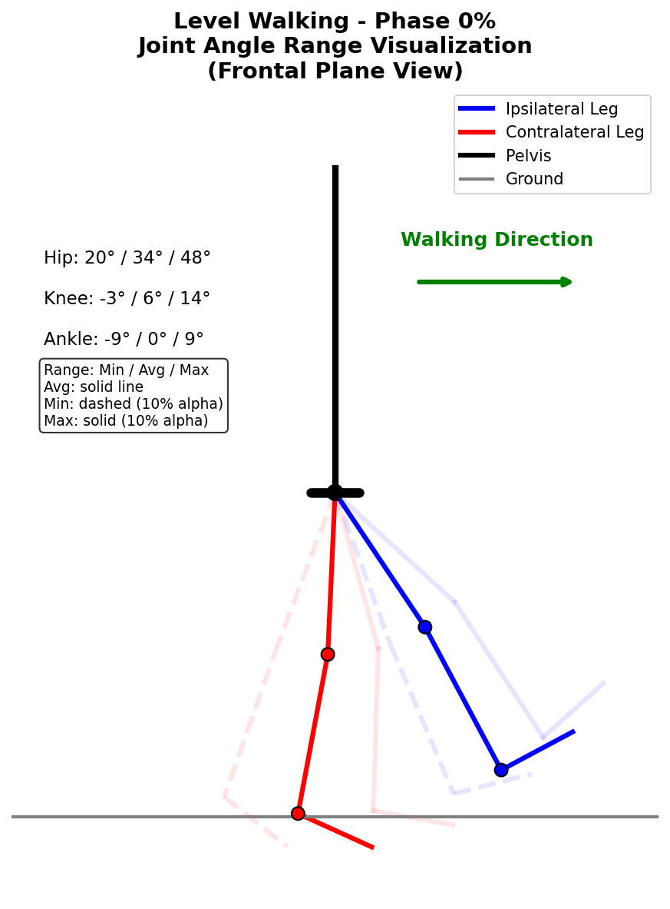 | 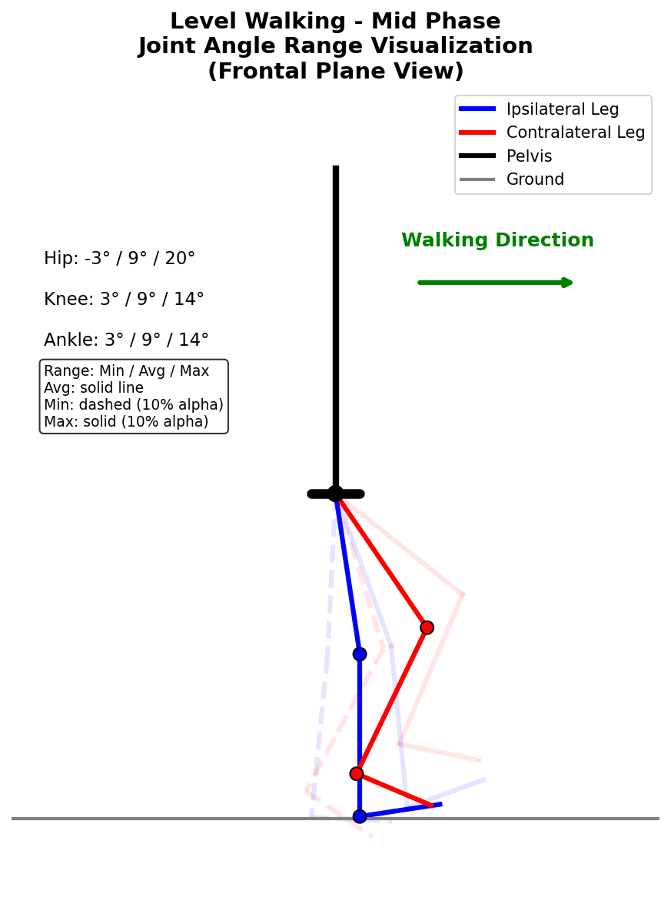 | 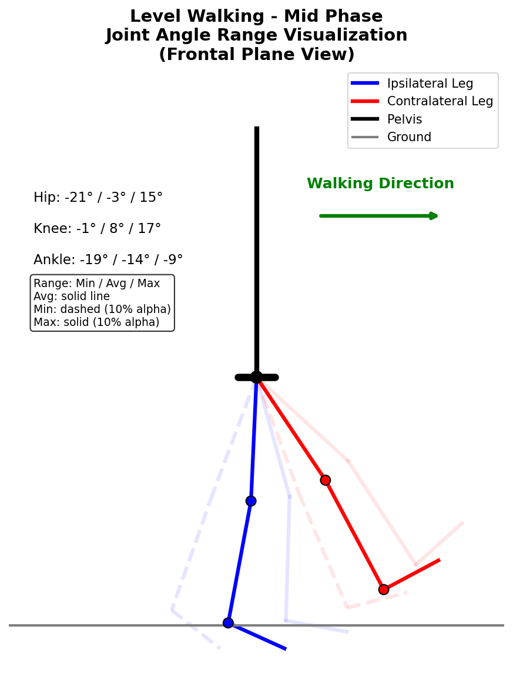 | 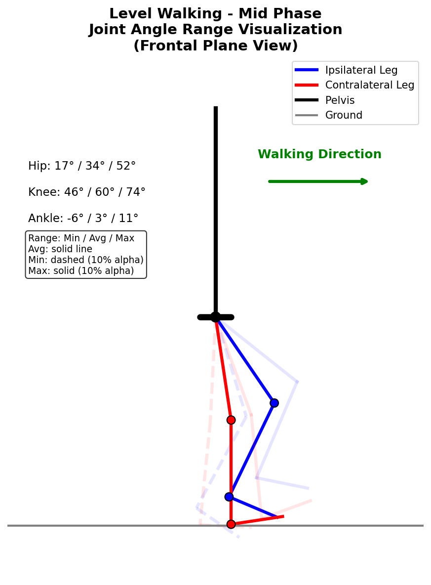 |

**Filters by Phase Validation:**

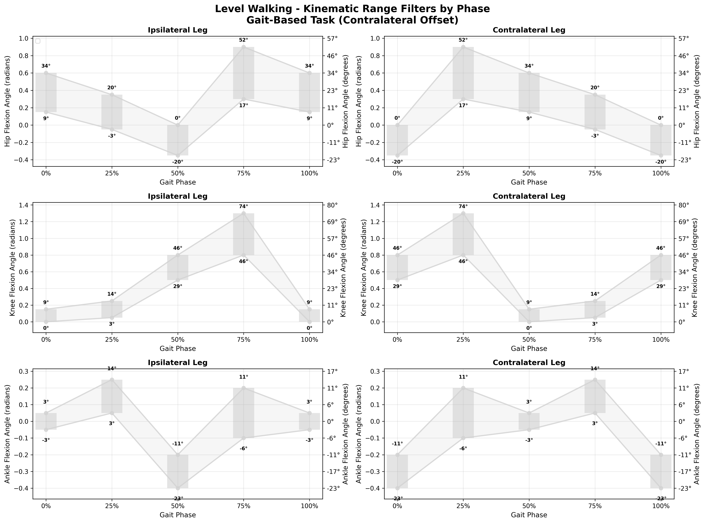

### Task: incline_walking

**Phase-Specific Range Validation (Ipsilateral Leg Only):**

#### Phase 0% (Heel Strike)
| Variable | Min_Value | Max_Value | Units | Notes |
|----------|-----------|-----------|-------|-------|
| hip_flexion_angle_ipsi_rad | 0.25 (14°) | 0.8 (46°) | rad | Increased hip flexion for incline approach (14-46°) |
| knee_flexion_angle_ipsi_rad | 0.0 (0°) | 0.25 (14°) | rad | Controlled loading on incline (0-14°) |
| ankle_flexion_angle_ipsi_rad | 0.05 (3°) | 0.25 (14°) | rad | Dorsiflexion for incline contact (3-14°) |
| vertical_grf_N | 500 | 1400 | N | Higher impact on incline |
| ap_grf_N | -400 | 0 | N | Strong braking forces uphill |
| ml_grf_N | -120 | 120 | N | Lateral balance on incline |

#### Phase 25% (Mid-Stance)
| Variable | Min_Value | Max_Value | Units | Notes |
|----------|-----------|-----------|-------|-------|
| hip_flexion_angle_ipsi_rad | 0.0 (0°) | 0.5 (29°) | rad | Hip extension for propulsion (0-29°) |
| knee_flexion_angle_ipsi_rad | 0.1 (6°) | 0.4 (23°) | rad | Stability with increased flexion (6-23°) |
| ankle_flexion_angle_ipsi_rad | 0.1 (6°) | 0.3 (17°) | rad | **VERIFIED: Greater dorsiflexion (6-17°)** |
| vertical_grf_N | 700 | 1200 | N | Single limb support |
| ap_grf_N | -300 | 100 | N | Transition to propulsion |
| ml_grf_N | -100 | 100 | N | Lateral stability |

#### Phase 50% (Toe-Off)
| Variable | Min_Value | Max_Value | Units | Notes |
|----------|-----------|-----------|-------|-------|
| hip_flexion_angle_ipsi_rad | -0.2 (-11°) | 0.3 (17°) | rad | Hip extension for incline propulsion (-11 to 17°) |
| knee_flexion_angle_ipsi_rad | 0.6 (34°) | 0.9 (52°) | rad | **VERIFIED: Increased push-off flexion (34-52°)** |
| ankle_flexion_angle_ipsi_rad | -0.3 (-17°) | -0.1 (-6°) | rad | **VERIFIED: Moderate plantarflexion (-17 to -6°)** |
| vertical_grf_N | 900 | 1600 | N | Peak propulsive forces |
| ap_grf_N | -100 | 200 | N | Limited propulsion uphill |
| ml_grf_N | -150 | 150 | N | Weight transfer |

#### Phase 75% (Mid-Swing)
| Variable | Min_Value | Max_Value | Units | Notes |
|----------|-----------|-----------|-------|-------|
| hip_flexion_angle_ipsi_rad | 0.4 (23°) | 1.0 (57°) | rad | Increased hip flexion for clearance (23-57°) |
| knee_flexion_angle_ipsi_rad | 0.9 (52°) | 1.5 (86°) | rad | Maximum clearance flexion (52-86°) |
| ankle_flexion_angle_ipsi_rad | 0.0 (0°) | 0.35 (20°) | rad | Enhanced dorsiflexion (0-20°) |
| vertical_grf_N | 0 | 100 | N | Minimal swing forces |
| ap_grf_N | -30 | 30 | N | Minimal swing forces |
| ml_grf_N | -20 | 20 | N | Minimal swing forces |

#### Phase 100% (Heel Strike - Cycle Complete)
| Variable | Min_Value | Max_Value | Units | Notes |
|----------|-----------|-----------|-------|-------|
| hip_flexion_angle_ipsi_rad | 0.25 (14°) | 0.8 (46°) | rad | Return to increased hip flexion for incline (same as 0%) |
| knee_flexion_angle_ipsi_rad | 0.0 (0°) | 0.25 (14°) | rad | Return to controlled loading (same as 0%) |
| ankle_flexion_angle_ipsi_rad | 0.05 (3°) | 0.25 (14°) | rad | Return to dorsiflexion for incline contact (same as 0%) |
| vertical_grf_N | 500 | 1400 | N | Return to higher incline impact (same as 0%) |
| ap_grf_N | -400 | 0 | N | Return to strong braking uphill (same as 0%) |
| ml_grf_N | -120 | 120 | N | Return to lateral balance (same as 0%) |

**Contralateral Offset Logic:**
- **Phase 0% ipsilateral** (heel strike) = **Phase 50% contralateral** (toe-off)
- **Phase 25% ipsilateral** (mid-stance) = **Phase 75% contralateral** (mid-swing)  
- **Phase 50% ipsilateral** (toe-off) = **Phase 0% contralateral** (heel strike)
- **Phase 75% ipsilateral** (mid-swing) = **Phase 25% contralateral** (mid-stance)

**Forward Kinematics Range Visualization:**

| Phase 0% (Heel Strike) | Phase 25% (Mid-Stance) | Phase 50% (Toe-Off) | Phase 75% (Mid-Swing) |
|---|---|---|---|
| 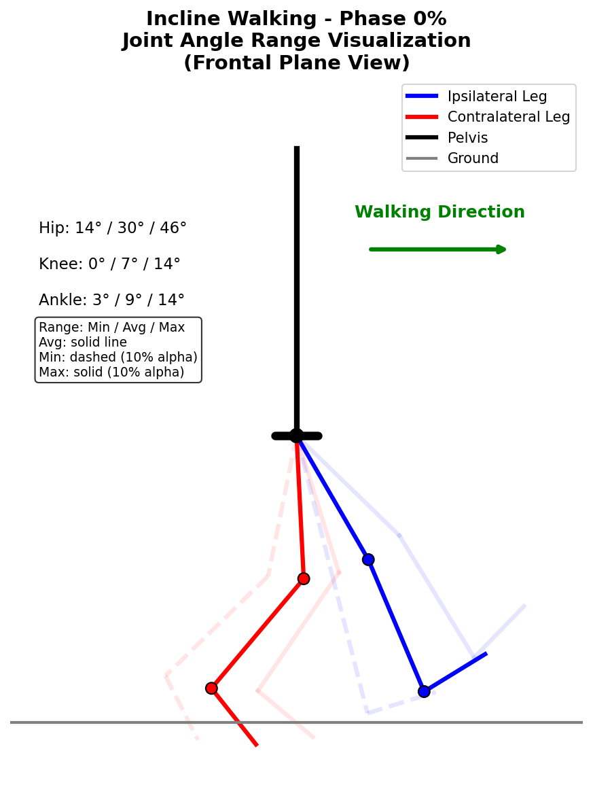 | 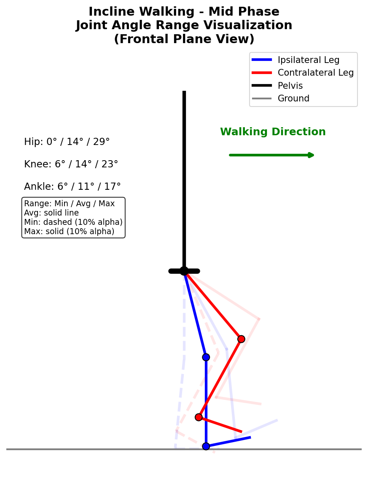 | 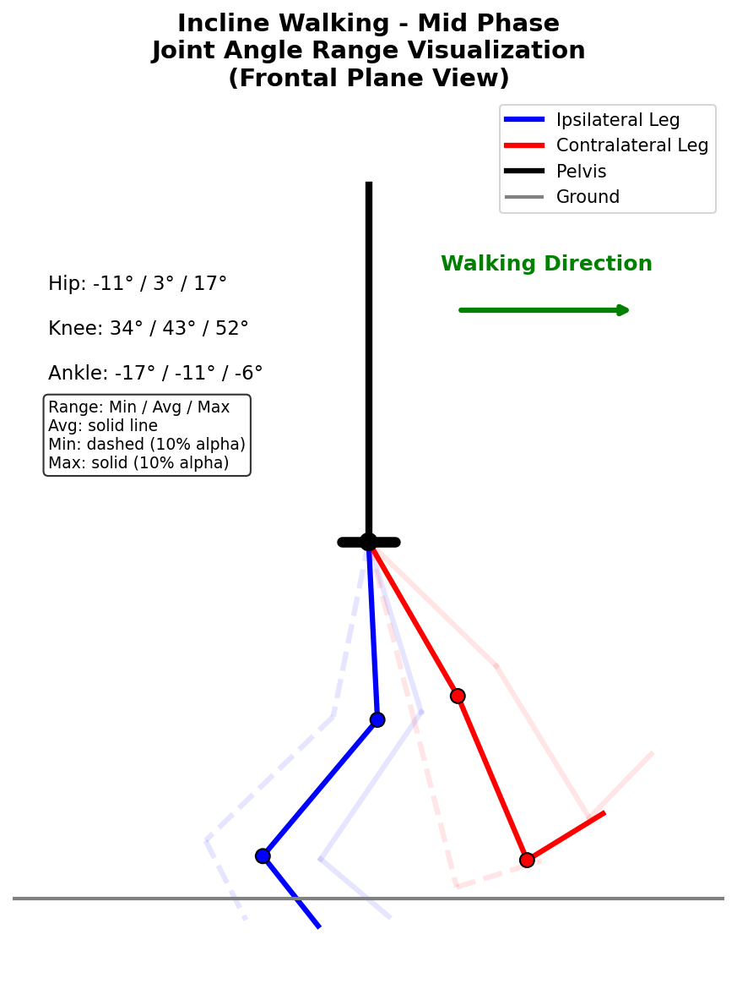 |  |

**Filters by Phase Validation:**

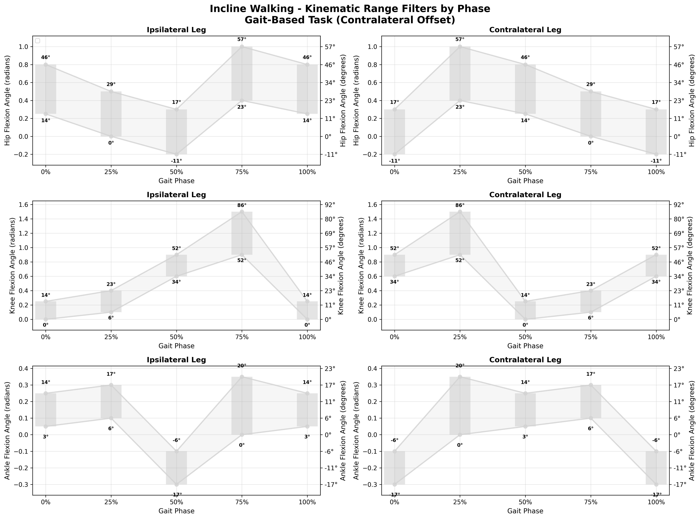

---

### Task: decline_walking

**Phase-Specific Range Validation (Ipsilateral Leg Only):**

#### Phase 0% (Heel Strike)
| Variable | Min_Value | Max_Value | Units | Notes |
|----------|-----------|-----------|-------|---------|
| hip_flexion_angle_ipsi_rad | -0.1 (-6°) | 0.4 (23°) | rad | Reduced hip flexion for decline approach (-6 to 23°) |
| knee_flexion_angle_ipsi_rad | 0.0 (0°) | 0.2 (11°) | rad | Controlled loading for descent (0-11°) |
| ankle_flexion_angle_ipsi_rad | -0.15 (-9°) | 0.0 (0°) | rad | Slight plantarflexion for control (-9 to 0°) |
| vertical_grf_N | 300 | 1000 | N | Controlled impact on decline |
| ap_grf_N | -200 | 200 | N | Balance of braking and propulsion |
| ml_grf_N | -100 | 100 | N | Lateral balance control |

#### Phase 25% (Mid-Stance)
| Variable | Min_Value | Max_Value | Units | Notes |
|----------|-----------|-----------|-------|---------|
| hip_flexion_angle_ipsi_rad | -0.3 (-17°) | 0.2 (11°) | rad | Hip extension for control (-17 to 11°) |
| knee_flexion_angle_ipsi_rad | 0.0 (0°) | 0.3 (17°) | rad | Eccentric control (0-17°) |
| ankle_flexion_angle_ipsi_rad | -0.05 (-3°) | 0.15 (9°) | rad | **VERIFIED: Controlled dorsiflexion (-3 to 9°)** |
| vertical_grf_N | 500 | 900 | N | Single limb support |
| ap_grf_N | 0 | 400 | N | Forward progression |
| ml_grf_N | -80 | 80 | N | Lateral stability |

#### Phase 50% (Toe-Off)
| Variable | Min_Value | Max_Value | Units | Notes |
|----------|-----------|-----------|-------|---------|
| hip_flexion_angle_ipsi_rad | -0.4 (-23°) | 0.1 (6°) | rad | Maximum hip extension (-23 to 6°) |
| knee_flexion_angle_ipsi_rad | 0.4 (23°) | 0.7 (40°) | rad | **VERIFIED: Push-off initiation (23-40°)** |
| ankle_flexion_angle_ipsi_rad | -0.45 (-26°) | -0.25 (-14°) | rad | **VERIFIED: Plantarflexion for propulsion (-26 to -14°)** |
| vertical_grf_N | 600 | 1100 | N | Controlled push-off |
| ap_grf_N | 200 | 500 | N | Forward propulsion |
| ml_grf_N | -120 | 120 | N | Weight transfer |

#### Phase 75% (Mid-Swing)
| Variable | Min_Value | Max_Value | Units | Notes |
|----------|-----------|-----------|-------|---------|
| hip_flexion_angle_ipsi_rad | 0.1 (6°) | 0.7 (40°) | rad | Hip flexion for advancement (6-40°) |
| knee_flexion_angle_ipsi_rad | 0.7 (40°) | 1.2 (69°) | rad | Swing flexion for clearance (40-69°) |
| ankle_flexion_angle_ipsi_rad | -0.1 (-6°) | 0.2 (11°) | rad | Dorsiflexion for clearance (-6 to 11°) |
| vertical_grf_N | 0 | 150 | N | Minimal swing forces |
| ap_grf_N | -40 | 40 | N | Minimal swing forces |
| ml_grf_N | -25 | 25 | N | Minimal swing forces |

**Contralateral Offset Logic:**
- **Phase 0% ipsilateral** (heel strike) = **Phase 50% contralateral** (toe-off)
- **Phase 25% ipsilateral** (mid-stance) = **Phase 75% contralateral** (mid-swing)  
- **Phase 50% ipsilateral** (toe-off) = **Phase 0% contralateral** (heel strike)
- **Phase 75% ipsilateral** (mid-swing) = **Phase 25% contralateral** (mid-stance)

**Forward Kinematics Range Visualization:**

| Phase 0% (Heel Strike) | Phase 25% (Mid-Stance) | Phase 50% (Toe-Off) | Phase 75% (Mid-Swing) |
|---|---|---|---|
| 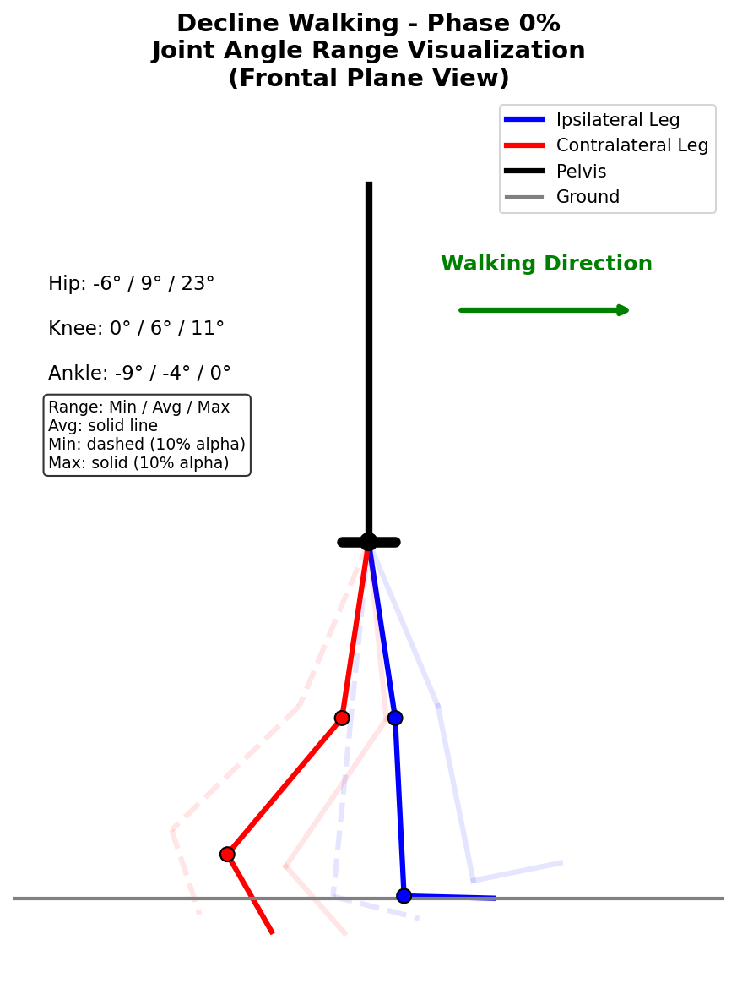 | 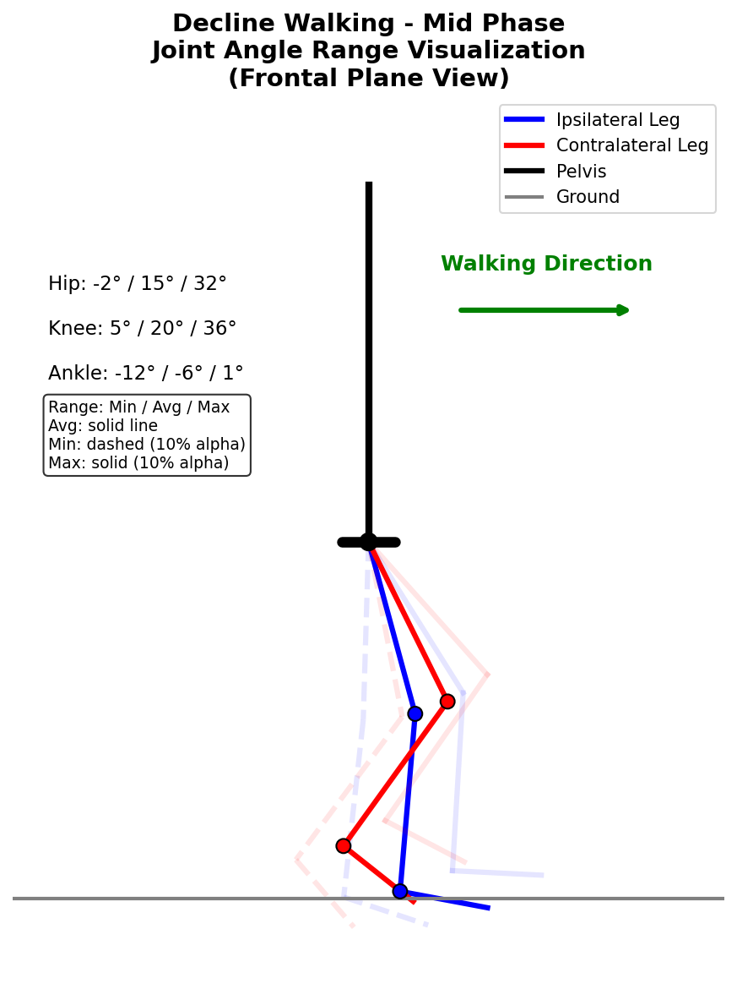 | 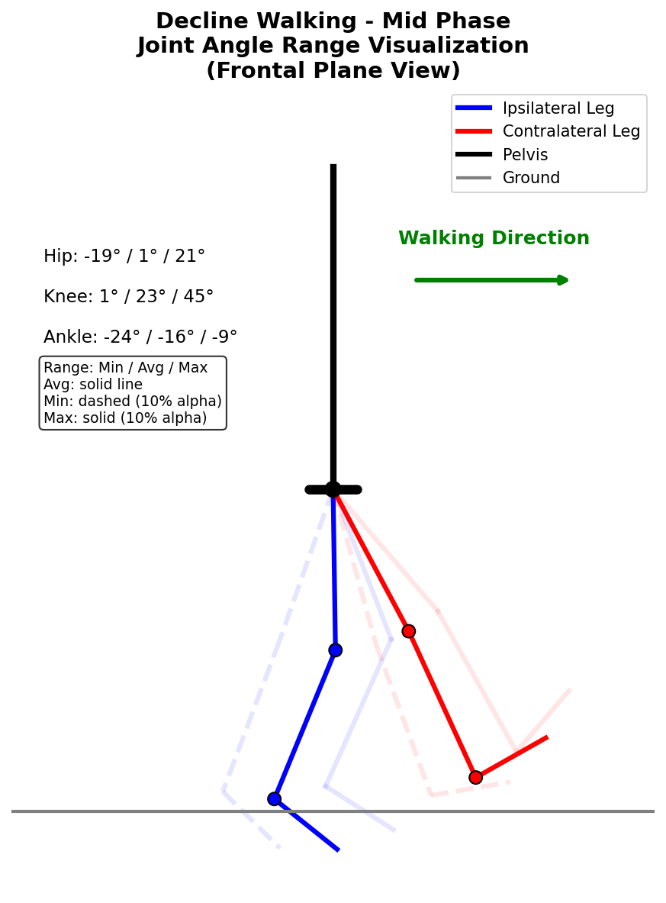 |  |

**Filters by Phase Validation:**

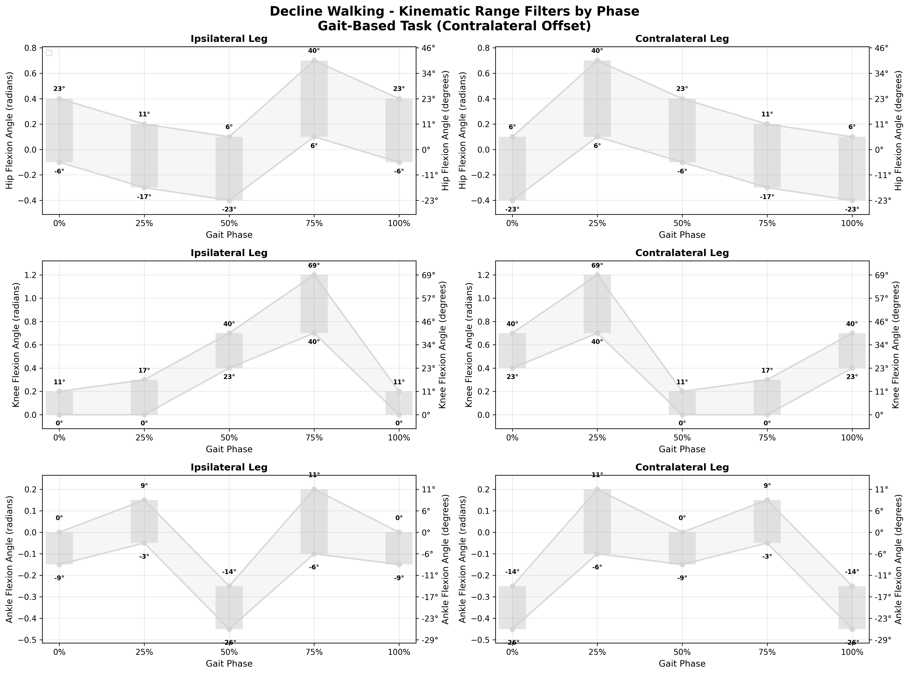

### Task: up_stairs

**Phase-Specific Range Validation (Ipsilateral Leg Only):**

#### Phase 0% (Step Contact)
| Variable | Min_Value | Max_Value | Units | Notes |
|----------|-----------|-----------|-------|---------|
| hip_flexion_angle_ipsi_rad | 0.3 (17°) | 0.7 (40°) | rad | Moderate hip flexion for step approach (17-40°) |
| knee_flexion_angle_ipsi_rad | 0.1 (6°) | 0.6 (34°) | rad | Controlled loading on step (6-34°) |
| ankle_flexion_angle_ipsi_rad | 0.05 (3°) | 0.3 (17°) | rad | Dorsiflexion for step contact (3-17°) |
| vertical_grf_N | 600 | 1800 | N | High vertical forces for lifting |
| ap_grf_N | -500 | 0 | N | Strong braking for control |
| ml_grf_N | -200 | 200 | N | Balance on step |

#### Phase 25% (Loading)
| Variable | Min_Value | Max_Value | Units | Notes |
|----------|-----------|-----------|-------|---------|
| hip_flexion_angle_ipsi_rad | 0.4 (23°) | 0.8 (46°) | rad | Hip flexion for lifting (23-46°) |
| knee_flexion_angle_ipsi_rad | 0.5 (29°) | 1.0 (57°) | rad | Eccentric to concentric transition (29-57°) |
| ankle_flexion_angle_ipsi_rad | 0.15 (9°) | 0.4 (23°) | rad | **VERIFIED: Dorsiflexion maintenance (9-23°)** |
| vertical_grf_N | 800 | 2000 | N | Peak vertical lifting forces |
| ap_grf_N | -400 | 100 | N | Transition to propulsion |
| ml_grf_N | -150 | 150 | N | Lateral balance |

#### Phase 50% (Toe-Off)
| Variable | Min_Value | Max_Value | Units | Notes |
|----------|-----------|-----------|-------|---------|
| hip_flexion_angle_ipsi_rad | 0.2 (11°) | 0.6 (34°) | rad | Hip extension for vertical lift (11-34°) |
| knee_flexion_angle_ipsi_rad | 0.9 (52°) | 1.5 (86°) | rad | **VERIFIED: Concentric extension phase (52-86°)** |
| ankle_flexion_angle_ipsi_rad | -0.3 (-17°) | -0.1 (-6°) | rad | **VERIFIED: Plantarflexion for push-off (-17 to -6°)** |
| vertical_grf_N | 1000 | 2200 | N | Maximum lifting forces |
| ap_grf_N | -200 | 200 | N | Balanced horizontal forces |
| ml_grf_N | -180 | 180 | N | Balance during lift |

#### Phase 75% (Mid-Swing)
| Variable | Min_Value | Max_Value | Units | Notes |
|----------|-----------|-----------|-------|---------|
| hip_flexion_angle_ipsi_rad | 0.4 (23°) | 0.8 (46°) | rad | Hip flexion for swing clearance (23-46°) |
| knee_flexion_angle_ipsi_rad | 1.2 (69°) | 1.7 (97°) | rad | Swing leg peak flexion (69-97°) |
| ankle_flexion_angle_ipsi_rad | 0.3 (17°) | 0.5 (29°) | rad | Maximum dorsiflexion (17-29°) |
| vertical_grf_N | 0 | 300 | N | Minimal forces during swing |
| ap_grf_N | -60 | 60 | N | Minimal swing forces |
| ml_grf_N | -40 | 40 | N | Minimal swing forces |

**Contralateral Offset Logic:**
- **Phase 0% ipsilateral** (step contact) = **Phase 50% contralateral** (toe-off)
- **Phase 25% ipsilateral** (loading) = **Phase 75% contralateral** (mid-swing)  
- **Phase 50% ipsilateral** (toe-off) = **Phase 0% contralateral** (step contact)
- **Phase 75% ipsilateral** (mid-swing) = **Phase 25% contralateral** (loading)

**Forward Kinematics Range Visualization:**

| Phase 0% (Step Contact) | Phase 25% (Loading) | Phase 50% (Toe-Off) | Phase 75% (Mid-Swing) |
|---|---|---|---|
| 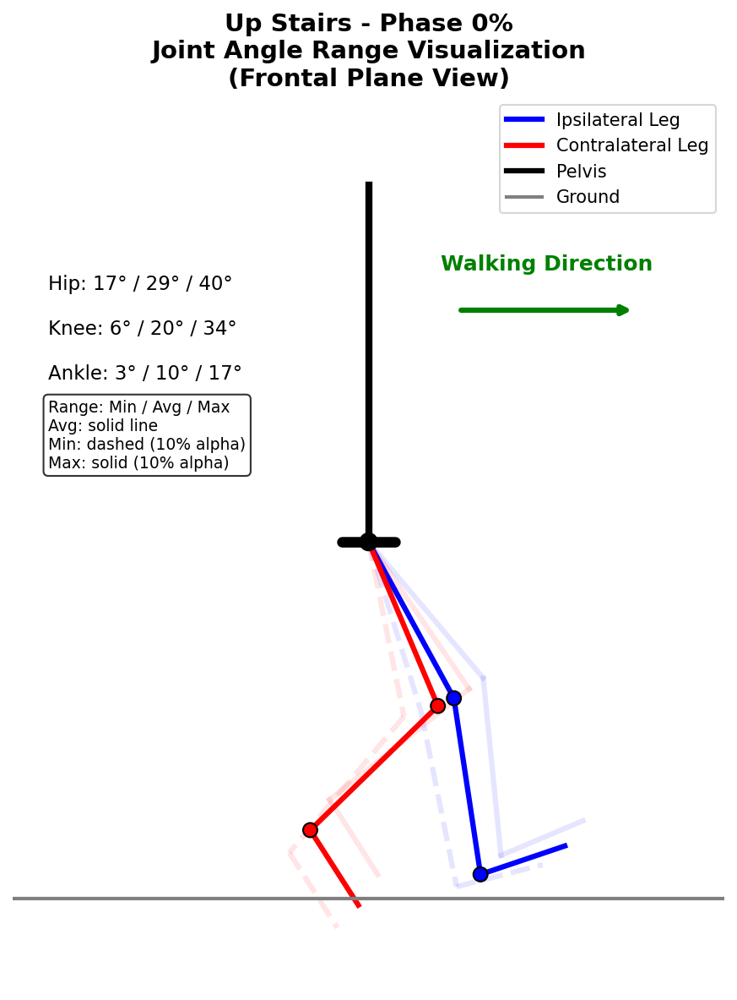 | 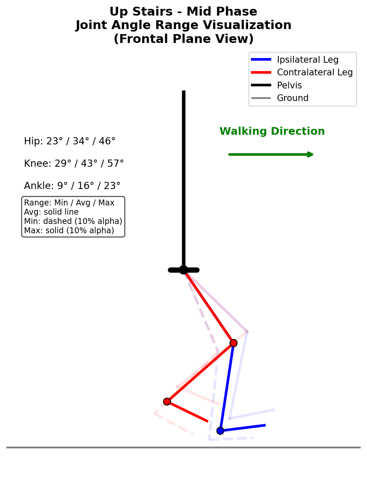 | 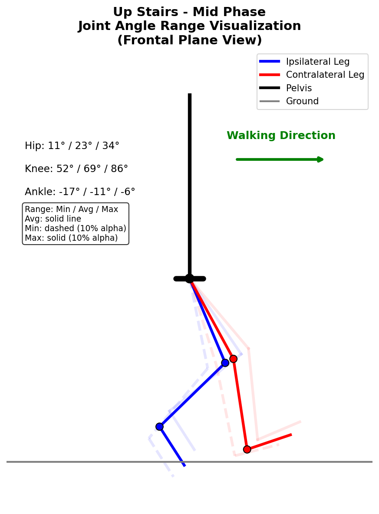 | 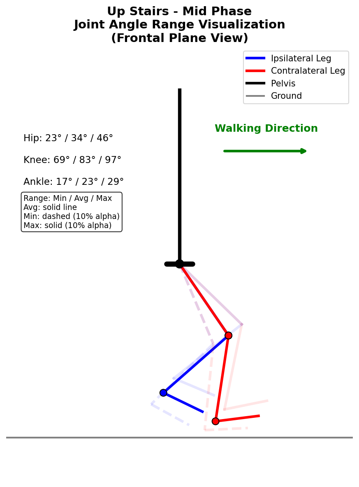 |

**Filters by Phase Validation:**

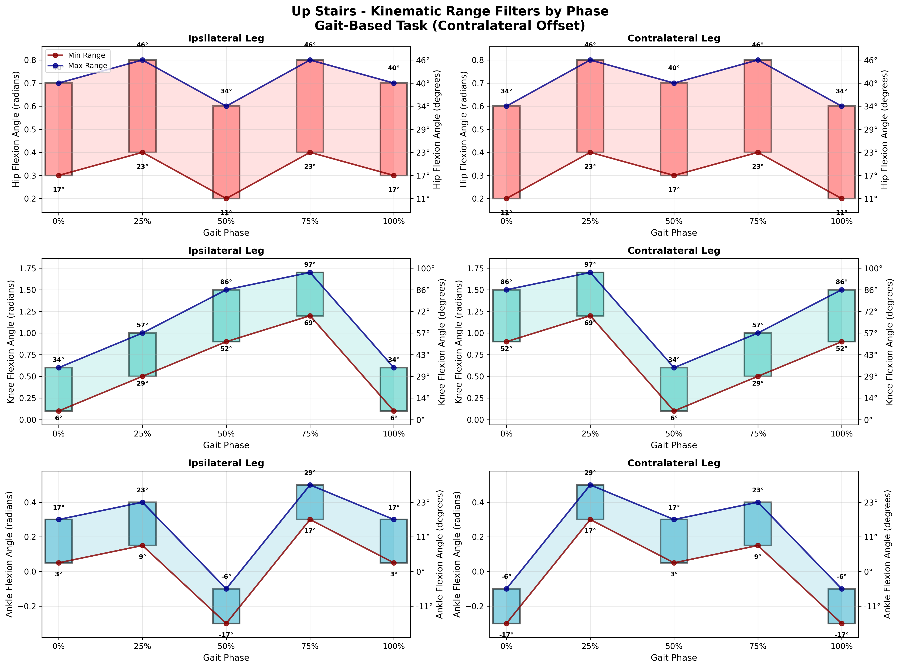

### Task: down_stairs

**Phase-Specific Range Validation (Ipsilateral Leg Only):**

#### Phase 0% (Step Contact)
| Variable | Min_Value | Max_Value | Units | Notes |
|----------|-----------|-----------|-------|---------|
| hip_flexion_angle_ipsi_rad | 0.0 (0°) | 0.4 (23°) | rad | Controlled hip position for descent (0 to 23°) |
| knee_flexion_angle_ipsi_rad | 0.0 (0°) | 0.4 (23°) | rad | Initial contact absorption (0-23°) |
| ankle_flexion_angle_ipsi_rad | -0.15 (-9°) | 0.05 (3°) | rad | Controlled landing (-9 to 3°) |
| vertical_grf_N | 800 | 2200 | N | High impact absorption |
| ap_grf_N | -100 | 400 | N | Forward momentum control |
| ml_grf_N | -150 | 150 | N | Lateral balance |

#### Phase 25% (Loading)
| Variable | Min_Value | Max_Value | Units | Notes |
|----------|-----------|-----------|-------|---------|
| hip_flexion_angle_ipsi_rad | -0.1 (-6°) | 0.2 (11°) | rad | Hip extension for control (-6 to 11°) |
| knee_flexion_angle_ipsi_rad | 0.3 (17°) | 0.8 (46°) | rad | Eccentric loading peak (17-46°) |
| ankle_flexion_angle_ipsi_rad | 0.0 (0°) | 0.2 (11°) | rad | **VERIFIED: Controlled dorsiflexion (0-11°)** |
| vertical_grf_N | 1000 | 2500 | N | Peak eccentric loading |
| ap_grf_N | 100 | 600 | N | Forward progression |
| ml_grf_N | -120 | 120 | N | Lateral control |

#### Phase 50% (Toe-Off)
| Variable | Min_Value | Max_Value | Units | Notes |
|----------|-----------|-----------|-------|---------|
| hip_flexion_angle_ipsi_rad | -0.2 (-11°) | 0.1 (6°) | rad | Hip extension for push-off (-11 to 6°) |
| knee_flexion_angle_ipsi_rad | 0.7 (40°) | 1.1 (63°) | rad | **VERIFIED: Controlled extension (40-63°)** |
| ankle_flexion_angle_ipsi_rad | -0.35 (-20°) | -0.15 (-9°) | rad | **VERIFIED: Push-off preparation (-20 to -9°)** |
| vertical_grf_N | 600 | 1800 | N | Controlled push-off |
| ap_grf_N | 200 | 600 | N | Forward propulsion |
| ml_grf_N | -140 | 140 | N | Weight transfer |

#### Phase 75% (Mid-Swing)
| Variable | Min_Value | Max_Value | Units | Notes |
|----------|-----------|-----------|-------|---------|
| hip_flexion_angle_ipsi_rad | 0.2 (11°) | 0.6 (34°) | rad | Swing hip flexion (11-34°) |
| knee_flexion_angle_ipsi_rad | 1.0 (57°) | 1.4 (80°) | rad | Swing clearance (57-80°) |
| ankle_flexion_angle_ipsi_rad | 0.0 (0°) | 0.3 (17°) | rad | Clearance dorsiflexion (0-17°) |
| vertical_grf_N | 0 | 250 | N | Minimal swing forces |
| ap_grf_N | -50 | 50 | N | Minimal swing forces |
| ml_grf_N | -30 | 30 | N | Minimal swing forces |

**Contralateral Offset Logic:**
- **Phase 0% ipsilateral** (step contact) = **Phase 50% contralateral** (toe-off)
- **Phase 25% ipsilateral** (loading) = **Phase 75% contralateral** (mid-swing)  
- **Phase 50% ipsilateral** (toe-off) = **Phase 0% contralateral** (step contact)
- **Phase 75% ipsilateral** (mid-swing) = **Phase 25% contralateral** (loading)

**Forward Kinematics Range Visualization:**

| Phase 0% (Step Contact) | Phase 25% (Loading) | Phase 50% (Toe-Off) | Phase 75% (Mid-Swing) |
|---|---|---|---|
| 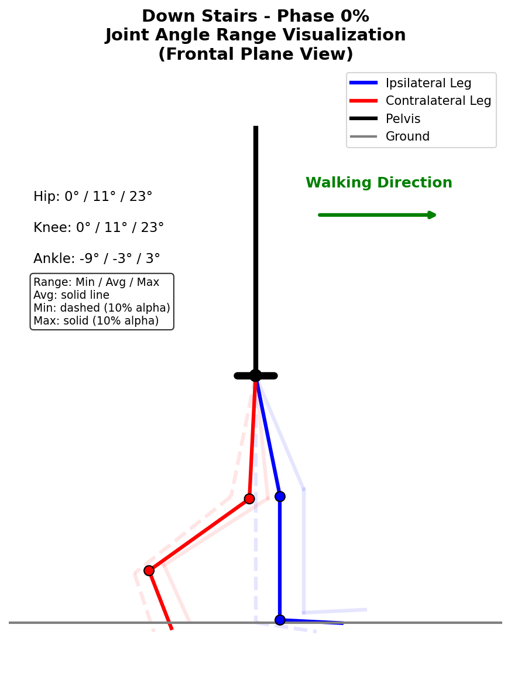 | 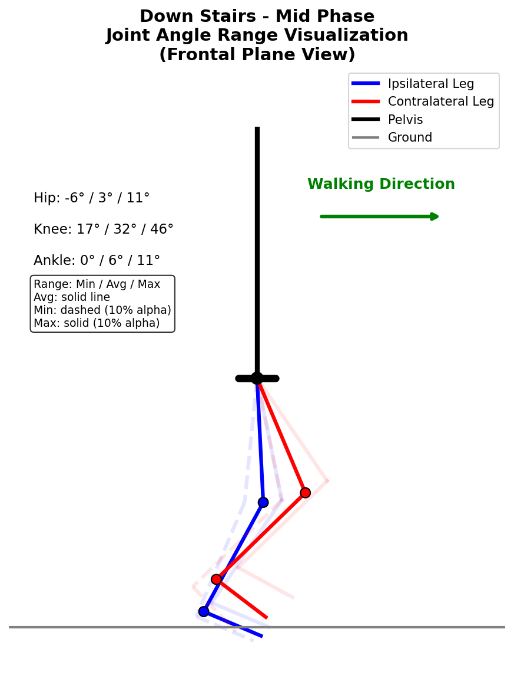 | 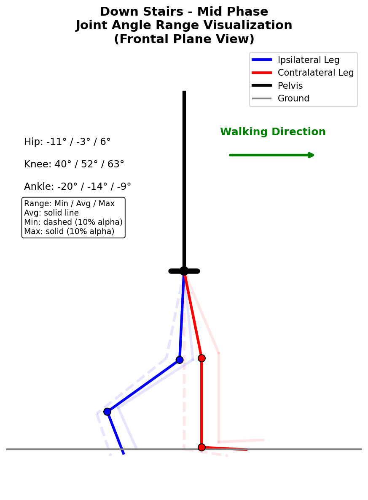 | 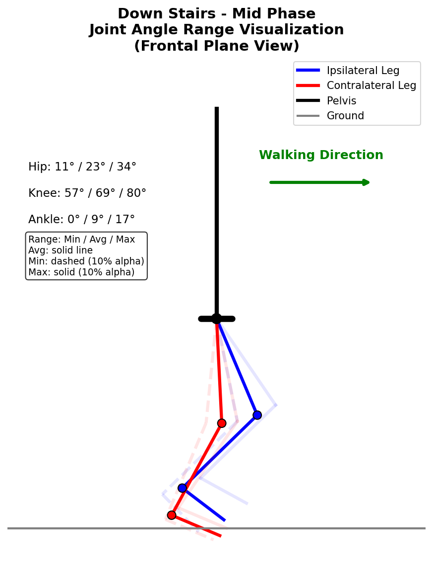 |

**Filters by Phase Validation:**

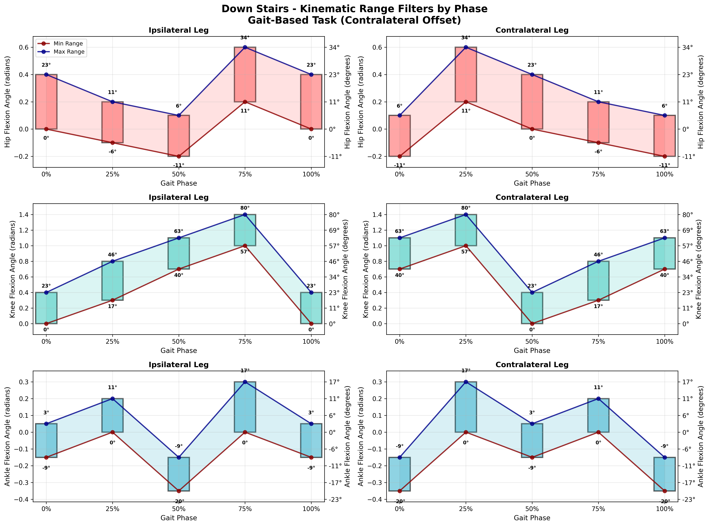

### Task: run

**Phase-Specific Range Validation (Ipsilateral Leg Only):**

#### Phase 0% (Heel Strike)
| Variable | Min_Value | Max_Value | Units | Notes |
|----------|-----------|-----------|-------|---------|
| hip_flexion_angle_ipsi_rad | -0.1 (-6°) | 0.8 (46°) | rad | Initial contact with forward lean (-6 to 46°) |
| knee_flexion_angle_ipsi_rad | 0.0 (0°) | 0.35 (20°) | rad | Impact absorption (0-20°) |
| ankle_flexion_angle_ipsi_rad | -0.25 (-14°) | 0.15 (9°) | rad | Variable contact strategy (-14 to 9°) |
| vertical_grf_N | 1200 | 2800 | N | High impact forces |
| ap_grf_N | -600 | 200 | N | Strong braking forces |
| ml_grf_N | -250 | 250 | N | Lateral balance |

#### Phase 25% (Mid-Stance)
| Variable | Min_Value | Max_Value | Units | Notes |
|----------|-----------|-----------|-------|---------|
| hip_flexion_angle_ipsi_rad | -0.4 (-23°) | 0.4 (23°) | rad | Hip extension for propulsion (-23 to 23°) |
| knee_flexion_angle_ipsi_rad | 0.2 (11°) | 0.7 (40°) | rad | Stance flexion control (11-40°) |
| ankle_flexion_angle_ipsi_rad | 0.0 (0°) | 0.3 (17°) | rad | **VERIFIED: Dorsiflexion development (0-17°)** |
| vertical_grf_N | 800 | 2200 | N | Mid-stance loading |
| ap_grf_N | -300 | 400 | N | Transition to propulsion |
| ml_grf_N | -200 | 200 | N | Dynamic balance |

#### Phase 50% (Toe-Off)
| Variable | Min_Value | Max_Value | Units | Notes |
|----------|-----------|-----------|-------|---------|
| hip_flexion_angle_ipsi_rad | -0.5 (-29°) | 0.2 (11°) | rad | Maximum hip extension (-29 to 11°) |
| knee_flexion_angle_ipsi_rad | 0.8 (46°) | 1.3 (74°) | rad | **VERIFIED: Push-off flexion (46-74°)** |
| ankle_flexion_angle_ipsi_rad | -0.6 (-34°) | -0.3 (-17°) | rad | **VERIFIED: Strong plantarflexion (-34 to -17°)** |
| vertical_grf_N | 1000 | 3000 | N | Peak propulsive forces |
| ap_grf_N | 200 | 800 | N | Maximum propulsion |
| ml_grf_N | -300 | 300 | N | Dynamic lateral forces |

#### Phase 75% (Mid-Swing)
| Variable | Min_Value | Max_Value | Units | Notes |
|----------|-----------|-----------|-------|---------|
| hip_flexion_angle_ipsi_rad | 0.1 (6°) | 1.3 (74°) | rad | Swing hip flexion (6-74°) |
| knee_flexion_angle_ipsi_rad | 1.5 (86°) | 2.2 (126°) | rad | **UPDATED: Peak swing flexion (86-126°)** |
| ankle_flexion_angle_ipsi_rad | -0.1 (-6°) | 0.35 (20°) | rad | Swing dorsiflexion (-6 to 20°) |
| vertical_grf_N | 0 | 200 | N | Flight phase - minimal forces |
| ap_grf_N | -80 | 80 | N | Minimal flight forces |
| ml_grf_N | -50 | 50 | N | Minimal flight forces |

#### Phase 100% (Heel Strike - Cycle Complete)
| Variable | Min_Value | Max_Value | Units | Notes |
|----------|-----------|-----------|-------|---------|
| hip_flexion_angle_ipsi_rad | -0.1 (-6°) | 0.8 (46°) | rad | Return to initial contact with forward lean (same as 0%) |
| knee_flexion_angle_ipsi_rad | 0.0 (0°) | 0.35 (20°) | rad | Return to impact absorption (same as 0%) |
| ankle_flexion_angle_ipsi_rad | -0.25 (-14°) | 0.15 (9°) | rad | Return to variable contact strategy (same as 0%) |
| vertical_grf_N | 1200 | 2800 | N | Return to high impact forces (same as 0%) |
| ap_grf_N | -600 | 200 | N | Return to strong braking forces (same as 0%) |
| ml_grf_N | -250 | 250 | N | Return to lateral balance (same as 0%) |

**Contralateral Offset Logic:**
- **Phase 0% ipsilateral** (heel strike) = **Phase 50% contralateral** (toe-off)
- **Phase 25% ipsilateral** (mid-stance) = **Phase 75% contralateral** (mid-swing)  
- **Phase 50% ipsilateral** (toe-off) = **Phase 0% contralateral** (heel strike)
- **Phase 75% ipsilateral** (mid-swing) = **Phase 25% contralateral** (mid-stance)

**Forward Kinematics Range Visualization:**

| Phase 0% (Heel Strike) | Phase 25% (Mid-Stance) | Phase 50% (Toe-Off) | Phase 75% (Mid-Swing) |
|---|---|---|---|
| 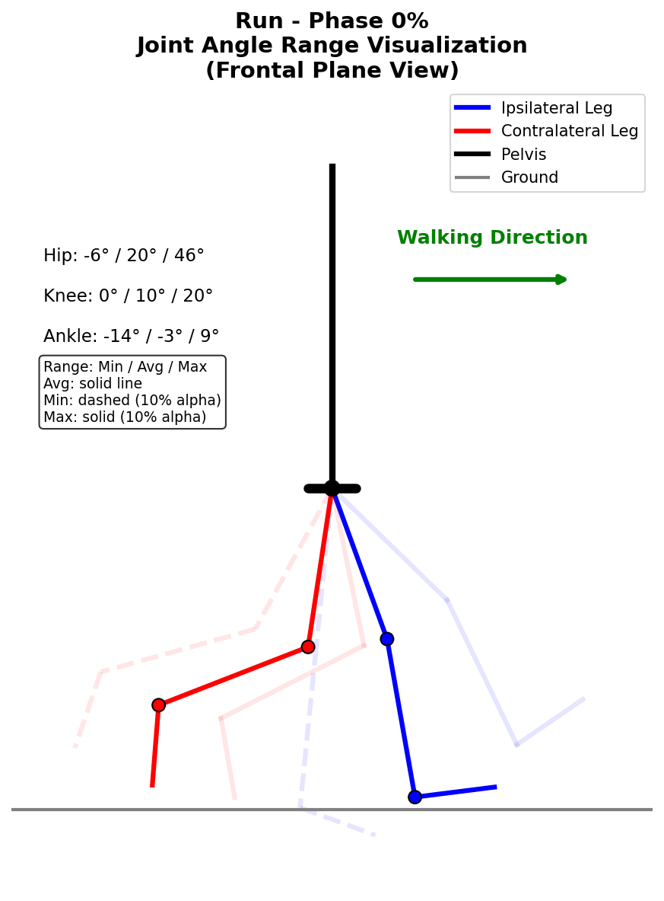 | 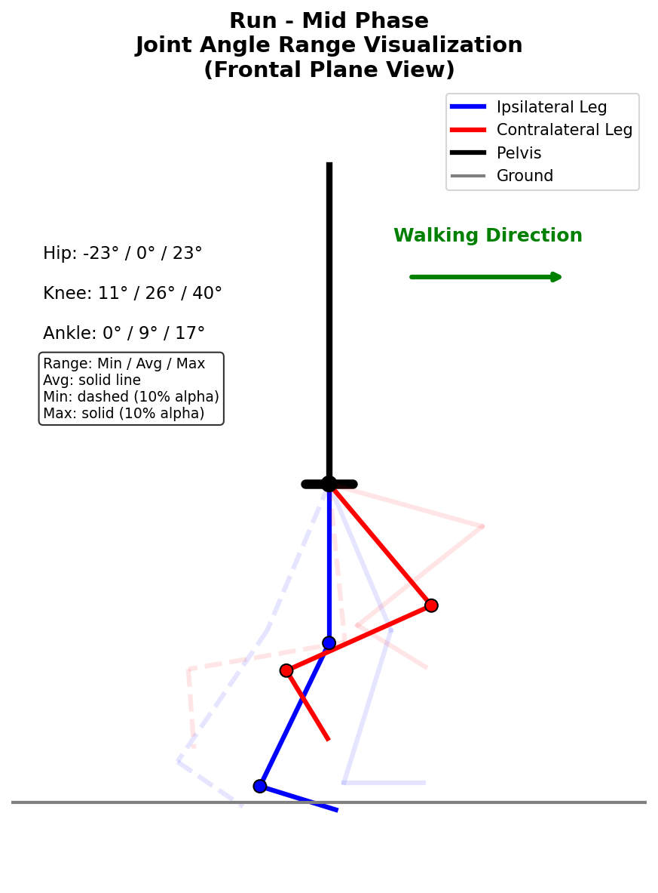 | 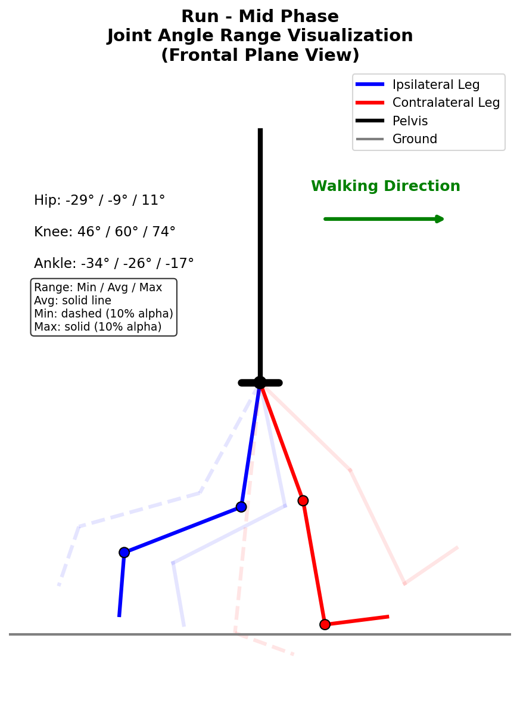 | 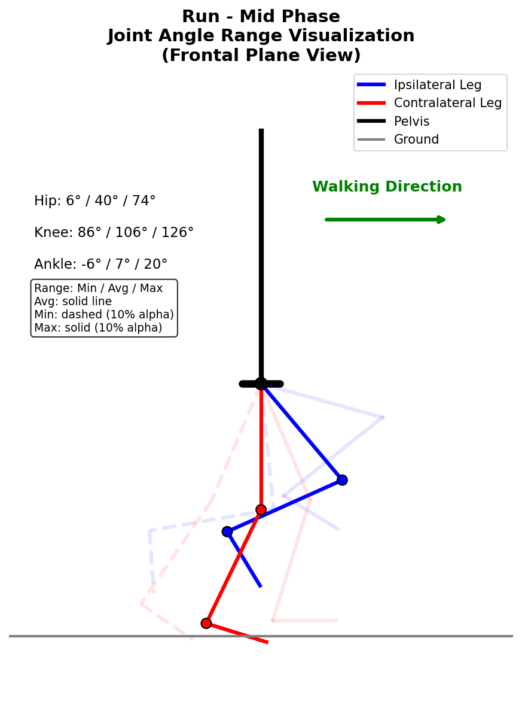 |

**Filters by Phase Validation:**

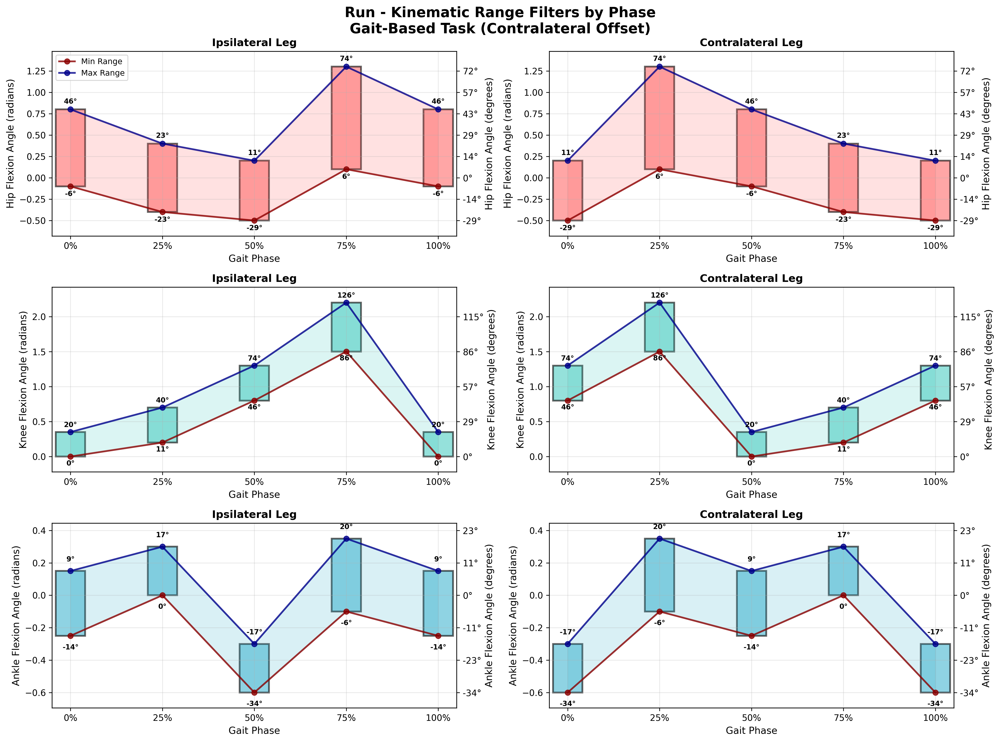

### Task: sit_to_stand

**Phase-Specific Range Validation (Bilateral Movement - Both Legs):**

#### Phase 0% (Seated)
| Variable | Min_Value | Max_Value | Units | Notes |
|----------|-----------|-----------|-------|---------|
| hip_flexion_angle_ipsi_rad | 1.2 (69°) | 2.0 (115°) | rad | Initial seated position (69-115°) |
| hip_flexion_angle_contra_rad | 1.2 (69°) | 2.0 (115°) | rad | Bilateral seated position (69-115°) |
| knee_flexion_angle_ipsi_rad | 1.3 (74°) | 1.8 (103°) | rad | Seated knee position (74-103°) |
| knee_flexion_angle_contra_rad | 1.3 (74°) | 1.8 (103°) | rad | Bilateral knee position (74-103°) |
| ankle_flexion_angle_ipsi_rad | 0.05 (3°) | 0.35 (20°) | rad | Dorsiflexion for preparation (3-20°) |
| ankle_flexion_angle_contra_rad | 0.05 (3°) | 0.35 (20°) | rad | Bilateral preparation (3-20°) |
| vertical_grf_N | 400 | 800 | N | Initial weight bearing |
| ap_grf_N | -200 | 200 | N | Balance adjustment |
| ml_grf_N | -150 | 150 | N | Lateral balance |

#### Phase 25% (Initiation)
| Variable | Min_Value | Max_Value | Units | Notes |
|----------|-----------|-----------|-------|---------|
| hip_flexion_angle_ipsi_rad | 0.8 (46°) | 1.6 (92°) | rad | Hip extension initiation (46-92°) |
| hip_flexion_angle_contra_rad | 0.8 (46°) | 1.6 (92°) | rad | Bilateral hip extension (46-92°) |
| knee_flexion_angle_ipsi_rad | 0.8 (46°) | 1.4 (80°) | rad | Knee extension initiation (46-80°) |
| knee_flexion_angle_contra_rad | 0.8 (46°) | 1.4 (80°) | rad | Bilateral knee extension (46-80°) |
| ankle_flexion_angle_ipsi_rad | 0.0 (0°) | 0.25 (14°) | rad | Ankle adjustment (0-14°) |
| ankle_flexion_angle_contra_rad | 0.0 (0°) | 0.25 (14°) | rad | Bilateral adjustment (0-14°) |
| vertical_grf_N | 600 | 1000 | N | Increasing weight transfer |
| ap_grf_N | -250 | 250 | N | Forward momentum |
| ml_grf_N | -180 | 180 | N | Balance control |

#### Phase 50% (Mid-Rise)
| Variable | Min_Value | Max_Value | Units | Notes |
|----------|-----------|-----------|-------|---------|
| hip_flexion_angle_ipsi_rad | 0.5 (29°) | 1.2 (69°) | rad | Mid-range hip extension (29-69°) |
| hip_flexion_angle_contra_rad | 0.5 (29°) | 1.2 (69°) | rad | Bilateral progression (29-69°) |
| knee_flexion_angle_ipsi_rad | 0.4 (23°) | 1.0 (57°) | rad | Mid-range knee extension (23-57°) |
| knee_flexion_angle_contra_rad | 0.4 (23°) | 1.0 (57°) | rad | Bilateral progression (23-57°) |
| ankle_flexion_angle_ipsi_rad | -0.15 (-9°) | 0.15 (9°) | rad | Neutral ankle position (-9 to 9°) |
| ankle_flexion_angle_contra_rad | -0.15 (-9°) | 0.15 (9°) | rad | Bilateral neutral (-9 to 9°) |
| vertical_grf_N | 800 | 1200 | N | Peak vertical forces |
| ap_grf_N | -300 | 300 | N | Balance maintenance |
| ml_grf_N | -200 | 200 | N | Dynamic balance |

#### Phase 75% (Standing)
| Variable | Min_Value | Max_Value | Units | Notes |
|----------|-----------|-----------|-------|---------|
| hip_flexion_angle_ipsi_rad | 0.2 (11°) | 0.8 (46°) | rad | Near standing hip position (11-46°) |
| hip_flexion_angle_contra_rad | 0.2 (11°) | 0.8 (46°) | rad | Bilateral near standing (11-46°) |
| knee_flexion_angle_ipsi_rad | 0.0 (0°) | 0.5 (29°) | rad | Near full knee extension (0-29°) |
| knee_flexion_angle_contra_rad | 0.0 (0°) | 0.5 (29°) | rad | Bilateral extension (0-29°) |
| ankle_flexion_angle_ipsi_rad | -0.15 (-9°) | 0.15 (9°) | rad | Standing ankle position (-9 to 9°) |
| ankle_flexion_angle_contra_rad | -0.15 (-9°) | 0.15 (9°) | rad | Bilateral standing (-9 to 9°) |
| vertical_grf_N | 600 | 1000 | N | Standing weight bearing |
| ap_grf_N | -200 | 200 | N | Final balance adjustment |
| ml_grf_N | -150 | 150 | N | Standing balance |

**Note:** Sit-to-stand is a bilateral symmetric movement, so both legs maintain similar ranges throughout all phases.

**Forward Kinematics Range Visualization:**

| Phase 0% (Seated) | Phase 25% (Initiation) | Phase 50% (Mid-Rise) | Phase 75% (Standing) |
|---|---|---|---|
| 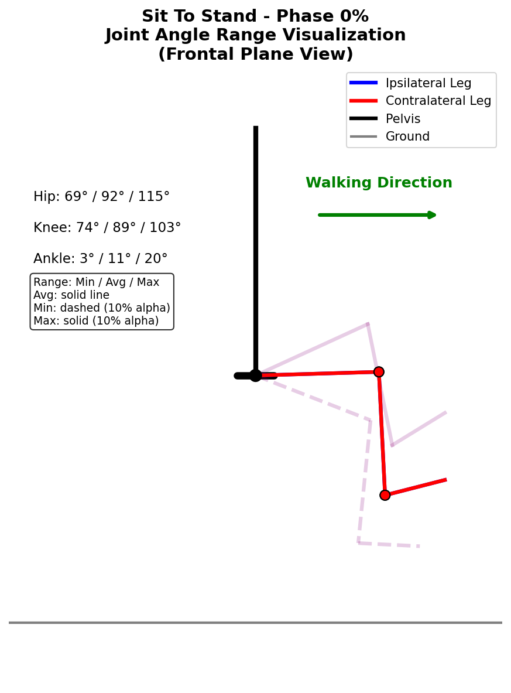 | 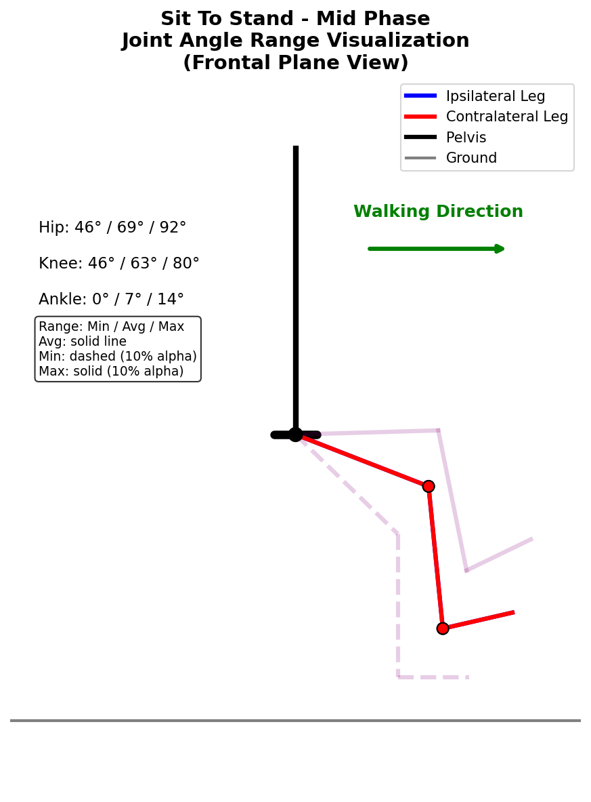 | 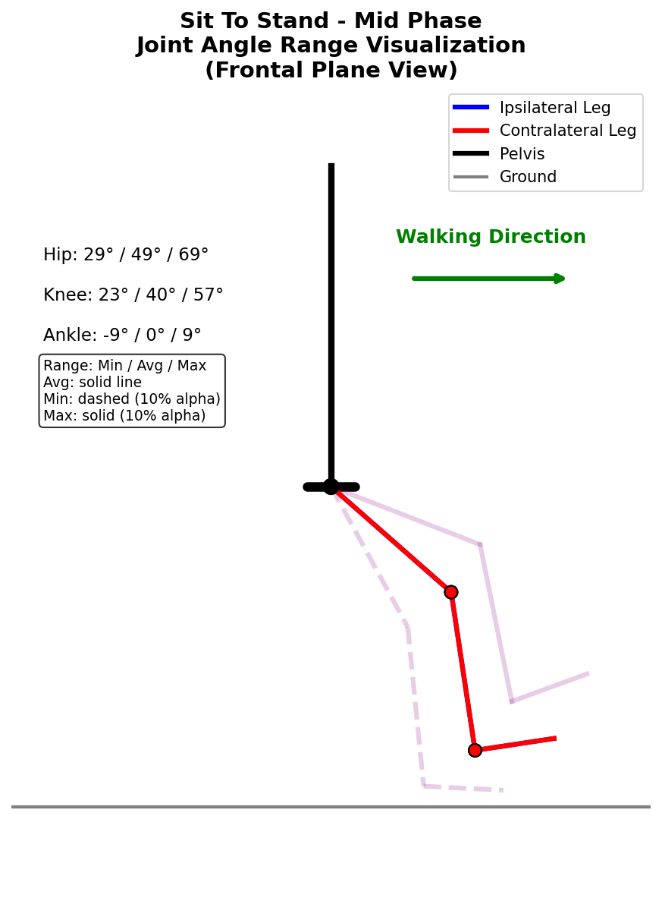 | 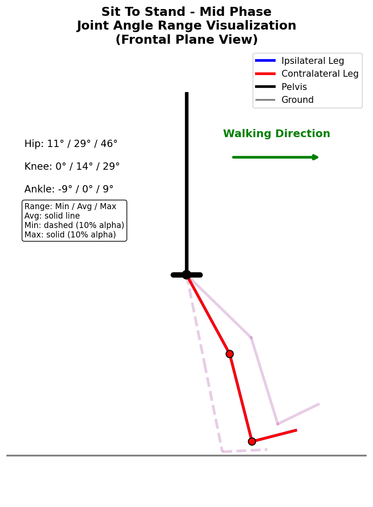 |

**Filters by Phase Validation:**


### Task: jump

**Phase-Specific Range Validation (Bilateral Movement - Both Legs):**

#### Phase 0% (Initial)
| Variable | Min_Value | Max_Value | Units | Notes |
|----------|-----------|-----------|-------|---------|
| hip_flexion_angle_ipsi_rad | -0.1 (-6°) | 0.6 (34°) | rad | Initial standing position (-6 to 34°) |
| hip_flexion_angle_contra_rad | -0.1 (-6°) | 0.6 (34°) | rad | Bilateral standing (-6 to 34°) |
| knee_flexion_angle_ipsi_rad | 0.0 (0°) | 0.3 (17°) | rad | Initial knee position (0-17°) |
| knee_flexion_angle_contra_rad | 0.0 (0°) | 0.3 (17°) | rad | Bilateral initial position (0-17°) |
| ankle_flexion_angle_ipsi_rad | -0.15 (-9°) | 0.15 (9°) | rad | Neutral ankle start (-9 to 9°) |
| ankle_flexion_angle_contra_rad | -0.15 (-9°) | 0.15 (9°) | rad | Bilateral neutral (-9 to 9°) |
| vertical_grf_N | 600 | 1200 | N | Initial body weight |
| ap_grf_N | -300 | 300 | N | Balance preparation |
| ml_grf_N | -200 | 200 | N | Lateral balance |

#### Phase 25% (Countermovement)
| Variable | Min_Value | Max_Value | Units | Notes |
|----------|-----------|-----------|-------|---------|
| hip_flexion_angle_ipsi_rad | 0.5 (29°) | 1.3 (74°) | rad | Countermovement hip flexion (29-74°) |
| hip_flexion_angle_contra_rad | 0.5 (29°) | 1.3 (74°) | rad | Bilateral countermovement (29-74°) |
| knee_flexion_angle_ipsi_rad | 0.7 (40°) | 1.6 (92°) | rad | **UPDATED: Deep countermovement (40-92°)** |
| knee_flexion_angle_contra_rad | 0.7 (40°) | 1.6 (92°) | rad | **UPDATED: Bilateral deep flexion (40-92°)** |
| ankle_flexion_angle_ipsi_rad | 0.1 (6°) | 0.4 (23°) | rad | **VERIFIED: Dorsiflexion preparation (6-23°)** |
| ankle_flexion_angle_contra_rad | 0.1 (6°) | 0.4 (23°) | rad | Bilateral preparation (6-23°) |
| vertical_grf_N | 200 | 800 | N | Reduced loading during descent |
| ap_grf_N | -400 | 400 | N | Dynamic balance |
| ml_grf_N | -250 | 250 | N | Balance during descent |

#### Phase 50% (Takeoff)
| Variable | Min_Value | Max_Value | Units | Notes |
|----------|-----------|-----------|-------|---------|
| hip_flexion_angle_ipsi_rad | -0.3 (-17°) | 0.5 (29°) | rad | Explosive hip extension (-17 to 29°) |
| hip_flexion_angle_contra_rad | -0.3 (-17°) | 0.5 (29°) | rad | Bilateral extension (-17 to 29°) |
| knee_flexion_angle_ipsi_rad | 0.0 (0°) | 0.6 (34°) | rad | **VERIFIED: Explosive knee extension (0-34°)** |
| knee_flexion_angle_contra_rad | 0.0 (0°) | 0.6 (34°) | rad | Bilateral explosion (0-34°) |
| ankle_flexion_angle_ipsi_rad | -0.7 (-40°) | -0.3 (-17°) | rad | **VERIFIED: Strong plantarflexion (-40 to -17°)** |
| ankle_flexion_angle_contra_rad | -0.7 (-40°) | -0.3 (-17°) | rad | Bilateral plantarflexion (-40 to -17°) |
| vertical_grf_N | 1500 | 4000 | N | Peak takeoff forces |
| ap_grf_N | -500 | 500 | N | Direction-dependent forces |
| ml_grf_N | -300 | 300 | N | Dynamic balance forces |

#### Phase 75% (Flight)
| Variable | Min_Value | Max_Value | Units | Notes |
|----------|-----------|-----------|-------|---------|
| hip_flexion_angle_ipsi_rad | 0.2 (11°) | 1.0 (57°) | rad | Flight position (11-57°) |
| hip_flexion_angle_contra_rad | 0.2 (11°) | 1.0 (57°) | rad | Bilateral flight (11-57°) |
| knee_flexion_angle_ipsi_rad | 0.2 (11°) | 1.4 (80°) | rad | Variable flight position (11-80°) |
| knee_flexion_angle_contra_rad | 0.2 (11°) | 1.4 (80°) | rad | Bilateral flight position (11-80°) |
| ankle_flexion_angle_ipsi_rad | -0.35 (-20°) | 0.35 (20°) | rad | Flight ankle position (-20 to 20°) |
| ankle_flexion_angle_contra_rad | -0.35 (-20°) | 0.35 (20°) | rad | Bilateral flight (-20 to 20°) |
| vertical_grf_N | 0 | 100 | N | Minimal flight forces |
| ap_grf_N | -50 | 50 | N | Minimal flight forces |
| ml_grf_N | -30 | 30 | N | Minimal flight forces |

**Note:** Jumping is a bilateral symmetric movement, so both legs maintain similar ranges throughout all phases.

**Forward Kinematics Range Visualization:**

| Phase 0% (Initial) | Phase 25% (Countermovement) | Phase 50% (Takeoff) | Phase 75% (Flight) |
|---|---|---|---|
| 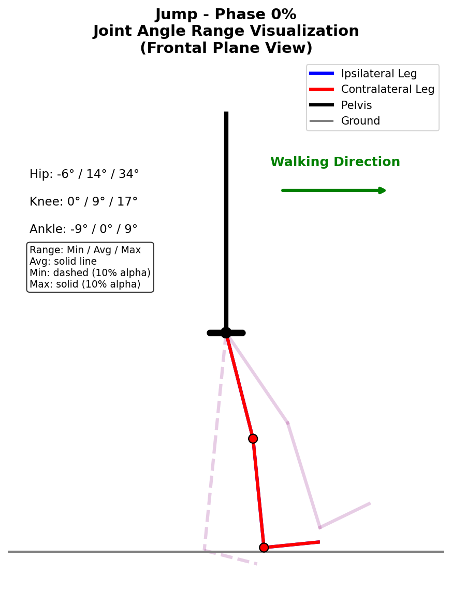 | 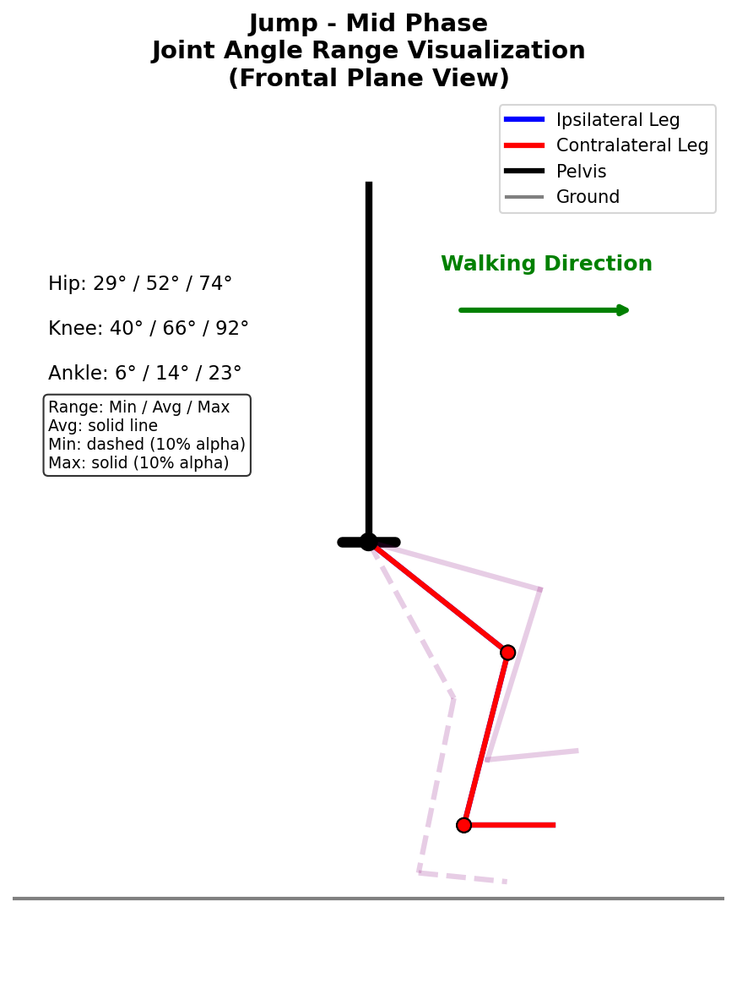 | 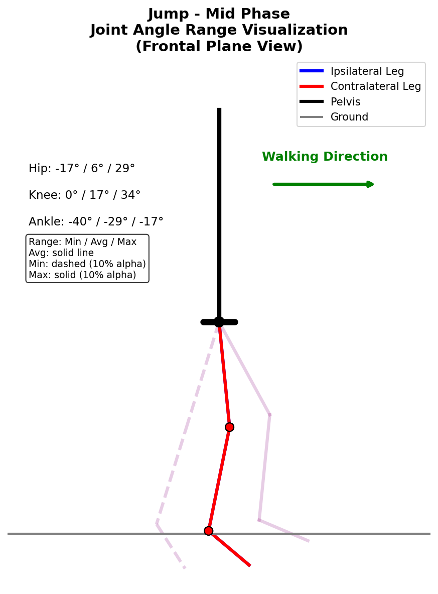 | 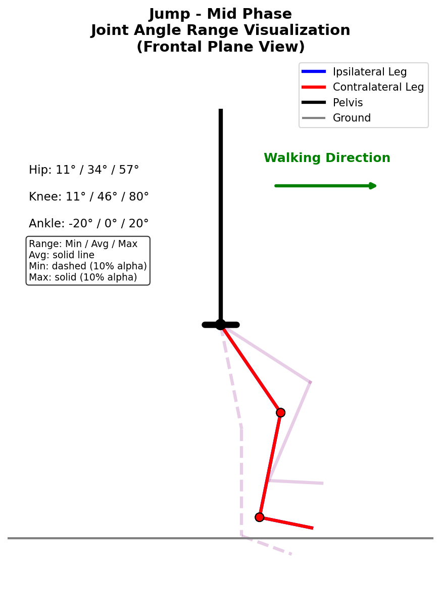 |

**Filters by Phase Validation:**

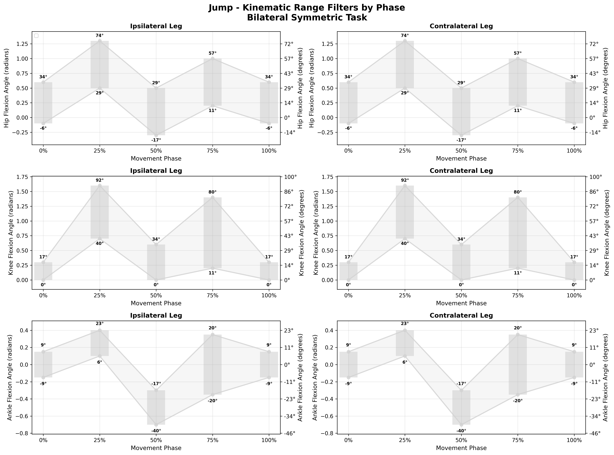

### Task: squats

**Phase-Specific Range Validation (Bilateral Movement - Both Legs):**

#### Phase 0% (Standing)
| Variable | Min_Value | Max_Value | Units | Notes |
|----------|-----------|-----------|-------|---------|
| hip_flexion_angle_ipsi_rad | -0.1 (-6°) | 0.3 (17°) | rad | Initial standing position (-6 to 17°) |
| hip_flexion_angle_contra_rad | -0.1 (-6°) | 0.3 (17°) | rad | Bilateral standing (-6 to 17°) |
| knee_flexion_angle_ipsi_rad | 0.0 (0°) | 0.25 (14°) | rad | Initial knee position (0-14°) |
| knee_flexion_angle_contra_rad | 0.0 (0°) | 0.25 (14°) | rad | Bilateral initial (0-14°) |
| ankle_flexion_angle_ipsi_rad | -0.05 (-3°) | 0.15 (9°) | rad | Neutral ankle start (-3 to 9°) |
| ankle_flexion_angle_contra_rad | -0.05 (-3°) | 0.15 (9°) | rad | Bilateral neutral (-3 to 9°) |
| vertical_grf_N | 600 | 1200 | N | Initial body weight |
| ap_grf_N | -200 | 200 | N | Balance maintenance |
| ml_grf_N | -150 | 150 | N | Lateral balance |

#### Phase 25% (Descent)
| Variable | Min_Value | Max_Value | Units | Notes |
|----------|-----------|-----------|-------|---------|
| hip_flexion_angle_ipsi_rad | 0.6 (34°) | 1.4 (80°) | rad | Descent hip flexion (34-80°) |
| hip_flexion_angle_contra_rad | 0.6 (34°) | 1.4 (80°) | rad | Bilateral descent (34-80°) |
| knee_flexion_angle_ipsi_rad | 0.9 (52°) | 1.8 (103°) | rad | Descent knee flexion (52-103°) |
| knee_flexion_angle_contra_rad | 0.9 (52°) | 1.8 (103°) | rad | Bilateral descent (52-103°) |
| ankle_flexion_angle_ipsi_rad | 0.15 (9°) | 0.4 (23°) | rad | **VERIFIED: Dorsiflexion for balance (9-23°)** |
| ankle_flexion_angle_contra_rad | 0.15 (9°) | 0.4 (23°) | rad | Bilateral dorsiflexion (9-23°) |
| vertical_grf_N | 400 | 1000 | N | Reduced loading during descent |
| ap_grf_N | -300 | 300 | N | Balance control |
| ml_grf_N | -180 | 180 | N | Lateral stability |

#### Phase 50% (Bottom)
| Variable | Min_Value | Max_Value | Units | Notes |
|----------|-----------|-----------|-------|---------|
| hip_flexion_angle_ipsi_rad | 1.2 (69°) | 2.2 (126°) | rad | Maximum squat depth (69-126°) |
| hip_flexion_angle_contra_rad | 1.2 (69°) | 2.2 (126°) | rad | Bilateral maximum (69-126°) |
| knee_flexion_angle_ipsi_rad | 1.7 (97°) | 2.4 (138°) | rad | Maximum knee flexion (97-137°) |
| knee_flexion_angle_contra_rad | 1.7 (97°) | 2.4 (138°) | rad | Bilateral maximum (97-137°) |
| ankle_flexion_angle_ipsi_rad | 0.25 (14°) | 0.70 (40°) | rad | **UPDATED: Peak dorsiflexion (14-40°)** |
| ankle_flexion_angle_contra_rad | 0.25 (14°) | 0.70 (40°) | rad | **UPDATED: Bilateral peak (14-40°)** |
| vertical_grf_N | 500 | 1000 | N | Bottom position loading |
| ap_grf_N | -350 | 350 | N | Balance at depth |
| ml_grf_N | -200 | 200 | N | Lateral balance at depth |

#### Phase 75% (Ascent)
| Variable | Min_Value | Max_Value | Units | Notes |
|----------|-----------|-----------|-------|---------|
| hip_flexion_angle_ipsi_rad | 0.4 (23°) | 1.2 (69°) | rad | Ascent hip extension (23-69°) |
| hip_flexion_angle_contra_rad | 0.4 (23°) | 1.2 (69°) | rad | Bilateral ascent (23-69°) |
| knee_flexion_angle_ipsi_rad | 0.7 (40°) | 1.6 (92°) | rad | Ascent knee extension (40-92°) |
| knee_flexion_angle_contra_rad | 0.7 (40°) | 1.6 (92°) | rad | Bilateral ascent (40-92°) |
| ankle_flexion_angle_ipsi_rad | 0.05 (3°) | 0.35 (20°) | rad | Return to neutral (3-20°) |
| ankle_flexion_angle_contra_rad | 0.05 (3°) | 0.35 (20°) | rad | Bilateral return (3-20°) |
| vertical_grf_N | 800 | 1600 | N | Ascent forces |
| ap_grf_N | -250 | 250 | N | Balance during ascent |
| ml_grf_N | -180 | 180 | N | Lateral control |

**Note:** Squats are a bilateral symmetric movement, so both legs maintain similar ranges throughout all phases.

**Forward Kinematics Range Visualization:**

| Phase 0% (Standing) | Phase 25% (Descent) | Phase 50% (Bottom) | Phase 75% (Ascent) |
|---|---|---|---|
| 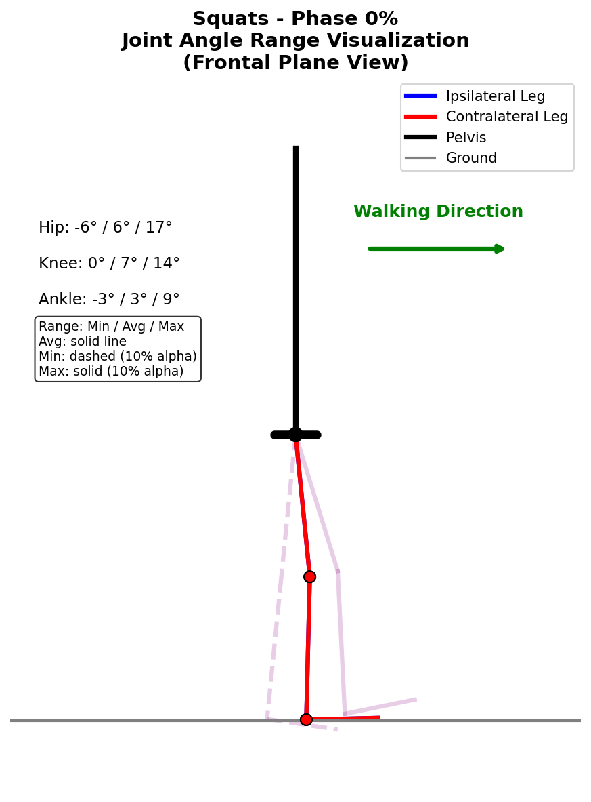 | 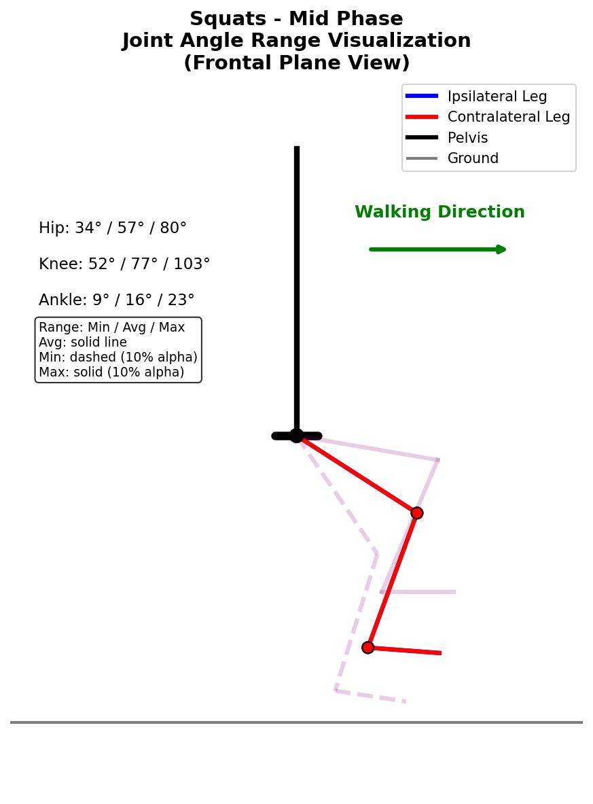 | 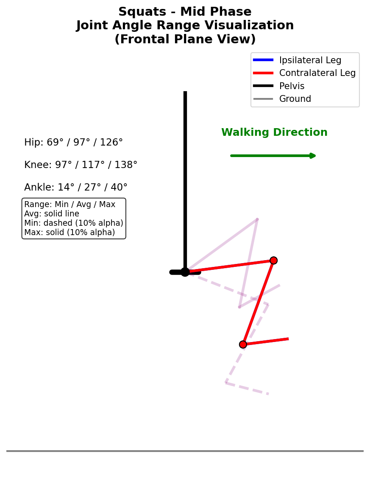 | 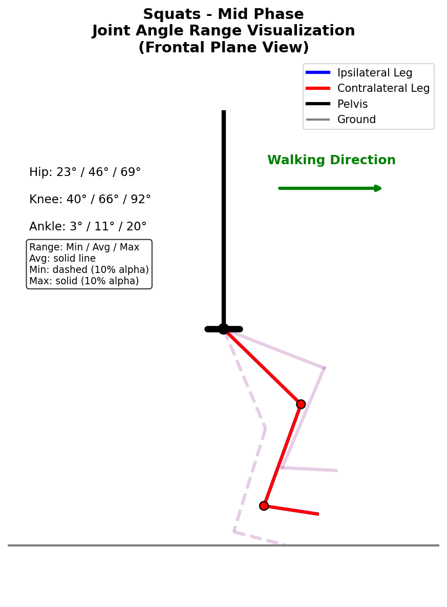 |

**Filters by Phase Validation:**

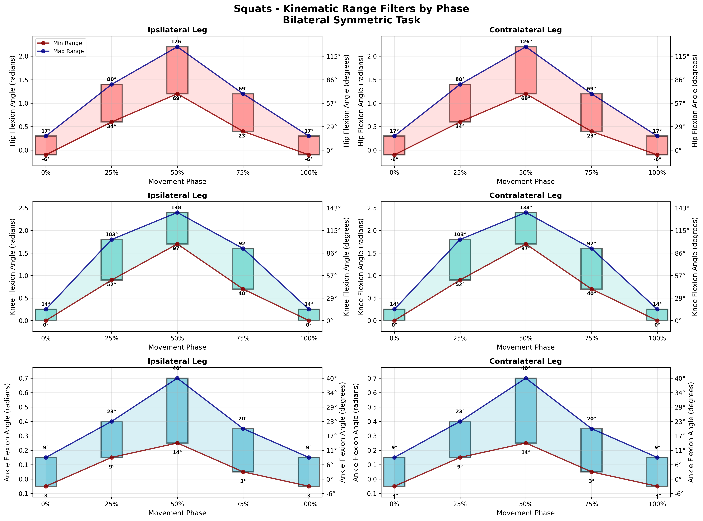

## Joint Validation Range Summary

The filters by phase validation plots have been moved to their corresponding individual task sections above. Each task now includes both forward kinematics range visualizations and filters by phase validation plots.

**Reading the Filters by Phase Plots:**
- **X-axis**: Movement phase progression (0%, 25%, 50%, 75%)
- **Y-axis**: Joint angle values in radians (left) and degrees (right)
- **Layout**: 3 rows (hip, knee, ankle) × 2 columns (left leg, right leg)
- **Bounding Boxes**: Colored rectangles show valid range for each phase
- **Connecting Lines**: 
  - Red line with circles: Minimum acceptable values across phases
  - Blue line with circles: Maximum acceptable values across phases
- **Shaded Area**: Filled region between min/max shows complete acceptable range
- **Value Labels**: Degree values shown at min/max points for easy reference
- **Color Coding**: 
  - Red: Hip flexion angles
  - Teal: Knee flexion angles  
  - Blue: Ankle flexion angles

These plots make it easy to visualize how joint angle requirements change throughout the movement cycle and compare bilateral coordination patterns between left and right legs.

## Pattern Definitions

**Temporal Patterns:**
- `peak_at_X`: Maximum value occurs at phase X%
- `valley_at_X`: Minimum value occurs at phase X%
- `increasing`: Monotonic increase throughout phase range
- `decreasing`: Monotonic decrease throughout phase range
- `negative_to_positive`: Crosses zero from negative to positive
- `U_shaped`: Decreases then increases (valley in middle)
- `inverted_U`: Increases then decreases (peak in middle)

**Amplitude Patterns:**
- `near_zero`: Values close to zero throughout
- `predominantly_negative`: Mostly negative values
- `predominantly_positive`: Mostly positive values
- `variable`: High variability, no clear pattern
- `controlled_motion`: Smooth, controlled changes

## Parser Usage

This markdown file can be parsed programmatically using the companion parser:

```python
from validation_markdown_parser import ValidationMarkdownParser

parser = ValidationMarkdownParser()
validation_rules = parser.parse_file('validation_expectations.md')

# Get rules for specific task
level_walking_rules = validation_rules['level_walking']

# Validate data against rules
results = parser.validate_data(data, 'level_walking')
```

## Maintenance Guidelines

1. **Adding New Tasks**: Follow the exact table format
2. **Variable Names**: Must match dataset column names exactly
3. **Phase Ranges**: Use format "start-end" (e.g., "0-100", "45-55")  
4. **Patterns**: Use predefined pattern names from Pattern Definitions
5. **Units**: Must match standard specification units
6. **Tolerance**: Percentage (e.g., "15%") or absolute values

## References

These ranges are verified against:
1. Perry, J., & Burnfield, J. M. (2010). Gait Analysis: Normal and Pathological Function (2nd ed.)
2. Winter, D. A. (2009). Biomechanics and Motor Control of Human Movement (4th ed.)
3. Whittle, M. W. (2007). Gait Analysis: An Introduction (4th ed.)
4. Nordin, M., & Frankel, V. H. (2012). Basic Biomechanics of the Musculoskeletal System (4th ed.)
5. Schoenfeld, B. J. (2010). Squatting kinematics and kinetics and their application to exercise performance
6. Cook, G. (2010). Movement: Functional Movement Systems
7. Various peer-reviewed sources from 2024 literature searches

> **📋 Version History**: See [validation_expectations_changelog.md](validation_expectations_changelog.md) for complete version history and detailed change documentation.
> **🧪 Parser Testing**: See [test_validation_parser.md](test_validation_parser.md) for markdown parser unit test data.