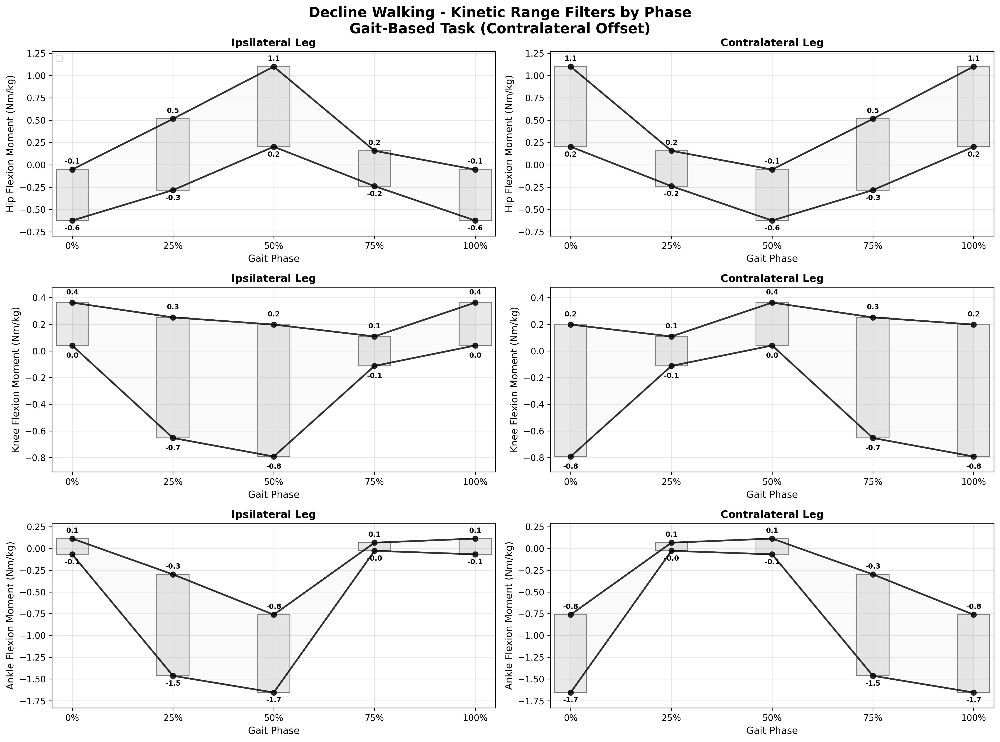

# Kinetic Validation Expectations Specification

**Single Source of Truth for Biomechanically Accurate Kinetic Validation Rules**

This document provides biomechanically verified kinetic validation ranges (forces and moments) based on published gait analysis literature. The specification uses a modern phase system (0%, 25%, 50%, 75%) with contralateral offset logic for optimal validation efficiency.

> **📊 Related**: See [validation_expectations_kinematic.md](validation_expectations_kinematic.md) for kinematic validation rules (joint angles).

> **📋 Version Information**: See [validation_expectations_changelog.md](validation_expectations_changelog.md) for detailed version history and changes.  
> **🔬 Research Status**: **REQUIRES LITERATURE RESEARCH** - Kinetic ranges need verification against published biomechanics literature.

> **🔄 Plot Generation**: 
> 
> **One-click regeneration (VS Code):** `Ctrl+Shift+P` → `Tasks: Run Task` → `🔄 Regenerate Kinetic Plots`
> 
> **GitHub Actions:** [](https://github.com/jmontp/locomotion-data-standardization/actions/workflows/regenerate-validation-plots.yml)
> 
> **Manual command:**
> ```bash
> python3 source/validation/generate_validation_plots.py --filters-only
> ```


## Validation Tables

**🤖 AUTOMATED TUNING - DECLINE_WALKING**

⚠️  **Data-Driven Ranges**: These validation ranges were automatically generated using statistical analysis.

📊 **Source**: `umich_2021_phase.parquet` | 📈 **Method**: 95% Percentile (2.5th-97.5th percentiles) | 🕒 **Generated**: 2025-06-12 10:17:06

### Task: decline_walking

**Phase-Specific Range Validation (Ipsilateral Leg Only):**

#### Phase 0% (Heel Strike)
| Variable | Min_Value | Max_Value | Units | Notes |
|----------|-----------|-----------|-------|-------|
| ankle_adduction_moment_contra_Nm | -0.094 | 0.301 | Nm | Data-driven statistical range |
| ankle_adduction_moment_ipsi_Nm | -0.056 | 0.024 | Nm | Data-driven statistical range |
| ankle_flexion_moment_contra_Nm | -1.656 | -0.761 | Nm | Data-driven statistical range |
| ankle_flexion_moment_ipsi_Nm | -0.067 | 0.114 | Nm | Data-driven statistical range |
| ankle_rotation_moment_contra_Nm | -0.022 | 0.191 | Nm | Data-driven statistical range |
| ankle_rotation_moment_ipsi_Nm | -0.180 | 0.037 | Nm | Data-driven statistical range |
| hip_adduction_moment_contra_Nm | 0.143 | 0.855 | Nm | Data-driven statistical range |
| hip_adduction_moment_ipsi_Nm | -0.155 | 0.176 | Nm | Data-driven statistical range |
| hip_flexion_moment_contra_Nm | 0.203 | 1.100 | Nm | Data-driven statistical range |
| hip_flexion_moment_ipsi_Nm | -0.624 | -0.053 | Nm | Data-driven statistical range |
| hip_rotation_moment_contra_Nm | -0.212 | 0.105 | Nm | Data-driven statistical range |
| hip_rotation_moment_ipsi_Nm | -0.174 | 0.057 | Nm | Data-driven statistical range |
| knee_adduction_moment_contra_Nm | -0.010 | 0.539 | Nm | Data-driven statistical range |
| knee_adduction_moment_ipsi_Nm | -0.083 | 0.112 | Nm | Data-driven statistical range |
| knee_flexion_moment_contra_Nm | -0.792 | 0.198 | Nm | Data-driven statistical range |
| knee_flexion_moment_ipsi_Nm | 0.041 | 0.363 | Nm | Data-driven statistical range |
| knee_rotation_moment_contra_Nm | -0.036 | 0.187 | Nm | Data-driven statistical range |
| knee_rotation_moment_ipsi_Nm | -0.188 | 0.038 | Nm | Data-driven statistical range |

#### Phase 25% (Mid-Stance)
| Variable | Min_Value | Max_Value | Units | Notes |
|----------|-----------|-----------|-------|-------|
| ankle_adduction_moment_contra_Nm | -0.000 | 0.185 | Nm | Data-driven statistical range |
| ankle_adduction_moment_ipsi_Nm | -0.107 | 0.233 | Nm | Data-driven statistical range |
| ankle_flexion_moment_contra_Nm | -0.027 | 0.067 | Nm | Data-driven statistical range |
| ankle_flexion_moment_ipsi_Nm | -1.464 | -0.298 | Nm | Data-driven statistical range |
| ankle_rotation_moment_contra_Nm | -0.148 | 0.020 | Nm | Data-driven statistical range |
| ankle_rotation_moment_ipsi_Nm | -0.295 | 0.115 | Nm | Data-driven statistical range |
| hip_adduction_moment_contra_Nm | -0.045 | 0.220 | Nm | Data-driven statistical range |
| hip_adduction_moment_ipsi_Nm | 0.364 | 0.958 | Nm | Data-driven statistical range |
| hip_flexion_moment_contra_Nm | -0.239 | 0.157 | Nm | Data-driven statistical range |
| hip_flexion_moment_ipsi_Nm | -0.283 | 0.515 | Nm | Data-driven statistical range |
| hip_rotation_moment_contra_Nm | -0.353 | 0.013 | Nm | Data-driven statistical range |
| hip_rotation_moment_ipsi_Nm | -0.435 | 0.043 | Nm | Data-driven statistical range |
| knee_adduction_moment_contra_Nm | -0.022 | 0.314 | Nm | Data-driven statistical range |
| knee_adduction_moment_ipsi_Nm | 0.062 | 0.619 | Nm | Data-driven statistical range |
| knee_flexion_moment_contra_Nm | -0.112 | 0.109 | Nm | Data-driven statistical range |
| knee_flexion_moment_ipsi_Nm | -0.653 | 0.252 | Nm | Data-driven statistical range |
| knee_rotation_moment_contra_Nm | -0.125 | 0.020 | Nm | Data-driven statistical range |
| knee_rotation_moment_ipsi_Nm | -0.268 | 0.138 | Nm | Data-driven statistical range |

#### Phase 50% (Toe-Off)
| Variable | Min_Value | Max_Value | Units | Notes |
|----------|-----------|-----------|-------|-------|
| ankle_adduction_moment_contra_Nm | -0.056 | 0.024 | Nm | Data-driven statistical range |
| ankle_adduction_moment_ipsi_Nm | -0.094 | 0.301 | Nm | Data-driven statistical range |
| ankle_flexion_moment_contra_Nm | -0.067 | 0.114 | Nm | Data-driven statistical range |
| ankle_flexion_moment_ipsi_Nm | -1.656 | -0.761 | Nm | Data-driven statistical range |
| ankle_rotation_moment_contra_Nm | -0.180 | 0.037 | Nm | Data-driven statistical range |
| ankle_rotation_moment_ipsi_Nm | -0.022 | 0.191 | Nm | Data-driven statistical range |
| hip_adduction_moment_contra_Nm | -0.155 | 0.176 | Nm | Data-driven statistical range |
| hip_adduction_moment_ipsi_Nm | 0.143 | 0.855 | Nm | Data-driven statistical range |
| hip_flexion_moment_contra_Nm | -0.624 | -0.053 | Nm | Data-driven statistical range |
| hip_flexion_moment_ipsi_Nm | 0.203 | 1.100 | Nm | Data-driven statistical range |
| hip_rotation_moment_contra_Nm | -0.174 | 0.057 | Nm | Data-driven statistical range |
| hip_rotation_moment_ipsi_Nm | -0.212 | 0.105 | Nm | Data-driven statistical range |
| knee_adduction_moment_contra_Nm | -0.083 | 0.112 | Nm | Data-driven statistical range |
| knee_adduction_moment_ipsi_Nm | -0.010 | 0.539 | Nm | Data-driven statistical range |
| knee_flexion_moment_contra_Nm | 0.041 | 0.363 | Nm | Data-driven statistical range |
| knee_flexion_moment_ipsi_Nm | -0.792 | 0.198 | Nm | Data-driven statistical range |
| knee_rotation_moment_contra_Nm | -0.188 | 0.038 | Nm | Data-driven statistical range |
| knee_rotation_moment_ipsi_Nm | -0.036 | 0.187 | Nm | Data-driven statistical range |

#### Phase 75% (Mid-Swing)
| Variable | Min_Value | Max_Value | Units | Notes |
|----------|-----------|-----------|-------|-------|
| ankle_adduction_moment_contra_Nm | -0.107 | 0.233 | Nm | Data-driven statistical range |
| ankle_adduction_moment_ipsi_Nm | -0.000 | 0.185 | Nm | Data-driven statistical range |
| ankle_flexion_moment_contra_Nm | -1.464 | -0.298 | Nm | Data-driven statistical range |
| ankle_flexion_moment_ipsi_Nm | -0.027 | 0.067 | Nm | Data-driven statistical range |
| ankle_rotation_moment_contra_Nm | -0.295 | 0.115 | Nm | Data-driven statistical range |
| ankle_rotation_moment_ipsi_Nm | -0.148 | 0.020 | Nm | Data-driven statistical range |
| hip_adduction_moment_contra_Nm | 0.364 | 0.958 | Nm | Data-driven statistical range |
| hip_adduction_moment_ipsi_Nm | -0.045 | 0.220 | Nm | Data-driven statistical range |
| hip_flexion_moment_contra_Nm | -0.283 | 0.515 | Nm | Data-driven statistical range |
| hip_flexion_moment_ipsi_Nm | -0.239 | 0.157 | Nm | Data-driven statistical range |
| hip_rotation_moment_contra_Nm | -0.435 | 0.043 | Nm | Data-driven statistical range |
| hip_rotation_moment_ipsi_Nm | -0.353 | 0.013 | Nm | Data-driven statistical range |
| knee_adduction_moment_contra_Nm | 0.062 | 0.619 | Nm | Data-driven statistical range |
| knee_adduction_moment_ipsi_Nm | -0.022 | 0.314 | Nm | Data-driven statistical range |
| knee_flexion_moment_contra_Nm | -0.653 | 0.252 | Nm | Data-driven statistical range |
| knee_flexion_moment_ipsi_Nm | -0.112 | 0.109 | Nm | Data-driven statistical range |
| knee_rotation_moment_contra_Nm | -0.268 | 0.138 | Nm | Data-driven statistical range |
| knee_rotation_moment_ipsi_Nm | -0.125 | 0.020 | Nm | Data-driven statistical range |

**Filters by Phase Validation:**



---

**🤖 AUTOMATED TUNING - INCLINE_WALKING**

⚠️  **Data-Driven Ranges**: These validation ranges were automatically generated using statistical analysis.

📊 **Source**: `umich_2021_phase.parquet` | 📈 **Method**: 95% Percentile (2.5th-97.5th percentiles) | 🕒 **Generated**: 2025-06-12 10:17:06

### Task: incline_walking

**Phase-Specific Range Validation (Ipsilateral Leg Only):**

#### Phase 0% (Heel Strike)
| Variable | Min_Value | Max_Value | Units | Notes |
|----------|-----------|-----------|-------|-------|
| ankle_adduction_moment_contra_Nm | nan | nan | Nm | Data-driven statistical range |
| ankle_adduction_moment_ipsi_Nm | nan | nan | Nm | Data-driven statistical range |
| ankle_flexion_moment_contra_Nm | nan | nan | Nm | Data-driven statistical range |
| ankle_flexion_moment_ipsi_Nm | nan | nan | Nm | Data-driven statistical range |
| ankle_rotation_moment_contra_Nm | nan | nan | Nm | Data-driven statistical range |
| ankle_rotation_moment_ipsi_Nm | nan | nan | Nm | Data-driven statistical range |
| hip_adduction_moment_contra_Nm | nan | nan | Nm | Data-driven statistical range |
| hip_adduction_moment_ipsi_Nm | nan | nan | Nm | Data-driven statistical range |
| hip_flexion_moment_contra_Nm | nan | nan | Nm | Data-driven statistical range |
| hip_flexion_moment_ipsi_Nm | nan | nan | Nm | Data-driven statistical range |
| hip_rotation_moment_contra_Nm | nan | nan | Nm | Data-driven statistical range |
| hip_rotation_moment_ipsi_Nm | nan | nan | Nm | Data-driven statistical range |
| knee_adduction_moment_contra_Nm | nan | nan | Nm | Data-driven statistical range |
| knee_adduction_moment_ipsi_Nm | nan | nan | Nm | Data-driven statistical range |
| knee_flexion_moment_contra_Nm | nan | nan | Nm | Data-driven statistical range |
| knee_flexion_moment_ipsi_Nm | nan | nan | Nm | Data-driven statistical range |
| knee_rotation_moment_contra_Nm | nan | nan | Nm | Data-driven statistical range |
| knee_rotation_moment_ipsi_Nm | nan | nan | Nm | Data-driven statistical range |

#### Phase 25% (Mid-Stance)
| Variable | Min_Value | Max_Value | Units | Notes |
|----------|-----------|-----------|-------|-------|
| ankle_adduction_moment_contra_Nm | nan | nan | Nm | Data-driven statistical range |
| ankle_adduction_moment_ipsi_Nm | nan | nan | Nm | Data-driven statistical range |
| ankle_flexion_moment_contra_Nm | nan | nan | Nm | Data-driven statistical range |
| ankle_flexion_moment_ipsi_Nm | nan | nan | Nm | Data-driven statistical range |
| ankle_rotation_moment_contra_Nm | nan | nan | Nm | Data-driven statistical range |
| ankle_rotation_moment_ipsi_Nm | nan | nan | Nm | Data-driven statistical range |
| hip_adduction_moment_contra_Nm | nan | nan | Nm | Data-driven statistical range |
| hip_adduction_moment_ipsi_Nm | nan | nan | Nm | Data-driven statistical range |
| hip_flexion_moment_contra_Nm | nan | nan | Nm | Data-driven statistical range |
| hip_flexion_moment_ipsi_Nm | nan | nan | Nm | Data-driven statistical range |
| hip_rotation_moment_contra_Nm | nan | nan | Nm | Data-driven statistical range |
| hip_rotation_moment_ipsi_Nm | nan | nan | Nm | Data-driven statistical range |
| knee_adduction_moment_contra_Nm | nan | nan | Nm | Data-driven statistical range |
| knee_adduction_moment_ipsi_Nm | nan | nan | Nm | Data-driven statistical range |
| knee_flexion_moment_contra_Nm | nan | nan | Nm | Data-driven statistical range |
| knee_flexion_moment_ipsi_Nm | nan | nan | Nm | Data-driven statistical range |
| knee_rotation_moment_contra_Nm | nan | nan | Nm | Data-driven statistical range |
| knee_rotation_moment_ipsi_Nm | nan | nan | Nm | Data-driven statistical range |

#### Phase 50% (Toe-Off)
| Variable | Min_Value | Max_Value | Units | Notes |
|----------|-----------|-----------|-------|-------|
| ankle_adduction_moment_contra_Nm | nan | nan | Nm | Data-driven statistical range |
| ankle_adduction_moment_ipsi_Nm | nan | nan | Nm | Data-driven statistical range |
| ankle_flexion_moment_contra_Nm | nan | nan | Nm | Data-driven statistical range |
| ankle_flexion_moment_ipsi_Nm | nan | nan | Nm | Data-driven statistical range |
| ankle_rotation_moment_contra_Nm | nan | nan | Nm | Data-driven statistical range |
| ankle_rotation_moment_ipsi_Nm | nan | nan | Nm | Data-driven statistical range |
| hip_adduction_moment_contra_Nm | nan | nan | Nm | Data-driven statistical range |
| hip_adduction_moment_ipsi_Nm | nan | nan | Nm | Data-driven statistical range |
| hip_flexion_moment_contra_Nm | nan | nan | Nm | Data-driven statistical range |
| hip_flexion_moment_ipsi_Nm | nan | nan | Nm | Data-driven statistical range |
| hip_rotation_moment_contra_Nm | nan | nan | Nm | Data-driven statistical range |
| hip_rotation_moment_ipsi_Nm | nan | nan | Nm | Data-driven statistical range |
| knee_adduction_moment_contra_Nm | nan | nan | Nm | Data-driven statistical range |
| knee_adduction_moment_ipsi_Nm | nan | nan | Nm | Data-driven statistical range |
| knee_flexion_moment_contra_Nm | nan | nan | Nm | Data-driven statistical range |
| knee_flexion_moment_ipsi_Nm | nan | nan | Nm | Data-driven statistical range |
| knee_rotation_moment_contra_Nm | nan | nan | Nm | Data-driven statistical range |
| knee_rotation_moment_ipsi_Nm | nan | nan | Nm | Data-driven statistical range |

#### Phase 75% (Mid-Swing)
| Variable | Min_Value | Max_Value | Units | Notes |
|----------|-----------|-----------|-------|-------|
| ankle_adduction_moment_contra_Nm | nan | nan | Nm | Data-driven statistical range |
| ankle_adduction_moment_ipsi_Nm | nan | nan | Nm | Data-driven statistical range |
| ankle_flexion_moment_contra_Nm | nan | nan | Nm | Data-driven statistical range |
| ankle_flexion_moment_ipsi_Nm | nan | nan | Nm | Data-driven statistical range |
| ankle_rotation_moment_contra_Nm | nan | nan | Nm | Data-driven statistical range |
| ankle_rotation_moment_ipsi_Nm | nan | nan | Nm | Data-driven statistical range |
| hip_adduction_moment_contra_Nm | nan | nan | Nm | Data-driven statistical range |
| hip_adduction_moment_ipsi_Nm | nan | nan | Nm | Data-driven statistical range |
| hip_flexion_moment_contra_Nm | nan | nan | Nm | Data-driven statistical range |
| hip_flexion_moment_ipsi_Nm | nan | nan | Nm | Data-driven statistical range |
| hip_rotation_moment_contra_Nm | nan | nan | Nm | Data-driven statistical range |
| hip_rotation_moment_ipsi_Nm | nan | nan | Nm | Data-driven statistical range |
| knee_adduction_moment_contra_Nm | nan | nan | Nm | Data-driven statistical range |
| knee_adduction_moment_ipsi_Nm | nan | nan | Nm | Data-driven statistical range |
| knee_flexion_moment_contra_Nm | nan | nan | Nm | Data-driven statistical range |
| knee_flexion_moment_ipsi_Nm | nan | nan | Nm | Data-driven statistical range |
| knee_rotation_moment_contra_Nm | nan | nan | Nm | Data-driven statistical range |
| knee_rotation_moment_ipsi_Nm | nan | nan | Nm | Data-driven statistical range |

**Filters by Phase Validation:**


---

**🤖 AUTOMATED TUNING - LEVEL_WALKING**

⚠️  **Data-Driven Ranges**: These validation ranges were automatically generated using statistical analysis.

📊 **Source**: `umich_2021_phase.parquet` | 📈 **Method**: 95% Percentile (2.5th-97.5th percentiles) | 🕒 **Generated**: 2025-06-12 10:17:06

### Task: level_walking

**Phase-Specific Range Validation (Ipsilateral Leg Only):**

#### Phase 0% (Heel Strike)
| Variable | Min_Value | Max_Value | Units | Notes |
|----------|-----------|-----------|-------|-------|
| ankle_adduction_moment_contra_Nm | -0.090 | 0.257 | Nm | Data-driven statistical range |
| ankle_adduction_moment_ipsi_Nm | -0.018 | 0.055 | Nm | Data-driven statistical range |
| ankle_flexion_moment_contra_Nm | -1.916 | -0.990 | Nm | Data-driven statistical range |
| ankle_flexion_moment_ipsi_Nm | -0.034 | 0.067 | Nm | Data-driven statistical range |
| ankle_rotation_moment_contra_Nm | -0.015 | 0.171 | Nm | Data-driven statistical range |
| ankle_rotation_moment_ipsi_Nm | -0.018 | 0.017 | Nm | Data-driven statistical range |
| hip_adduction_moment_contra_Nm | 0.144 | 0.826 | Nm | Data-driven statistical range |
| hip_adduction_moment_ipsi_Nm | -0.188 | 0.148 | Nm | Data-driven statistical range |
| hip_flexion_moment_contra_Nm | 0.096 | 0.977 | Nm | Data-driven statistical range |
| hip_flexion_moment_ipsi_Nm | -0.773 | -0.113 | Nm | Data-driven statistical range |
| hip_rotation_moment_contra_Nm | 0.011 | 0.153 | Nm | Data-driven statistical range |
| hip_rotation_moment_ipsi_Nm | -0.034 | 0.054 | Nm | Data-driven statistical range |
| knee_adduction_moment_contra_Nm | -0.184 | 0.374 | Nm | Data-driven statistical range |
| knee_adduction_moment_ipsi_Nm | -0.078 | 0.086 | Nm | Data-driven statistical range |
| knee_flexion_moment_contra_Nm | 0.007 | 0.512 | Nm | Data-driven statistical range |
| knee_flexion_moment_ipsi_Nm | 0.077 | 0.387 | Nm | Data-driven statistical range |
| knee_rotation_moment_contra_Nm | -0.035 | 0.196 | Nm | Data-driven statistical range |
| knee_rotation_moment_ipsi_Nm | -0.017 | 0.018 | Nm | Data-driven statistical range |

#### Phase 25% (Mid-Stance)
| Variable | Min_Value | Max_Value | Units | Notes |
|----------|-----------|-----------|-------|-------|
| ankle_adduction_moment_contra_Nm | -0.000 | 0.000 | Nm | Data-driven statistical range |
| ankle_adduction_moment_ipsi_Nm | -0.164 | 0.192 | Nm | Data-driven statistical range |
| ankle_flexion_moment_contra_Nm | 0.000 | 0.031 | Nm | Data-driven statistical range |
| ankle_flexion_moment_ipsi_Nm | -1.206 | -0.251 | Nm | Data-driven statistical range |
| ankle_rotation_moment_contra_Nm | -0.011 | 0.018 | Nm | Data-driven statistical range |
| ankle_rotation_moment_ipsi_Nm | -0.016 | 0.127 | Nm | Data-driven statistical range |
| hip_adduction_moment_contra_Nm | -0.060 | 0.153 | Nm | Data-driven statistical range |
| hip_adduction_moment_ipsi_Nm | 0.324 | 0.872 | Nm | Data-driven statistical range |
| hip_flexion_moment_contra_Nm | -0.064 | 0.166 | Nm | Data-driven statistical range |
| hip_flexion_moment_ipsi_Nm | -0.422 | 0.248 | Nm | Data-driven statistical range |
| hip_rotation_moment_contra_Nm | -0.041 | 0.011 | Nm | Data-driven statistical range |
| hip_rotation_moment_ipsi_Nm | -0.031 | 0.085 | Nm | Data-driven statistical range |
| knee_adduction_moment_contra_Nm | -0.029 | 0.058 | Nm | Data-driven statistical range |
| knee_adduction_moment_ipsi_Nm | -0.001 | 0.522 | Nm | Data-driven statistical range |
| knee_flexion_moment_contra_Nm | -0.116 | -0.000 | Nm | Data-driven statistical range |
| knee_flexion_moment_ipsi_Nm | -0.208 | 0.445 | Nm | Data-driven statistical range |
| knee_rotation_moment_contra_Nm | -0.011 | 0.019 | Nm | Data-driven statistical range |
| knee_rotation_moment_ipsi_Nm | -0.015 | 0.148 | Nm | Data-driven statistical range |

#### Phase 50% (Toe-Off)
| Variable | Min_Value | Max_Value | Units | Notes |
|----------|-----------|-----------|-------|-------|
| ankle_adduction_moment_contra_Nm | -0.018 | 0.055 | Nm | Data-driven statistical range |
| ankle_adduction_moment_ipsi_Nm | -0.090 | 0.257 | Nm | Data-driven statistical range |
| ankle_flexion_moment_contra_Nm | -0.034 | 0.067 | Nm | Data-driven statistical range |
| ankle_flexion_moment_ipsi_Nm | -1.916 | -0.990 | Nm | Data-driven statistical range |
| ankle_rotation_moment_contra_Nm | -0.018 | 0.017 | Nm | Data-driven statistical range |
| ankle_rotation_moment_ipsi_Nm | -0.015 | 0.171 | Nm | Data-driven statistical range |
| hip_adduction_moment_contra_Nm | -0.188 | 0.148 | Nm | Data-driven statistical range |
| hip_adduction_moment_ipsi_Nm | 0.144 | 0.826 | Nm | Data-driven statistical range |
| hip_flexion_moment_contra_Nm | -0.773 | -0.113 | Nm | Data-driven statistical range |
| hip_flexion_moment_ipsi_Nm | 0.096 | 0.977 | Nm | Data-driven statistical range |
| hip_rotation_moment_contra_Nm | -0.034 | 0.054 | Nm | Data-driven statistical range |
| hip_rotation_moment_ipsi_Nm | 0.011 | 0.153 | Nm | Data-driven statistical range |
| knee_adduction_moment_contra_Nm | -0.078 | 0.086 | Nm | Data-driven statistical range |
| knee_adduction_moment_ipsi_Nm | -0.184 | 0.374 | Nm | Data-driven statistical range |
| knee_flexion_moment_contra_Nm | 0.077 | 0.387 | Nm | Data-driven statistical range |
| knee_flexion_moment_ipsi_Nm | 0.007 | 0.512 | Nm | Data-driven statistical range |
| knee_rotation_moment_contra_Nm | -0.017 | 0.018 | Nm | Data-driven statistical range |
| knee_rotation_moment_ipsi_Nm | -0.035 | 0.196 | Nm | Data-driven statistical range |

#### Phase 75% (Mid-Swing)
| Variable | Min_Value | Max_Value | Units | Notes |
|----------|-----------|-----------|-------|-------|
| ankle_adduction_moment_contra_Nm | -0.164 | 0.192 | Nm | Data-driven statistical range |
| ankle_adduction_moment_ipsi_Nm | -0.000 | 0.000 | Nm | Data-driven statistical range |
| ankle_flexion_moment_contra_Nm | -1.206 | -0.251 | Nm | Data-driven statistical range |
| ankle_flexion_moment_ipsi_Nm | 0.000 | 0.031 | Nm | Data-driven statistical range |
| ankle_rotation_moment_contra_Nm | -0.016 | 0.127 | Nm | Data-driven statistical range |
| ankle_rotation_moment_ipsi_Nm | -0.011 | 0.018 | Nm | Data-driven statistical range |
| hip_adduction_moment_contra_Nm | 0.324 | 0.872 | Nm | Data-driven statistical range |
| hip_adduction_moment_ipsi_Nm | -0.060 | 0.153 | Nm | Data-driven statistical range |
| hip_flexion_moment_contra_Nm | -0.422 | 0.248 | Nm | Data-driven statistical range |
| hip_flexion_moment_ipsi_Nm | -0.064 | 0.166 | Nm | Data-driven statistical range |
| hip_rotation_moment_contra_Nm | -0.031 | 0.085 | Nm | Data-driven statistical range |
| hip_rotation_moment_ipsi_Nm | -0.041 | 0.011 | Nm | Data-driven statistical range |
| knee_adduction_moment_contra_Nm | -0.001 | 0.522 | Nm | Data-driven statistical range |
| knee_adduction_moment_ipsi_Nm | -0.029 | 0.058 | Nm | Data-driven statistical range |
| knee_flexion_moment_contra_Nm | -0.208 | 0.445 | Nm | Data-driven statistical range |
| knee_flexion_moment_ipsi_Nm | -0.116 | -0.000 | Nm | Data-driven statistical range |
| knee_rotation_moment_contra_Nm | -0.015 | 0.148 | Nm | Data-driven statistical range |
| knee_rotation_moment_ipsi_Nm | -0.011 | 0.019 | Nm | Data-driven statistical range |

**Filters by Phase Validation:**


---

## Research Requirements

### Literature Sources Needed
1. **Ground Reaction Forces**:
   - Normal walking GRF patterns and magnitudes
   - Incline/decline walking force modifications
   - Running vs walking force differences
   - Stair climbing/descending force patterns

2. **Joint Moments**:
   - Hip, knee, ankle moment patterns during gait
   - Task-specific moment modifications
   - Age and anthropometric scaling factors
   - Pathological vs normal moment patterns

3. **Power Analysis**:
   - Joint power generation and absorption patterns
   - Energy transfer between joints
   - Efficiency metrics across tasks

### Key Research Questions
1. What are typical GRF magnitudes relative to body weight?
2. How do joint moments scale with anthropometric measures?
3. What are the phase-specific patterns for different locomotion tasks?
4. How do kinetic patterns differ between ipsilateral and contralateral legs?
5. What are acceptable ranges for healthy adult populations?

### Recommended Literature Sources
- Winter, D. A. (2009). Biomechanics and Motor Control of Human Movement
- Perry, J., & Burnfield, J. M. (2010). Gait Analysis: Normal and Pathological Function
- Robertson, D. G. E., et al. (2013). Research Methods in Biomechanics
- Journal of Biomechanics - recent gait analysis studies
- Gait & Posture - locomotion-specific research
- IEEE Transactions on Biomedical Engineering - force platform studies

## Parser Usage

This markdown file can be parsed programmatically using the same parser as kinematic validation:

```python
from validation_markdown_parser import ValidationMarkdownParser

parser = ValidationMarkdownParser()
kinetic_rules = parser.parse_file('validation_expectations_kinetic.md')

# Get rules for specific task
level_walking_kinetics = kinetic_rules['level_walking']

# Validate kinetic data against rules
results = parser.validate_data(kinetic_data, 'level_walking')
```

## Maintenance Guidelines

1. **Adding New Tasks**: Follow the exact table format used for kinematics
2. **Variable Names**: Must match dataset column names exactly
3. **Phase Ranges**: Use format "start-end" (e.g., "0-100", "45-55")  
4. **Units**: Must match standard specification units (N, Nm, W)
5. **Research Verification**: All ranges must be verified against literature before production use

## References

> **⚠️ PLACEHOLDER**: Literature references need to be added after research completion

These ranges will be verified against:
1. Winter, D. A. (2009). Biomechanics and Motor Control of Human Movement (4th ed.)
2. Perry, J., & Burnfield, J. M. (2010). Gait Analysis: Normal and Pathological Function (2nd ed.)
3. Robertson, D. G. E., et al. (2013). Research Methods in Biomechanics (2nd ed.)
4. [Additional peer-reviewed sources to be added after research]

> **📋 Version History**: See [validation_expectations_changelog.md](validation_expectations_changelog.md) for complete version history and detailed change documentation.
> **🧪 Parser Testing**: See [test_validation_parser.md](test_validation_parser.md) for markdown parser unit test data.