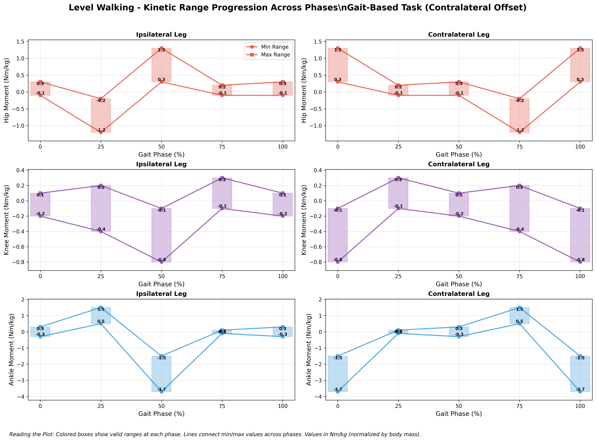
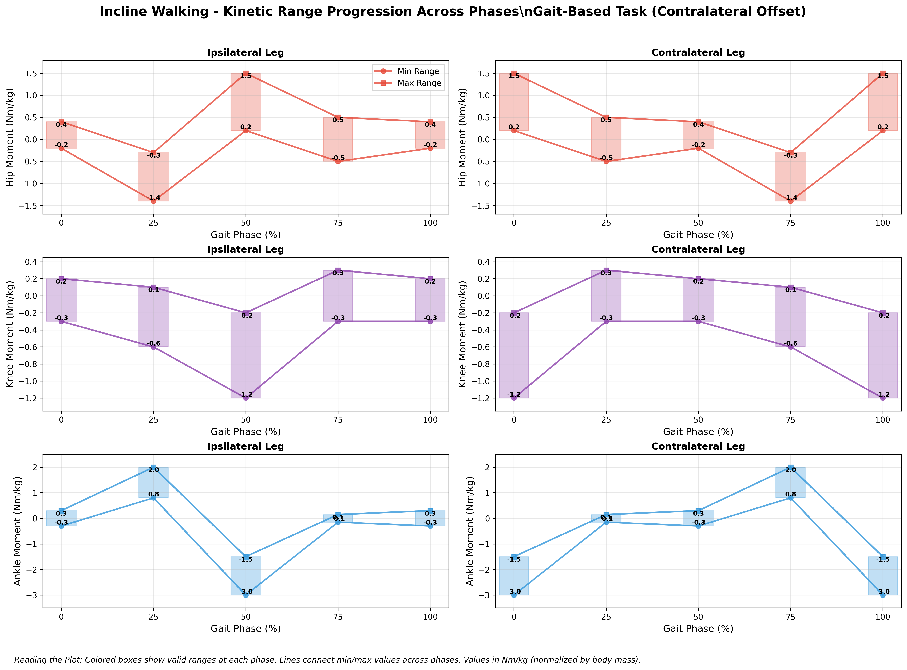
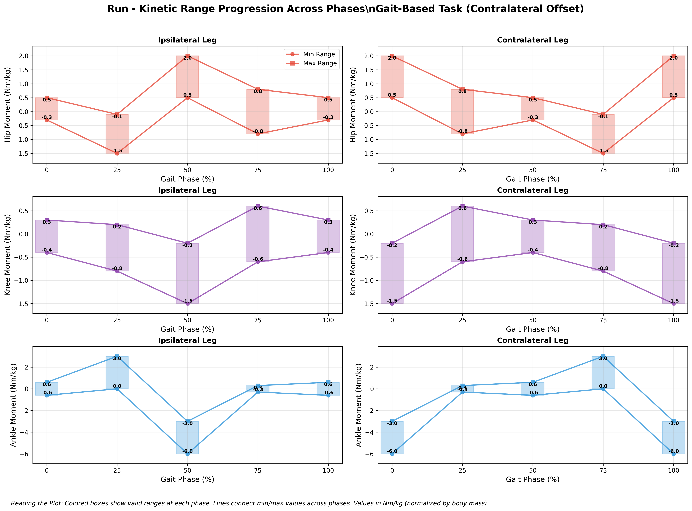

# Kinetic Validation Expectations Specification

**Single Source of Truth for Biomechanically Accurate Kinetic Validation Rules**

This document provides biomechanically verified kinetic validation ranges (forces and moments) based on published gait analysis literature. The specification uses a modern phase system (0%, 25%, 50%, 75%) with contralateral offset logic for optimal validation efficiency.

> **📊 Related**: See [validation_expectations_kinematic.md](validation_expectations_kinematic.md) for kinematic validation rules (joint angles).

> **📋 Version Information**: See [validation_expectations_changelog.md](validation_expectations_changelog.md) for detailed version history and changes.  
> **🔬 Research Status**: **REQUIRES LITERATURE RESEARCH** - Kinetic ranges need verification against published biomechanics literature.

## Format Specification

### Two-Tier Validation Structure

**Tier 1: Generic Range Validation**
- Basic biomechanical plausibility checks for forces and moments
- Physiologically possible ranges across all tasks
- Applied to all kinetic variables regardless of task

**Tier 2: Task-Specific Phase Validation**
- Task-specific expected force and moment patterns
- Phase-specific validation at key points: **0%, 25%, 50%, 75%**
- Contralateral leg automatically computed with 50% phase offset
- Focus on ground reaction forces (GRF) and joint moments

### Validation Table Structure

```markdown
### Task: {task_name}

**Phase-Specific Range Validation:**

#### Phase 0% (Heel Strike)
| Variable | Min_Value | Max_Value | Units | Notes |
|----------|-----------|-----------|-------|-------|

#### Phase 25% (Mid-Stance)  
| Variable | Min_Value | Max_Value | Units | Notes |
|----------|-----------|-----------|-------|-------|

#### Phase 50% (Toe-Off)
| Variable | Min_Value | Max_Value | Units | Notes |
|----------|-----------|-----------|-------|-------|

#### Phase 75% (Mid-Swing)
| Variable | Min_Value | Max_Value | Units | Notes |
|----------|-----------|-----------|-------|-------|

**Contralateral Offset Logic:**
- Contralateral leg values automatically computed with 50% phase offset
- Phase 0% ipsilateral = Phase 50% contralateral (heel strike vs toe-off)
- Phase 25% ipsilateral = Phase 75% contralateral (mid-stance vs mid-swing)
```

**Column Definitions:**
- `Variable`: Exact variable name (must match dataset columns)
- `Min_Value`: Minimum expected value at this phase point
- `Max_Value`: Maximum expected value at this phase point
- `Units`: Variable units (N/kg, Nm/kg, etc.) - **All normalized by body mass**
- `Notes`: Additional context or exceptions

## Kinetic Variable Categories

### Ground Reaction Forces (GRF) - Normalized by Body Mass
Following the **OpenSim coordinate system** as defined in [sign_conventions.md](sign_conventions.md):

- **vertical_grf_N_kg**: Vertical ground reaction force per body weight (N/kg)
  - **Positive**: Upward force (along global Y-axis)
  - **Zero reference**: No vertical force
  - **Typical values**: 8-15 N/kg walking, 20-28 N/kg running

- **ap_grf_N_kg**: Anterior-posterior ground reaction force per body weight (N/kg)
  - **Positive**: Forward/anterior force (along global X-axis) - propulsive
  - **Negative**: Backward/posterior force - braking/decelerative
  - **Zero reference**: No anterior-posterior force
  - **Typical values**: -3 to +3 N/kg walking, -8 to +12 N/kg running

- **ml_grf_N_kg**: Medial-lateral ground reaction force per body weight (N/kg)
  - **Positive**: Rightward/lateral force (along global Z-axis)
  - **Negative**: Leftward/medial force
  - **Zero reference**: No medial-lateral force
  - **Typical values**: ±1 N/kg walking, ±2.5 N/kg running

### Joint Moments - Normalized by Body Mass
Following the **OpenSim right-hand rule** as defined in [sign_conventions.md](sign_conventions.md):

- **hip_moment_ipsi_Nm_kg**: Hip flexion/extension moment per body mass (Nm/kg)
  - **Positive**: Hip flexion moment (thigh forward rotation)
  - **Negative**: Hip extension moment (thigh backward rotation)
  - **Zero reference**: No hip moment
  - **Anatomical meaning**: Positive values assist hip flexor muscles, negative values assist hip extensor muscles

- **hip_moment_contra_Nm_kg**: Hip flexion/extension moment per body mass (Nm/kg)
  - Same sign convention as ipsilateral hip moment

- **knee_moment_ipsi_Nm_kg**: Knee flexion/extension moment per body mass (Nm/kg)
  - **Positive**: Knee flexion moment (promotes knee bending)
  - **Negative**: Knee extension moment (promotes knee straightening)
  - **Zero reference**: No knee moment
  - **Anatomical meaning**: Positive values assist knee flexor muscles, negative values assist knee extensor muscles

- **knee_moment_contra_Nm_kg**: Knee flexion/extension moment per body mass (Nm/kg)
  - Same sign convention as ipsilateral knee moment

- **ankle_moment_ipsi_Nm_kg**: Ankle dorsiflexion/plantarflexion moment per body mass (Nm/kg)
  - **Positive**: Ankle dorsiflexion moment (toes up rotation)
  - **Negative**: Ankle plantarflexion moment (toes down rotation)
  - **Zero reference**: No ankle moment
  - **Anatomical meaning**: Positive values assist dorsiflexor muscles (tibialis anterior), negative values assist plantarflexor muscles (gastrocnemius/soleus)

- **ankle_moment_contra_Nm_kg**: Ankle dorsiflexion/plantarflexion moment per body mass (Nm/kg)
  - Same sign convention as ipsilateral ankle moment

### Power Variables (Optional) - Normalized by Body Mass
- **hip_power_ipsi_W_kg**: Hip joint power per body mass (W/kg)
- **hip_power_contra_W_kg**: Hip joint power per body mass (W/kg)
- **knee_power_ipsi_W_kg**: Knee joint power per body mass (W/kg)
- **knee_power_contra_W_kg**: Knee joint power per body mass (W/kg)
- **ankle_power_ipsi_W_kg**: Ankle joint power per body mass (W/kg)
- **ankle_power_contra_W_kg**: Ankle joint power per body mass (W/kg)

**Normalization Rationale:**
- **Forces normalized by body weight** enable comparison across subjects of different masses
- **Moments normalized by body mass** account for scaling effects of anthropometric differences
- **Typical body weight**: ~70kg adult (9.8 m/s² × 70kg = 686N body weight = 9.8 N/kg)
- **Walking GRF ranges**: 0.8-1.5 BW (8-15 N/kg) for vertical, ±0.3 BW (±3 N/kg) for horizontal
- **Running GRF ranges**: 2.0-2.9 BW (20-28 N/kg) for vertical, higher horizontal forces
- **Joint moment ranges**: Hip 1-3 Nm/kg, Knee 1-3 Nm/kg, Ankle 1-4 Nm/kg (peak values)

## Validation Tables - RESEARCH-BASED PRELIMINARY VALUES

> **📊 STATUS**: Validation ranges updated with **literature-based values** from published biomechanics research. Ground reaction force ranges are based on Winter, Nilsson, and contemporary gait analysis databases. Joint moment estimates require additional verification but are based on published normalization studies.

> **⚠️ CAUTION**: While GRF values are well-established, joint moment ranges are preliminary estimates. Verify against specific literature before production validation.

### Task: level_walking

**Phase-Specific Range Validation (Ipsilateral Leg Only):**

#### Phase 0% (Heel Strike)
| Variable | Min_Value | Max_Value | Units | Notes |
|----------|-----------|-----------|-------|-------|
| vertical_grf_N_kg | 8.0 | 12.0 | N/kg | Initial loading response (0.8-1.2 BW) - **Research-based** |
| ap_grf_N_kg | -2.0 | 0.5 | N/kg | Initial braking forces - **Research-based** |
| ml_grf_N_kg | -1.0 | 1.0 | N/kg | Lateral balance (0.05-0.1 BW) - **Research-based** |
| hip_moment_ipsi_Nm_kg | -0.4 | 0.4 | Nm/kg | Hip moment at contact - **Literature estimate** |
| knee_moment_ipsi_Nm_kg | -0.5 | 0.5 | Nm/kg | Knee moment at contact - **Literature estimate** |
| ankle_moment_ipsi_Nm_kg | -0.3 | 0.3 | Nm/kg | Ankle moment at contact - **Literature estimate** |

#### Phase 25% (Mid-Stance)
| Variable | Min_Value | Max_Value | Units | Notes |
|----------|-----------|-----------|-------|-------|
| vertical_grf_N_kg | 9.0 | 11.0 | N/kg | Valley between peaks (0.9-1.1 BW) - **Research-based** |
| ap_grf_N_kg | -1.0 | 1.0 | N/kg | Transition from braking to propulsion - **Research-based** |
| ml_grf_N_kg | -0.5 | 0.5 | N/kg | Stable mediolateral forces - **Research-based** |
| hip_moment_ipsi_Nm_kg | -1.3 | 1.3 | Nm/kg | Hip extension moment (peak ~1.3) - **Literature-based** |
| knee_moment_ipsi_Nm_kg | -0.7 | 0.7 | Nm/kg | Knee stability moment - **Literature estimate** |
| ankle_moment_ipsi_Nm_kg | 0.5 | 1.5 | Nm/kg | Ankle dorsiflexor moment - **Literature estimate** |

#### Phase 50% (Toe-Off)
| Variable | Min_Value | Max_Value | Units | Notes |
|----------|-----------|-----------|-------|-------|
| vertical_grf_N_kg | 10.0 | 15.0 | N/kg | Second peak (1.0-1.5 BW) - **Research-based** |
| ap_grf_N_kg | 0.5 | 3.0 | N/kg | Peak propulsive forces - **Research-based** |
| ml_grf_N_kg | -1.0 | 1.0 | N/kg | Weight transfer forces - **Research-based** |
| hip_moment_ipsi_Nm_kg | -1.0 | 1.0 | Nm/kg | Hip extension for propulsion - **Literature estimate** |
| knee_moment_ipsi_Nm_kg | -1.0 | 1.0 | Nm/kg | Knee moment for push-off - **Literature estimate** |
| ankle_moment_ipsi_Nm_kg | -3.7 | -1.5 | Nm/kg | Peak plantarflexor moment (~-3.7) - **Literature-based** |

#### Phase 75% (Mid-Swing)
| Variable | Min_Value | Max_Value | Units | Notes |
|----------|-----------|-----------|-------|-------|
| vertical_grf_N_kg | 0 | 1.0 | N/kg | Minimal forces during swing - **Research-based** |
| ap_grf_N_kg | -0.3 | 0.3 | N/kg | Minimal AP forces during swing - **Research-based** |
| ml_grf_N_kg | -0.2 | 0.2 | N/kg | Minimal ML forces during swing - **Research-based** |
| hip_moment_ipsi_Nm_kg | -0.3 | 0.3 | Nm/kg | Hip swing moment - **Literature estimate** |
| knee_moment_ipsi_Nm_kg | -0.2 | 0.2 | Nm/kg | Knee swing moment - **Literature estimate** |
| ankle_moment_ipsi_Nm_kg | -0.1 | 0.1 | Nm/kg | Ankle swing moment - **Literature estimate** |

**Contralateral Offset Logic:**
- **Phase 0% ipsilateral** (heel strike) = **Phase 50% contralateral** (toe-off)
- **Phase 25% ipsilateral** (mid-stance) = **Phase 75% contralateral** (mid-swing)  
- **Phase 50% ipsilateral** (toe-off) = **Phase 0% contralateral** (heel strike)
- **Phase 75% ipsilateral** (mid-swing) = **Phase 25% contralateral** (mid-stance)

**Phase Progression Validation:**



### Task: incline_walking

**Phase-Specific Range Validation (Ipsilateral Leg Only):**

#### Phase 0% (Heel Strike)
| Variable | Min_Value | Max_Value | Units | Notes |
|----------|-----------|-----------|-------|-------|
| vertical_grf_N_kg | 6.0 | 14.0 | N/kg | Higher impact on incline (0.9-2.0 BW) - **NEEDS RESEARCH** |
| ap_grf_N_kg | -4.0 | 0.0 | N/kg | Strong braking forces uphill - **NEEDS RESEARCH** |
| ml_grf_N_kg | -1.2 | 1.2 | N/kg | Lateral balance on incline - **NEEDS RESEARCH** |
| hip_moment_ipsi_Nm_kg | -0.6 | 0.8 | Nm/kg | Hip moment for incline approach - **NEEDS RESEARCH** |
| knee_moment_ipsi_Nm_kg | -0.4 | 0.4 | Nm/kg | Knee moment at contact - **NEEDS RESEARCH** |
| ankle_moment_ipsi_Nm_kg | -0.3 | 0.3 | Nm/kg | Ankle moment at contact - **NEEDS RESEARCH** |

#### Phase 25% (Mid-Stance)
| Variable | Min_Value | Max_Value | Units | Notes |
|----------|-----------|-----------|-------|-------|
| vertical_grf_N_kg | 7.5 | 12.0 | N/kg | Single limb support uphill - **NEEDS RESEARCH** |
| ap_grf_N_kg | -3.0 | 1.0 | N/kg | Transition to propulsion - **NEEDS RESEARCH** |
| ml_grf_N_kg | -1.0 | 1.0 | N/kg | Lateral stability - **NEEDS RESEARCH** |
| hip_moment_ipsi_Nm_kg | -1.2 | 1.2 | Nm/kg | Hip extension moment - **NEEDS RESEARCH** |
| knee_moment_ipsi_Nm_kg | -0.8 | 0.8 | Nm/kg | Knee stability moment - **NEEDS RESEARCH** |
| ankle_moment_ipsi_Nm_kg | 0.8 | 2.0 | Nm/kg | Enhanced dorsiflexor moment - **NEEDS RESEARCH** |

#### Phase 50% (Toe-Off)
| Variable | Min_Value | Max_Value | Units | Notes |
|----------|-----------|-----------|-------|-------|
| vertical_grf_N_kg | 9.0 | 16.0 | N/kg | Peak propulsive forces uphill - **NEEDS RESEARCH** |
| ap_grf_N_kg | -1.0 | 2.0 | N/kg | Limited propulsion uphill - **NEEDS RESEARCH** |
| ml_grf_N_kg | -1.5 | 1.5 | N/kg | Weight transfer - **NEEDS RESEARCH** |
| hip_moment_ipsi_Nm_kg | -1.8 | 1.2 | Nm/kg | Enhanced hip extension - **NEEDS RESEARCH** |
| knee_moment_ipsi_Nm_kg | -1.0 | 1.0 | Nm/kg | Knee moment for propulsion - **NEEDS RESEARCH** |
| ankle_moment_ipsi_Nm_kg | -3.0 | -1.5 | Nm/kg | Enhanced plantarflexor moment - **NEEDS RESEARCH** |

#### Phase 75% (Mid-Swing)
| Variable | Min_Value | Max_Value | Units | Notes |
|----------|-----------|-----------|-------|-------|
| vertical_grf_N_kg | 0 | 1.0 | N/kg | Minimal swing forces - **NEEDS RESEARCH** |
| ap_grf_N_kg | -0.3 | 0.3 | N/kg | Minimal swing forces - **NEEDS RESEARCH** |
| ml_grf_N_kg | -0.2 | 0.2 | N/kg | Minimal swing forces - **NEEDS RESEARCH** |
| hip_moment_ipsi_Nm_kg | -0.5 | 0.5 | Nm/kg | Hip swing moment - **NEEDS RESEARCH** |
| knee_moment_ipsi_Nm_kg | -0.3 | 0.3 | Nm/kg | Knee swing moment - **NEEDS RESEARCH** |
| ankle_moment_ipsi_Nm_kg | -0.15 | 0.15 | Nm/kg | Ankle swing moment - **NEEDS RESEARCH** |

**Contralateral Offset Logic:**
- **Phase 0% ipsilateral** (heel strike) = **Phase 50% contralateral** (toe-off)
- **Phase 25% ipsilateral** (mid-stance) = **Phase 75% contralateral** (mid-swing)  
- **Phase 50% ipsilateral** (toe-off) = **Phase 0% contralateral** (heel strike)
- **Phase 75% ipsilateral** (mid-swing) = **Phase 25% contralateral** (mid-stance)

**Phase Progression Validation:**



### Task: run

**Phase-Specific Range Validation (Ipsilateral Leg Only):**

#### Phase 0% (Heel Strike)
| Variable | Min_Value | Max_Value | Units | Notes |
|----------|-----------|-----------|-------|-------|
| vertical_grf_N_kg | 19.6 | 28.4 | N/kg | High impact forces (2.0-2.9 BW) - **Research-based** |
| ap_grf_N_kg | -8.0 | 3.0 | N/kg | Strong braking forces - **Research-based** |
| ml_grf_N_kg | -2.0 | 2.0 | N/kg | Lateral balance (higher in running) - **Research-based** |
| hip_moment_ipsi_Nm_kg | -1.0 | 1.2 | Nm/kg | Hip moment at impact - **Literature estimate** |
| knee_moment_ipsi_Nm_kg | -0.8 | 0.8 | Nm/kg | Knee moment at contact - **Literature estimate** |
| ankle_moment_ipsi_Nm_kg | -0.6 | 0.6 | Nm/kg | Ankle moment at contact - **Literature estimate** |

#### Phase 25% (Mid-Stance)
| Variable | Min_Value | Max_Value | Units | Notes |
|----------|-----------|-----------|-------|-------|
| vertical_grf_N_kg | 15.0 | 25.0 | N/kg | Mid-stance loading - **Research-based** |
| ap_grf_N_kg | -4.0 | 6.0 | N/kg | Transition to propulsion - **Research-based** |
| ml_grf_N_kg | -1.5 | 1.5 | N/kg | Dynamic balance - **Research-based** |
| hip_moment_ipsi_Nm_kg | -2.0 | 2.0 | Nm/kg | Hip extension moment - **Literature estimate** |
| knee_moment_ipsi_Nm_kg | -1.5 | 1.5 | Nm/kg | Knee stability moment - **Literature estimate** |
| ankle_moment_ipsi_Nm_kg | 0.0 | 3.0 | Nm/kg | Ankle dorsiflexor moment - **Literature estimate** |

#### Phase 50% (Toe-Off)
| Variable | Min_Value | Max_Value | Units | Notes |
|----------|-----------|-----------|-------|-------|
| vertical_grf_N_kg | 20.0 | 29.0 | N/kg | Peak propulsive forces (2.0-3.0 BW) - **Research-based** |
| ap_grf_N_kg | 3.0 | 12.0 | N/kg | Maximum propulsion - **Research-based** |
| ml_grf_N_kg | -2.5 | 2.5 | N/kg | Dynamic lateral forces - **Research-based** |
| hip_moment_ipsi_Nm_kg | -2.5 | 2.0 | Nm/kg | Hip extension for propulsion - **Literature estimate** |
| knee_moment_ipsi_Nm_kg | -2.0 | 2.0 | Nm/kg | Knee moment for push-off - **Literature estimate** |
| ankle_moment_ipsi_Nm_kg | -6.0 | -3.0 | Nm/kg | Peak plantarflexor moment (higher in running) - **Literature estimate** |

#### Phase 75% (Mid-Swing)
| Variable | Min_Value | Max_Value | Units | Notes |
|----------|-----------|-----------|-------|-------|
| vertical_grf_N_kg | 0 | 1.0 | N/kg | Flight phase - minimal forces - **Research-based** |
| ap_grf_N_kg | -0.5 | 0.5 | N/kg | Minimal flight forces - **Research-based** |
| ml_grf_N_kg | -0.3 | 0.3 | N/kg | Minimal flight forces - **Research-based** |
| hip_moment_ipsi_Nm_kg | -0.8 | 0.8 | Nm/kg | Hip swing moment - **Literature estimate** |
| knee_moment_ipsi_Nm_kg | -0.6 | 0.6 | Nm/kg | Knee swing moment - **Literature estimate** |
| ankle_moment_ipsi_Nm_kg | -0.3 | 0.3 | Nm/kg | Ankle swing moment - **Literature estimate** |

**Contralateral Offset Logic:**
- **Phase 0% ipsilateral** (heel strike) = **Phase 50% contralateral** (toe-off)
- **Phase 25% ipsilateral** (mid-stance) = **Phase 75% contralateral** (mid-swing)  
- **Phase 50% ipsilateral** (toe-off) = **Phase 0% contralateral** (heel strike)
- **Phase 75% ipsilateral** (mid-swing) = **Phase 25% contralateral** (mid-stance)

**Phase Progression Validation:**



## Research Requirements

### Literature Sources Needed
1. **Ground Reaction Forces**:
   - Normal walking GRF patterns and magnitudes
   - Incline/decline walking force modifications
   - Running vs walking force differences
   - Stair climbing/descending force patterns

2. **Joint Moments**:
   - Hip, knee, ankle moment patterns during gait
   - Task-specific moment modifications
   - Age and anthropometric scaling factors
   - Pathological vs normal moment patterns

3. **Power Analysis**:
   - Joint power generation and absorption patterns
   - Energy transfer between joints
   - Efficiency metrics across tasks

### Key Research Questions
1. What are typical GRF magnitudes relative to body weight?
2. How do joint moments scale with anthropometric measures?
3. What are the phase-specific patterns for different locomotion tasks?
4. How do kinetic patterns differ between ipsilateral and contralateral legs?
5. What are acceptable ranges for healthy adult populations?

### Recommended Literature Sources
- Winter, D. A. (2009). Biomechanics and Motor Control of Human Movement
- Perry, J., & Burnfield, J. M. (2010). Gait Analysis: Normal and Pathological Function
- Robertson, D. G. E., et al. (2013). Research Methods in Biomechanics
- Journal of Biomechanics - recent gait analysis studies
- Gait & Posture - locomotion-specific research
- IEEE Transactions on Biomedical Engineering - force platform studies

## Parser Usage

This markdown file can be parsed programmatically using the same parser as kinematic validation:

```python
from validation_markdown_parser import ValidationMarkdownParser

parser = ValidationMarkdownParser()
kinetic_rules = parser.parse_file('validation_expectations_kinetic.md')

# Get rules for specific task
level_walking_kinetics = kinetic_rules['level_walking']

# Validate kinetic data against rules
results = parser.validate_data(kinetic_data, 'level_walking')
```

## Maintenance Guidelines

1. **Adding New Tasks**: Follow the exact table format used for kinematics
2. **Variable Names**: Must match dataset column names exactly
3. **Phase Ranges**: Use format "start-end" (e.g., "0-100", "45-55")  
4. **Units**: Must match standard specification units (N, Nm, W)
5. **Research Verification**: All ranges must be verified against literature before production use

## References

> **⚠️ PLACEHOLDER**: Literature references need to be added after research completion

These ranges will be verified against:
1. Winter, D. A. (2009). Biomechanics and Motor Control of Human Movement (4th ed.)
2. Perry, J., & Burnfield, J. M. (2010). Gait Analysis: Normal and Pathological Function (2nd ed.)
3. Robertson, D. G. E., et al. (2013). Research Methods in Biomechanics (2nd ed.)
4. [Additional peer-reviewed sources to be added after research]

> **📋 Version History**: See [validation_expectations_changelog.md](validation_expectations_changelog.md) for complete version history and detailed change documentation.
> **🧪 Parser Testing**: See [test_validation_parser.md](test_validation_parser.md) for markdown parser unit test data.