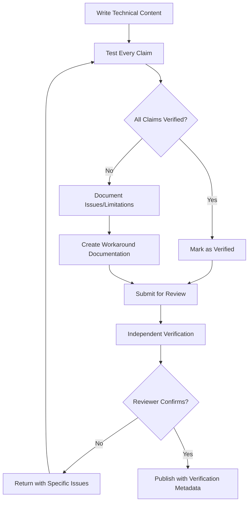

# Verification-Embedded Content Strategy

**Comprehensive Strategy for Truth-Driven Documentation Development**

Created: 2025-06-19 with user permission
Purpose: Embed verification requirements directly into content creation workflows

Intent: Prevent documentation drift by making accuracy verification a required step in all content creation, review, and maintenance processes.

## Strategic Framework

### 1. Verification-First Content Development

**Core Principle**: No content is published without explicit verification against the actual codebase.

**Implementation Strategy**:
- All technical content requires proof-of-testing before publication
- Content creators must document their verification process
- Review process includes independent verification of claims
- Content is marked with verification status and dates

### 2. Code-Reality Alignment Process

**Verification Workflow**:


### 3. Content Verification Requirements

**Every piece of technical content must include:**
- **Verification Date**: When claims were last tested
- **Test Environment**: Platform, versions, setup used for testing
- **Success Criteria**: What constitutes "working"
- **Known Issues**: Documented limitations or workarounds
- **Update Triggers**: What changes require re-verification

## Implementation Workflows

### For Tutorial Content

**Step 1: Environment Preparation**
```bash
# Create clean test environment
mkdir tutorial_verification
cd tutorial_verification
# Document exact environment setup
python3 --version > environment_info.txt
pip list >> environment_info.txt
```

**Step 2: Execute Every Step**
```bash
# Run tutorial steps exactly as documented
# Log all outputs and errors
python3 tutorial_step1.py 2>&1 | tee step1_output.log
python3 tutorial_step2.py 2>&1 | tee step2_output.log
```

**Step 3: Document Results**
```markdown
## Verification Report
- **Date**: 2025-06-19
- **Environment**: Ubuntu 22.04, Python 3.9.16
- **Status**: ✅ All steps working / ⚠️ Issues found / ❌ Tutorial broken
- **Issues Found**: 
  - Step 3 requires manual file setup (not documented)
  - Import path needs sys.path modification
- **Workarounds**: [Document specific solutions]
```

### For API Documentation

**Verification Requirements**:
1. **Function Signature Accuracy**: Verify parameters and return types
2. **Example Code Testing**: Run all code examples
3. **Error Handling**: Test and document failure modes
4. **Performance Claims**: Measure and verify any performance statements

**Template**:
```python
def verify_api_function():
    """
    Verification test for documented API function
    
    Tests:
    - Function signature matches documentation
    - Examples work as documented
    - Error cases behave as described
    """
    # Test actual function
    try:
        result = api_function(param1="test")
        assert result is not None, "Function should return non-None result"
        print("✅ API function verified working")
    except Exception as e:
        print(f"❌ API function failed: {e}")
        return False
    return True
```

### For Installation Guides

**Fresh Environment Testing**:
```bash
# Test installation from completely fresh state
docker run -it ubuntu:22.04 bash
# OR use fresh VM/container

# Follow installation steps exactly as documented
# Document any missing prerequisites
# Record installation time and any errors
```

**Verification Checklist**:
- [ ] Fresh environment installation tested
- [ ] All dependencies explicitly listed
- [ ] Installation time measured and documented
- [ ] Common failure modes identified and documented
- [ ] Success verification steps tested

## Quality Assurance Framework

### Automated Verification

**CI/CD Integration**:
```yaml
# .github/workflows/docs-verification.yml
name: Documentation Verification
on: [push, pull_request]

jobs:
  verify-docs:
    runs-on: ubuntu-latest
    steps:
    - uses: actions/checkout@v3
    
    - name: Test Python Examples
      run: |
        # Extract and test all Python code blocks from docs
        python3 scripts/test_documentation_examples.py
        
    - name: Verify File Paths
      run: |
        # Check all file paths mentioned in documentation
        python3 scripts/verify_documentation_paths.py
        
    - name: Test Command Examples
      run: |
        # Test all bash commands in documentation
        bash scripts/test_documentation_commands.sh
```

**Documentation Testing Script Example**:
```python
#!/usr/bin/env python3
"""
Automated documentation verification script.
Extracts code examples from markdown and tests them.
"""

import re
import subprocess
import markdown
import os
import sys

def extract_code_blocks(markdown_file):
    """Extract Python code blocks from markdown file"""
    with open(markdown_file, 'r') as f:
        content = f.read()
    
    # Find Python code blocks
    pattern = r'```python\n(.*?)\n```'
    code_blocks = re.findall(pattern, content, re.DOTALL)
    return code_blocks

def test_code_block(code, test_id):
    """Test a single code block"""
    try:
        # Write code to temporary file
        with open(f'temp_test_{test_id}.py', 'w') as f:
            f.write(code)
        
        # Execute code
        result = subprocess.run(['python3', f'temp_test_{test_id}.py'], 
                              capture_output=True, text=True, timeout=30)
        
        if result.returncode == 0:
            print(f"✅ Code block {test_id} passed")
            return True
        else:
            print(f"❌ Code block {test_id} failed:")
            print(f"Error: {result.stderr}")
            return False
            
    except Exception as e:
        print(f"❌ Code block {test_id} exception: {e}")
        return False
    finally:
        # Cleanup
        if os.path.exists(f'temp_test_{test_id}.py'):
            os.remove(f'temp_test_{test_id}.py')

def main():
    docs_dir = 'docs'
    total_tests = 0
    passed_tests = 0
    
    for root, dirs, files in os.walk(docs_dir):
        for file in files:
            if file.endswith('.md'):
                filepath = os.path.join(root, file)
                code_blocks = extract_code_blocks(filepath)
                
                for i, code in enumerate(code_blocks):
                    total_tests += 1
                    test_id = f"{file}_{i}"
                    if test_code_block(code, test_id):
                        passed_tests += 1
    
    print(f"\nResults: {passed_tests}/{total_tests} tests passed")
    if passed_tests < total_tests:
        sys.exit(1)

if __name__ == "__main__":
    main()
```

### Manual Review Process

**Review Checklist for Technical Content**:
- [ ] **Independent Verification**: Reviewer tests all claims independently
- [ ] **Environment Documentation**: Testing environment clearly specified
- [ ] **Error Reproduction**: Reviewer can reproduce any documented issues
- [ ] **Completeness**: All steps needed for success are documented
- [ ] **Accuracy**: Claims match actual implementation behavior

**Reviewer Responsibilities**:
1. **Test in Fresh Environment**: Use clean setup to verify instructions
2. **Document Verification Process**: Record testing steps and results
3. **Challenge Claims**: Question any unsupported statements
4. **Test Edge Cases**: Try to break documented procedures
5. **Verify Updates**: Ensure content matches current code version

## Content Lifecycle Management

### Creation Phase
1. **Research**: Understand actual implementation before writing
2. **Test**: Verify all claims against real code
3. **Document**: Record verification process and results
4. **Review**: Independent verification by another team member

### Maintenance Phase
1. **Automated Monitoring**: CI/CD tests catch broken examples
2. **Regular Audits**: Quarterly manual verification of high-impact content
3. **User Feedback Integration**: Track and respond to user-reported issues
4. **Code Change Triggers**: Automatic re-verification when code changes

### Update Phase
1. **Impact Assessment**: Identify all content affected by code changes
2. **Re-verification**: Test all affected content against new implementation
3. **Issue Documentation**: Record any new limitations or workarounds
4. **User Communication**: Notify users of significant changes

## Accountability Framework

### Content Creator Responsibilities
- **Verification Documentation**: Provide proof of testing for all claims
- **Issue Reporting**: Document any limitations or workarounds found
- **Update Tracking**: Monitor relevant code changes that affect content
- **User Support**: Respond to issues with documented content

### Reviewer Responsibilities
- **Independent Testing**: Verify claims without relying on creator's tests
- **Process Validation**: Ensure verification process was followed correctly
- **Quality Standards**: Enforce truth-first writing standards
- **Continuous Improvement**: Identify gaps in verification process

### Team Responsibilities
- **Process Enforcement**: Ensure verification requirements are met
- **Tool Development**: Create automated testing for documentation
- **User Feedback**: Collect and analyze user experience with documentation
- **Accuracy Metrics**: Track and improve documentation accuracy over time

## Success Metrics

### Quantitative Measures
- **Verification Coverage**: % of technical claims with documented verification
- **Test Pass Rate**: % of automated documentation tests passing
- **User Success Rate**: % of users successfully completing documented procedures
- **Issue Response Time**: Speed of fixing documented inaccuracies
- **Content Freshness**: % of content verified within acceptable timeframes

### Qualitative Measures
- **User Confidence**: Survey responses about documentation trustworthiness
- **Developer Experience**: Ease of maintaining accurate documentation
- **Community Feedback**: External contributions and issue reports
- **Onboarding Success**: New user experience with documentation

## Risk Management

### Common Documentation Drift Patterns
1. **Path Changes**: File/directory restructuring breaks documented paths
2. **API Changes**: Function signatures change without documentation updates
3. **Environment Changes**: New dependencies or version requirements
4. **Feature Deprecation**: Old features removed but documentation remains
5. **Performance Changes**: Documented performance claims become outdated

### Mitigation Strategies
1. **Automated Path Validation**: Regular checking of all documented paths
2. **API Signature Monitoring**: Automated detection of API changes
3. **Environment Documentation**: Explicit version and dependency tracking
4. **Deprecation Tracking**: Systematic review of deprecated feature documentation
5. **Performance Benchmarking**: Regular validation of performance claims

This verification-embedded strategy ensures that documentation maintains accuracy through systematic testing, review, and maintenance processes that are integrated into the normal development workflow.