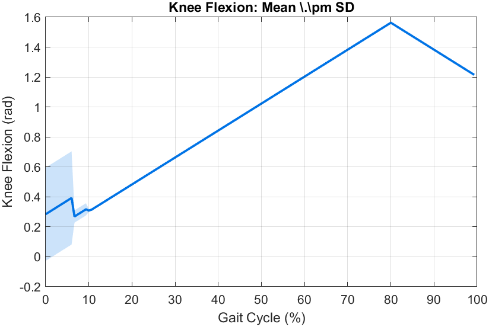
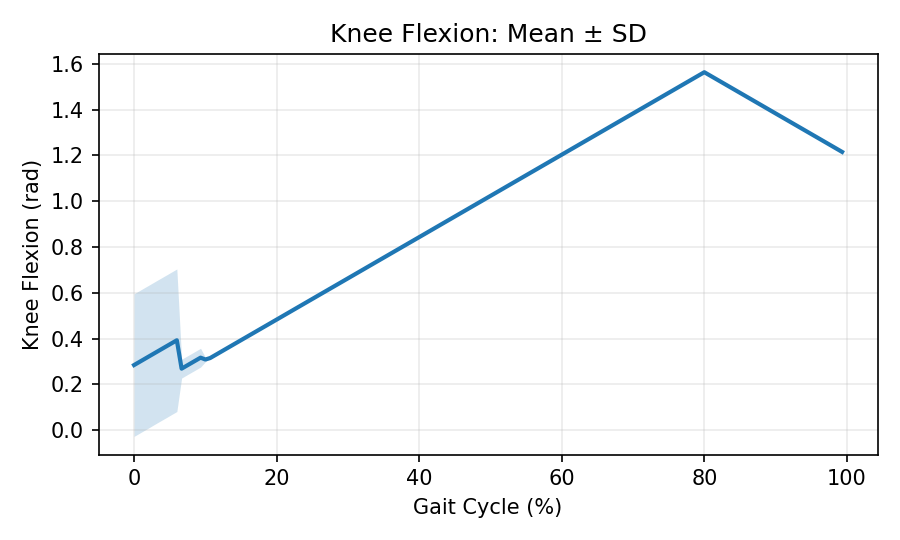
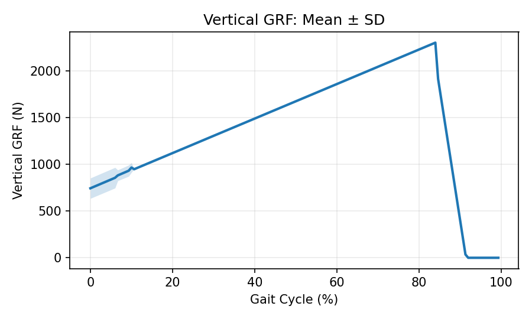
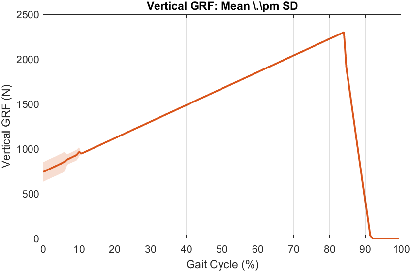

# Tutorials

Do the tasks below. Pick your environment once and the page follows your choice.

Select your language:

<div class="code-mode-buttons">
  <a href="#" class="code-mode-button" data-lang="python">Python</a>
  <a href="#" class="code-mode-button" data-lang="matlab">MATLAB</a>
  
</div>

## Test Dataset

Use this small sample to try the tutorials quickly:

[Download Example CSV (1000 rows)](../../contributing/locohub_example_data.csv){ .md-button .md-button--primary download="locohub_example_data.csv" }

Or use the full parquet datasets linked on the homepage.

## Environment

<div class="code-lang code-lang-python" markdown>

- Version: 3.9–3.12 (tested 3.11)
- Packages:
  
  - `pandas >= 1.5`
  - `numpy >= 1.23`
  - `matplotlib >= 3.6`
  - `pyarrow >= 12`

</div>

<div class="code-lang code-lang-matlab" markdown>

- Version: R2021b+ (tested R2023b)
- Functions used:
  
  - `parquetread`
  - `exportgraphics` (optional)

</div>

## 1) Load Data

=== "Raw"
    <div class="code-lang code-lang-python">
    
    ```python
    import pandas as pd
    import numpy as np
    
    # Load phase-indexed dataset (150 samples per cycle)
    df = pd.read_parquet('umich_2021_phase.parquet')
    print(df.shape)
    
    # Inspect structure
    print(df.columns.tolist()[:10])
    print(df.dtypes.head())
    
    # Filter to one subject + task
    subset = df[(df['task'] == 'level_walking') & (df['subject'] == 'UM21_AB01')]
    
    # Extract arrays for analysis/plotting
    phase = subset['phase_ipsi'].to_numpy()
    knee  = subset['knee_flexion_angle_ipsi_rad'].to_numpy()
    ```
    
    </div>
    <div class="code-lang code-lang-matlab">
    
    ```matlab
    % Load phase-indexed dataset (150 samples per cycle)
    T = parquetread('umich_2021_phase.parquet');
    size(T)  % rows x columns
    
    % Inspect structure
    T.Properties.VariableNames(1:10)
    varfun(@class, T(1,:), 'OutputFormat','table')
    
    % Filter to one subject + task
    subset = T(T.task == "level_walking" & T.subject == "UM21_AB01", :);
    
    % Extract arrays for analysis/plotting
    phase = subset.phase_ipsi;
    knee  = subset.knee_flexion_angle_ipsi_rad;
    ```
    
    </div>

=== "Library"
    <div class="code-lang code-lang-python">
    
    ```python
    from user_libs.python.locomotion_data import LocomotionData
    
    data = LocomotionData('umich_2021_phase.parquet')
    print(data.shape)            # rows, columns
    print(data.get_variables()[:10])
    
    # Filter and extract cycles (3D array: n_cycles x 150 x n_features)
    subset = data.filter(task='level_walking', subjects=['UM21_AB01'])
    cycles, features = subset.get_cycles('UM21_AB01', 'level_walking')
    
    # Convenience arrays for a single feature
    knee_idx = features.index('knee_flexion_angle_ipsi_rad')
    knee_cycles = cycles[:, :, knee_idx]
    ```
    
    </div>
    <div class="code-lang code-lang-matlab">
    
    ```matlab
    addpath('user_libs/matlab');
    loco  = LocomotionData('umich_2021_phase.parquet');
    [rows, cols] = loco.getShape()
    
    % Filter and extract cycles (n_cycles x 150 x n_features)
    level = loco.filterTask('level_walking').filterSubject('UM21_AB01');
    [cycles, features] = level.getCycles('UM21_AB01', 'level_walking');
    
    % Convenience arrays for a single feature
    kneeIdx = find(strcmp(features,'knee_flexion_angle_ipsi_rad'));
    kneeCycles = squeeze(cycles(:, :, kneeIdx));
    ```
    
    </div>

## 2) Filter / Subset

=== "Raw"
    <div class="code-lang code-lang-python">
    
    ```python
    import pandas as pd
    
    # Load dataset
    df = pd.read_parquet('umich_2021_phase.parquet')

    # Filter by subject + task + columns
    cols = ['subject','task','phase_ipsi','knee_flexion_angle_ipsi_rad']
    subset = df.loc[(df.task=='level_walking') & (df.subject=='UM21_AB01'), cols]
    
    # Multiple tasks
    walking = df[df['task'].isin(['level_walking','incline_walking','decline_walking'])]
    
    # First N cycles per subject-task
    def first_n_cycles(x, n=5):
        return x[x['cycle_id'].isin(x['cycle_id'].unique()[:n])]
    first5 = df.groupby(['subject','task'], group_keys=False).apply(first_n_cycles, n=5)
    ```
    
    </div>
    <div class="code-lang code-lang-matlab">
    
    ```matlab
    % Load dataset
    T = parquetread('umich_2021_phase.parquet');

    % Filter by subject + task + columns
    cols = {'subject','task','phase_ipsi','knee_flexion_angle_ipsi_rad'};
    mask = T.task=="level_walking" & T.subject=="UM21_AB01";
    subset = T(mask, cols);
    
    % Multiple tasks
    maskWalk = ismember(T.task, {"level_walking","incline_walking","decline_walking"});
    walking = T(maskWalk, :);
    
    % First N cycles per subject-task
    % (Example using cycle_id if available)
    % See detailed MATLAB tutorial for grouping utilities.
    ```
    
    </div>

=== "Library"
    <div class="code-lang code-lang-python">
    
    ```python
    from user_libs.python.locomotion_data import LocomotionData
    data = LocomotionData('umich_2021_phase.parquet')

    # Filter by subject + task + features
    subset = data.filter(task='level_walking', subjects=['UM21_AB01'],
                         features=['knee_flexion_angle_ipsi_rad'])
    
    # Multiple tasks
    walking = data.filter(tasks=['level_walking','incline_walking','decline_walking'])
    
    # First N cycles per subject-task
    first5 = data.get_first_n_cycles(n=5)
    ```
    
    </div>
    <div class="code-lang code-lang-matlab">
    
    ```matlab
    addpath('user_libs/matlab');
    loco = LocomotionData('umich_2021_phase.parquet');
    level = loco.filterTask('level_walking').filterSubject('UM21_AB01');

    % Filter by subject + task + features
    subset = level.selectFeatures({'knee_flexion_angle_ipsi_rad'});
    
    % Multiple tasks (re-load or filter from loco)
    walking = loco.filterTasks({"level_walking","incline_walking","decline_walking"});
    
    % First N cycles per subject-task
    first5 = loco.getFirstNCycles(5);
    ```
    
    </div>

## 3) Visualize

=== "Raw"
    <div class="code-lang code-lang-python">
    
    ```python
    import pandas as pd
    import numpy as np
    import matplotlib.pyplot as plt
    
    # Load + filter
    df = pd.read_parquet('umich_2021_phase.parquet')
    subset = df[(df['task'] == 'level_walking') & (df['subject'] == 'UM21_AB01')]
    
    # Mean ± SD band over phase
    mean_knee = subset.groupby('phase_ipsi')['knee_flexion_angle_ipsi_rad'].mean().to_numpy()
    std_knee  = subset.groupby('phase_ipsi')['knee_flexion_angle_ipsi_rad'].std().to_numpy()
    phase100  = subset['phase_ipsi'].unique()
    
    plt.figure(figsize=(6,4))
    plt.fill_between(phase100, mean_knee-std_knee, mean_knee+std_knee, alpha=0.2)
    plt.plot(phase100, mean_knee, label='Knee Flex (rad)')
    plt.xlabel('Gait Cycle (%)'); plt.ylabel('Knee Flexion (rad)'); plt.legend(); plt.tight_layout(); plt.show()
    ```
    
    </div>
    <div class="code-lang code-lang-matlab">
    
    ```matlab
    % Load + filter
    T = parquetread('umich_2021_phase.parquet');
    subset = T(T.task=="level_walking" & T.subject=="UM21_AB01", :);
    
    % Mean ± SD band over phase
    [g,~,idx] = unique(subset.phase_ipsi);
    mean_knee = splitapply(@mean, subset.knee_flexion_angle_ipsi_rad, idx);
    std_knee  = splitapply(@std,  subset.knee_flexion_angle_ipsi_rad, idx);
    
    figure('Position',[100,100,600,380]); hold on
    fill([g; flipud(g)], [mean_knee-std_knee; flipud(mean_knee+std_knee)], [0 0.45 0.9], 'FaceAlpha',0.2,'EdgeColor','none');
    plot(g, mean_knee, 'Color',[0 0.45 0.9], 'LineWidth',1.8)
    xlabel('Gait Cycle (%)'); ylabel('Knee Flexion (rad)'); grid on; box on; hold off
    ```
    
    </div>

=== "Library"
    <div class="code-lang code-lang-python">
    
    ```python
    from user_libs.python.locomotion_data import LocomotionData
    data = LocomotionData('umich_2021_phase.parquet')
    subset = data.filter(task='level_walking', subjects=['UM21_AB01'])

    # Built-in phase plotter (adds mean ± SD by default)
    subset.plot_phase_patterns('UM21_AB01','level_walking',['knee_flexion_angle_ipsi_rad'])
   
    # Task comparison helper
    subset.plot_task_comparison('UM21_AB01',['level_walking','incline_walking'],['knee_flexion_angle_ipsi_rad'])
    ```
    
    </div>
    <div class="code-lang code-lang-matlab">
    
    ```matlab
    addpath('user_libs/matlab');
    loco = LocomotionData('umich_2021_phase.parquet');
    level = loco.filterTask('level_walking').filterSubject('UM21_AB01');
    
    % Built-in phase plotter (adds mean ± SD)
    level.plotPhasePatterns('UM21_AB01','level_walking',{'knee_flexion_angle_ipsi_rad'});
    
    % Task comparison helper
    level.plotTaskComparison('UM21_AB01', {"level_walking","incline_walking"}, {'knee_flexion_angle_ipsi_rad'});
    ```
    
    </div>

## 4) Plotting Results with Expected Outputs

Use the sample CSV: `docs/contributing/locohub_example_data.csv`.


 

=== "Raw"
    <div class="code-lang code-lang-python">
    
    ```python
    import pandas as pd
    import matplotlib.pyplot as plt

    df = pd.read_csv('docs/contributing/locohub_example_data.csv')
    agg = df.groupby('phase_ipsi')['knee_flexion_angle_ipsi_rad'].agg(['mean','std']).reset_index()

    plt.figure(figsize=(6,3.6))
    plt.fill_between(agg['phase_ipsi'], agg['mean']-agg['std'], agg['mean']+agg['std'], alpha=0.2)
    plt.plot(agg['phase_ipsi'], agg['mean'], lw=2)
    plt.xlabel('Gait Cycle (%)'); plt.ylabel('Knee Flexion (rad)'); plt.tight_layout(); plt.show()
    ```
    
    </div>
    <div class="code-lang code-lang-matlab">
    
    ```matlab
    T = readtable('docs/contributing/locohub_example_data.csv');
    [g,~,idx] = unique(T.phase_ipsi);
    mean_knee = splitapply(@mean, T.knee_flexion_angle_ipsi_rad, idx);
    std_knee  = splitapply(@std,  T.knee_flexion_angle_ipsi_rad, idx);
    
    figure('Position',[100,100,600,360]); hold on
    fill([g; flipud(g)], [mean_knee-std_knee; flipud(mean_knee+std_knee)], [0 0.45 0.9], 'FaceAlpha',0.2,'EdgeColor','none');
    plot(g, mean_knee, 'Color',[0 0.45 0.9], 'LineWidth',1.8)
    xlabel('Gait Cycle (%)'); ylabel('Knee Flexion (rad)'); grid on; box on; hold off
    ```
    
    Expected output (MATLAB):
    
    
    
    </div>

=== "Library"
    <div class="code-lang code-lang-python">
    
    ```python
    from user_libs.python.locomotion_data import LocomotionData
    data = LocomotionData('converted_datasets/umich_2021_phase.parquet')
    subset = data.filter(task='level_walking', subjects=['UM21_AB01'])
    subset.plot_phase_patterns('UM21_AB01','level_walking',['knee_flexion_angle_ipsi_rad'])
    ```
    
    </div>
    <div class="code-lang code-lang-matlab">
    
    ```matlab
    addpath('user_libs/matlab');
    loco = LocomotionData('converted_datasets/umich_2021_phase.parquet');
    level = loco.filterTask('level_walking').filterSubject('UM21_AB01');
    level.plotPhasePatterns('UM21_AB01','level_walking',{'knee_flexion_angle_ipsi_rad'});
    ```
    
    Expected output (MATLAB):
    
    
    
    </div>

Expected outputs:

<div class="code-lang code-lang-python" markdown>





</div>

<div class="code-lang code-lang-matlab" markdown>




</div>

## 5) Parse `task_info` into Columns

=== "Raw"
    <div class="code-lang code-lang-python">
    
    ```python
    import pandas as pd
    
    df = pd.read_csv('docs/contributing/locohub_example_data.csv')
    
    def parse_task_info_row(s: str) -> dict:
        if pd.isna(s) or not isinstance(s, str) or not s:
            return {}
        parts = [p.strip() for p in s.split(',') if p.strip()]
        out = {}
        for p in parts:
            if ':' in p:
                k, v = p.split(':', 1)
                k = k.strip(); v = v.strip()
                try:
                    out[k] = float(v)
                except ValueError:
                    out[k] = v
        return out
    
    parsed = df['task_info'].apply(parse_task_info_row)
    parsed_df = pd.json_normalize(parsed)
    df_out = pd.concat([df.drop(columns=['task_info']), parsed_df], axis=1)
    print(df_out[['subject','task','speed_m_s','incline_deg']].head())
    ```
    
    </div>
    <div class="code-lang code-lang-matlab">
    
    ```matlab
    T = readtable('docs/contributing/locohub_example_data.csv');
    speed_m_s = nan(height(T),1);
    incline_deg = nan(height(T),1);
    for i = 1:height(T)
        s = string(T.task_info{i});
        if strlength(s) == 0, continue; end
        parts = split(s, ',');
        for p = parts'
            kv = split(strip(p), ':');
            if numel(kv) ~= 2, continue; end
            key = strtrim(kv(1)); val = strtrim(kv(2));
            switch key
                case "speed_m_s", speed_m_s(i) = str2double(val);
                case "incline_deg", incline_deg(i) = str2double(val);
            end
        end
    end
    T.speed_m_s = speed_m_s; T.incline_deg = incline_deg;
    head(T(:, {'subject','task','speed_m_s','incline_deg'}))
    ```
    
    </div>

=== "Library"
    <div class="code-lang code-lang-python">
    
    ```python
    from user_libs.python.locomotion_data import LocomotionData
    import pandas as pd
    
    data = LocomotionData('converted_datasets/umich_2021_phase.parquet')
    df = data.df  # Access underlying DataFrame
    
    def parse_task_info_row(s: str) -> dict:
        if pd.isna(s) or not isinstance(s, str) or not s:
            return {}
        parts = [p.strip() for p in s.split(',') if p.strip()]
        out = {}
        for p in parts:
            if ':' in p:
                k, v = p.split(':', 1)
                k = k.strip(); v = v.strip()
                try:
                    out[k] = float(v)
                except ValueError:
                    out[k] = v
        return out
    parsed = df['task_info'].apply(parse_task_info_row)
    df_out = pd.concat([df.drop(columns=['task_info']), pd.json_normalize(parsed)], axis=1)
    ```
    
    </div>
    <div class="code-lang code-lang-matlab">
    
    ```matlab
    addpath('user_libs/matlab');
    loco = LocomotionData('converted_datasets/umich_2021_phase.parquet');
    % If library exposes a table, use it; otherwise, use the Raw approach
    if ismethod(loco, 'asTable')
        T = loco.asTable();
    else
        % Fallback: read raw parquet
        T = parquetread('converted_datasets/umich_2021_phase.parquet');
    end
    % Reuse parsing loop from Raw example to derive columns
    % ... (same as above)
    ```
    
    </div>

## 6) Merge Datasets

=== "Raw"
    <div class="code-lang code-lang-python">
    
    ```python
    import pandas as pd
    
    umich = pd.read_parquet('converted_datasets/umich_2021_phase.parquet')
    gtech = pd.read_parquet('converted_datasets/gtech_2021_phase.parquet')
    
    # Harmonize key columns if needed
    common = ['subject','task','phase_ipsi']
    keepU = [c for c in umich.columns if ('knee_flexion' in c) or (c in common)]
    keepG = [c for c in gtech.columns if ('knee_flexion' in c) or (c in common)]
    umich = umich[keepU]
    gtech = gtech[keepG]
    
    merged = pd.concat([umich, gtech], ignore_index=True, sort=False)
    print(merged.shape)
    ```
    
    </div>
    <div class="code-lang code-lang-matlab">
    
    ```matlab
    U = parquetread('converted_datasets/umich_2021_phase.parquet');
    G = parquetread('converted_datasets/gtech_2021_phase.parquet');
    
    common = {'subject','task','phase_ipsi'};
    colsU = [common, U.Properties.VariableNames(contains(U.Properties.VariableNames,'knee_flexion'))];
    colsG = [common, G.Properties.VariableNames(contains(G.Properties.VariableNames,'knee_flexion'))];
    U = U(:, intersect(colsU, U.Properties.VariableNames));
    G = G(:, intersect(colsG, G.Properties.VariableNames));
    
    M = [U; G];
    size(M)
    ```
    
    </div>

=== "Library"
    <div class="code-lang code-lang-python">
    
    ```python
    from user_libs.python.locomotion_data import LocomotionData
    import pandas as pd
    
    umich = LocomotionData('converted_datasets/umich_2021_phase.parquet').df
    gtech = LocomotionData('converted_datasets/gtech_2021_phase.parquet').df
    common = ['subject','task','phase_ipsi']
    keepU = [c for c in umich.columns if ('knee_flexion' in c) or (c in common)]
    keepG = [c for c in gtech.columns if ('knee_flexion' in c) or (c in common)]
    merged = pd.concat([umich[keepU], gtech[keepG]], ignore_index=True, sort=False)
    print(merged.shape)
    ```
    
    </div>
    <div class="code-lang code-lang-matlab">
    
    ```matlab
    addpath('user_libs/matlab');
    U = LocomotionData('converted_datasets/umich_2021_phase.parquet');
    G = LocomotionData('converted_datasets/gtech_2021_phase.parquet');
    if ismethod(U,'asTable') && ismethod(G,'asTable')
        Tu = U.asTable();
        Tg = G.asTable();
    else
        Tu = parquetread('converted_datasets/umich_2021_phase.parquet');
        Tg = parquetread('converted_datasets/gtech_2021_phase.parquet');
    end
    common = {'subject','task','phase_ipsi'};
    colsU = [common, Tu.Properties.VariableNames(contains(Tu.Properties.VariableNames,'knee_flexion'))];
    colsG = [common, Tg.Properties.VariableNames(contains(Tg.Properties.VariableNames,'knee_flexion'))];
    Tu = Tu(:, intersect(colsU, Tu.Properties.VariableNames));
    Tg = Tg(:, intersect(colsG, Tg.Properties.VariableNames));
    M = [Tu; Tg];
    size(M)
    ```
    
    </div>

## 7) Cycle Analysis

=== "Raw"
    <div class="code-lang code-lang-python">
    
    ```python
    import pandas as pd
    import numpy as np
    
    df = pd.read_parquet('umich_2021_phase.parquet')
    sub = df[(df['task']=='level_walking') & (df['subject']=='UM21_AB01')]
    phase = sub['phase_ipsi'].to_numpy()
    knee  = sub['knee_flexion_angle_ipsi_rad'].to_numpy()
    
    # ROM for a single stride sequence (example)
    rom = float(np.nanmax(knee) - np.nanmin(knee))
    
    # Peak timing in the cycle
    peak_idx = int(np.nanargmax(knee))
    peak_phase = float(phase[peak_idx])
    print({'rom': rom, 'peak_phase_ipsi': peak_phase})
    ```
    
    </div>
    <div class="code-lang code-lang-matlab">
    
    ```matlab
    % Load + filter
    T = parquetread('umich_2021_phase.parquet');
    sub = T(T.task=="level_walking" & T.subject=="UM21_AB01", :);
    phase = sub.phase_ipsi; knee = sub.knee_flexion_angle_ipsi_rad;
    
    % ROM and peak timing
    rom = max(knee) - min(knee);
    [~,peakIdx] = max(knee);
    peakPhase = phase(peakIdx);
    fprintf('ROM=%.3f, Peak at %.2f%%\n', rom, peakPhase);
    ```
    
    </div>

=== "Library"
    <div class="code-lang code-lang-python">
    
    ```python
    from user_libs.python.locomotion_data import LocomotionData
    data = LocomotionData('umich_2021_phase.parquet')
    subset = data.filter(task='level_walking', subjects=['UM21_AB01'])
    
    # Summary statistics and ROM
    stats = subset.get_summary_statistics('UM21_AB01','level_walking')
    rom   = subset.calculate_rom('UM21_AB01','level_walking')
    
    # Outlier cycles based on deviation
    outliers = subset.find_outlier_cycles('UM21_AB01','level_walking', ['knee_flexion_angle_ipsi_rad'])
    ```
    
    </div>
    <div class="code-lang code-lang-matlab">
    
    ```matlab
    addpath('user_libs/matlab');
    loco = LocomotionData('umich_2021_phase.parquet');
    level = loco.filterTask('level_walking').filterSubject('UM21_AB01');
    
    % Summary statistics and ROM
    stats = level.getSummaryStatistics('UM21_AB01','level_walking');
    rom   = level.calculateROM('UM21_AB01','level_walking');
    
    % Outlier cycles
    outliers = level.findOutlierCycles('UM21_AB01','level_walking', {'knee_flexion_angle_ipsi_rad'});
    ```
    
    </div>

## 8) Group Analysis

=== "Raw"
    <div class="code-lang code-lang-python">
    
    ```python
    import pandas as pd
    import numpy as np
    
    df = pd.read_parquet('umich_2021_phase.parquet')
    subset = df[(df['task']=='level_walking') & (df['subject']=='UM21_AB01')]
    
    # Group mean across all cycles of the subset
    mean_knee = subset.groupby('phase_ipsi')['knee_flexion_angle_ipsi_rad'].mean().to_numpy()
    std_knee  = subset.groupby('phase_ipsi')['knee_flexion_angle_ipsi_rad'].std().to_numpy()
    ```
    
    </div>
    <div class="code-lang code-lang-matlab">
    
    ```matlab
    T = parquetread('umich_2021_phase.parquet');
    subset = T(T.task=="level_walking" & T.subject=="UM21_AB01", :);
    
    % Group mean across all cycles of the subset
    [g,~,idx] = unique(subset.phase_ipsi);
    mean_knee = splitapply(@mean, subset.knee_flexion_angle_ipsi_rad, idx);
    std_knee  = splitapply(@std,  subset.knee_flexion_angle_ipsi_rad, idx);
    ```
    
    </div>

=== "Library"
    <div class="code-lang code-lang-python">
    
    ```python
    from user_libs.python.locomotion_data import LocomotionData
    data = LocomotionData('umich_2021_phase.parquet')
    subset = data.filter(task='level_walking', subjects=['UM21_AB01'])
    
    mean_patterns = subset.get_mean_patterns('UM21_AB01','level_walking')
    mean_knee = mean_patterns['knee_flexion_angle_ipsi_rad']['mean']
    std_knee  = mean_patterns['knee_flexion_angle_ipsi_rad']['std']
    ```
    
    </div>
    <div class="code-lang code-lang-matlab">
    
    ```matlab
    addpath('user_libs/matlab');
    loco = LocomotionData('umich_2021_phase.parquet');
    level = loco.filterTask('level_walking').filterSubject('UM21_AB01');
    patterns = level.getMeanPatterns('UM21_AB01','level_walking');
    mean_knee = patterns('knee_flexion_angle_ipsi_rad').mean;
    std_knee  = patterns('knee_flexion_angle_ipsi_rad').std;
    ```
    
    </div>

## 9) Export Figures and Tables

=== "Raw"
    <div class="code-lang code-lang-python">
    
    ```python
    import pandas as pd
    import matplotlib.pyplot as plt
    
    df = pd.read_parquet('umich_2021_phase.parquet')
    sub = df[(df['task']=='level_walking') & (df['subject']=='UM21_AB01')]
    phase = sub['phase_ipsi']; knee = sub['knee_flexion_angle_ipsi_rad']
    
    fig, ax = plt.subplots(figsize=(5,3.5))
    ax.plot(phase, knee, lw=1.8)
    ax.set(xlabel='Gait Cycle (%)', ylabel='Knee Flexion (rad)')
    fig.tight_layout(); fig.savefig('figure.png', dpi=300)
    
    # Export summary table
    summary = sub.groupby('phase_ipsi')['knee_flexion_angle_ipsi_rad'].agg(['mean','std']).reset_index()
    summary.to_csv('summary_knee.csv', index=False)
    ```
    
    </div>
    <div class="code-lang code-lang-matlab">
    
    ```matlab
    T = parquetread('umich_2021_phase.parquet');
    sub = T(T.task=="level_walking" & T.subject=="UM21_AB01", :);
    phase = sub.phase_ipsi; knee = sub.knee_flexion_angle_ipsi_rad;
    set(gcf,'Position',[100,100,520,360]);
    plot(phase, knee, 'LineWidth',1.8);
    xlabel('Gait Cycle (%)'); ylabel('Knee Flexion (rad)'); grid on;
    print('-dpng','-r300','figure.png');
    
    % Export summary table
    [g,~,idx] = unique(sub.phase_ipsi);
    mean_knee = splitapply(@mean, sub.knee_flexion_angle_ipsi_rad, idx);
    std_knee  = splitapply(@std,  sub.knee_flexion_angle_ipsi_rad, idx);
    summary = table(g, mean_knee, std_knee, 'VariableNames',{'phase_ipsi','mean','std'});
    writetable(summary, 'summary_knee.csv');
    ```
    
    </div>

=== "Library"
    <div class="code-lang code-lang-python">
    
    ```python
    # Library plotting exists, but fine-grained figure control is often easier with raw plotting.
    from user_libs.python.locomotion_data import LocomotionData
    data = LocomotionData('umich_2021_phase.parquet')
    subset = data.filter(task='level_walking', subjects=['UM21_AB01'])
    stats = subset.get_summary_statistics('UM21_AB01','level_walking')
    
    # Export stats
    import pandas as pd
    pd.DataFrame(stats).to_csv('summary_stats.csv', index=False)
    ```
    
    </div>
    <div class="code-lang code-lang-matlab">
    
    ```matlab
    % Use library for quick stats export
    addpath('user_libs/matlab');
    loco = LocomotionData('umich_2021_phase.parquet');
    level = loco.filterTask('level_walking').filterSubject('UM21_AB01');
    stats = level.getSummaryStatistics('UM21_AB01','level_walking');
    % Convert to table and save as needed
    ```
    
    </div>

## 10) Save Filtered Subset

=== "Raw"
    <div class="code-lang code-lang-python">
    
    ```python
    import pandas as pd
    
    df = pd.read_parquet('umich_2021_phase.parquet')
    filt = df[(df['task']=='level_walking') & (df['subject']=='UM21_AB01')]
    
    # Save CSV (portable)
    filt.to_csv('filtered_level_walking_UM21_AB01.csv', index=False)
    
    # Save Parquet (compact; requires pyarrow)
    # pip install pyarrow
    filt.to_parquet('filtered_level_walking_UM21_AB01.parquet', index=False)
    ```
    
    </div>
    <div class="code-lang code-lang-matlab">
    
    ```matlab
    T = parquetread('umich_2021_phase.parquet');
    filt = T(T.task=="level_walking" & T.subject=="UM21_AB01", :);
    
    % Save CSV
    writetable(filt, 'filtered_level_walking_UM21_AB01.csv');
    
    % Save Parquet (R2022a+)
    parquetwrite('filtered_level_walking_UM21_AB01.parquet', filt);
    ```
    
    </div>

=== "Library"
    <div class="code-lang code-lang-python">
    
    ```python
    from user_libs.python.locomotion_data import LocomotionData
    data = LocomotionData('umich_2021_phase.parquet')
    subset = data.filter(task='level_walking', subjects=['UM21_AB01'])
    
    # Access underlying DataFrame then save
    df = subset.df
    df.to_csv('filtered_level_walking_UM21_AB01.csv', index=False)
    df.to_parquet('filtered_level_walking_UM21_AB01.parquet', index=False)
    ```
    
    </div>
    <div class="code-lang code-lang-matlab">
    
    ```matlab
    addpath('user_libs/matlab');
    loco = LocomotionData('umich_2021_phase.parquet');
    level = loco.filterTask('level_walking').filterSubject('UM21_AB01');
    
    % If the library exposes a table, save it; otherwise use the raw approach above.
    % tbl = level.asTable(); writetable(tbl, 'filtered_level_walking_UM21_AB01.csv');
    ```
    
    </div>

 

## References

- Data schema: [What the data looks like](../index.md#what-the-data-looks-like)
- Specs: [Technical Specification](../../reference/index.md)
