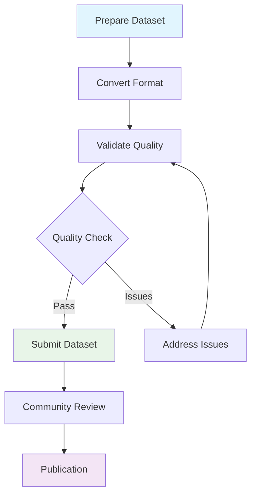

# Contributor Guide Overview

Welcome to the Locomotion Data Standardization project! This guide helps you contribute high-quality biomechanical datasets to our standardized collection.

## Why Contribute?

Your contribution helps advance biomechanics research by:

- **Increasing dataset diversity** - More tasks, populations, and conditions
- **Enabling meta-analyses** - Standardized format allows cross-study comparisons  
- **Accelerating research** - Researchers can focus on analysis vs. data cleaning
- **Building community** - Shared resources benefit the entire field

## Who Can Contribute?

We welcome contributions from:

- **Research laboratories** with locomotion datasets
- **Clinical centers** with patient movement data
- **Sports science groups** with athlete performance data
- **Individual researchers** with specialized task datasets

## Contribution Process Overview



### Phase 1: Preparation
1. **[Dataset Assessment](#dataset-requirements)** - Verify your data meets requirements
2. **[Format Conversion](#format-conversion)** - Transform to standardized structure
3. **[Quality Validation](#quality-validation)** - Ensure biomechanical plausibility

### Phase 2: Submission
4. **[Documentation](#documentation)** - Create dataset description and metadata
5. **[Community Review](#review-process)** - Peer validation of quality and documentation
6. **[Publication](#publication)** - Integration into public collection

## Dataset Requirements

### Minimum Data Requirements

**Essential Variables** (at least one side):
- Hip flexion angle
- Knee flexion angle  
- Ankle flexion angle

**Recommended Variables**:
- Joint moments (hip, knee, ankle)
- Ground reaction forces
- Additional joint angles (abduction, rotation)

**Metadata Requirements**:
- Subject demographics (age, sex, height, weight)
- Task descriptions and conditions
- Data collection protocols
- Equipment specifications

### Data Quality Standards

**Temporal Requirements**:
- Minimum 5 complete gait cycles per task per subject
- Consistent sampling frequency (≥100 Hz recommended)
- Clear gait event identification (heel strikes)

**Biomechanical Plausibility**:
- Joint angles within physiological ranges
- Consistent movement patterns across cycles
- Minimal missing data (<5% per variable)

**Documentation Standards**:
- Clear variable definitions
- Units and coordinate systems specified
- Data collection procedures documented

## Format Conversion

### Supported Input Formats

We provide conversion tools for common formats:

- **C3D files** (motion capture standard)
- **MATLAB .mat files** (lab-specific structures)
- **CSV/Excel files** (tabular data)
- **Custom formats** (with conversion script development)

### Target Format

**Phase-Indexed Dataset** (`dataset_phase.parquet`):
- 150 points per gait cycle (0-100%)
- Standardized variable names
- Consistent units and coordinate systems

**Time-Indexed Dataset** (`dataset_time.parquet`):
- Original sampling frequency preserved
- Time-series structure maintained
- Raw temporal data for specialized analysis

### Conversion Tools

=== "Automated Conversion"

    ```bash
    # Use our conversion pipeline
    python convert_dataset.py \
        --input "your_data_directory/" \
        --format "c3d" \
        --output "standardized_dataset.parquet"
    ```

=== "Custom Conversion"

    ```python
    # Adapt our conversion template
    from locomotion_standardization import DatasetConverter
    
    converter = DatasetConverter()
    converter.load_custom_format("your_data.format")
    converter.apply_naming_convention()
    converter.validate_biomechanics()
    converter.save_parquet("output.parquet")
    ```

## Quality Validation

### Automated Validation

Our validation system checks:

**Structural Validation**:
- Correct number of points per cycle (150 for phase data)
- Required columns present
- Data types and units correct

**Biomechanical Validation**:
- Joint angles within expected ranges
- Movement patterns physiologically plausible
- Consistency across gait cycles

**Statistical Validation**:
- Outlier detection and flagging
- Cross-cycle variability assessment
- Task-appropriate movement characteristics

### Validation Report

Every dataset receives a comprehensive quality report:

```python
# Generate validation report
python validate_dataset.py \
    --dataset "your_dataset.parquet" \
    --generate-plots \
    --output-report "validation_report.html"
```

**Report Contents**:
- Data completeness summary
- Biomechanical plausibility scores
- Visualization of gait patterns
- Outlier identification
- Recommendations for improvement

## Review Process

### Peer Review

**Technical Review**:
- Data quality assessment
- Format compliance verification
- Documentation completeness

**Scientific Review**:
- Biomechanical plausibility evaluation
- Experimental design assessment
- Contribution significance

### Review Criteria

**Data Quality (40%)**:
- Completeness and consistency
- Biomechanical plausibility
- Technical standards compliance

**Documentation Quality (30%)**:
- Clear methodology description
- Complete metadata
- Reproducible procedures

**Scientific Value (30%)**:
- Novel tasks or populations
- Methodological innovations
- Community research potential

## Documentation Standards

### Dataset Documentation Template

```markdown
# Dataset: [Your Dataset Name]

## Overview
- **Laboratory**: [Your Institution]
- **Principal Investigator**: [Name]
- **Data Collection Period**: [Dates]
- **Publication Status**: [Published/Unpublished]

## Participants
- **Sample Size**: N subjects
- **Demographics**: Age, sex, anthropometrics
- **Inclusion/Exclusion Criteria**: [Criteria]

## Experimental Protocol
- **Tasks Performed**: [List and describe]
- **Equipment**: [Motion capture system, force plates]
- **Sampling Frequency**: [Hz]
- **Data Processing**: [Filtering, event detection]

## Variables Included
- **Kinematics**: Joint angles (hip, knee, ankle)
- **Kinetics**: Moments and forces (if available)
- **Coordinate System**: [Convention used]
- **Units**: [Specify for each variable]

## Quality Assessment
- **Validation Results**: [Summary of quality scores]
- **Known Limitations**: [Any data quality issues]
- **Recommended Use Cases**: [Suggested applications]
```

### Metadata Schema

**Required Metadata**:
```json
{
  "dataset_info": {
    "name": "dataset_name",
    "version": "1.0",
    "doi": "10.xxxx/xxxxx",
    "license": "CC-BY-4.0"
  },
  "experimental_design": {
    "tasks": ["level_walking", "incline_walking"],
    "subjects": {
      "count": 20,
      "age_range": [18, 65],
      "demographics": "detailed_description"
    }
  },
  "technical_details": {
    "sampling_frequency": 200,
    "equipment": "Vicon motion capture",
    "coordinate_system": "ISB_recommendations"
  }
}
```

## Support and Resources

### Getting Started
1. **[Dataset Conversion Guide](dataset_conversion/)** - Step-by-step conversion process
2. **[Validation Tutorial](validation_tuning/)** - Understanding quality assessment
3. **[Best Practices](best_practices/)** - Tips for successful contribution

### Community Support
- **Discussion Forum**: Ask questions and share experiences
- **Office Hours**: Weekly virtual meetings with core team
- **Documentation Wiki**: Community-maintained guides and examples

### Technical Support
- **GitHub Issues**: Report bugs or request features
- **Email Support**: Direct assistance for complex issues
- **Video Tutorials**: Visual guides for common procedures

## Recognition and Citation

### Contributor Recognition

**Dataset Citation**:
- DOI assignment for each contributed dataset
- Co-authorship on dataset descriptor publications
- Recognition in project acknowledgments

**Community Contributions**:
- Contributor listing on project website
- Annual contributor recognition awards
- Conference presentation opportunities

### Dataset Licensing

**Recommended License**: Creative Commons Attribution 4.0 (CC-BY)
- Allows broad use with appropriate attribution
- Enables research reproducibility
- Maintains contributor recognition

**Data Usage Tracking**:
- Download statistics and usage metrics
- Citation tracking and impact assessment
- Research outcome documentation

## Success Stories

### Example Contributions

**Georgia Tech 2023 Dataset**:
- 10 subjects, 3 locomotion tasks
- High-quality kinematics and kinetics
- Used in 15+ published studies

**University of Michigan 2021**:
- Incline/decline walking focus
- Novel terrain conditions
- Enabled meta-analysis of slope effects

**Clinical Gait Dataset 2022**:
- Pathological gait patterns
- Diverse patient populations
- Advanced clinical research applications

## Next Steps

Ready to contribute? Follow these guides:

1. **[Dataset Conversion](dataset_conversion/)** - Transform your data format
2. **[Validation Process](validation_tuning/)** - Ensure data quality
3. **[Best Practices](best_practices/)** - Optimize your contribution

Questions? Contact us at [contribute@locomotion-standardization.org](mailto:contribute@locomotion-standardization.org)

---

*Your contribution helps build the future of biomechanics research. Thank you for joining our community!*