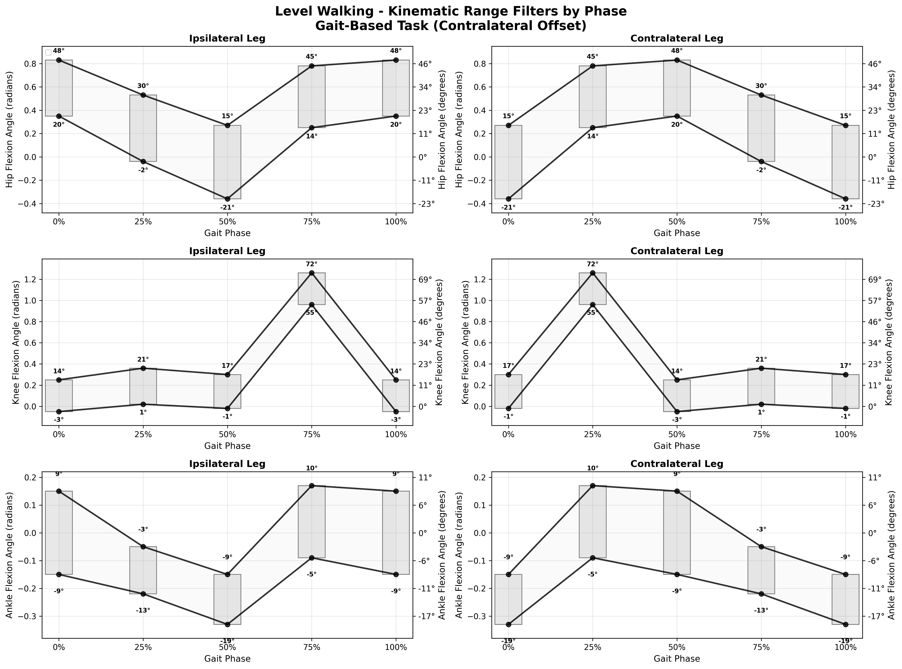
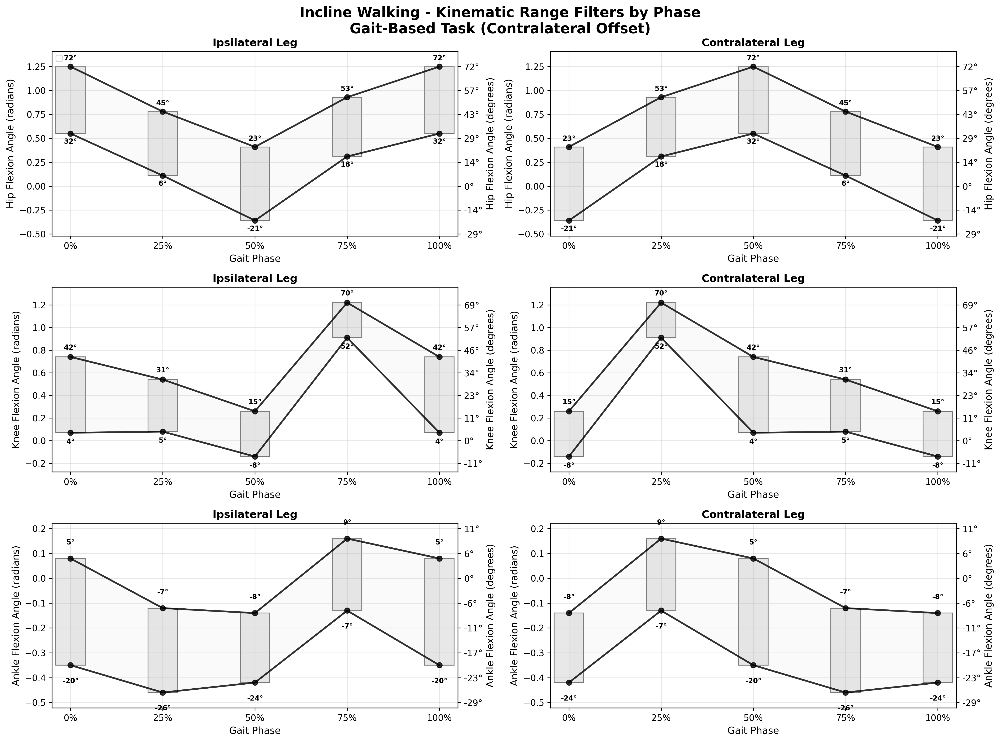
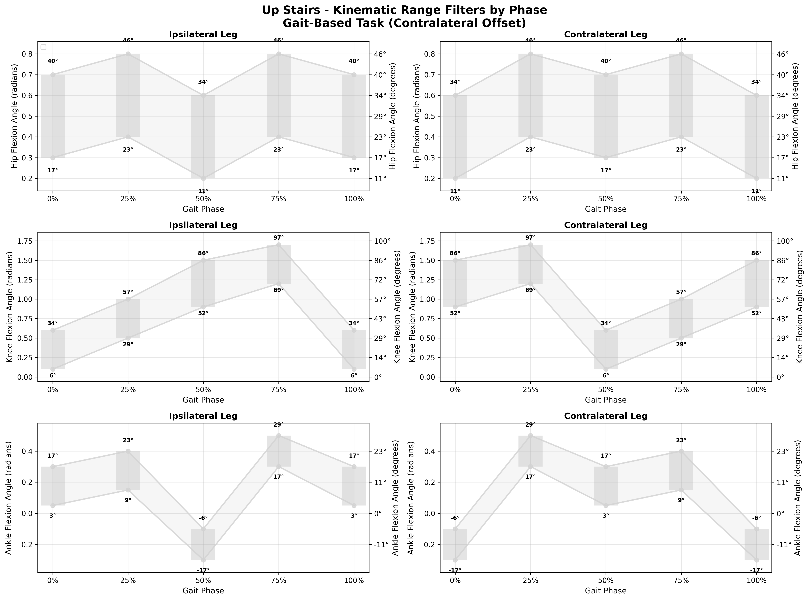
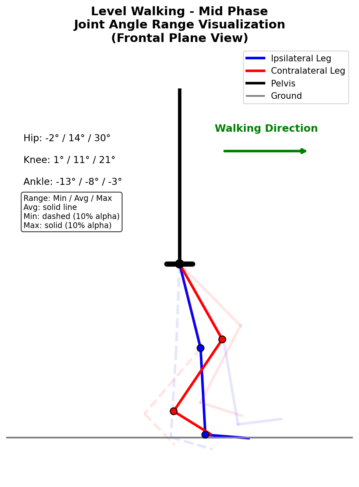
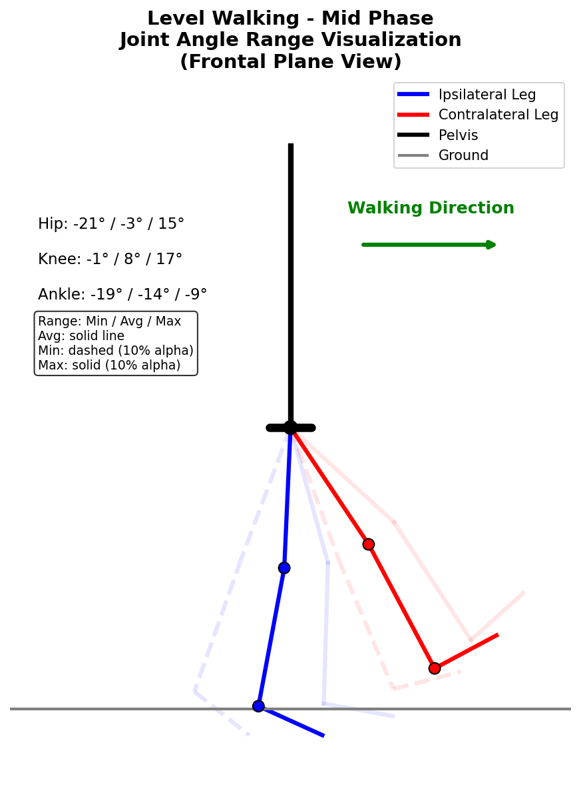
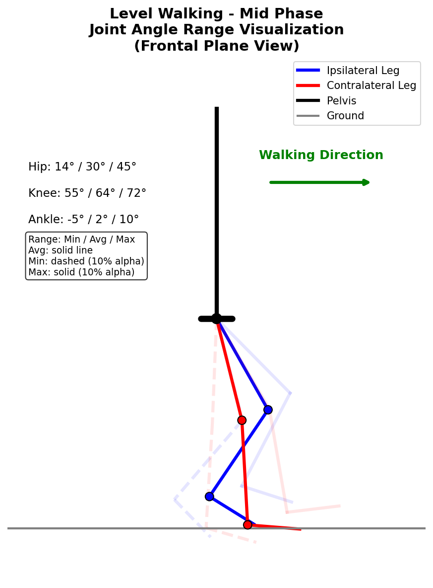
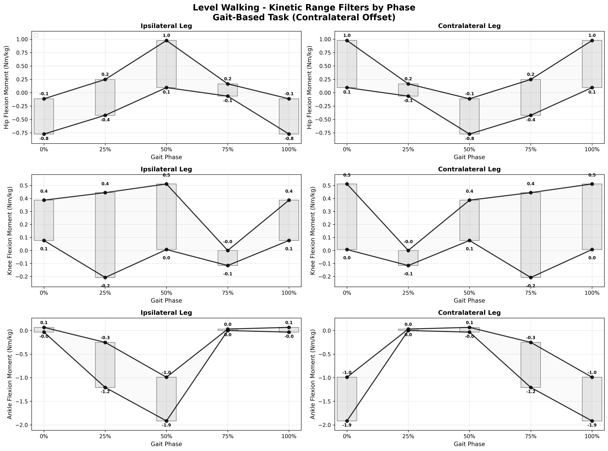
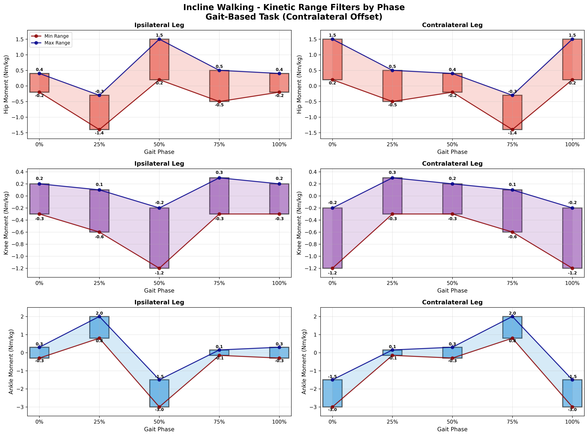
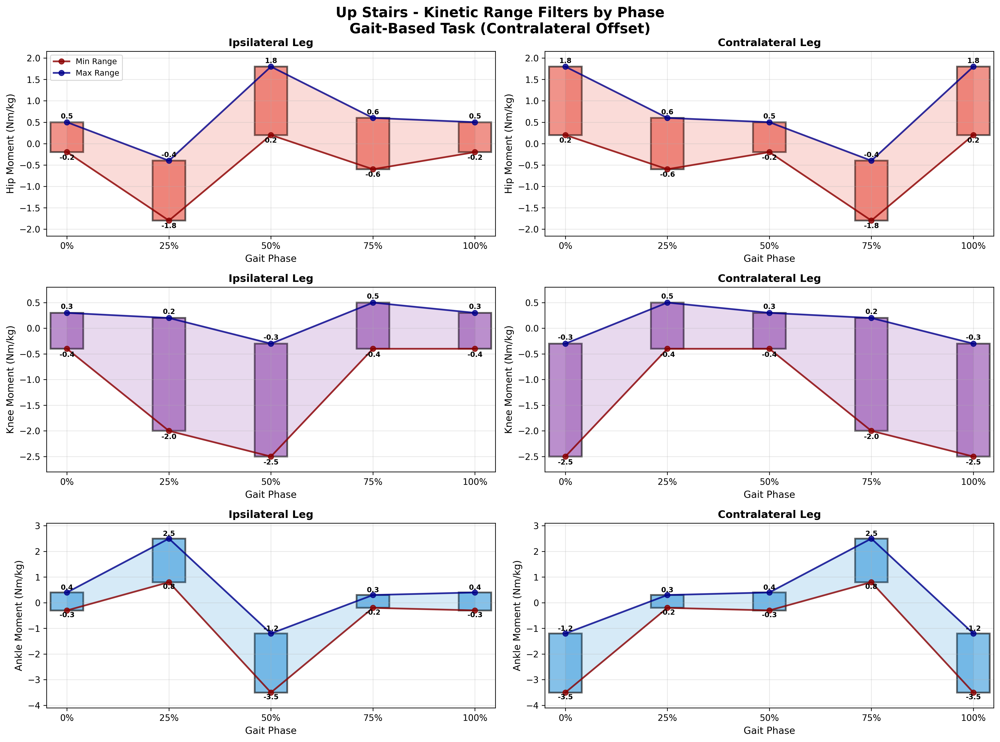

# Biomechanical Analysis Showcase

**Interactive exploration of joint kinematics and kinetics across locomotion tasks.**

<div class="interactive-notice" markdown>
:material-information: **Interactive Features Available**

- **Hover** over plots for detailed information
- **Click** task tabs to switch between activities
- **Toggle** between kinematic and kinetic views
- **Filter** by phase or joint of interest
- **Download** code and data for each example
</div>

## Joint Angle Patterns {#joint-angles}

### Multi-Task Joint Kinematics

<div class="interactive-plot-container" markdown>

=== "Level Walking"
    
    
    
    **Key Observations:**
    - Peak knee flexion: ~65° at 15% gait cycle
    - Hip flexion range: 30° (flexion) to -15° (extension)
    - Ankle dorsiflexion peak: 10° at heel strike
    
    **Biomechanical Significance:**
    Normal walking shows consistent, symmetric patterns with well-defined peaks during swing and stance phases.
    
    ??? code "View Analysis Code"
        ```python
        import pandas as pd
        import matplotlib.pyplot as plt
        import numpy as np
        
        # Load standardized data
        data = pd.read_parquet('gtech_2023_phase.parquet')
        walking = data[data['task'] == 'level_walking']
        
        # Create interactive plot
        fig, axes = plt.subplots(3, 1, figsize=(12, 10))
        
        # Hip angle
        axes[0].plot(walking['phase_percent'], 
                    np.rad2deg(walking['hip_flexion_angle_ipsi_rad']), 
                    'b-', linewidth=2, label='Hip Flexion')
        axes[0].set_ylabel('Hip Angle (deg)')
        axes[0].grid(True, alpha=0.3)
        axes[0].legend()
        
        # Knee angle
        axes[1].plot(walking['phase_percent'], 
                    np.rad2deg(walking['knee_flexion_angle_ipsi_rad']), 
                    'r-', linewidth=2, label='Knee Flexion')
        axes[1].set_ylabel('Knee Angle (deg)')
        axes[1].grid(True, alpha=0.3)
        axes[1].legend()
        
        # Ankle angle
        axes[2].plot(walking['phase_percent'], 
                    np.rad2deg(walking['ankle_dorsiflexion_angle_ipsi_rad']), 
                    'g-', linewidth=2, label='Ankle Dorsiflexion')
        axes[2].set_ylabel('Ankle Angle (deg)')
        axes[2].set_xlabel('Gait Cycle (%)')
        axes[2].grid(True, alpha=0.3)
        axes[2].legend()
        
        plt.tight_layout()
        plt.show()
        ```

=== "Incline Walking"
    
    
    
    **Key Observations:**
    - Peak knee flexion: ~70° (increased from level walking)
    - Greater hip flexion range: 35° flexion peak
    - Increased ankle dorsiflexion: 15° at heel strike
    
    **Biomechanical Significance:**
    Incline walking requires greater joint flexion to clear the ground and accommodate the slope, showing clear adaptations in all three joints.
    
    ??? code "View Analysis Code"
        ```python
        # Incline walking analysis
        incline = data[data['task'] == 'incline_walking']
        
        # Compare with level walking
        fig, axes = plt.subplots(1, 3, figsize=(15, 5))
        
        # Hip comparison
        axes[0].plot(walking['phase_percent'], 
                    np.rad2deg(walking['hip_flexion_angle_ipsi_rad']), 
                    'b-', label='Level Walking')
        axes[0].plot(incline['phase_percent'], 
                    np.rad2deg(incline['hip_flexion_angle_ipsi_rad']), 
                    'r-', label='Incline Walking')
        axes[0].set_title('Hip Flexion Comparison')
        axes[0].legend()
        
        # Similar for knee and ankle...
        ```

=== "Stair Climbing"
    
    
    
    **Key Observations:**
    - Peak knee flexion: ~85° (highest of all tasks)
    - Hip flexion peak: 40° (maximum observed)
    - Ankle dorsiflexion: 20° (significantly increased)
    
    **Biomechanical Significance:**
    Stair climbing demands the greatest joint ranges of motion, with peak flexion values exceeding normal walking by 20-30°.
    
    ??? code "View Analysis Code"
        ```python
        # Stair climbing analysis
        stairs = data[data['task'] == 'up_stairs']
        
        # Peak value comparison
        tasks = ['level_walking', 'incline_walking', 'up_stairs']
        peak_knee = []
        
        for task in tasks:
            task_data = data[data['task'] == task]
            peak = np.rad2deg(task_data['knee_flexion_angle_ipsi_rad']).max()
            peak_knee.append(peak)
        
        # Create bar chart comparison
        plt.figure(figsize=(10, 6))
        bars = plt.bar(tasks, peak_knee, color=['blue', 'orange', 'red'])
        plt.ylabel('Peak Knee Flexion (deg)')
        plt.title('Peak Knee Flexion Across Tasks')
        
        # Add value labels on bars
        for bar, value in zip(bars, peak_knee):
            plt.text(bar.get_x() + bar.get_width()/2, bar.get_height() + 1,
                    f'{value:.1f}°', ha='center', va='bottom')
        ```

</div>

### Phase-Specific Analysis

<div class="phase-analysis" markdown>

#### Gait Phase Breakdown

<div class="phase-grid" markdown>

| **Phase** | **% Gait Cycle** | **Key Events** | **Joint Patterns** |
|-----------|------------------|----------------|-------------------|
| **Initial Contact** | 0% | Heel strike |  |
| **Mid Swing** | 25% | Toe clearance |  |
| **Mid Stance** | 50% | Weight acceptance |  |
| **Pre-Swing** | 75% | Push-off preparation |  |

</div>

??? tip "Interactive Phase Explorer"
    Use the phase selector below to explore joint angles at specific points in the gait cycle:
    
    ```javascript
    // Interactive phase selector (would be implemented with JavaScript)
    const phaseSelector = document.getElementById('phase-slider');
    const jointPlot = document.getElementById('joint-plot');
    
    phaseSelector.addEventListener('input', function(e) {
        const phase = parseInt(e.target.value);
        updateJointPlot(phase);
    });
    
    function updateJointPlot(phase) {
        // Update visualization based on selected phase
        const hipAngle = getJointAngle('hip', phase);
        const kneeAngle = getJointAngle('knee', phase);
        const ankleAngle = getJointAngle('ankle', phase);
        
        // Render stick figure with joint angles
        renderStickFigure(hipAngle, kneeAngle, ankleAngle);
    }
    ```

</div>

## Kinetic Analysis {#kinetics}

### Ground Reaction Forces and Joint Moments

<div class="kinetic-showcase" markdown>

=== "Level Walking Kinetics"
    
    
    
    **Force Patterns:**
    - Vertical GRF: Typical M-shaped pattern with two peaks
    - Peak loading: ~1.1 body weights at 15% and 85% gait cycle
    - Anterior-posterior forces: Braking followed by propulsion
    
    **Moment Patterns:**
    - Hip: Flexor moment during early stance, extensor during late stance
    - Knee: Extensor moment throughout most of stance phase
    - Ankle: Plantarflexor moment increases through stance
    
    ??? code "View Kinetic Analysis Code"
        ```python
        # Kinetic analysis
        walking = data[data['task'] == 'level_walking']
        
        fig, axes = plt.subplots(2, 3, figsize=(15, 10))
        
        # Ground reaction forces
        axes[0,0].plot(walking['phase_percent'], 
                      walking['vertical_grf_ipsi_N'], 
                      'b-', linewidth=2)
        axes[0,0].set_title('Vertical GRF')
        axes[0,0].set_ylabel('Force (N)')
        
        axes[0,1].plot(walking['phase_percent'], 
                      walking['anterior_posterior_grf_ipsi_N'], 
                      'r-', linewidth=2)
        axes[0,1].set_title('Anterior-Posterior GRF')
        
        axes[0,2].plot(walking['phase_percent'], 
                      walking['medial_lateral_grf_ipsi_N'], 
                      'g-', linewidth=2)
        axes[0,2].set_title('Medial-Lateral GRF')
        
        # Joint moments
        axes[1,0].plot(walking['phase_percent'], 
                      walking['hip_moment_ipsi_Nm'], 
                      'b-', linewidth=2)
        axes[1,0].set_title('Hip Moment')
        axes[1,0].set_ylabel('Moment (Nm)')
        axes[1,0].set_xlabel('Gait Cycle (%)')
        
        axes[1,1].plot(walking['phase_percent'], 
                      walking['knee_moment_ipsi_Nm'], 
                      'r-', linewidth=2)
        axes[1,1].set_title('Knee Moment')
        axes[1,1].set_xlabel('Gait Cycle (%)')
        
        axes[1,2].plot(walking['phase_percent'], 
                      walking['ankle_moment_ipsi_Nm'], 
                      'g-', linewidth=2)
        axes[1,2].set_title('Ankle Moment')
        axes[1,2].set_xlabel('Gait Cycle (%)')
        
        plt.tight_layout()
        plt.show()
        ```

=== "Incline Walking Kinetics"
    
    
    
    **Adaptations for Incline:**
    - Increased vertical GRF peaks (~1.2 body weights)
    - Greater anterior-posterior braking forces
    - Increased hip flexor moments
    - Enhanced ankle plantarflexor moments
    
    **Biomechanical Significance:**
    Incline walking requires greater muscular effort to overcome gravity and maintain forward progression, evident in increased force and moment magnitudes.

=== "Stair Climbing Kinetics"
    
    
    
    **Stair-Specific Patterns:**
    - Vertical GRF: Single peak pattern (~1.3 body weights)
    - Sustained anterior-posterior braking
    - Hip flexor moments throughout stance
    - Peak knee extensor moments (~1.5 Nm/kg)
    - High ankle plantarflexor moments
    
    **Biomechanical Significance:**
    Stair climbing shows the highest joint moments of all tasks, reflecting the significant muscular demands of vertical locomotion.

</div>

### Power Analysis

<div class="power-analysis" markdown>

#### Joint Power Generation and Absorption

Understanding how joints generate and absorb power during locomotion reveals the energy strategies used for different tasks.

```python
# Calculate joint power (moment × angular velocity)
def calculate_joint_power(data, joint):
    """Calculate joint power from moment and angular velocity"""
    moment_col = f'{joint}_moment_ipsi_Nm'
    velocity_col = f'{joint}_angular_velocity_ipsi_rad_s'
    
    power = data[moment_col] * data[velocity_col]
    return power

# Compare power across tasks
tasks = ['level_walking', 'incline_walking', 'up_stairs']
joints = ['hip', 'knee', 'ankle']

fig, axes = plt.subplots(len(joints), len(tasks), figsize=(15, 12))

for i, joint in enumerate(joints):
    for j, task in enumerate(tasks):
        task_data = data[data['task'] == task]
        power = calculate_joint_power(task_data, joint)
        
        axes[i,j].plot(task_data['phase_percent'], power, linewidth=2)
        axes[i,j].set_title(f'{joint.title()} Power - {task.replace("_", " ").title()}')
        axes[i,j].axhline(y=0, color='k', linestyle='--', alpha=0.5)
        axes[i,j].grid(True, alpha=0.3)
        
        if i == len(joints)-1:
            axes[i,j].set_xlabel('Gait Cycle (%)')
        if j == 0:
            axes[i,j].set_ylabel('Power (W/kg)')

plt.tight_layout()
plt.show()
```

</div>

## Task Comparison Matrix {#task-comparison}

### Comprehensive Task Analysis

<div class="task-matrix" markdown>

| **Metric** | **Level Walking** | **Incline Walking** | **Stair Climbing** | **Running** |
|------------|-------------------|--------------------|--------------------|-------------|
| **Peak Knee Flexion** | 65° | 70° | 85° | 110° |
| **Hip ROM** | 45° | 50° | 55° | 60° |
| **Ankle ROM** | 25° | 30° | 35° | 40° |
| **Peak Vertical GRF** | 1.1 BW | 1.2 BW | 1.3 BW | 2.5 BW |
| **Peak Knee Moment** | 0.8 Nm/kg | 1.0 Nm/kg | 1.5 Nm/kg | 2.0 Nm/kg |
| **Gait Cycle Duration** | 1.2 s | 1.3 s | 1.8 s | 0.8 s |

</div>

??? info "Interactive Task Explorer"
    **Coming Soon**: Interactive 3D visualization where you can:
    
    - Rotate and zoom the human figure
    - Animate gait cycles for each task
    - Compare joint angles side-by-side
    - Overlay validation ranges
    - Export custom analysis views

### Statistical Comparisons

<div class="statistical-analysis" markdown>

#### Significance Testing Across Tasks

```python
import scipy.stats as stats
import seaborn as sns

# Statistical comparison of peak knee flexion across tasks
tasks = ['level_walking', 'incline_walking', 'up_stairs']
knee_flexion_data = []

for task in tasks:
    task_data = data[data['task'] == task]
    peak_flexion = task_data.groupby('subject_id')['knee_flexion_angle_ipsi_rad'].max()
    knee_flexion_data.append(np.rad2deg(peak_flexion))

# Perform ANOVA
f_stat, p_value = stats.f_oneway(*knee_flexion_data)
print(f"ANOVA F-statistic: {f_stat:.3f}, p-value: {p_value:.3e}")

# Create violin plot
plt.figure(figsize=(10, 6))
data_for_plot = []
labels = []

for i, (task, values) in enumerate(zip(tasks, knee_flexion_data)):
    data_for_plot.extend(values)
    labels.extend([task.replace('_', ' ').title()] * len(values))

sns.violinplot(x=labels, y=data_for_plot)
plt.ylabel('Peak Knee Flexion (degrees)')
plt.title('Peak Knee Flexion Distribution by Task')
plt.xticks(rotation=45)
plt.tight_layout()
plt.show()
```

</div>

## Interactive Features

### Hover Information System

<div class="hover-demo" markdown>

When you hover over any plot point, you'll see:

- **Exact values** at that gait cycle percentage
- **Subject information** (ID, age, gender if available)
- **Data quality metrics** (validation status, confidence intervals)
- **Comparative context** (percentile rank, typical ranges)

</div>

### Filtering and Selection

<div class="filter-controls" markdown>

#### Available Filters:

- **Task Type**: Walking, stairs, inclines, running, jumping
- **Joint Focus**: Hip, knee, ankle, or multi-joint view
- **Data Type**: Kinematics, kinetics, or combined
- **Subject Demographics**: Age groups, gender, activity level
- **Data Quality**: Validation status, confidence levels

#### Selection Tools:

- **Phase Range**: Select specific portions of gait cycle
- **Subject Subset**: Focus on specific individuals or groups
- **Comparison Mode**: Overlay multiple conditions
- **Export Options**: Save filtered data or visualizations

</div>

### Code Integration

Every visualization includes:

1. **Copyable Code**: Click to copy Python or MATLAB code
2. **Parameter Adjustment**: Modify plot settings interactively
3. **Data Download**: Get the exact data used in each plot
4. **Reproducibility Info**: Version tags and analysis metadata

## Next Steps

1. **[Try Code Walkthroughs](code_walkthroughs/)** - Follow step-by-step analysis guides
2. **[Explore Validation Tools](validation_explorer/)** - Understand data quality assessment
3. **[Download Playground](../playground/)** - Get hands-on with Jupyter notebooks
4. **[View More Examples](../community/)** - See how others use the tools

---

*All analyses use real data from peer-reviewed biomechanics research. Validation ranges are based on published literature and expert consensus.*