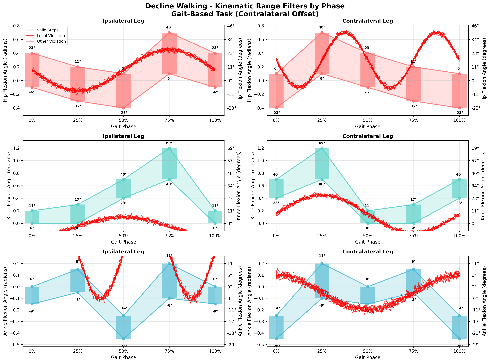
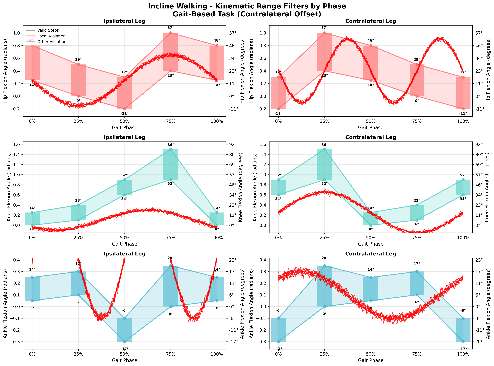
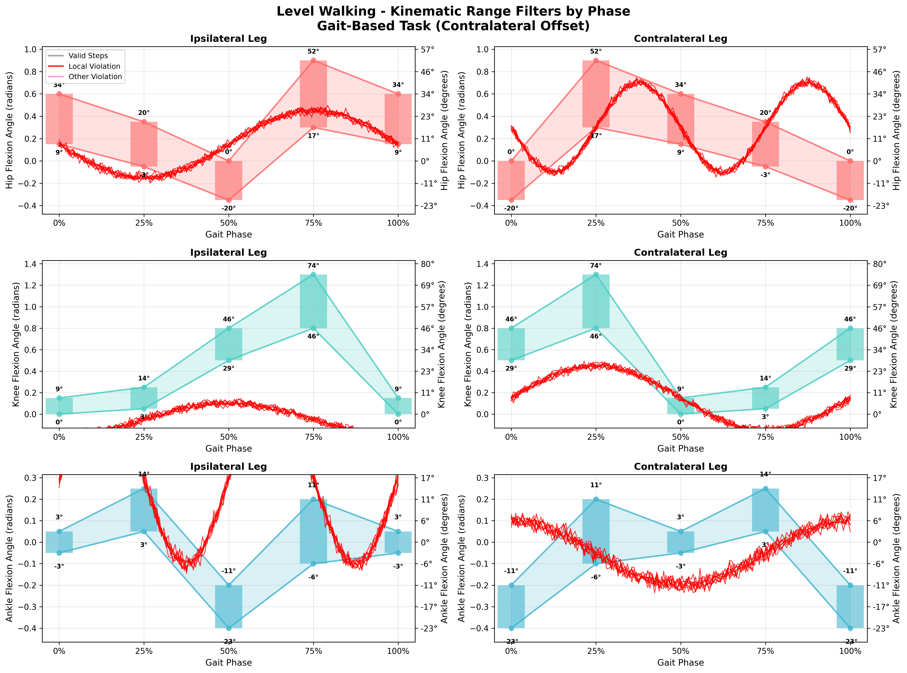

# Dataset Validation Report

**Generated**: 2025-06-11 01:01:09
**Dataset**: `source/tests/test_data/demo_clean_phase.parquet`

## Validation Summary

- **Total Steps Validated**: 27
- **Valid Steps**: 0
- **Failed Steps**: 27
- **Success Rate**: 0.0%
- **Tasks Validated**: decline_walking, incline_walking, level_walking

## Task Validation Results

### Decline Walking

**Kinematic Validation:**

**Step Summary**: 9/9 failed steps (100.0%)
**Success Rate**: 0.0%

**Validation Issues**: 147 failures detected
- Kinematic: 147 failures

### Incline Walking

**Kinematic Validation:**

**Step Summary**: 9/9 failed steps (100.0%)
**Success Rate**: 0.0%

**Validation Issues**: 164 failures detected
- Kinematic: 164 failures

### Level Walking

**Kinematic Validation:**

**Step Summary**: 9/9 failed steps (100.0%)
**Success Rate**: 0.0%

**Validation Issues**: 165 failures detected
- Kinematic: 165 failures

## ⚠️ Detailed Failure Analysis (476 total)

### Kinematic Failures (476)

#### Task: Decline Walking

**Variable: hip_flexion_angle_contra** (18 failures)

| Phase | Value | Expected Range | Failure Reason |
|-------|-------|----------------|----------------|
| 0.0% | 0.276 | -0.400 to 0.100 | Value 0.276 outside range [-0.400, 0.100] at phase 0% |
| 75.0% | 0.316 | -0.300 to 0.200 | Value 0.316 outside range [-0.300, 0.200] at phase 75% |
| 0.0% | 0.289 | -0.400 to 0.100 | Value 0.289 outside range [-0.400, 0.100] at phase 0% |
| 75.0% | 0.339 | -0.300 to 0.200 | Value 0.339 outside range [-0.300, 0.200] at phase 75% |
| 0.0% | 0.313 | -0.400 to 0.100 | Value 0.313 outside range [-0.400, 0.100] at phase 0% |
| 75.0% | 0.327 | -0.300 to 0.200 | Value 0.327 outside range [-0.300, 0.200] at phase 75% |
| 0.0% | 0.270 | -0.400 to 0.100 | Value 0.270 outside range [-0.400, 0.100] at phase 0% |
| 75.0% | 0.326 | -0.300 to 0.200 | Value 0.326 outside range [-0.300, 0.200] at phase 75% |
| 0.0% | 0.299 | -0.400 to 0.100 | Value 0.299 outside range [-0.400, 0.100] at phase 0% |
| 75.0% | 0.329 | -0.300 to 0.200 | Value 0.329 outside range [-0.300, 0.200] at phase 75% |

*... and 8 more failures*

**Variable: knee_flexion_angle_ipsi** (36 failures)

| Phase | Value | Expected Range | Failure Reason |
|-------|-------|----------------|----------------|
| 0.0% | -0.191 | 0.000 to 0.200 | Value -0.191 outside range [0.000, 0.200] at phase 0% |
| 25.0% | -0.022 | 0.000 to 0.300 | Value -0.022 outside range [0.000, 0.300] at phase 25% |
| 50.0% | 0.101 | 0.400 to 0.700 | Value 0.101 outside range [0.400, 0.700] at phase 50% |
| 75.0% | -0.034 | 0.700 to 1.200 | Value -0.034 outside range [0.700, 1.200] at phase 75% |
| 0.0% | -0.188 | 0.000 to 0.200 | Value -0.188 outside range [0.000, 0.200] at phase 0% |
| 25.0% | -0.027 | 0.000 to 0.300 | Value -0.027 outside range [0.000, 0.300] at phase 25% |
| 50.0% | 0.121 | 0.400 to 0.700 | Value 0.121 outside range [0.400, 0.700] at phase 50% |
| 75.0% | -0.064 | 0.700 to 1.200 | Value -0.064 outside range [0.700, 1.200] at phase 75% |
| 0.0% | -0.191 | 0.000 to 0.200 | Value -0.191 outside range [0.000, 0.200] at phase 0% |
| 25.0% | -0.031 | 0.000 to 0.300 | Value -0.031 outside range [0.000, 0.300] at phase 25% |

*... and 26 more failures*

**Variable: knee_flexion_angle_contra** (27 failures)

| Phase | Value | Expected Range | Failure Reason |
|-------|-------|----------------|----------------|
| 0.0% | 0.148 | 0.400 to 0.700 | Value 0.148 outside range [0.400, 0.700] at phase 0% |
| 25.0% | 0.423 | 0.700 to 1.200 | Value 0.423 outside range [0.700, 1.200] at phase 25% |
| 75.0% | -0.150 | 0.000 to 0.300 | Value -0.150 outside range [0.000, 0.300] at phase 75% |
| 0.0% | 0.136 | 0.400 to 0.700 | Value 0.136 outside range [0.400, 0.700] at phase 0% |
| 25.0% | 0.454 | 0.700 to 1.200 | Value 0.454 outside range [0.700, 1.200] at phase 25% |
| 75.0% | -0.149 | 0.000 to 0.300 | Value -0.149 outside range [0.000, 0.300] at phase 75% |
| 0.0% | 0.146 | 0.400 to 0.700 | Value 0.146 outside range [0.400, 0.700] at phase 0% |
| 25.0% | 0.470 | 0.700 to 1.200 | Value 0.470 outside range [0.700, 1.200] at phase 25% |
| 75.0% | -0.165 | 0.000 to 0.300 | Value -0.165 outside range [0.000, 0.300] at phase 75% |
| 0.0% | 0.159 | 0.400 to 0.700 | Value 0.159 outside range [0.400, 0.700] at phase 0% |

*... and 17 more failures*

**Variable: ankle_flexion_angle_ipsi** (36 failures)

| Phase | Value | Expected Range | Failure Reason |
|-------|-------|----------------|----------------|
| 0.0% | 0.299 | -0.150 to 0.000 | Value 0.299 outside range [-0.150, 0.000] at phase 0% |
| 25.0% | 0.343 | -0.050 to 0.150 | Value 0.343 outside range [-0.050, 0.150] at phase 25% |
| 50.0% | 0.346 | -0.450 to -0.250 | Value 0.346 outside range [-0.450, -0.250] at phase 50% |
| 75.0% | 0.296 | -0.100 to 0.200 | Value 0.296 outside range [-0.100, 0.200] at phase 75% |
| 0.0% | 0.279 | -0.150 to 0.000 | Value 0.279 outside range [-0.150, 0.000] at phase 0% |
| 25.0% | 0.313 | -0.050 to 0.150 | Value 0.313 outside range [-0.050, 0.150] at phase 25% |
| 50.0% | 0.337 | -0.450 to -0.250 | Value 0.337 outside range [-0.450, -0.250] at phase 50% |
| 75.0% | 0.277 | -0.100 to 0.200 | Value 0.277 outside range [-0.100, 0.200] at phase 75% |
| 0.0% | 0.285 | -0.150 to 0.000 | Value 0.285 outside range [-0.150, 0.000] at phase 0% |
| 25.0% | 0.302 | -0.050 to 0.150 | Value 0.302 outside range [-0.050, 0.150] at phase 25% |

*... and 26 more failures*

**Variable: ankle_flexion_angle_contra** (21 failures)

| Phase | Value | Expected Range | Failure Reason |
|-------|-------|----------------|----------------|
| 0.0% | 0.089 | -0.450 to -0.250 | Value 0.089 outside range [-0.450, -0.250] at phase 0% |
| 50.0% | -0.184 | -0.150 to 0.000 | Value -0.184 outside range [-0.150, 0.000] at phase 50% |
| 0.0% | 0.147 | -0.450 to -0.250 | Value 0.147 outside range [-0.450, -0.250] at phase 0% |
| 50.0% | -0.197 | -0.150 to 0.000 | Value -0.197 outside range [-0.150, 0.000] at phase 50% |
| 75.0% | -0.067 | -0.050 to 0.150 | Value -0.067 outside range [-0.050, 0.150] at phase 75% |
| 0.0% | 0.098 | -0.450 to -0.250 | Value 0.098 outside range [-0.450, -0.250] at phase 0% |
| 50.0% | -0.195 | -0.150 to 0.000 | Value -0.195 outside range [-0.150, 0.000] at phase 50% |
| 0.0% | 0.095 | -0.450 to -0.250 | Value 0.095 outside range [-0.450, -0.250] at phase 0% |
| 50.0% | -0.186 | -0.150 to 0.000 | Value -0.186 outside range [-0.150, 0.000] at phase 50% |
| 75.0% | -0.073 | -0.050 to 0.150 | Value -0.073 outside range [-0.050, 0.150] at phase 75% |

*... and 11 more failures*

**Variable: hip_flexion_angle_ipsi** (9 failures)

| Phase | Value | Expected Range | Failure Reason |
|-------|-------|----------------|----------------|
| 50.0% | 0.138 | -0.400 to 0.100 | Value 0.138 outside range [-0.400, 0.100] at phase 50% |
| 50.0% | 0.144 | -0.400 to 0.100 | Value 0.144 outside range [-0.400, 0.100] at phase 50% |
| 50.0% | 0.149 | -0.400 to 0.100 | Value 0.149 outside range [-0.400, 0.100] at phase 50% |
| 50.0% | 0.150 | -0.400 to 0.100 | Value 0.150 outside range [-0.400, 0.100] at phase 50% |
| 50.0% | 0.132 | -0.400 to 0.100 | Value 0.132 outside range [-0.400, 0.100] at phase 50% |
| 50.0% | 0.163 | -0.400 to 0.100 | Value 0.163 outside range [-0.400, 0.100] at phase 50% |
| 50.0% | 0.150 | -0.400 to 0.100 | Value 0.150 outside range [-0.400, 0.100] at phase 50% |
| 50.0% | 0.204 | -0.400 to 0.100 | Value 0.204 outside range [-0.400, 0.100] at phase 50% |
| 50.0% | 0.192 | -0.400 to 0.100 | Value 0.192 outside range [-0.400, 0.100] at phase 50% |

#### Task: Incline Walking

**Variable: hip_flexion_angle_ipsi** (16 failures)

| Phase | Value | Expected Range | Failure Reason |
|-------|-------|----------------|----------------|
| 0.0% | 0.247 | 0.250 to 0.800 | Value 0.247 outside range [0.250, 0.800] at phase 0% |
| 25.0% | -0.148 | 0.000 to 0.500 | Value -0.148 outside range [0.000, 0.500] at phase 25% |
| 0.0% | 0.249 | 0.250 to 0.800 | Value 0.249 outside range [0.250, 0.800] at phase 0% |
| 25.0% | -0.155 | 0.000 to 0.500 | Value -0.155 outside range [0.000, 0.500] at phase 25% |
| 25.0% | -0.111 | 0.000 to 0.500 | Value -0.111 outside range [0.000, 0.500] at phase 25% |
| 0.0% | 0.239 | 0.250 to 0.800 | Value 0.239 outside range [0.250, 0.800] at phase 0% |
| 25.0% | -0.201 | 0.000 to 0.500 | Value -0.201 outside range [0.000, 0.500] at phase 25% |
| 0.0% | 0.212 | 0.250 to 0.800 | Value 0.212 outside range [0.250, 0.800] at phase 0% |
| 25.0% | -0.156 | 0.000 to 0.500 | Value -0.156 outside range [0.000, 0.500] at phase 25% |
| 0.0% | 0.199 | 0.250 to 0.800 | Value 0.199 outside range [0.250, 0.800] at phase 0% |

*... and 6 more failures*

**Variable: hip_flexion_angle_contra** (17 failures)

| Phase | Value | Expected Range | Failure Reason |
|-------|-------|----------------|----------------|
| 0.0% | 0.394 | -0.200 to 0.300 | Value 0.394 outside range [-0.200, 0.300] at phase 0% |
| 25.0% | 0.391 | 0.400 to 1.000 | Value 0.391 outside range [0.400, 1.000] at phase 25% |
| 0.0% | 0.414 | -0.200 to 0.300 | Value 0.414 outside range [-0.200, 0.300] at phase 0% |
| 25.0% | 0.380 | 0.400 to 1.000 | Value 0.380 outside range [0.400, 1.000] at phase 25% |
| 0.0% | 0.413 | -0.200 to 0.300 | Value 0.413 outside range [-0.200, 0.300] at phase 0% |
| 25.0% | 0.392 | 0.400 to 1.000 | Value 0.392 outside range [0.400, 1.000] at phase 25% |
| 0.0% | 0.420 | -0.200 to 0.300 | Value 0.420 outside range [-0.200, 0.300] at phase 0% |
| 25.0% | 0.393 | 0.400 to 1.000 | Value 0.393 outside range [0.400, 1.000] at phase 25% |
| 0.0% | 0.364 | -0.200 to 0.300 | Value 0.364 outside range [-0.200, 0.300] at phase 0% |
| 25.0% | 0.396 | 0.400 to 1.000 | Value 0.396 outside range [0.400, 1.000] at phase 25% |

*... and 7 more failures*

**Variable: knee_flexion_angle_ipsi** (36 failures)

| Phase | Value | Expected Range | Failure Reason |
|-------|-------|----------------|----------------|
| 0.0% | -0.046 | 0.000 to 0.250 | Value -0.046 outside range [0.000, 0.250] at phase 0% |
| 25.0% | -0.024 | 0.100 to 0.400 | Value -0.024 outside range [0.100, 0.400] at phase 25% |
| 50.0% | 0.249 | 0.600 to 0.900 | Value 0.249 outside range [0.600, 0.900] at phase 50% |
| 75.0% | 0.254 | 0.900 to 1.500 | Value 0.254 outside range [0.900, 1.500] at phase 75% |
| 0.0% | -0.031 | 0.000 to 0.250 | Value -0.031 outside range [0.000, 0.250] at phase 0% |
| 25.0% | -0.043 | 0.100 to 0.400 | Value -0.043 outside range [0.100, 0.400] at phase 25% |
| 50.0% | 0.228 | 0.600 to 0.900 | Value 0.228 outside range [0.600, 0.900] at phase 50% |
| 75.0% | 0.231 | 0.900 to 1.500 | Value 0.231 outside range [0.900, 1.500] at phase 75% |
| 0.0% | -0.045 | 0.000 to 0.250 | Value -0.045 outside range [0.000, 0.250] at phase 0% |
| 25.0% | -0.058 | 0.100 to 0.400 | Value -0.058 outside range [0.100, 0.400] at phase 25% |

*... and 26 more failures*

**Variable: knee_flexion_angle_contra** (32 failures)

| Phase | Value | Expected Range | Failure Reason |
|-------|-------|----------------|----------------|
| 0.0% | 0.238 | 0.600 to 0.900 | Value 0.238 outside range [0.600, 0.900] at phase 0% |
| 25.0% | 0.665 | 0.900 to 1.500 | Value 0.665 outside range [0.900, 1.500] at phase 25% |
| 50.0% | 0.259 | 0.000 to 0.250 | Value 0.259 outside range [0.000, 0.250] at phase 50% |
| 75.0% | -0.164 | 0.100 to 0.400 | Value -0.164 outside range [0.100, 0.400] at phase 75% |
| 0.0% | 0.262 | 0.600 to 0.900 | Value 0.262 outside range [0.600, 0.900] at phase 0% |
| 25.0% | 0.662 | 0.900 to 1.500 | Value 0.662 outside range [0.900, 1.500] at phase 25% |
| 75.0% | -0.197 | 0.100 to 0.400 | Value -0.197 outside range [0.100, 0.400] at phase 75% |
| 0.0% | 0.234 | 0.600 to 0.900 | Value 0.234 outside range [0.600, 0.900] at phase 0% |
| 25.0% | 0.612 | 0.900 to 1.500 | Value 0.612 outside range [0.900, 1.500] at phase 25% |
| 50.0% | 0.251 | 0.000 to 0.250 | Value 0.251 outside range [0.000, 0.250] at phase 50% |

*... and 22 more failures*

**Variable: ankle_flexion_angle_ipsi** (36 failures)

| Phase | Value | Expected Range | Failure Reason |
|-------|-------|----------------|----------------|
| 0.0% | 0.389 | 0.050 to 0.250 | Value 0.389 outside range [0.050, 0.250] at phase 0% |
| 25.0% | 0.452 | 0.100 to 0.300 | Value 0.452 outside range [0.100, 0.300] at phase 25% |
| 50.0% | 0.457 | -0.300 to -0.100 | Value 0.457 outside range [-0.300, -0.100] at phase 50% |
| 75.0% | 0.416 | 0.000 to 0.350 | Value 0.416 outside range [0.000, 0.350] at phase 75% |
| 0.0% | 0.393 | 0.050 to 0.250 | Value 0.393 outside range [0.050, 0.250] at phase 0% |
| 25.0% | 0.443 | 0.100 to 0.300 | Value 0.443 outside range [0.100, 0.300] at phase 25% |
| 50.0% | 0.415 | -0.300 to -0.100 | Value 0.415 outside range [-0.300, -0.100] at phase 50% |
| 75.0% | 0.358 | 0.000 to 0.350 | Value 0.358 outside range [0.000, 0.350] at phase 75% |
| 0.0% | 0.384 | 0.050 to 0.250 | Value 0.384 outside range [0.050, 0.250] at phase 0% |
| 25.0% | 0.377 | 0.100 to 0.300 | Value 0.377 outside range [0.100, 0.300] at phase 25% |

*... and 26 more failures*

**Variable: ankle_flexion_angle_contra** (27 failures)

| Phase | Value | Expected Range | Failure Reason |
|-------|-------|----------------|----------------|
| 0.0% | 0.232 | -0.300 to -0.100 | Value 0.232 outside range [-0.300, -0.100] at phase 0% |
| 50.0% | -0.026 | 0.050 to 0.250 | Value -0.026 outside range [0.050, 0.250] at phase 50% |
| 75.0% | -0.057 | 0.100 to 0.300 | Value -0.057 outside range [0.100, 0.300] at phase 75% |
| 0.0% | 0.241 | -0.300 to -0.100 | Value 0.241 outside range [-0.300, -0.100] at phase 0% |
| 50.0% | -0.018 | 0.050 to 0.250 | Value -0.018 outside range [0.050, 0.250] at phase 50% |
| 75.0% | -0.027 | 0.100 to 0.300 | Value -0.027 outside range [0.100, 0.300] at phase 75% |
| 0.0% | 0.268 | -0.300 to -0.100 | Value 0.268 outside range [-0.300, -0.100] at phase 0% |
| 50.0% | -0.044 | 0.050 to 0.250 | Value -0.044 outside range [0.050, 0.250] at phase 50% |
| 75.0% | -0.035 | 0.100 to 0.300 | Value -0.035 outside range [0.100, 0.300] at phase 75% |
| 0.0% | 0.250 | -0.300 to -0.100 | Value 0.250 outside range [-0.300, -0.100] at phase 0% |

*... and 17 more failures*

#### Task: Level Walking

**Variable: hip_flexion_angle_contra** (17 failures)

| Phase | Value | Expected Range | Failure Reason |
|-------|-------|----------------|----------------|
| 0.0% | 0.314 | -0.350 to 0.000 | Value 0.314 outside range [-0.350, 0.000] at phase 0% |
| 25.0% | 0.279 | 0.300 to 0.900 | Value 0.279 outside range [0.300, 0.900] at phase 25% |
| 0.0% | 0.274 | -0.350 to 0.000 | Value 0.274 outside range [-0.350, 0.000] at phase 0% |
| 25.0% | 0.275 | 0.300 to 0.900 | Value 0.275 outside range [0.300, 0.900] at phase 25% |
| 0.0% | 0.316 | -0.350 to 0.000 | Value 0.316 outside range [-0.350, 0.000] at phase 0% |
| 0.0% | 0.292 | -0.350 to 0.000 | Value 0.292 outside range [-0.350, 0.000] at phase 0% |
| 25.0% | 0.289 | 0.300 to 0.900 | Value 0.289 outside range [0.300, 0.900] at phase 25% |
| 0.0% | 0.285 | -0.350 to 0.000 | Value 0.285 outside range [-0.350, 0.000] at phase 0% |
| 25.0% | 0.290 | 0.300 to 0.900 | Value 0.290 outside range [0.300, 0.900] at phase 25% |
| 0.0% | 0.295 | -0.350 to 0.000 | Value 0.295 outside range [-0.350, 0.000] at phase 0% |

*... and 7 more failures*

**Variable: knee_flexion_angle_ipsi** (36 failures)

| Phase | Value | Expected Range | Failure Reason |
|-------|-------|----------------|----------------|
| 0.0% | -0.202 | 0.000 to 0.150 | Value -0.202 outside range [0.000, 0.150] at phase 0% |
| 25.0% | -0.044 | 0.050 to 0.250 | Value -0.044 outside range [0.050, 0.250] at phase 25% |
| 50.0% | 0.128 | 0.500 to 0.800 | Value 0.128 outside range [0.500, 0.800] at phase 50% |
| 75.0% | -0.025 | 0.800 to 1.300 | Value -0.025 outside range [0.800, 1.300] at phase 75% |
| 0.0% | -0.216 | 0.000 to 0.150 | Value -0.216 outside range [0.000, 0.150] at phase 0% |
| 25.0% | -0.044 | 0.050 to 0.250 | Value -0.044 outside range [0.050, 0.250] at phase 25% |
| 50.0% | 0.095 | 0.500 to 0.800 | Value 0.095 outside range [0.500, 0.800] at phase 50% |
| 75.0% | -0.050 | 0.800 to 1.300 | Value -0.050 outside range [0.800, 1.300] at phase 75% |
| 0.0% | -0.226 | 0.000 to 0.150 | Value -0.226 outside range [0.000, 0.150] at phase 0% |
| 25.0% | -0.059 | 0.050 to 0.250 | Value -0.059 outside range [0.050, 0.250] at phase 25% |

*... and 26 more failures*

**Variable: knee_flexion_angle_contra** (28 failures)

| Phase | Value | Expected Range | Failure Reason |
|-------|-------|----------------|----------------|
| 0.0% | 0.157 | 0.500 to 0.800 | Value 0.157 outside range [0.500, 0.800] at phase 0% |
| 25.0% | 0.430 | 0.800 to 1.300 | Value 0.430 outside range [0.800, 1.300] at phase 25% |
| 75.0% | -0.102 | 0.050 to 0.250 | Value -0.102 outside range [0.050, 0.250] at phase 75% |
| 0.0% | 0.148 | 0.500 to 0.800 | Value 0.148 outside range [0.500, 0.800] at phase 0% |
| 25.0% | 0.434 | 0.800 to 1.300 | Value 0.434 outside range [0.800, 1.300] at phase 25% |
| 75.0% | -0.130 | 0.050 to 0.250 | Value -0.130 outside range [0.050, 0.250] at phase 75% |
| 0.0% | 0.152 | 0.500 to 0.800 | Value 0.152 outside range [0.500, 0.800] at phase 0% |
| 25.0% | 0.442 | 0.800 to 1.300 | Value 0.442 outside range [0.800, 1.300] at phase 25% |
| 75.0% | -0.162 | 0.050 to 0.250 | Value -0.162 outside range [0.050, 0.250] at phase 75% |
| 0.0% | 0.142 | 0.500 to 0.800 | Value 0.142 outside range [0.500, 0.800] at phase 0% |

*... and 18 more failures*

**Variable: ankle_flexion_angle_ipsi** (36 failures)

| Phase | Value | Expected Range | Failure Reason |
|-------|-------|----------------|----------------|
| 0.0% | 0.282 | -0.050 to 0.050 | Value 0.282 outside range [-0.050, 0.050] at phase 0% |
| 25.0% | 0.284 | 0.050 to 0.250 | Value 0.284 outside range [0.050, 0.250] at phase 25% |
| 50.0% | 0.325 | -0.400 to -0.200 | Value 0.325 outside range [-0.400, -0.200] at phase 50% |
| 75.0% | 0.293 | -0.100 to 0.200 | Value 0.293 outside range [-0.100, 0.200] at phase 75% |
| 0.0% | 0.291 | -0.050 to 0.050 | Value 0.291 outside range [-0.050, 0.050] at phase 0% |
| 25.0% | 0.315 | 0.050 to 0.250 | Value 0.315 outside range [0.050, 0.250] at phase 25% |
| 50.0% | 0.337 | -0.400 to -0.200 | Value 0.337 outside range [-0.400, -0.200] at phase 50% |
| 75.0% | 0.334 | -0.100 to 0.200 | Value 0.334 outside range [-0.100, 0.200] at phase 75% |
| 0.0% | 0.299 | -0.050 to 0.050 | Value 0.299 outside range [-0.050, 0.050] at phase 0% |
| 25.0% | 0.322 | 0.050 to 0.250 | Value 0.322 outside range [0.050, 0.250] at phase 25% |

*... and 26 more failures*

**Variable: ankle_flexion_angle_contra** (27 failures)

| Phase | Value | Expected Range | Failure Reason |
|-------|-------|----------------|----------------|
| 0.0% | 0.113 | -0.400 to -0.200 | Value 0.113 outside range [-0.400, -0.200] at phase 0% |
| 50.0% | -0.156 | -0.050 to 0.050 | Value -0.156 outside range [-0.050, 0.050] at phase 50% |
| 75.0% | -0.072 | 0.050 to 0.250 | Value -0.072 outside range [0.050, 0.250] at phase 75% |
| 0.0% | 0.098 | -0.400 to -0.200 | Value 0.098 outside range [-0.400, -0.200] at phase 0% |
| 50.0% | -0.191 | -0.050 to 0.050 | Value -0.191 outside range [-0.050, 0.050] at phase 50% |
| 75.0% | -0.047 | 0.050 to 0.250 | Value -0.047 outside range [0.050, 0.250] at phase 75% |
| 0.0% | 0.109 | -0.400 to -0.200 | Value 0.109 outside range [-0.400, -0.200] at phase 0% |
| 50.0% | -0.204 | -0.050 to 0.050 | Value -0.204 outside range [-0.050, 0.050] at phase 50% |
| 75.0% | -0.018 | 0.050 to 0.250 | Value -0.018 outside range [0.050, 0.250] at phase 75% |
| 0.0% | 0.106 | -0.400 to -0.200 | Value 0.106 outside range [-0.400, -0.200] at phase 0% |

*... and 17 more failures*

**Variable: hip_flexion_angle_ipsi** (21 failures)

| Phase | Value | Expected Range | Failure Reason |
|-------|-------|----------------|----------------|
| 25.0% | -0.165 | -0.050 to 0.350 | Value -0.165 outside range [-0.050, 0.350] at phase 25% |
| 50.0% | 0.165 | -0.350 to 0.000 | Value 0.165 outside range [-0.350, 0.000] at phase 50% |
| 0.0% | 0.141 | 0.150 to 0.600 | Value 0.141 outside range [0.150, 0.600] at phase 0% |
| 25.0% | -0.112 | -0.050 to 0.350 | Value -0.112 outside range [-0.050, 0.350] at phase 25% |
| 50.0% | 0.149 | -0.350 to 0.000 | Value 0.149 outside range [-0.350, 0.000] at phase 50% |
| 25.0% | -0.134 | -0.050 to 0.350 | Value -0.134 outside range [-0.050, 0.350] at phase 25% |
| 50.0% | 0.120 | -0.350 to 0.000 | Value 0.120 outside range [-0.350, 0.000] at phase 50% |
| 0.0% | 0.128 | 0.150 to 0.600 | Value 0.128 outside range [0.150, 0.600] at phase 0% |
| 25.0% | -0.133 | -0.050 to 0.350 | Value -0.133 outside range [-0.050, 0.350] at phase 25% |
| 50.0% | 0.165 | -0.350 to 0.000 | Value 0.165 outside range [-0.350, 0.000] at phase 50% |

*... and 11 more failures*

## Recommendations

1. Review data collection protocols for tasks with high failure rates
2. Check sensor calibration for variables consistently out of range
3. Verify subject instructions and movement quality
4. Consider if validation ranges need updating for your population
